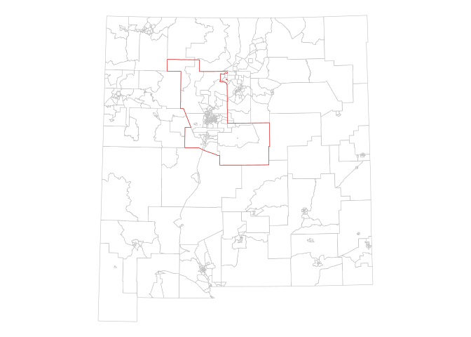
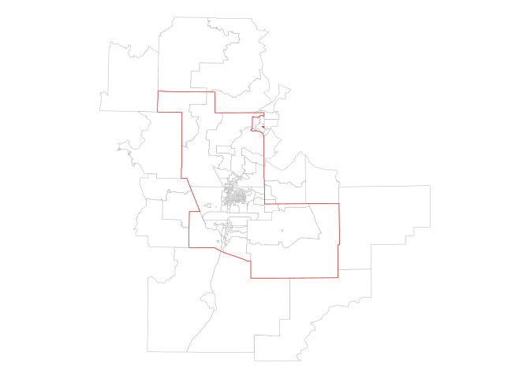
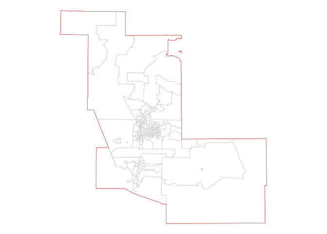

# Spatial overlay

R can perform calculations in geographic reference systems with `s2`,
but it is slower, so suggestion is to change crs.

## Identify geometries in a metro area

> Metropolitan areas are core-based statistical areas with a population
> $> 50,000$.

``` r
library(tigris)
```

    ## To enable caching of data, set `options(tigris_use_cache = TRUE)`
    ## in your R script or .Rprofile.

``` r
library(tidyverse)
```

    ## ── Attaching core tidyverse packages ──────────────────────── tidyverse 2.0.0 ──
    ## ✔ dplyr     1.1.4     ✔ readr     2.1.5
    ## ✔ forcats   1.0.0     ✔ stringr   1.5.1
    ## ✔ ggplot2   3.5.1     ✔ tibble    3.2.1
    ## ✔ lubridate 1.9.4     ✔ tidyr     1.3.1
    ## ✔ purrr     1.0.4

    ## ── Conflicts ────────────────────────────────────────── tidyverse_conflicts() ──
    ## ✖ dplyr::filter() masks stats::filter()
    ## ✖ dplyr::lag()    masks stats::lag()
    ## ℹ Use the conflicted package (<http://conflicted.r-lib.org/>) to force all conflicts to become errors

``` r
library(sf)
```

    ## Linking to GEOS 3.13.1, GDAL 3.10.2, PROJ 9.6.0; sf_use_s2() is TRUE

``` r
library(tidycensus)
options(tigris_use_cache = T)
```

``` r
nm_tracts <- map_dfr(c("NM"), ~{
  tracts(.x, cb = T, year = 2020)
}) |> 
  st_transform(32113)
```

``` r
abq_metro <- core_based_statistical_areas(
  cb = T, year = 2020
) |> 
  filter(str_detect(NAME, "Albuquerque")) |> 
  st_transform(32113)
```

``` r
abq_metro_plot <- ggplot() +
  geom_sf(data = nm_tracts, fill = "white", color = "grey") +
  geom_sf(data = abq_metro, fill = NA, color = "red") +
  theme_void()
abq_metro_plot
```

<!-- -->

## Spatial subsets

``` r
abq_tracts <- nm_tracts[abq_metro, ]
```

``` r
ggplot() + 
  geom_sf(data = abq_tracts, fill = "white", color = "grey") + 
  geom_sf(data = abq_metro, fill = NA, color = "red") + 
  theme_void()
```

<!-- -->

``` r
abq_tract_within <- nm_tracts |> 
  st_filter(abq_metro, .predicate = st_within)

# Equivalent syntax: 
# kc_metro2 <- kc_tracts[kc_metro, op = st_within]

ggplot() +
  geom_sf(data = abq_tract_within, fill = "white", color = "grey") +
  geom_sf(data = abq_metro, fill = NA, color = "red") +
  theme_void()
```

<!-- -->
