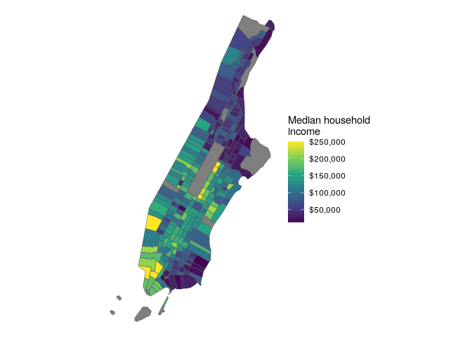
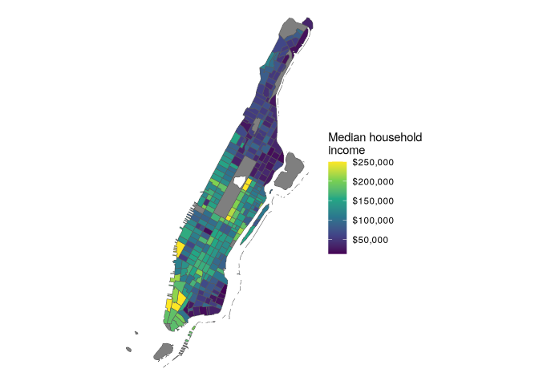

# Better cartography with spatial overlay

Sometimes the cartographic shape files created using `geometry = T` may
not be sufficient. This example is of NYC, which includes water areas in
what tidycensus returns. In this case, we can use the core TIGER/Line
shapefiles instead.

``` r
library(tidycensus)
library(tidyverse)
```

    ## ── Attaching core tidyverse packages ──────────────────────── tidyverse 2.0.0 ──
    ## ✔ dplyr     1.1.4     ✔ readr     2.1.5
    ## ✔ forcats   1.0.0     ✔ stringr   1.5.1
    ## ✔ ggplot2   3.5.1     ✔ tibble    3.2.1
    ## ✔ lubridate 1.9.4     ✔ tidyr     1.3.1
    ## ✔ purrr     1.0.4     
    ## ── Conflicts ────────────────────────────────────────── tidyverse_conflicts() ──
    ## ✖ dplyr::filter() masks stats::filter()
    ## ✖ dplyr::lag()    masks stats::lag()
    ## ℹ Use the conflicted package (<http://conflicted.r-lib.org/>) to force all conflicts to become errors

``` r
library(tigris)
```

    ## To enable caching of data, set `options(tigris_use_cache = TRUE)`
    ## in your R script or .Rprofile.

``` r
library(sf)
```

    ## Linking to GEOS 3.13.1, GDAL 3.10.2, PROJ 9.6.0; sf_use_s2() is TRUE

``` r
options(tigris_use_cache = T)
```

``` r
ny <- get_acs(
  geography = "tract",
  variables = "B19013_001",
  state = "NY",
  county = "New York",
  year = 2020,
  geometry = T
)
```

    ## Getting data from the 2016-2020 5-year ACS

``` r
ggplot(ny) +
  geom_sf(aes(fill = estimate)) +
  scale_fill_viridis_c(labels = scales::label_dollar()) +
  theme_void() +
  labs(fill = "Median household\nincome")
```

<!-- -->

> get TIGER/Line instead of cartographic boundaries

``` r
ny2 <- get_acs(
  geography = "tract",
  variables = "B19013_001",
  state = "NY",
  county = "New York",
  year = 2020,
  geometry = T,
  cb = F
) |> st_transform(6538)
```

    ## Getting data from the 2016-2020 5-year ACS

> remove water areas with `erase_water`

``` r
ny_erase <- erase_water(ny2)
```

    ## Fetching area water data for your dataset's location...

    ## Erasing water area...
    ## If this is slow, try a larger area threshold value.

``` r
ggplot(ny_erase) +
  geom_sf(aes(fill = estimate)) +
  scale_fill_viridis_c(labels = scales::label_dollar()) +
  theme_void() +
  labs(fill = "Median household\nincome")
```

<!-- -->
