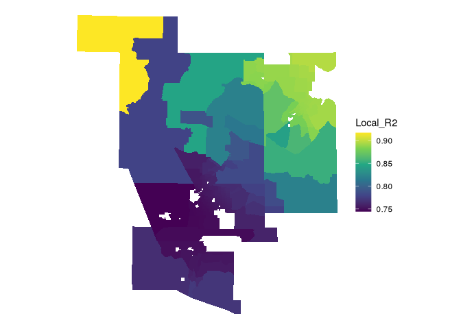
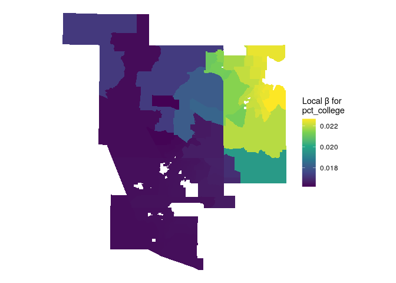
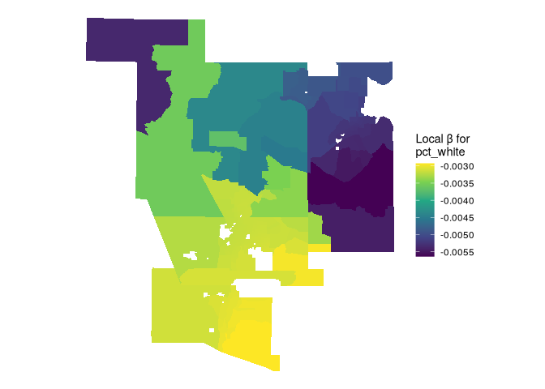
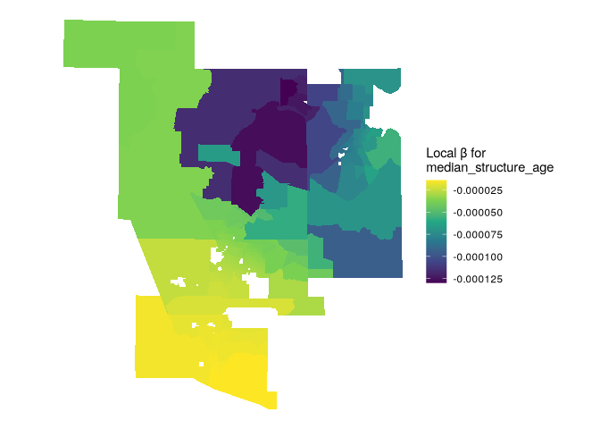

# Geographically weighted regression

A way to look at local variation from neighborhood to neighborhood in
the relationship between predictors and outcomes. It uses a kernel
weighting function (distance-decay).

$$
Y_i=\alpha_i+\sum^m_{k=1}\beta_{ik}X_{ik}+\epsilon_i
$$

where the model intercept, parameters, and error term are all
location-specific. Notably, $\beta_{ik}$ represents a *local regression
coefficient* for predictor $k$ (of the total number of predictors $m$)
that is specific to location $i$.

## Prepare data

``` r
library(tidycensus)
library(tidyverse)
```

    ## ── Attaching core tidyverse packages ──────────────────────── tidyverse 2.0.0 ──
    ## ✔ dplyr     1.1.4     ✔ readr     2.1.5
    ## ✔ forcats   1.0.0     ✔ stringr   1.5.1
    ## ✔ ggplot2   3.5.1     ✔ tibble    3.2.1
    ## ✔ lubridate 1.9.4     ✔ tidyr     1.3.1
    ## ✔ purrr     1.0.4     
    ## ── Conflicts ────────────────────────────────────────── tidyverse_conflicts() ──
    ## ✖ dplyr::filter() masks stats::filter()
    ## ✖ dplyr::lag()    masks stats::lag()
    ## ℹ Use the conflicted package (<http://conflicted.r-lib.org/>) to force all conflicts to become errors

``` r
library(sf)
```

    ## Linking to GEOS 3.13.1, GDAL 3.10.2, PROJ 9.6.0; sf_use_s2() is TRUE

``` r
nm_counties <- c("Valencia", "Bernalillo","Sandoval", 
                 "Santa Fe", "Los Alamos")

variables_to_get <- c(
  median_value = "B25077_001",
  median_rooms = "B25018_001",
  median_income = "DP03_0062",
  total_population = "B01003_001",
  median_age = "B01002_001",
  pct_college = "DP02_0068P",
  pct_foreign_born = "DP02_0094P",
  pct_white = "DP05_0077P",
  median_year_built = "B25037_001",
  percent_ooh = "DP04_0046P"
)

abq_data <- get_acs(
  geography = "tract", 
  variables = variables_to_get,
  state = "NM",
  geometry = T,
  county = nm_counties,
  output = "wide",
  year = 2020
) |> 
  select(-NAME) |> 
  st_transform(32113)
```

    ## Getting data from the 2016-2020 5-year ACS

    ## Downloading feature geometry from the Census website.  To cache shapefiles for use in future sessions, set `options(tigris_use_cache = TRUE)`.

    ## Fetching data by table type ("B/C", "S", "DP") and combining the result.

    ##   |                                                                              |                                                                      |   0%  |                                                                              |=                                                                     |   1%  |                                                                              |=                                                                     |   2%  |                                                                              |==                                                                    |   3%  |                                                                              |===                                                                   |   4%  |                                                                              |===                                                                   |   5%  |                                                                              |====                                                                  |   5%  |                                                                              |====                                                                  |   6%  |                                                                              |=====                                                                 |   7%  |                                                                              |======                                                                |   8%  |                                                                              |======                                                                |   9%  |                                                                              |=======                                                               |   9%  |                                                                              |=======                                                               |  10%  |                                                                              |=======                                                               |  11%  |                                                                              |========                                                              |  11%  |                                                                              |========                                                              |  12%  |                                                                              |=========                                                             |  12%  |                                                                              |=========                                                             |  13%  |                                                                              |==========                                                            |  14%  |                                                                              |==========                                                            |  15%  |                                                                              |===========                                                           |  15%  |                                                                              |===========                                                           |  16%  |                                                                              |============                                                          |  18%  |                                                                              |=============                                                         |  19%  |                                                                              |===============                                                       |  21%  |                                                                              |================                                                      |  23%  |                                                                              |=================                                                     |  24%  |                                                                              |==================                                                    |  26%  |                                                                              |===================                                                   |  28%  |                                                                              |====================                                                  |  28%  |                                                                              |====================                                                  |  29%  |                                                                              |=====================                                                 |  30%  |                                                                              |=======================                                               |  33%  |                                                                              |=========================                                             |  35%  |                                                                              |==========================                                            |  37%  |                                                                              |============================                                          |  40%  |                                                                              |=============================                                         |  42%  |                                                                              |===============================                                       |  44%  |                                                                              |=================================                                     |  47%  |                                                                              |==================================                                    |  49%  |                                                                              |====================================                                  |  51%  |                                                                              |======================================                                |  54%  |                                                                              |=======================================                               |  56%  |                                                                              |=========================================                             |  58%  |                                                                              |===========================================                           |  61%  |                                                                              |============================================                          |  63%  |                                                                              |==============================================                        |  65%  |                                                                              |===============================================                       |  68%  |                                                                              |=================================================                     |  70%  |                                                                              |===================================================                   |  72%  |                                                                              |====================================================                  |  75%  |                                                                              |======================================================                |  77%  |                                                                              |========================================================              |  80%  |                                                                              |=========================================================             |  82%  |                                                                              |===========================================================           |  84%  |                                                                              |=============================================================         |  87%  |                                                                              |==============================================================        |  89%  |                                                                              |================================================================      |  91%  |                                                                              |==================================================================    |  94%  |                                                                              |===================================================================   |  96%  |                                                                              |===================================================================== |  98%  |                                                                              |======================================================================| 100%

``` r
library(units)
```

    ## udunits database from /nix/store/ix91mbkvnbc5v50mvfxim62jibg3c4xl-r-units-0.8-5/library/units/share/udunits/udunits2.xml

``` r
abq_data_for_model <- abq_data |> 
  mutate(pop_density = as.numeric(set_units(total_populationE / st_area(geometry), "1/km2")),
         median_structure_age = 2018 - median_year_builtE)  |> 
    select(!ends_with("M")) |> 
  rename_with(.fn = ~str_remove(.x, "E$")) |> 
  na.omit()

formula1 <- "log(median_value) ~ median_rooms + median_income + pct_college + pct_foreign_born + pct_white + median_age + median_structure_age + percent_ooh + pop_density + total_population"

model1 <- lm(formula = formula1, data = abq_data_for_model)

summary(model1)
```

    ## 
    ## Call:
    ## lm(formula = formula1, data = abq_data_for_model)
    ## 
    ## Residuals:
    ##      Min       1Q   Median       3Q      Max 
    ## -1.35324 -0.11161  0.01791  0.13641  0.95129 
    ## 
    ## Coefficients:
    ##                        Estimate Std. Error t value Pr(>|t|)    
    ## (Intercept)           1.084e+01  1.629e-01  66.566  < 2e-16 ***
    ## median_rooms          3.927e-02  3.665e-02   1.071  0.28496    
    ## median_income         2.705e-06  1.187e-06   2.280  0.02340 *  
    ## pct_college           1.919e-02  1.787e-03  10.740  < 2e-16 ***
    ## pct_foreign_born     -6.087e-03  2.340e-03  -2.601  0.00981 ** 
    ## pct_white            -4.980e-03  1.675e-03  -2.973  0.00322 ** 
    ## median_age            1.643e-02  2.649e-03   6.203  2.1e-09 ***
    ## median_structure_age -7.824e-05  1.347e-04  -0.581  0.56173    
    ## percent_ooh          -1.485e-03  1.559e-03  -0.952  0.34192    
    ## pop_density          -3.051e-06  2.021e-05  -0.151  0.88013    
    ## total_population      9.461e-06  1.138e-05   0.831  0.40663    
    ## ---
    ## Signif. codes:  0 '***' 0.001 '**' 0.01 '*' 0.05 '.' 0.1 ' ' 1
    ## 
    ## Residual standard error: 0.2633 on 267 degrees of freedom
    ## Multiple R-squared:  0.7498, Adjusted R-squared:  0.7404 
    ## F-statistic:    80 on 10 and 267 DF,  p-value: < 2.2e-16

## Choosing a bandwidth

> - Fixed: uses a cutoff distance
> - Adaptive: uses nearest neighbors
>
> Census tracts vary widely in size, so adaptive kernels are usually
> used.
>
> GWmodel can help choose, but object must be converted from `sf` to
> `SpatialPolygonsDataFrame`.

``` r
library(GWmodel)
```

    ## Loading required package: robustbase

    ## Loading required package: sp

    ## Loading required package: Rcpp

    ## Welcome to GWmodel version 2.4-2.

``` r
library(sf)
```

``` r
bw <- bw.gwr(
  formula = formula1,
  data = abq_data_for_model,
  kernel = "bisquare",
  adaptive = TRUE
) 
```

    ## Adaptive bandwidth: 179 CV score: 21.89022 
    ## Adaptive bandwidth: 119 CV score: 30.43867 
    ## Adaptive bandwidth: 218 CV score: 19.56302 
    ## Adaptive bandwidth: 240 CV score: 18.84295 
    ## Adaptive bandwidth: 256 CV score: 18.87809 
    ## Adaptive bandwidth: 232 CV score: 18.89156 
    ## Adaptive bandwidth: 246 CV score: 18.83222 
    ## Adaptive bandwidth: 249 CV score: 18.80326 
    ## Adaptive bandwidth: 251 CV score: 18.80168 
    ## Adaptive bandwidth: 252 CV score: 18.80471 
    ## Adaptive bandwidth: 249 CV score: 18.80326 
    ## Adaptive bandwidth: 250 CV score: 18.77954 
    ## Adaptive bandwidth: 252 CV score: 18.80471 
    ## Adaptive bandwidth: 251 CV score: 18.80168 
    ## Adaptive bandwidth: 251 CV score: 18.80168 
    ## Adaptive bandwidth: 250 CV score: 18.77954

``` r
bw
```

    ## [1] 250

## Fitting and evaluating the GWR model

``` r
gw_model <- gwr.basic(
  formula = formula1,
  data = abq_data_for_model,
  bw = bw,
  kernel = "bisquare", 
  adaptive = TRUE
)
gw_model
```

    ##    ***********************************************************************
    ##    *                       Package   GWmodel                             *
    ##    ***********************************************************************
    ##    Program starts at: 2025-04-19 19:43:43.278202 
    ##    Call:
    ##    gwr.basic(formula = formula1, data = abq_data_for_model, bw = bw, 
    ##     kernel = "bisquare", adaptive = TRUE)
    ## 
    ##    Dependent (y) variable:  NA
    ##    Independent variables:  
    ##    Number of data points: 278
    ##    ***********************************************************************
    ##    *                    Results of Global Regression                     *
    ##    ***********************************************************************
    ## 
    ##    Call:
    ##     lm(formula = formula, data = data)
    ## 
    ##    Residuals:
    ##      Min       1Q   Median       3Q      Max 
    ## -1.35324 -0.11161  0.01791  0.13641  0.95129 
    ## 
    ##    Coefficients:
    ##                           Estimate Std. Error t value Pr(>|t|)    
    ##    (Intercept)           1.084e+01  1.629e-01  66.566  < 2e-16 ***
    ##    median_rooms          3.927e-02  3.665e-02   1.071  0.28496    
    ##    median_income         2.705e-06  1.187e-06   2.280  0.02340 *  
    ##    pct_college           1.919e-02  1.787e-03  10.740  < 2e-16 ***
    ##    pct_foreign_born     -6.087e-03  2.340e-03  -2.601  0.00981 ** 
    ##    pct_white            -4.980e-03  1.675e-03  -2.973  0.00322 ** 
    ##    median_age            1.643e-02  2.649e-03   6.203  2.1e-09 ***
    ##    median_structure_age -7.824e-05  1.347e-04  -0.581  0.56173    
    ##    percent_ooh          -1.485e-03  1.559e-03  -0.952  0.34192    
    ##    pop_density          -3.051e-06  2.021e-05  -0.151  0.88013    
    ##    total_population      9.461e-06  1.138e-05   0.831  0.40663    
    ## 
    ##    ---Significance stars
    ##    Signif. codes:  0 '***' 0.001 '**' 0.01 '*' 0.05 '.' 0.1 ' ' 1 
    ##    Residual standard error: 0.2633 on 267 degrees of freedom
    ##    Multiple R-squared: 0.7498
    ##    Adjusted R-squared: 0.7404 
    ##    F-statistic:    80 on 10 and 267 DF,  p-value: < 2.2e-16 
    ##    ***Extra Diagnostic information
    ##    Residual sum of squares: 18.51636
    ##    Sigma(hat): 0.259014
    ##    AIC:  59.83713
    ##    AICc:  61.01449
    ##    BIC:  -107.1
    ##    ***********************************************************************
    ##    *          Results of Geographically Weighted Regression              *
    ##    ***********************************************************************
    ## 
    ##    *********************Model calibration information*********************
    ##    Kernel function: bisquare 
    ##    Adaptive bandwidth: 250 (number of nearest neighbours)
    ##    Regression points: the same locations as observations are used.
    ##    Distance metric: Euclidean distance metric is used.
    ## 
    ##    ****************Summary of GWR coefficient estimates:******************
    ##                                Min.     1st Qu.      Median     3rd Qu.    Max.
    ##    Intercept             1.0165e+01  1.0959e+01  1.0996e+01  1.1021e+01 11.3952
    ##    median_rooms          3.1835e-03  4.9776e-02  5.4601e-02  6.9113e-02  0.1581
    ##    median_income        -2.1929e-06  3.0479e-06  3.1045e-06  3.1403e-06  0.0000
    ##    pct_college           1.6203e-02  1.6415e-02  1.6449e-02  1.6512e-02  0.0227
    ##    pct_foreign_born     -1.0235e-02 -1.0089e-02 -1.0037e-02 -9.4024e-03  0.0069
    ##    pct_white            -5.6371e-03 -3.1999e-03 -3.1649e-03 -3.1397e-03 -0.0029
    ##    median_age            9.4381e-03  9.9838e-03  1.0054e-02  1.0153e-02  0.0231
    ##    median_structure_age -1.2985e-04 -4.2704e-05 -3.3132e-05 -2.9196e-05  0.0000
    ##    percent_ooh          -4.7955e-03 -2.1312e-03 -1.9239e-03 -1.5424e-03  0.0000
    ##    pop_density          -7.2861e-05 -1.6100e-05 -1.0483e-05 -7.1137e-06  0.0000
    ##    total_population     -4.3436e-05  2.2706e-05  2.5300e-05  2.5705e-05  0.0000
    ##    ************************Diagnostic information*************************
    ##    Number of data points: 278 
    ##    Effective number of parameters (2trace(S) - trace(S'S)): 24.89238 
    ##    Effective degrees of freedom (n-2trace(S) + trace(S'S)): 253.1076 
    ##    AICc (GWR book, Fotheringham, et al. 2002, p. 61, eq 2.33): 21.2841 
    ##    AIC (GWR book, Fotheringham, et al. 2002,GWR p. 96, eq. 4.22): -5.611173 
    ##    BIC (GWR book, Fotheringham, et al. 2002,GWR p. 61, eq. 2.34): -186.6793 
    ##    Residual sum of squares: 14.79388 
    ##    R-square value:  0.8000753 
    ##    Adjusted R-square value:  0.7803353 
    ## 
    ##    ***********************************************************************
    ##    Program stops at: 2025-04-19 19:43:43.305676

``` r
names(gw_model)
```

    ## [1] "GW.arguments"  "GW.diagnostic" "lm"            "SDF"          
    ## [5] "timings"       "this.call"     "Ftests"

> `SDF` is a `SpatialPolygonsDataFrame` that can be mapped.

``` r
gw_model_results <- gw_model$SDF |> 
  st_as_sf()

names(gw_model_results)
```

    ##  [1] "Intercept"               "median_rooms"           
    ##  [3] "median_income"           "pct_college"            
    ##  [5] "pct_foreign_born"        "pct_white"              
    ##  [7] "median_age"              "median_structure_age"   
    ##  [9] "percent_ooh"             "pop_density"            
    ## [11] "total_population"        "y"                      
    ## [13] "yhat"                    "residual"               
    ## [15] "CV_Score"                "Stud_residual"          
    ## [17] "Intercept_SE"            "median_rooms_SE"        
    ## [19] "median_income_SE"        "pct_college_SE"         
    ## [21] "pct_foreign_born_SE"     "pct_white_SE"           
    ## [23] "median_age_SE"           "median_structure_age_SE"
    ## [25] "percent_ooh_SE"          "pop_density_SE"         
    ## [27] "total_population_SE"     "Intercept_TV"           
    ## [29] "median_rooms_TV"         "median_income_TV"       
    ## [31] "pct_college_TV"          "pct_foreign_born_TV"    
    ## [33] "pct_white_TV"            "median_age_TV"          
    ## [35] "median_structure_age_TV" "percent_ooh_TV"         
    ## [37] "pop_density_TV"          "total_population_TV"    
    ## [39] "Local_R2"                "geometry"

> Map the local R-squared

``` r
ggplot(gw_model_results, aes(fill = Local_R2)) +
  geom_sf(color = NA) +
  scale_fill_viridis_c() +
  theme_void()
```

<!-- -->

> The model performs better in the Santa Fe and Los Alamos regions and
> worse in Bernalillo County and near Albuquerque.

``` r
library(mapview)
mapview(gw_model_results, zcol = "Local_R2")
```

> Visualize local parameter estimate variation

``` r
ggplot(gw_model_results, aes(fill = pct_college)) +
  geom_sf(color = NA) + 
  scale_fill_viridis_c() + 
  theme_void() + 
  labs(fill = "Local β for \npct_college")  
```

<!-- -->

``` r
ggplot(gw_model_results, aes(fill = pct_white)) +
  geom_sf(color = NA) + 
  scale_fill_viridis_c() + 
  theme_void() + 
  labs(fill = "Local β for \npct_white") 
```

<!-- -->

``` r
ggplot(gw_model_results, aes(fill = median_structure_age)) +
  geom_sf(color = NA) + 
  scale_fill_viridis_c() + 
  theme_void() + 
  labs(fill = "Local β for \nmedian_structure_age") 
```

<!-- -->
