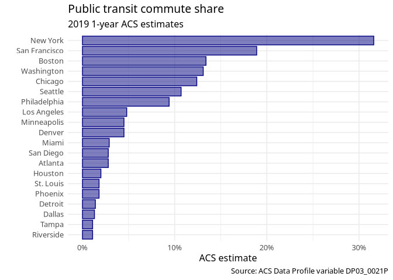

# Visualization

## Basics

``` r
library(tidycensus)
```

``` r
nm_wide <- get_acs(
  geography = "county", 
  state = "New Mexico", 
  variables = c(medinc = "B19013_001", 
                medage = "B01002_001"), 
  output = "wide",
  year = 2020
)
```

    ## Getting data from the 2016-2020 5-year ACS

``` r
nm_wide
```

    ## # A tibble: 33 × 6
    ##    GEOID NAME                         medincE medincM medageE medageM
    ##    <chr> <chr>                          <dbl>   <dbl>   <dbl>   <dbl>
    ##  1 35003 Catron County, New Mexico      36607    8958    59.4     2.6
    ##  2 35005 Chaves County, New Mexico      46254    2393    36.1     0.3
    ##  3 35006 Cibola County, New Mexico      44731    3783    37.5     0.7
    ##  4 35007 Colfax County, New Mexico      36937    4886    50.3     0.6
    ##  5 35009 Curry County, New Mexico       48903    2442    31.7     0.3
    ##  6 35011 De Baca County, New Mexico     31532   13343    22.2     6.9
    ##  7 35013 Doña Ana County, New Mexico    44024    2292    33.3     0.2
    ##  8 35015 Eddy County, New Mexico        65000    3898    35.4     0.3
    ##  9 35017 Grant County, New Mexico       37453    3245    46.5     0.4
    ## 10 35019 Guadalupe County, New Mexico   31061    5288    43.7     4.6
    ## # ℹ 23 more rows

``` r
library(tidyverse)
options(scipen = 999) # avoid scientific notation

ggplot(nm_wide, aes(x = medincE)) +
  geom_histogram(bins = 15)
```

<!-- -->

``` r
ggplot(nm_wide, aes(y = medincE)) +
  geom_boxplot()
```

<!-- -->

## Multivariate relationships

``` r
ggplot(nm_wide, aes(x = medageE, y = medincE)) +
  geom_point()
```

<!-- -->

``` r
ggplot(nm_wide, aes(x = medageE, y = medincE)) +
  geom_point() +
  geom_smooth(method = "lm")
```

    ## `geom_smooth()` using formula = 'y ~ x'

<!-- -->

## Customizing visualizations

``` r
library(tidycensus)
library(tidyverse)
```

In this example, we will create a visualization that illustrates the
percent of commuters that take public transportation to work for the
largest metropolitan areas in the United States. The data come from the
2019 1-year American Community Survey Data Profile, variable
`DP03_0021P`.

``` r
metros <- get_acs(
  geography = "cbsa", 
  variables = "DP03_0021P", 
  summary_var = "B01003_001", 
  survey = "acs1", 
  year = 2019
) |> 
  slice_max(summary_est, n = 20)
```

    ## Getting data from the 2019 1-year ACS

    ## The 1-year ACS provides data for geographies with populations of 65,000 and greater.

    ## Using the ACS Data Profile

``` r
metros
```

    ## # A tibble: 20 × 7
    ##    GEOID NAME                    variable estimate   moe summary_est summary_moe
    ##    <chr> <chr>                   <chr>       <dbl> <dbl>       <dbl>       <dbl>
    ##  1 35620 New York-Newark-Jersey… DP03_00…     31.6   0.2    19216182          NA
    ##  2 31080 Los Angeles-Long Beach… DP03_00…      4.8   0.1    13214799          NA
    ##  3 16980 Chicago-Naperville-Elg… DP03_00…     12.4   0.3     9457867        1469
    ##  4 19100 Dallas-Fort Worth-Arli… DP03_00…      1.3   0.1     7573136          NA
    ##  5 26420 Houston-The Woodlands-… DP03_00…      2     0.2     7066140          NA
    ##  6 47900 Washington-Arlington-A… DP03_00…     13.1   0.4     6280697        2482
    ##  7 33100 Miami-Fort Lauderdale-… DP03_00…      2.9   0.2     6166488          NA
    ##  8 37980 Philadelphia-Camden-Wi… DP03_00…      9.4   0.3     6102434          NA
    ##  9 12060 Atlanta-Sandy Springs-… DP03_00…      2.8   0.2     6018744        3340
    ## 10 38060 Phoenix-Mesa-Chandler,… DP03_00…      1.8   0.2     4948203          NA
    ## 11 14460 Boston-Cambridge-Newto… DP03_00…     13.4   0.4     4873019          NA
    ## 12 41860 San Francisco-Oakland-… DP03_00…     18.9   0.4     4731803          NA
    ## 13 40140 Riverside-San Bernardi… DP03_00…      1.1   0.2     4650631          NA
    ## 14 19820 Detroit-Warren-Dearbor… DP03_00…      1.4   0.2     4319629          NA
    ## 15 42660 Seattle-Tacoma-Bellevu… DP03_00…     10.7   0.4     3979845          NA
    ## 16 33460 Minneapolis-St. Paul-B… DP03_00…      4.5   0.2     3640043          NA
    ## 17 41740 San Diego-Chula Vista-… DP03_00…      2.8   0.3     3338330          NA
    ## 18 45300 Tampa-St. Petersburg-C… DP03_00…      1.1   0.2     3194831          NA
    ## 19 19740 Denver-Aurora-Lakewood… DP03_00…      4.5   0.3     2967239          NA
    ## 20 41180 St. Louis, MO-IL Metro… DP03_00…      1.8   0.2     2801423        1618

``` r
ggplot(metros, aes(x = NAME, y = estimate)) +
  geom_col()
```

<!-- -->

> Simplify the names

``` r
metro_plot <- metros |> 
  mutate(NAME = str_remove(NAME, "-.*$")) |> 
  mutate(NAME = str_remove(NAME, ",.*$")) |> 
  ggplot(aes(y = reorder(NAME, estimate), x = estimate)) +
  geom_col()
metro_plot
```

<!-- -->

``` r
metro_plot <- metro_plot +
  theme_minimal() +
  labs(title = "Public transit commute share", 
       subtitle = "2019 1-year ACS estimates",
       y = "",
       x = "ACS estimate", 
       caption = "Source: ACS Data Profile variable DP03_0021P")
metro_plot
```

<!-- -->

``` r
library(scales)
```

``` r
metro_transit <- metros |> 
  mutate(NAME = str_remove(NAME, "-.*$")) %>%
  mutate(NAME = str_remove(NAME, ",.*$")) %>%
  ggplot(aes(y = reorder(NAME, estimate), x = estimate)) + 
  geom_col(color = "navy", fill = "navy", 
           alpha = 0.5, width = 0.85) +
  theme_minimal(base_size = 12, base_family = "Verdana") +
  scale_x_continuous(labels = label_percent(scale = 1)) +
  labs(title = "Public transit commute share", 
       subtitle = "2019 1-year ACS estimates",
       y = "",
       x = "ACS estimate", 
       caption = "Source: ACS Data Profile variable DP03_0021P")
metro_transit
```

<!-- -->

## Exporting visualizations

``` r
ggsave("metro_transit.png")
```

    ## Saving 7 x 5 in image

``` r
ggsave(
  filename = "metro_transit.png",
  path = "./images",
  width = 8,
  height = 5, 
  units = "in", 
  dpi = 300
)
```

## Visualizing margins of error

``` r
new_mexico <- get_decennial(
  state = "New Mexico", 
  geography = "county",
  variables = c(totalpop = "P1_001N"),
  year = 2020
) |> arrange(desc(value))
```

    ## Getting data from the 2020 decennial Census

    ## Using the PL 94-171 Redistricting Data Summary File

    ## Note: 2020 decennial Census data use differential privacy, a technique that
    ## introduces errors into data to preserve respondent confidentiality.
    ## ℹ Small counts should be interpreted with caution.
    ## ℹ See https://www.census.gov/library/fact-sheets/2021/protecting-the-confidentiality-of-the-2020-census-redistricting-data.html for additional guidance.
    ## This message is displayed once per session.

``` r
new_mexico
```

    ## # A tibble: 33 × 4
    ##    GEOID NAME                          variable  value
    ##    <chr> <chr>                         <chr>     <dbl>
    ##  1 35001 Bernalillo County, New Mexico totalpop 676444
    ##  2 35013 Doña Ana County, New Mexico   totalpop 219561
    ##  3 35049 Santa Fe County, New Mexico   totalpop 154823
    ##  4 35043 Sandoval County, New Mexico   totalpop 148834
    ##  5 35045 San Juan County, New Mexico   totalpop 121661
    ##  6 35061 Valencia County, New Mexico   totalpop  76205
    ##  7 35025 Lea County, New Mexico        totalpop  74455
    ##  8 35031 McKinley County, New Mexico   totalpop  72902
    ##  9 35035 Otero County, New Mexico      totalpop  67839
    ## 10 35005 Chaves County, New Mexico     totalpop  65157
    ## # ℹ 23 more rows

Estimates for the counties with smaller population sizes are likely to
be subject to a larger margin of error than those with larger baseline
populations. Comparing median household incomes of these sixteen
counties illustrates this point.

``` r
nm_income <- get_acs(
  state = "New Mexico", 
  geography = "county", 
  variables = c(hhincome = "B19013_001"), 
  year = 2020
) |> 
  mutate(NAME = str_remove(NAME, " County, New Mexico"))
```

    ## Getting data from the 2016-2020 5-year ACS

``` r
nm_income
```

    ## # A tibble: 33 × 5
    ##    GEOID NAME       variable estimate   moe
    ##    <chr> <chr>      <chr>       <dbl> <dbl>
    ##  1 35001 Bernalillo hhincome    54308   929
    ##  2 35003 Catron     hhincome    36607  8958
    ##  3 35005 Chaves     hhincome    46254  2393
    ##  4 35006 Cibola     hhincome    44731  3783
    ##  5 35007 Colfax     hhincome    36937  4886
    ##  6 35009 Curry      hhincome    48903  2442
    ##  7 35011 De Baca    hhincome    31532 13343
    ##  8 35013 Doña Ana   hhincome    44024  2292
    ##  9 35015 Eddy       hhincome    65000  3898
    ## 10 35017 Grant      hhincome    37453  3245
    ## # ℹ 23 more rows

``` r
nm_income |> 
  ggplot(aes(x = estimate, y = reorder(NAME, estimate))) +
  geom_point(size = 2, color = "darkgreen") +
  labs(title = "Median household income", 
       subtitle = "Counties in New Mexico", 
       x = "", 
       y = "ACS estimate") +
  theme_minimal(base_size = 11) +
  scale_x_continuous(labels = label_dollar())
```

<!-- -->

## Error bars

``` r
nm_income |> 
  arrange(desc(moe))
```

    ## # A tibble: 33 × 5
    ##    GEOID NAME      variable estimate   moe
    ##    <chr> <chr>     <chr>       <dbl> <dbl>
    ##  1 35011 De Baca   hhincome    31532 13343
    ##  2 35033 Mora      hhincome    29458  9207
    ##  3 35003 Catron    hhincome    36607  8958
    ##  4 35059 Union     hhincome    35484  8155
    ##  5 35023 Hidalgo   hhincome    44722  7506
    ##  6 35021 Harding   hhincome    32500  7357
    ##  7 35057 Torrance  hhincome    38240  6353
    ##  8 35051 Sierra    hhincome    33873  5975
    ##  9 35019 Guadalupe hhincome    31061  5288
    ## 10 35053 Socorro   hhincome    40297  5122
    ## # ℹ 23 more rows

``` r
nm_income |> 
  ggplot(aes(x = estimate, y = reorder(NAME, estimate))) +
  geom_errorbar(aes(xmin = estimate - moe, xmax = estimate + moe)) +
  geom_point(size = 2, color = "gold") +
  theme_minimal(base_size = 10) +
  labs(title = "Median household income", 
       subtitle = "Counties in Maine", 
       x = "2016-2020 ACS estimate", 
       y = "") + 
  scale_x_continuous(labels = label_dollar())  
```

<!-- -->

## Visualizing estimates over time

``` r
years <- 2005:2019
names(years) <- years

bernalillo_value <- map_dfr(years, ~{
  get_acs(
    geography = "county", 
    variables = "B25077_001",
    state = "New Mexico",
    county = "Bernalillo",
    year = .x,
    survey = "acs1"
  )
}, .id = "year")
bernalillo_value
```

    ## # A tibble: 15 × 6
    ##    year  GEOID NAME                          variable   estimate   moe
    ##    <chr> <chr> <chr>                         <chr>         <dbl> <dbl>
    ##  1 2005  35001 Bernalillo County, New Mexico B25077_001   152400  3060
    ##  2 2006  35001 Bernalillo County, New Mexico B25077_001   173500  3086
    ##  3 2007  35001 Bernalillo County, New Mexico B25077_001   185600  3406
    ##  4 2008  35001 Bernalillo County, New Mexico B25077_001   201900  4553
    ##  5 2009  35001 Bernalillo County, New Mexico B25077_001   189800  3618
    ##  6 2010  35001 Bernalillo County, New Mexico B25077_001   192800  3139
    ##  7 2011  35001 Bernalillo County, New Mexico B25077_001   185100  5771
    ##  8 2012  35001 Bernalillo County, New Mexico B25077_001   181600  3874
    ##  9 2013  35001 Bernalillo County, New Mexico B25077_001   185000  3894
    ## 10 2014  35001 Bernalillo County, New Mexico B25077_001   184600  4412
    ## 11 2015  35001 Bernalillo County, New Mexico B25077_001   189000  3121
    ## 12 2016  35001 Bernalillo County, New Mexico B25077_001   194200  5197
    ## 13 2017  35001 Bernalillo County, New Mexico B25077_001   198000  4999
    ## 14 2018  35001 Bernalillo County, New Mexico B25077_001   208400  4626
    ## 15 2019  35001 Bernalillo County, New Mexico B25077_001   210900  4113

``` r
bernalillo_value |> 
  ggplot(aes(x = year, y = estimate, group = 1)) +
  geom_line() +
  geom_point()
```

<!-- -->

``` r
santa_fe_value <- map_dfr(years, ~{
  get_acs(
    geography = "county", 
    variables = "B25077_001",
    state = "New Mexico",
    county = "Santa Fe",
    year = .x,
    survey = "acs1"
  )
}, .id = "year")
santa_fe_value |> 
  ggplot(aes(x = year, y = estimate, group = 1)) +
  geom_line() +
  geom_point()
```

<!-- -->

``` r
bernalillo_value |> 
  ggplot(aes(x = year, y = estimate, group = 1)) +
  geom_ribbon(aes(ymax = estimate + moe, ymin = estimate - moe),
              fill = "aquamarine", alpha = 0.4) +
  geom_line(color = "gold") +
  geom_point(color = "firebrick") +
  theme_minimal(base_size = 12) +
  scale_y_continuous(labels = label_dollar(scale = .001, suffix = "k")) +
  labs(title = "Med home value in Bernalillo County, NM", 
       x = "Year", 
       y = "ACS estimate",
       caption = "Shaded area represents ACS margin of error")
```

<!-- -->

## Population pyramids

Population pyramids are typically constructed by visualizing population
size or proportion on the x-axis; age cohort on the y-axis; and sex is
represented categorically with male and female bars mirrored around a
central axis.

``` r
nm <- get_estimates(
  geography = "state", 
  state = "NM", 
  product = "characteristics",
  breakdown = c("SEX", "AGEGROUP"),
  breakdown_labels = T,
  year = 2019
)
nm
```

    ## # A tibble: 96 × 5
    ##    GEOID NAME         value SEX        AGEGROUP          
    ##    <chr> <chr>        <dbl> <chr>      <fct>             
    ##  1 35    New Mexico 2096829 Both sexes All ages          
    ##  2 35    New Mexico  120986 Both sexes Age 0 to 4 years  
    ##  3 35    New Mexico  132779 Both sexes Age 5 to 9 years  
    ##  4 35    New Mexico 1037432 Male       All ages          
    ##  5 35    New Mexico   67810 Male       Age 5 to 9 years  
    ##  6 35    New Mexico 1059397 Female     All ages          
    ##  7 35    New Mexico   64969 Female     Age 5 to 9 years  
    ##  8 35    New Mexico   24468 Female     Age 80 to 84 years
    ##  9 35    New Mexico  139489 Both sexes Age 10 to 14 years
    ## 10 35    New Mexico   70811 Male       Age 10 to 14 years
    ## # ℹ 86 more rows

> Processing
>
> - remove “Both sexes” rows
> - remove rows for “All ages”
> - to achieve the mirroring, convert all Male values to negative

``` r
nm_filtered <- nm |> 
  filter(str_detect(AGEGROUP, "^Age"),
         SEX != "Both sexes") |> 
  mutate(value = ifelse(SEX == "Male", -value, value))
nm_filtered
```

    ## # A tibble: 36 × 5
    ##    GEOID NAME        value SEX    AGEGROUP          
    ##    <chr> <chr>       <dbl> <chr>  <fct>             
    ##  1 35    New Mexico -67810 Male   Age 5 to 9 years  
    ##  2 35    New Mexico  64969 Female Age 5 to 9 years  
    ##  3 35    New Mexico  24468 Female Age 80 to 84 years
    ##  4 35    New Mexico -70811 Male   Age 10 to 14 years
    ##  5 35    New Mexico -70557 Male   Age 15 to 19 years
    ##  6 35    New Mexico  68678 Female Age 10 to 14 years
    ##  7 35    New Mexico  67901 Female Age 15 to 19 years
    ##  8 35    New Mexico -72869 Male   Age 20 to 24 years
    ##  9 35    New Mexico  67132 Female Age 20 to 24 years
    ## 10 35    New Mexico -71278 Male   Age 30 to 34 years
    ## # ℹ 26 more rows

``` r
nm_filtered |> 
  ggplot(aes(x = value, y = AGEGROUP, fill = SEX)) +
  geom_col()
```

<!-- -->

- specify appropriate chart labels
- format the axis tick labels by using appropriate `scale_*` functions
- set the X-axis limits to show both sides of 0 equally. In particular,
  this involves the use of custom absolute values to represent
  population sizes, and the removal of redundant age group information
- use
  [`theme_minimal()`](https://ggplot2.tidyverse.org/reference/ggtheme.html),
  which uses a white background with muted gridlines.

``` r
nm_pyramid <- nm_filtered |> 
  ggplot(aes(y = AGEGROUP, 
             x = value, 
             fill = SEX)) +
  geom_col(width = 0.95, alpha = 0.75) +
  theme_minimal(base_family = "Verdana", base_size = 12) +
  scale_x_continuous(
    labels = ~ number_format(scale = .001, suffix = "k")(abs(.x)),
    limits = 100000 * c(-1,1)
  ) +
  scale_y_discrete(labels = ~ str_remove_all(.x, "Age\\s|\\syears")) +
  scale_fill_manual(values = c("firebrick","aquamarine")) +
  labs(x = "", 
       y = "2019 Census Bureau population estimate", 
       title = "Population structure in New Mexico", 
       fill = "", 
       caption = "Data source: US Census Bureau population estimates & tidycensus R package")
nm_pyramid
```

<!-- -->

## Group-wise comparisons

``` r
housing_val <- get_acs(
  geography = "tract", 
  variables = "B25077_001",
  state = "NM", 
  county = c(
    "Bernalillo", 
    "Sandoval", 
    "Los Alamos", 
    "Santa Fe",
    "Dona Ana",
    "McKinley"
  ),
  year = 2020
)
```

    ## Getting data from the 2016-2020 5-year ACS

``` r
housing_val
```

    ## # A tibble: 366 × 5
    ##    GEOID       NAME                                      variable estimate   moe
    ##    <chr>       <chr>                                     <chr>       <dbl> <dbl>
    ##  1 35001000107 Census Tract 1.07, Bernalillo County, Ne… B25077_…   371700 17742
    ##  2 35001000108 Census Tract 1.08, Bernalillo County, Ne… B25077_…   236100 11071
    ##  3 35001000109 Census Tract 1.09, Bernalillo County, Ne… B25077_…   261500 10628
    ##  4 35001000110 Census Tract 1.10, Bernalillo County, Ne… B25077_…   217800  9528
    ##  5 35001000111 Census Tract 1.11, Bernalillo County, Ne… B25077_…   226100  8486
    ##  6 35001000112 Census Tract 1.12, Bernalillo County, Ne… B25077_…   283500 18244
    ##  7 35001000113 Census Tract 1.13, Bernalillo County, Ne… B25077_…   201800 17349
    ##  8 35001000114 Census Tract 1.14, Bernalillo County, Ne… B25077_…   167200  6364
    ##  9 35001000115 Census Tract 1.15, Bernalillo County, Ne… B25077_…   165700  3514
    ## 10 35001000116 Census Tract 1.16, Bernalillo County, Ne… B25077_…   223300 12353
    ## # ℹ 356 more rows

``` r
housing_val2 <- housing_val |> 
  separate(
    NAME, into = c("tract","county","state"),
    sep = ", "
  )
housing_val2
```

    ## # A tibble: 366 × 7
    ##    GEOID       tract             county            state variable estimate   moe
    ##    <chr>       <chr>             <chr>             <chr> <chr>       <dbl> <dbl>
    ##  1 35001000107 Census Tract 1.07 Bernalillo County New … B25077_…   371700 17742
    ##  2 35001000108 Census Tract 1.08 Bernalillo County New … B25077_…   236100 11071
    ##  3 35001000109 Census Tract 1.09 Bernalillo County New … B25077_…   261500 10628
    ##  4 35001000110 Census Tract 1.10 Bernalillo County New … B25077_…   217800  9528
    ##  5 35001000111 Census Tract 1.11 Bernalillo County New … B25077_…   226100  8486
    ##  6 35001000112 Census Tract 1.12 Bernalillo County New … B25077_…   283500 18244
    ##  7 35001000113 Census Tract 1.13 Bernalillo County New … B25077_…   201800 17349
    ##  8 35001000114 Census Tract 1.14 Bernalillo County New … B25077_…   167200  6364
    ##  9 35001000115 Census Tract 1.15 Bernalillo County New … B25077_…   165700  3514
    ## 10 35001000116 Census Tract 1.16 Bernalillo County New … B25077_…   223300 12353
    ## # ℹ 356 more rows

``` r
housing_val2 |> 
  group_by(county) |> 
  summarise(min = min(estimate, na.rm = T), 
            mean = mean(estimate, na.rm = T), 
            median = median(estimate, na.rm = T), 
            max = max(estimate, na.rm = T))
```

    ## # A tibble: 6 × 5
    ##   county               min    mean median    max
    ##   <chr>              <dbl>   <dbl>  <dbl>  <dbl>
    ## 1 Bernalillo County  20100 219124. 204350 719800
    ## 2 Doña Ana County    76200 157002. 130100 359000
    ## 3 Los Alamos County 232100 316400  323700 386100
    ## 4 McKinley County    33400  77652.  64500 189000
    ## 5 Sandoval County    51300 214342. 192000 475200
    ## 6 Santa Fe County   122400 363269. 307300 851600

``` r
housing_val2 |> 
  ggplot(aes(x = estimate)) +
  geom_density()
```

    ## Warning: Removed 20 rows containing non-finite outside the scale range
    ## (`stat_density()`).

<!-- -->

``` r
housing_val2 |> 
  ggplot(aes(x = estimate, fill = county)) +
  geom_density(alpha = 0.3)
```

    ## Warning: Removed 20 rows containing non-finite outside the scale range
    ## (`stat_density()`).

<!-- -->

``` r
library(scales)
housing_val2 |> 
  ggplot(aes(x = estimate)) +
  geom_density(fill = "orange", color = "red", alpha = 0.5) +
  facet_wrap(~county) +
  scale_x_continuous(labels = dollar_format(scale = .001,
                                           suffix = "k")) +
  theme_minimal(base_size = 14) +
  theme(axis.text.y = element_blank(), 
        axis.text.x = element_text(angle = 45)) +
  labs(x = "ACS estimate", 
       y = "",
       title = "Median home value by census tract, 2015-2019 ACS")
```

<!-- -->

## ggridges

``` r
library(ggridges)
```

``` r
housing_val2 |> 
  ggplot(aes(x = estimate, y = county)) +
  geom_density_ridges() +
  theme_ridges() +
  labs(x = "Median home value: 2016-2020 ACS estimate", 
       y = "") +
  scale_x_continuous(labels = label_dollar(scale = .001, suffix = "k", 
                                           breaks = c(0, 5e5, 1e6))) +
  theme(axis.text.x = element_text(angle = 45))
```

    ## Picking joint bandwidth of 31400

<!-- -->

``` r
library(ggbeeswarm)
```

``` r
race_vars <- c(
  White = "B03002_003",
  Black = "B03002_004",
  Native = "B03002_005",
  Asian = "B03002_006",
  Hispanic = "B03002_012"
)
abq_race_income <- get_acs(
  geography = "tract", 
  state = "NM",
  county = c("Bernalillo", "Sandoval"),
  variables = race_vars,
  summary_var = "B19013_001", 
  year = 2020
)
```

    ## Getting data from the 2016-2020 5-year ACS

``` r
abq_race_income <- abq_race_income |> 
  group_by(GEOID) |> 
  filter(estimate == max(estimate, na.rm = T)) |> 
  ungroup() |> 
  filter(estimate != 0)
```

``` r
abq_race_income |> 
  ggplot(aes(x = variable, y = summary_est, color = summary_est)) +
  geom_quasirandom(alpha = 0.5) +
  coord_flip() +
  theme_minimal(base_size = 12) +
  scale_color_viridis_c(guide = "none") +
  scale_y_continuous(labels = label_dollar()) +
  labs(x = "Largest group in Census tract", 
       y = "Median household income", 
       title = "Household income distribution by largest racial/ethnic group", 
       subtitle = "Census tracts, Albuquerque Area", 
       caption = "Data source: 2016-2020 ACS")  
```

    ## Warning: Removed 1 row containing missing values or values outside the scale range
    ## (`position_quasirandom()`).

<!-- -->

``` r
nm_pyramid_data <-  get_estimates(
  geography = "county",
  state = "NM",
  product = "characteristics",
  breakdown = c("SEX", "AGEGROUP"),
  breakdown_labels = TRUE,
  year = 2019
) %>%
  filter(str_detect(AGEGROUP, "^Age"),
         SEX != "Both sexes") %>%
  group_by(NAME) %>%
  mutate(prop = value / sum(value, na.rm = TRUE)) %>%
  ungroup() %>%
  mutate(prop = ifelse(SEX == "Male", -prop, prop))
nm_pyramid_data
```

    ## # A tibble: 1,188 × 6
    ##    GEOID NAME                       value SEX   AGEGROUP              prop
    ##    <chr> <chr>                      <dbl> <chr> <fct>                <dbl>
    ##  1 35023 Hidalgo County, New Mexico   138 Male  Age 0 to 4 years   -0.0329
    ##  2 35023 Hidalgo County, New Mexico   119 Male  Age 5 to 9 years   -0.0283
    ##  3 35023 Hidalgo County, New Mexico   139 Male  Age 10 to 14 years -0.0331
    ##  4 35023 Hidalgo County, New Mexico   124 Male  Age 20 to 24 years -0.0295
    ##  5 35023 Hidalgo County, New Mexico   148 Male  Age 25 to 29 years -0.0353
    ##  6 35023 Hidalgo County, New Mexico   113 Male  Age 30 to 34 years -0.0269
    ##  7 35023 Hidalgo County, New Mexico    81 Male  Age 40 to 44 years -0.0193
    ##  8 35023 Hidalgo County, New Mexico    91 Male  Age 45 to 49 years -0.0217
    ##  9 35023 Hidalgo County, New Mexico   151 Male  Age 50 to 54 years -0.0360
    ## 10 35023 Hidalgo County, New Mexico   161 Male  Age 55 to 59 years -0.0384
    ## # ℹ 1,178 more rows

``` r
nm_pyramid_data <- nm_pyramid_data |> 
  separate(
    NAME, into = c("county","state"),
    sep = ", "
  )
nm_pyramid_data
```

    ## # A tibble: 1,188 × 7
    ##    GEOID county         state      value SEX   AGEGROUP              prop
    ##    <chr> <chr>          <chr>      <dbl> <chr> <fct>                <dbl>
    ##  1 35023 Hidalgo County New Mexico   138 Male  Age 0 to 4 years   -0.0329
    ##  2 35023 Hidalgo County New Mexico   119 Male  Age 5 to 9 years   -0.0283
    ##  3 35023 Hidalgo County New Mexico   139 Male  Age 10 to 14 years -0.0331
    ##  4 35023 Hidalgo County New Mexico   124 Male  Age 20 to 24 years -0.0295
    ##  5 35023 Hidalgo County New Mexico   148 Male  Age 25 to 29 years -0.0353
    ##  6 35023 Hidalgo County New Mexico   113 Male  Age 30 to 34 years -0.0269
    ##  7 35023 Hidalgo County New Mexico    81 Male  Age 40 to 44 years -0.0193
    ##  8 35023 Hidalgo County New Mexico    91 Male  Age 45 to 49 years -0.0217
    ##  9 35023 Hidalgo County New Mexico   151 Male  Age 50 to 54 years -0.0360
    ## 10 35023 Hidalgo County New Mexico   161 Male  Age 55 to 59 years -0.0384
    ## # ℹ 1,178 more rows

``` r
nm_pyramid_data <- nm_pyramid_data |> 
  mutate(county = str_remove(county, " County$"))
nm_pyramid_data
```

    ## # A tibble: 1,188 × 7
    ##    GEOID county  state      value SEX   AGEGROUP              prop
    ##    <chr> <chr>   <chr>      <dbl> <chr> <fct>                <dbl>
    ##  1 35023 Hidalgo New Mexico   138 Male  Age 0 to 4 years   -0.0329
    ##  2 35023 Hidalgo New Mexico   119 Male  Age 5 to 9 years   -0.0283
    ##  3 35023 Hidalgo New Mexico   139 Male  Age 10 to 14 years -0.0331
    ##  4 35023 Hidalgo New Mexico   124 Male  Age 20 to 24 years -0.0295
    ##  5 35023 Hidalgo New Mexico   148 Male  Age 25 to 29 years -0.0353
    ##  6 35023 Hidalgo New Mexico   113 Male  Age 30 to 34 years -0.0269
    ##  7 35023 Hidalgo New Mexico    81 Male  Age 40 to 44 years -0.0193
    ##  8 35023 Hidalgo New Mexico    91 Male  Age 45 to 49 years -0.0217
    ##  9 35023 Hidalgo New Mexico   151 Male  Age 50 to 54 years -0.0360
    ## 10 35023 Hidalgo New Mexico   161 Male  Age 55 to 59 years -0.0384
    ## # ℹ 1,178 more rows

``` r
library(geofacet)
ggplot(nm_pyramid_data, aes(x = prop, y = AGEGROUP, fill = SEX)) + 
  geom_col(width = 1) + 
  theme_minimal() + 
  scale_fill_manual(values = c("darkred", "navy")) + 
  facet_geo(~county, grid = "us_nm_counties_grid1",
            label = "county") + 
  theme(axis.text = element_blank(),
        strip.text.x = element_text(size = 8)) + 
  labs(x = "", 
       y = "", 
       title = "Population structure by age and sex", 
       fill = "", 
       caption = "Data source: US Census Bureau population estimates & tidycensus R package")
```

    ## grid 'us_nm_counties_grid1' not found in package, checking online...

    ## Note: the specified label = 'county' does not exist in the supplied
    ##   grid and it will be ignored.

    ## Some values in the specified facet_geo column 'county' do not match the
    ##   'name' column of the specified grid and will be removed: McKinley

<!-- -->
