# Census Geographic Data and Applications in R

## Tigris

``` r
library(tigris)
```

    ## To enable caching of data, set `options(tigris_use_cache = TRUE)`
    ## in your R script or .Rprofile.

``` r
options(tigris_use_cache = T)
```

``` r
states <- states()
```

    ## Retrieving data for the year 2021

``` r
states
```

    ## Simple feature collection with 56 features and 14 fields
    ## Geometry type: MULTIPOLYGON
    ## Dimension:     XY
    ## Bounding box:  xmin: -179.2311 ymin: -14.60181 xmax: 179.8597 ymax: 71.43979
    ## Geodetic CRS:  NAD83
    ## First 10 features:
    ##    REGION DIVISION STATEFP  STATENS GEOID STUSPS           NAME LSAD MTFCC
    ## 1       3        5      54 01779805    54     WV  West Virginia   00 G4000
    ## 2       3        5      12 00294478    12     FL        Florida   00 G4000
    ## 3       2        3      17 01779784    17     IL       Illinois   00 G4000
    ## 4       2        4      27 00662849    27     MN      Minnesota   00 G4000
    ## 5       3        5      24 01714934    24     MD       Maryland   00 G4000
    ## 6       1        1      44 01219835    44     RI   Rhode Island   00 G4000
    ## 7       4        8      16 01779783    16     ID          Idaho   00 G4000
    ## 8       1        1      33 01779794    33     NH  New Hampshire   00 G4000
    ## 9       3        5      37 01027616    37     NC North Carolina   00 G4000
    ## 10      1        1      50 01779802    50     VT        Vermont   00 G4000
    ##    FUNCSTAT        ALAND      AWATER    INTPTLAT     INTPTLON
    ## 1         A  62266298634   489204185 +38.6472854 -080.6183274
    ## 2         A 138961722096 45972570361 +28.3989775 -082.5143005
    ## 3         A 143778561906  6216493488 +40.1028754 -089.1526108
    ## 4         A 206232627084 18949394733 +46.3159573 -094.1996043
    ## 5         A  25151992308  6979074857 +38.9466584 -076.6744939
    ## 6         A   2677763359  1323686988 +41.5964850 -071.5264901
    ## 7         A 214049931578  2391569647 +44.3484222 -114.5588538
    ## 8         A  23190115212  1025971768 +43.6726907 -071.5843145
    ## 9         A 125933327733 13456093195 +35.5397100 -079.1308636
    ## 10        A  23872569964  1030754609 +44.0589536 -072.6710173
    ##                          geometry
    ## 1  MULTIPOLYGON (((-80.85847 3...
    ## 2  MULTIPOLYGON (((-83.10874 2...
    ## 3  MULTIPOLYGON (((-89.17208 3...
    ## 4  MULTIPOLYGON (((-92.74568 4...
    ## 5  MULTIPOLYGON (((-75.76659 3...
    ## 6  MULTIPOLYGON (((-71.67881 4...
    ## 7  MULTIPOLYGON (((-111.0455 4...
    ## 8  MULTIPOLYGON (((-71.24548 4...
    ## 9  MULTIPOLYGON (((-76.91598 3...
    ## 10 MULTIPOLYGON (((-72.43462 4...

``` r
plot(states$geometry)
```

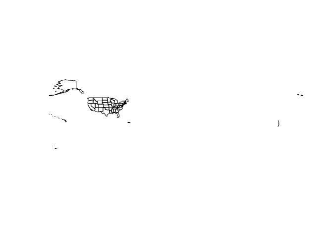<!-- -->

``` r
nm_counties <- counties("NM")
```

    ## Retrieving data for the year 2022

``` r
plot(nm_counties$geometry)
```

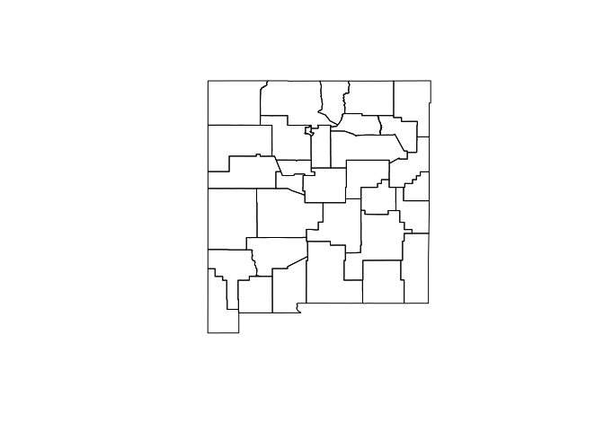<!-- -->

``` r
library(sf)
```

    ## Linking to GEOS 3.13.1, GDAL 3.10.2, PROJ 9.6.0; sf_use_s2() is TRUE

``` r
st_crs(nm_counties)
```

    ## Coordinate Reference System:
    ##   User input: NAD83 
    ##   wkt:
    ## GEOGCRS["NAD83",
    ##     DATUM["North American Datum 1983",
    ##         ELLIPSOID["GRS 1980",6378137,298.257222101,
    ##             LENGTHUNIT["metre",1]]],
    ##     PRIMEM["Greenwich",0,
    ##         ANGLEUNIT["degree",0.0174532925199433]],
    ##     CS[ellipsoidal,2],
    ##         AXIS["latitude",north,
    ##             ORDER[1],
    ##             ANGLEUNIT["degree",0.0174532925199433]],
    ##         AXIS["longitude",east,
    ##             ORDER[2],
    ##             ANGLEUNIT["degree",0.0174532925199433]],
    ##     ID["EPSG",4269]]

``` r
bern_tracts <- tracts("NM", "Bernalillo")
```

    ## Retrieving data for the year 2022

``` r
plot(bern_tracts$geometry)
```

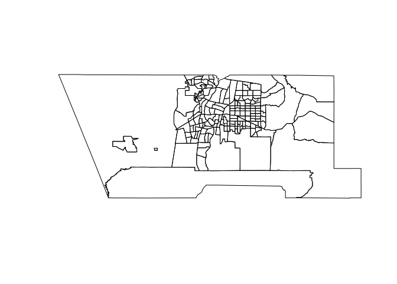<!-- -->

``` r
sf_water <- area_water("NM", "Santa Fe")
```

    ## Retrieving data for the year 2022

``` r
plot(sf_water$geometry)
```

<!-- -->

``` r
taos_water <- area_water("NM", "Taos")
```

    ## Retrieving data for the year 2022

``` r
plot(taos_water$geometry)
```

<!-- -->

``` r
bern_water <- area_water("NM", "Bernalillo")
```

    ## Retrieving data for the year 2022

``` r
plot(bern_water$geometry)
```

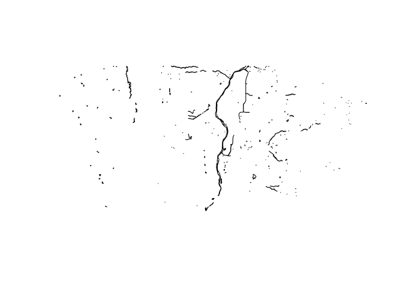<!-- -->

## Points Landmarks

``` r
nm_landmarks <- landmarks("NM", type = "point")
```

    ## Retrieving data for the year 2022

``` r
plot(nm_landmarks$geometry)
```

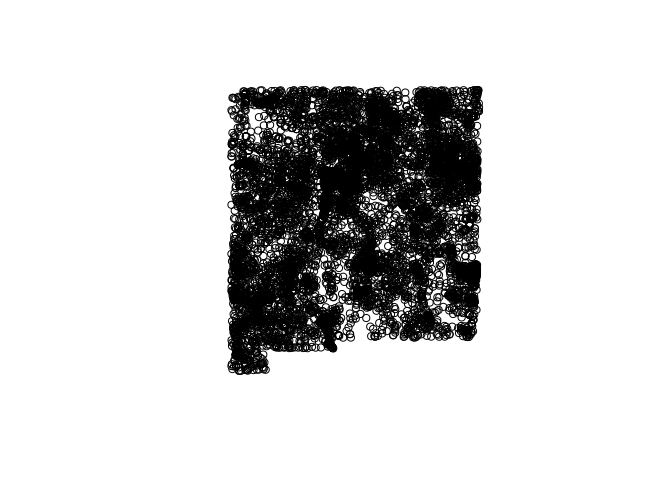<!-- -->

``` r
#View(nm_landmarks)
```

## Lines

``` r
nm_roads <- primary_secondary_roads("NM")
```

    ## Retrieving data for the year 2022

``` r
plot(nm_roads$geometry)
```

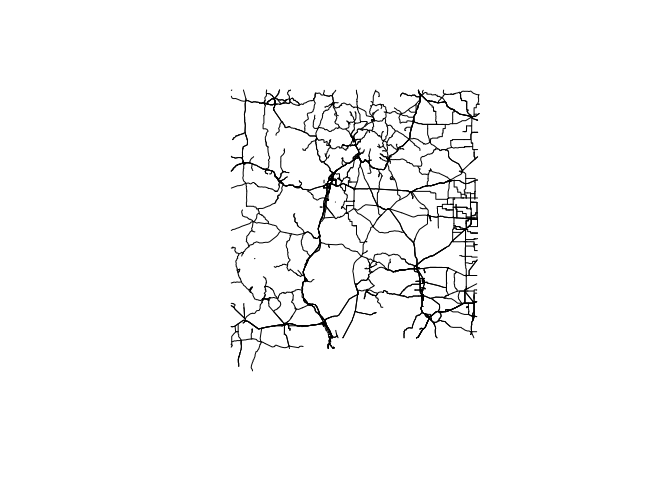<!-- -->

## Polygons

``` r
nm_block_groups <- block_groups("NM")
```

    ## Retrieving data for the year 2022

``` r
plot(nm_block_groups$geometry)
```

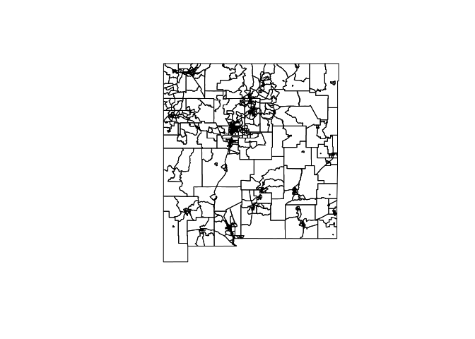<!-- -->

- `nation()`
- [`divisions()`](https://rdrr.io/pkg/tigris/man/divisions.html)
- [`regions()`](https://rdrr.io/pkg/tigris/man/regions.html)
- [`states()`](https://rdrr.io/pkg/tigris/man/states.html)
- [`counties()`](https://rdrr.io/pkg/tigris/man/counties.html)
- [`tracts()`](https://rdrr.io/pkg/tigris/man/tracts.html)
- [`block_groups()`](https://rdrr.io/pkg/tigris/man/block_groups.html)
- [`blocks()`](https://rdrr.io/pkg/tigris/man/blocks.html)
- [`places()`](https://rdrr.io/pkg/tigris/man/places.html)
- [`pumas()`](https://rdrr.io/pkg/tigris/man/pumas.html)
- [`school_districts()`](https://rdrr.io/pkg/tigris/man/school_districts.html)
- [`zctas()`](https://rdrr.io/pkg/tigris/man/zctas.html)
- [`congressional_districts()`](https://rdrr.io/pkg/tigris/man/congressional_districts.html)
- [`state_legislative_districts()`](https://rdrr.io/pkg/tigris/man/state_legislative_districts.html)
- [`voting_districts()`](https://rdrr.io/pkg/tigris/man/voting_districts.html)
- [`area_water()`](https://rdrr.io/pkg/tigris/man/area_water.html)
- [`linear_water()`](https://rdrr.io/pkg/tigris/man/linear_water.html)
- [`coastline()`](https://rdrr.io/pkg/tigris/man/coastline.html)
- [`core_based_statistical_areas()`](https://rdrr.io/pkg/tigris/man/core_based_statistical_areas.html)
- [`combined_statistical_areas()`](https://rdrr.io/pkg/tigris/man/combined_statistical_areas.html)
- [`metro_divisions()`](https://rdrr.io/pkg/tigris/man/metro_divisions.html)
- [`new_england()`](https://rdrr.io/pkg/tigris/man/new_england.html)
- [`county_subdivisions()`](https://rdrr.io/pkg/tigris/man/county_subdivisions.html)
- [`urban_areas()`](https://rdrr.io/pkg/tigris/man/urban_areas.html)
- [`primary_roads()`](https://rdrr.io/pkg/tigris/man/primary_roads.html)
- [`primary_secondary_roads()`](https://rdrr.io/pkg/tigris/man/primary_secondary_roads.html)
- [`roads()`](https://rdrr.io/pkg/tigris/man/roads.html)
- [`rails()`](https://rdrr.io/pkg/tigris/man/rails.html)
- [`native_areas()`](https://rdrr.io/pkg/tigris/man/native_areas.html)
- [`alaska_native_regional_corporations()`](https://rdrr.io/pkg/tigris/man/alaska_native_regional_corporations.html)
- [`tribal_block_groups()`](https://rdrr.io/pkg/tigris/man/tribal_block_groups.html)
- [`tribal_census_tracts()`](https://rdrr.io/pkg/tigris/man/tribal_census_tracts.html)
- [`tribal_subdivisions_national()`](https://rdrr.io/pkg/tigris/man/tribal_subdivisions_national.html)
- [`landmarks()`](https://rdrr.io/pkg/tigris/man/landmarks.html)
- [`military()`](https://rdrr.io/pkg/tigris/man/military.html)

``` r
library(ggplot2)
ggplot(bern_tracts) +
  geom_sf()
```

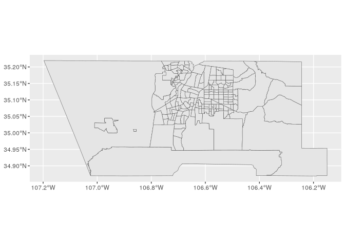<!-- -->

``` r
ggplot(bern_tracts) +
  geom_sf() +
  theme_void()
```

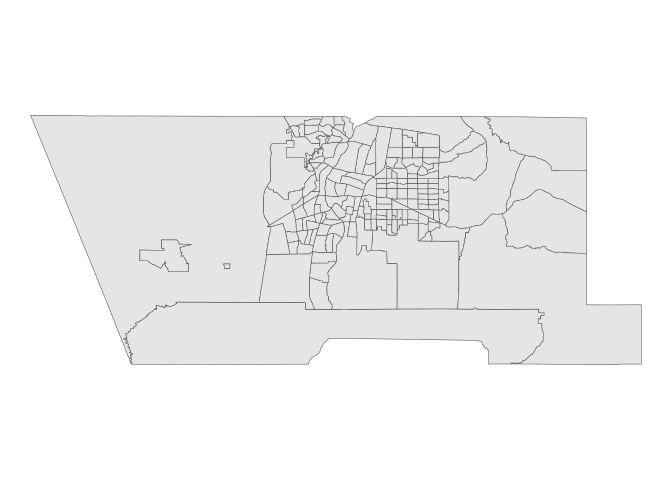<!-- -->

``` r
library(patchwork)

sf_block_groups <- block_groups("NM", "Santa Fe")
```

    ## Retrieving data for the year 2022

``` r
sf_tracts <- tracts("NM", "Santa Fe")
```

    ## Retrieving data for the year 2022

``` r
gg1 <- ggplot(sf_tracts) +
  geom_sf() +
  theme_void() +
  labs(title = "Census tracts")

gg2 <- ggplot(sf_block_groups) +
  geom_sf() +
  theme_void() +
  labs(title = "Block groups")

gg1 + gg2
```

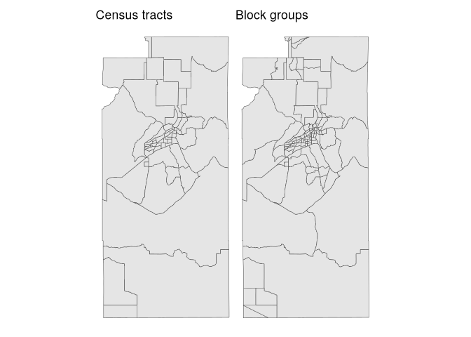<!-- -->

``` r
library(mapview)
mapview(sf_tracts)
```

## Cartographic boundary shapefiles

Most polygon datasets in **tigris** are available as cartographic
boundary files, accessible with the argument `cb = TRUE`. These are
generalized in the interior and clipped to the shoreline. When using the
`cb = TRUE` argument with counties and larger geographies, users can
also specify one of three resolutions with the `resolution` argument:
`"500k"` (the default), `"5m"`, or `"20m"`, with higher values
representing more generalized boundaries and smaller file sizes.

``` r
mi_counties <- counties("MI")
```

    ## Retrieving data for the year 2022

``` r
mi_counties_cb <- counties("MI", cb = TRUE)
```

    ## Retrieving data for the year 2022

``` r
mi_tiger_gg <- ggplot(mi_counties) + 
  geom_sf() + 
  theme_void() + 
  labs(title = "TIGER/Line")

mi_cb_gg <- ggplot(mi_counties_cb) + 
  geom_sf() + 
  theme_void() + 
  labs(title = "Cartographic boundary")

mi_tiger_gg + mi_cb_gg
```

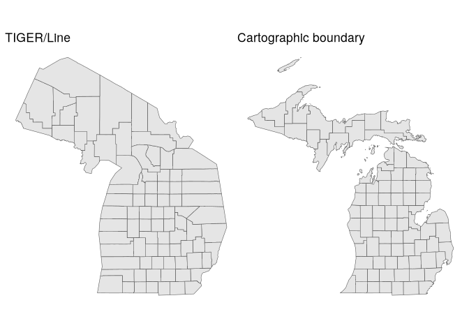<!-- -->

## Cache directory

``` r
options(tigris_use_cache = T)

rappdirs::user_cache_dir("tigris")
```

    ## [1] "~/.cache/tigris"

## Yearly difference in TIGER/Line files

``` r
library(glue)
library(purrr)
yearly_plots <- map(seq(1990, 2020, 10), ~{
  year_tracts <- tracts("TX", "Tarrant", year = .x, 
                        cb = T)
  
  ggplot(year_tracts) +
    geom_sf() +
    theme_void() +
    labs(title = glue("{.x}: {nrow(year_tracts)} tracts"))
})
```

``` r
(yearly_plots[[1]] + yearly_plots[[2]]) /
  (yearly_plots[[3]] + yearly_plots[[4]])
```

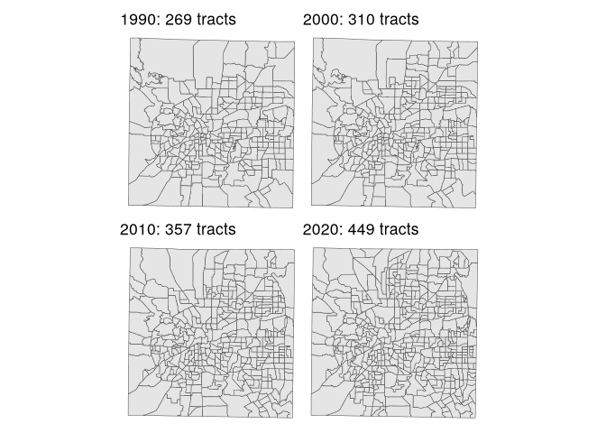<!-- -->

``` r
yearly_plots <- map(seq(1990, 2020, 10), ~{
  year_tracts <- tracts("NM", "Bernalillo", year = .x, 
                        cb = T)
  
  ggplot(year_tracts) +
    geom_sf() +
    theme_void() +
    labs(title = glue("{.x}: {nrow(year_tracts)} tracts"))
})
(yearly_plots[[1]] + yearly_plots[[2]]) /
  (yearly_plots[[3]] + yearly_plots[[4]])
```

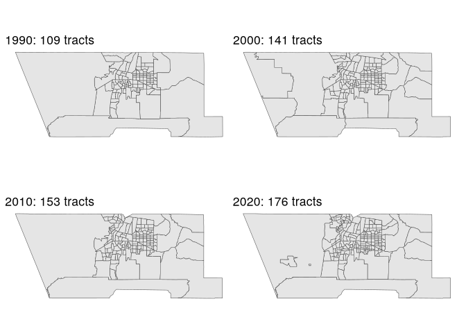<!-- -->

## Combining tigris datasets

For years starting 2019, `cb = TRUE` obtains all blockgroups.

``` r
us_bgs_2020 <- block_groups(cb = T, year = 2020)
```

    ## Retrieving Census block groups for the entire United States

``` r
nrow(us_bgs_2020)
```

    ## [1] 242298

> for years prior to 2019

``` r
state_codes <- c(state.abb, "DC", "PR")

us_bgs_2018 <- map_dfr(
  state_codes, 
  ~block_groups(
    state = .x, 
    cb = T, 
    year = 2018
  )
)

nrow(us_bgs_2018)
```

    ## [1] 220016

## CRS

``` r
library(sf)

st_crs(nm_counties)
```

    ## Coordinate Reference System:
    ##   User input: NAD83 
    ##   wkt:
    ## GEOGCRS["NAD83",
    ##     DATUM["North American Datum 1983",
    ##         ELLIPSOID["GRS 1980",6378137,298.257222101,
    ##             LENGTHUNIT["metre",1]]],
    ##     PRIMEM["Greenwich",0,
    ##         ANGLEUNIT["degree",0.0174532925199433]],
    ##     CS[ellipsoidal,2],
    ##         AXIS["latitude",north,
    ##             ORDER[1],
    ##             ANGLEUNIT["degree",0.0174532925199433]],
    ##         AXIS["longitude",east,
    ##             ORDER[2],
    ##             ANGLEUNIT["degree",0.0174532925199433]],
    ##     ID["EPSG",4269]]

## crsuggest

``` r
library(crsuggest)
```

    ## Using the EPSG Dataset v10.019, a product of the International Association of Oil & Gas Producers. 
    ## Please view the terms of use at https://epsg.org/terms-of-use.html.

``` r
nm_crs <- suggest_crs(nm_counties)
nm_crs
```

    ## # A tibble: 10 × 6
    ##    crs_code crs_name                        crs_type crs_gcs crs_units crs_proj4
    ##    <chr>    <chr>                           <chr>      <dbl> <chr>     <chr>    
    ##  1 6529     NAD83(2011) / New Mexico Centr… project…    6318 us-ft     +proj=tm…
    ##  2 6528     NAD83(2011) / New Mexico Centr… project…    6318 m         +proj=tm…
    ##  3 3618     NAD83(NSRS2007) / New Mexico C… project…    4759 us-ft     +proj=tm…
    ##  4 3617     NAD83(NSRS2007) / New Mexico C… project…    4759 m         +proj=tm…
    ##  5 32113    NAD83 / New Mexico Central      project…    4269 m         +proj=tm…
    ##  6 2903     NAD83(HARN) / New Mexico Centr… project…    4152 us-ft     +proj=tm…
    ##  7 2826     NAD83(HARN) / New Mexico Centr… project…    4152 m         +proj=tm…
    ##  8 2258     NAD83 / New Mexico Central (ft… project…    4269 us-ft     +proj=tm…
    ##  9 32013    NAD27 / New Mexico Central      project…    4267 us-ft     +proj=tm…
    ## 10 6531     NAD83(2011) / New Mexico East … project…    6318 us-ft     +proj=tm…

``` r
nm_projected <- st_transform(nm_counties, crs = 32113)
head(nm_projected)
```

    ## Simple feature collection with 6 features and 17 fields
    ## Geometry type: MULTIPOLYGON
    ## Dimension:     XY
    ## Bounding box:  xmin: 239159.5 ymin: 111038.3 xmax: 790979.4 ymax: 670420.6
    ## Projected CRS: NAD83 / New Mexico Central
    ##     STATEFP COUNTYFP COUNTYNS GEOID       NAME          NAMELSAD LSAD CLASSFP
    ## 3        35      011 00933054 35011    De Baca    De Baca County   06      H1
    ## 31       35      035 00929104 35035      Otero      Otero County   06      H1
    ## 32       35      003 00929108 35003     Catron     Catron County   06      H1
    ## 209      35      059 00929115 35059      Union      Union County   06      H1
    ## 448      35      047 00929114 35047 San Miguel San Miguel County   06      H1
    ## 729      35      055 00933056 35055       Taos       Taos County   06      H1
    ##     MTFCC CSAFP CBSAFP METDIVFP FUNCSTAT       ALAND   AWATER    INTPTLAT
    ## 3   G4020  <NA>   <NA>     <NA>        A  6016818946 29090018 +34.3592729
    ## 31  G4020  <NA>   <NA>     <NA>        A 17126455957 36944199 +32.6155988
    ## 32  G4020  <NA>   <NA>     <NA>        A 17933561654 14193499 +33.9016208
    ## 209 G4020  <NA>   <NA>     <NA>        A  9906834380 15498790 +36.4880853
    ## 448 G4020  <NA>   <NA>     <NA>        A 12228666259 51380263 +35.4768585
    ## 729 G4020  <NA>   <NA>     <NA>        A  5704119616  3383128 +36.5771832
    ##         INTPTLON                       geometry
    ## 3   -104.3686961 MULTIPOLYGON (((625192.7 34...
    ## 31  -105.7513079 MULTIPOLYGON (((488165.8 21...
    ## 32  -108.3919284 MULTIPOLYGON (((241586.4 33...
    ## 209 -103.4757229 MULTIPOLYGON (((700226.3 63...
    ## 448 -104.8035189 MULTIPOLYGON (((672509.9 46...
    ## 729 -105.6388781 MULTIPOLYGON (((574603.5 57...

## `coord_sf()`

``` r
library(ggplot2)
library(patchwork)
options(scipen = 999)

p1 <- ggplot(nm_counties) +
  geom_sf() +
  coord_sf(crs = 32113)
p2 <- ggplot(nm_counties) +
  geom_sf() +
  coord_sf(crs = 32113, datum = 32113)

p1 + p2
```

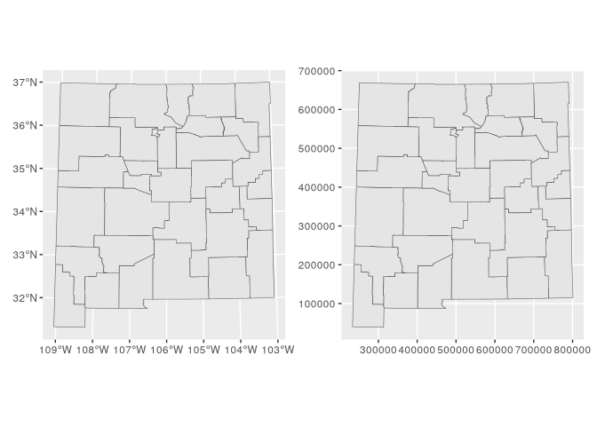<!-- -->

## Shifting and rescaling for national US mapping

``` r
us_states <- states(cb = T, resolution = "20m")
```

    ## Retrieving data for the year 2021

``` r
ggplot(us_states) +
  geom_sf() +
  theme_void()
```

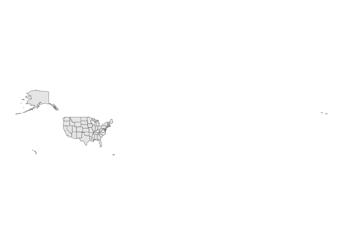<!-- -->

``` r
ggplot(us_states) +
  geom_sf() +
  coord_sf(crs = "ESRI:102003") +
  theme_void()
```

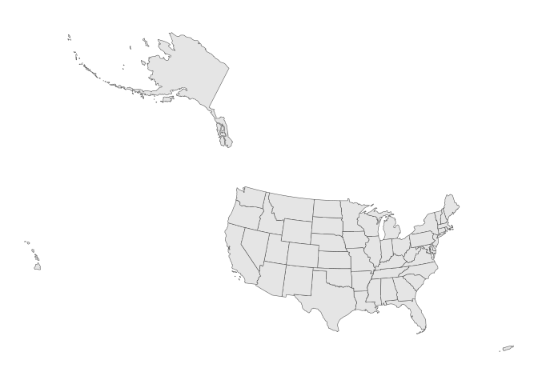<!-- -->

> with default `preserve_area = TRUE` and `position = "below"`

``` r
us_states_shifted <- shift_geometry(us_states)

ggplot(us_states_shifted) +
  geom_sf() +
  theme_void()
```

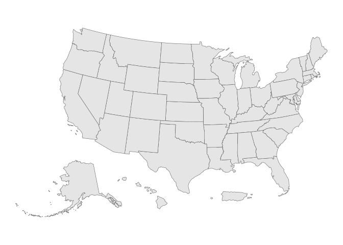<!-- -->

``` r
us_states_outside <- shift_geometry(us_states, 
                                    preserve_area = T, 
                                    position = "outside")

ggplot(us_states_outside) +
  geom_sf() +
  theme_void()
```

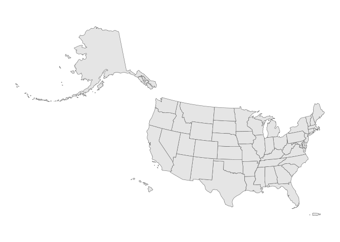<!-- -->

## Polygons to points

``` r
library(tidyverse)
```

    ## ── Attaching core tidyverse packages ──────────────────────── tidyverse 2.0.0 ──
    ## ✔ dplyr     1.1.4     ✔ stringr   1.5.1
    ## ✔ forcats   1.0.0     ✔ tibble    3.2.1
    ## ✔ lubridate 1.9.4     ✔ tidyr     1.3.1
    ## ✔ readr     2.1.5     
    ## ── Conflicts ────────────────────────────────────────── tidyverse_conflicts() ──
    ## ✖ dplyr::filter() masks stats::filter()
    ## ✖ dplyr::lag()    masks stats::lag()
    ## ℹ Use the conflicted package (<http://conflicted.r-lib.org/>) to force all conflicts to become errors

``` r
nm_places <- places("NM", cb = T)|> 
  filter(NAME %in% c("Albuquerque", "Rio Rancho", "Farmington", 
                     "Gallup", "Santa Fe", "Las Cruces", 
                     "Roswell", "Santa Rosa", "Raton")) |> 
  st_transform(crs = 32113)
```

    ## Retrieving data for the year 2022

``` r
nm_outline <- states(cb = T) |> 
  filter(NAME == "New Mexico") |> 
  st_transform(crs = 32113)
```

    ## Retrieving data for the year 2021

``` r
ggplot() +
  geom_sf(data = nm_outline) +
  geom_sf(data = nm_places, fill = "red", color = NA) +
  theme_void()
```

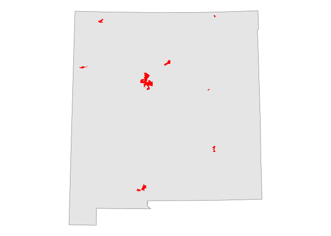<!-- -->

``` r
nm_centroids <- st_centroid(nm_places)
```

    ## Warning: st_centroid assumes attributes are constant over geometries

``` r
ggplot() +
  geom_sf(data = nm_outline) +
  geom_sf(data = nm_centroids, color = "red", xize = 3) +
  theme_void()
```

    ## Warning in layer_sf(geom = GeomSf, data = data, mapping = mapping, stat = stat,
    ## : Ignoring unknown parameters: `xize`

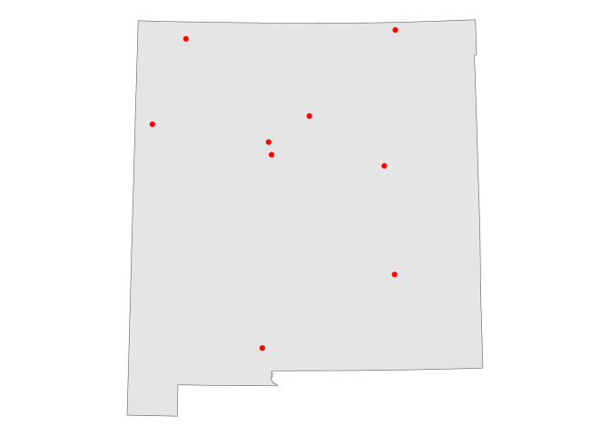<!-- -->

## Exploding Multipolygons

``` r
fl_counties <- counties("FL", cb = TRUE)
```

    ## Retrieving data for the year 2022

``` r
fl_projected <- st_transform(fl_counties, crs = 3087)
lee <- fl_projected |> 
  filter(NAME == "Lee")
```

``` r
mapview(lee)
```

``` r
lee
```

    ## Simple feature collection with 1 feature and 12 fields
    ## Geometry type: MULTIPOLYGON
    ## Dimension:     XY
    ## Bounding box:  xmin: 571477.3 ymin: 258767.6 xmax: 642721.2 ymax: 310583.5
    ## Projected CRS: NAD83(HARN) / Florida GDL Albers
    ##   STATEFP COUNTYFP COUNTYNS       AFFGEOID GEOID NAME   NAMELSAD STUSPS
    ## 1      12      071 00295758 0500000US12071 12071  Lee Lee County     FL
    ##   STATE_NAME LSAD      ALAND     AWATER                       geometry
    ## 1    Florida   06 2022848995 1900537643 MULTIPOLYGON (((580415.6 30...

``` r
lee_seperate <- st_cast(lee, "POLYGON")
```

    ## Warning in st_cast.sf(lee, "POLYGON"): repeating attributes for all
    ## sub-geometries for which they may not be constant

``` r
lee_seperate
```

    ## Simple feature collection with 4 features and 12 fields
    ## Geometry type: POLYGON
    ## Dimension:     XY
    ## Bounding box:  xmin: 571477.3 ymin: 258767.6 xmax: 642721.2 ymax: 310583.5
    ## Projected CRS: NAD83(HARN) / Florida GDL Albers
    ##     STATEFP COUNTYFP COUNTYNS       AFFGEOID GEOID NAME   NAMELSAD STUSPS
    ## 1        12      071 00295758 0500000US12071 12071  Lee Lee County     FL
    ## 1.1      12      071 00295758 0500000US12071 12071  Lee Lee County     FL
    ## 1.2      12      071 00295758 0500000US12071 12071  Lee Lee County     FL
    ## 1.3      12      071 00295758 0500000US12071 12071  Lee Lee County     FL
    ##     STATE_NAME LSAD      ALAND     AWATER                       geometry
    ## 1      Florida   06 2022848995 1900537643 POLYGON ((580415.6 300219.1...
    ## 1.1    Florida   06 2022848995 1900537643 POLYGON ((576540.7 289935.2...
    ## 1.2    Florida   06 2022848995 1900537643 POLYGON ((572595.7 298880.5...
    ## 1.3    Florida   06 2022848995 1900537643 POLYGON ((571477.3 310583, ...

``` r
lee_seperate[2,] |> 
  mapview()
```
