# Census Mapping

``` r
library(tidycensus)
options(tigris_use_cache = T)
```

``` r
nm_income <- get_acs(
  geography = "tract", 
  state = "NM", 
  variables = "B19013_001", 
  year = 2020, 
  geometry = T
)
```

    ## Getting data from the 2016-2020 5-year ACS

``` r
nm_income
```

    ## Simple feature collection with 612 features and 5 fields
    ## Geometry type: POLYGON
    ## Dimension:     XY
    ## Bounding box:  xmin: -109.0502 ymin: 31.3323 xmax: -103.002 ymax: 37.00023
    ## Geodetic CRS:  NAD83
    ## First 10 features:
    ##          GEOID                                             NAME   variable
    ## 1  35007950500     Census Tract 9505, Colfax County, New Mexico B19013_001
    ## 2  35013000800      Census Tract 8, Doña Ana County, New Mexico B19013_001
    ## 3  35013000104   Census Tract 1.04, Doña Ana County, New Mexico B19013_001
    ## 4  35017964200      Census Tract 9642, Grant County, New Mexico B19013_001
    ## 5  35017964800      Census Tract 9648, Grant County, New Mexico B19013_001
    ## 6  35009000202      Census Tract 2.02, Curry County, New Mexico B19013_001
    ## 7  35029000300          Census Tract 3, Luna County, New Mexico B19013_001
    ## 8  35001003400   Census Tract 34, Bernalillo County, New Mexico B19013_001
    ## 9  35001000712 Census Tract 7.12, Bernalillo County, New Mexico B19013_001
    ## 10 35001000206 Census Tract 2.06, Bernalillo County, New Mexico B19013_001
    ##    estimate   moe                       geometry
    ## 1     35568  4625 POLYGON ((-104.5368 36.7188...
    ## 2     23144 12649 POLYGON ((-106.7568 32.2957...
    ## 3     54706 13878 POLYGON ((-106.7922 32.3599...
    ## 4     43155  8458 POLYGON ((-109.0475 33.0694...
    ## 5     43750  6390 POLYGON ((-108.5379 32.1181...
    ## 6     41026  8848 POLYGON ((-103.2318 34.4192...
    ## 7     29567  6927 POLYGON ((-107.7828 32.2545...
    ## 8     27146  3065 POLYGON ((-106.6277 35.1091...
    ## 9     40952 12019 POLYGON ((-106.5064 35.0740...
    ## 10    58314  3822 POLYGON ((-106.5864 35.1232...

## Basic plotting

``` r
plot(nm_income['estimate'])
```

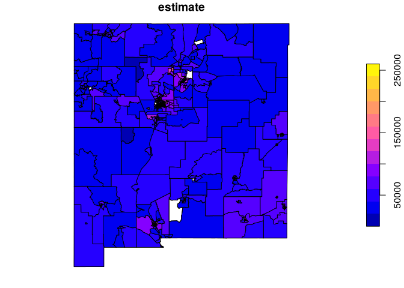<!-- -->

## ggplot2

### Cholopleth

``` r
library(tidycensus)
library(tidyverse)
```

    ## ── Attaching core tidyverse packages ──────────────────────── tidyverse 2.0.0 ──
    ## ✔ dplyr     1.1.4     ✔ readr     2.1.5
    ## ✔ forcats   1.0.0     ✔ stringr   1.5.1
    ## ✔ ggplot2   3.5.1     ✔ tibble    3.2.1
    ## ✔ lubridate 1.9.4     ✔ tidyr     1.3.1
    ## ✔ purrr     1.0.4     
    ## ── Conflicts ────────────────────────────────────────── tidyverse_conflicts() ──
    ## ✖ dplyr::filter() masks stats::filter()
    ## ✖ dplyr::lag()    masks stats::lag()
    ## ℹ Use the conflicted package (<http://conflicted.r-lib.org/>) to force all conflicts to become errors

``` r
library(tigris)
```

    ## To enable caching of data, set `options(tigris_use_cache = TRUE)`
    ## in your R script or .Rprofile.

``` r
us_median_age <- get_acs(
  geography = "state", 
  variables = "B01002_001",
  year = 2019,
  survey = "acs1",
  geometry = T,
  resolution = "20m",
) |> 
  shift_geometry()
```

    ## Getting data from the 2019 1-year ACS

    ## The 1-year ACS provides data for geographies with populations of 65,000 and greater.

``` r
plot(us_median_age$geometry)
```

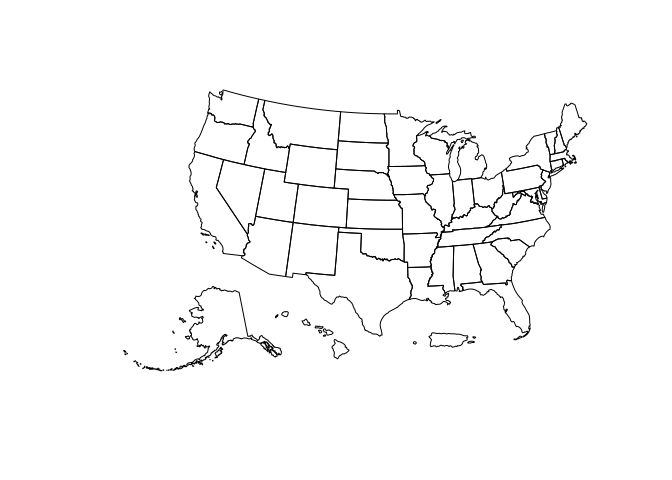<!-- -->

``` r
ggplot(us_median_age, aes(fill = estimate)) +
  geom_sf() +
  labs(title = "Median Age by State, 2019", 
       caption = "Data Source US Census Bureau 1-year ACS", 
       fill = "ACS estimate") +
  scale_fill_distiller(palette = "RdPu", 
                       direction = 1) +
  theme_void()
```

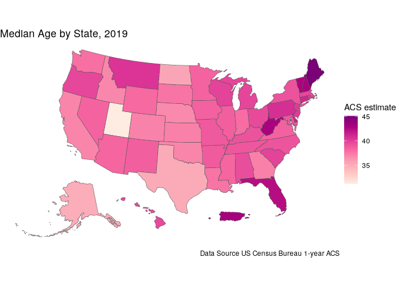<!-- -->

## tmap

``` r
bernalillo_race <- get_decennial(
  geography = "tract", 
  state = "NM", 
  county = "Bernalillo",
  variables = c(
    Hispanic = "P2_002N",
    White = "P2_005N",
    Black = "P2_006N",
    Native = "P2_007N",
    Asian = "P2_008N"    
  ),
  summary_var = "P2_001N",
  year = 2020,
  geometry = T
) |> 
  mutate(percent = 100 * value / summary_value)
```

    ## Getting data from the 2020 decennial Census

    ## Using the PL 94-171 Redistricting Data Summary File

    ## Note: 2020 decennial Census data use differential privacy, a technique that
    ## introduces errors into data to preserve respondent confidentiality.
    ## ℹ Small counts should be interpreted with caution.
    ## ℹ See https://www.census.gov/library/fact-sheets/2021/protecting-the-confidentiality-of-the-2020-census-redistricting-data.html for additional guidance.
    ## This message is displayed once per session.

``` r
bernalillo_race
```

    ## Simple feature collection with 880 features and 6 fields
    ## Geometry type: POLYGON
    ## Dimension:     XY
    ## Bounding box:  xmin: -107.1972 ymin: 34.86928 xmax: -106.1497 ymax: 35.21946
    ## Geodetic CRS:  NAD83
    ## # A tibble: 880 × 7
    ##    GEOID    NAME  variable value summary_value                  geometry percent
    ##  * <chr>    <chr> <chr>    <dbl>         <dbl>             <POLYGON [°]>   <dbl>
    ##  1 3500100… Cens… Hispanic  2188          4368 ((-106.6277 35.10917, -1…   50.1 
    ##  2 3500100… Cens… White     1122          4368 ((-106.6277 35.10917, -1…   25.7 
    ##  3 3500100… Cens… Black      197          4368 ((-106.6277 35.10917, -1…    4.51
    ##  4 3500100… Cens… Native     581          4368 ((-106.6277 35.10917, -1…   13.3 
    ##  5 3500100… Cens… Asian       93          4368 ((-106.6277 35.10917, -1…    2.13
    ##  6 3500100… Cens… Hispanic  1717          4189 ((-106.5064 35.07402, -1…   41.0 
    ##  7 3500100… Cens… White     1598          4189 ((-106.5064 35.07402, -1…   38.1 
    ##  8 3500100… Cens… Black      215          4189 ((-106.5064 35.07402, -1…    5.13
    ##  9 3500100… Cens… Native     316          4189 ((-106.5064 35.07402, -1…    7.54
    ## 10 3500100… Cens… Asian      142          4189 ((-106.5064 35.07402, -1…    3.39
    ## # ℹ 870 more rows

### Chorpleth with tmap

``` r
library(tmap)
bernalillo_hisp <- bernalillo_race |> 
  filter(variable == "Hispanic")
bernalillo_hisp
```

    ## Simple feature collection with 176 features and 6 fields
    ## Geometry type: POLYGON
    ## Dimension:     XY
    ## Bounding box:  xmin: -107.1972 ymin: 34.86928 xmax: -106.1497 ymax: 35.21946
    ## Geodetic CRS:  NAD83
    ## # A tibble: 176 × 7
    ##    GEOID    NAME  variable value summary_value                  geometry percent
    ##  * <chr>    <chr> <chr>    <dbl>         <dbl>             <POLYGON [°]>   <dbl>
    ##  1 3500100… Cens… Hispanic  2188          4368 ((-106.6277 35.10917, -1…    50.1
    ##  2 3500100… Cens… Hispanic  1717          4189 ((-106.5064 35.07402, -1…    41.0
    ##  3 3500100… Cens… Hispanic  1277          2906 ((-106.5864 35.12329, -1…    43.9
    ##  4 3500100… Cens… Hispanic  2472          4319 ((-106.7146 35.11297, -1…    57.2
    ##  5 3500100… Cens… Hispanic   908          2785 ((-106.5154 35.10146, -1…    32.6
    ##  6 3500100… Cens… Hispanic  5703          6907 ((-106.7601 35.0554, -10…    82.6
    ##  7 3500100… Cens… Hispanic   978          2925 ((-106.5156 35.10887, -1…    33.4
    ##  8 3500100… Cens… Hispanic   523          2760 ((-106.5174 35.14188, -1…    18.9
    ##  9 3500100… Cens… Hispanic  2115          5042 ((-106.5328 35.04683, -1…    41.9
    ## 10 3500100… Cens… Hispanic  6275          8660 ((-106.7563 35.03995, -1…    72.5
    ## # ℹ 166 more rows

``` r
tm_shape(bernalillo_hisp) +
  tm_polygons(fill = "percent")
```

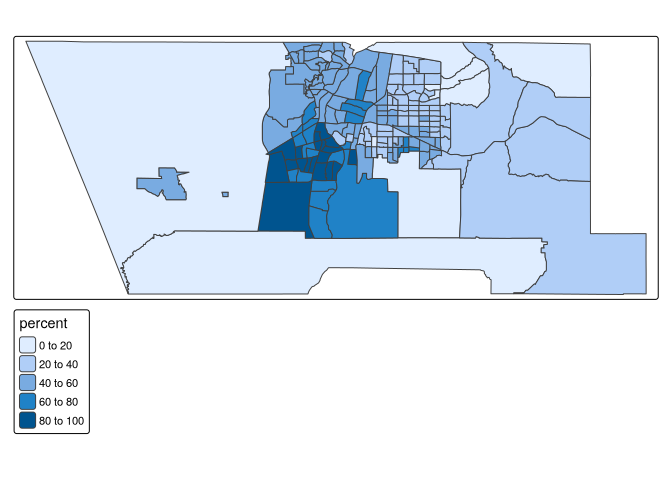<!-- -->

``` r
hist(bernalillo_hisp$percent)
```

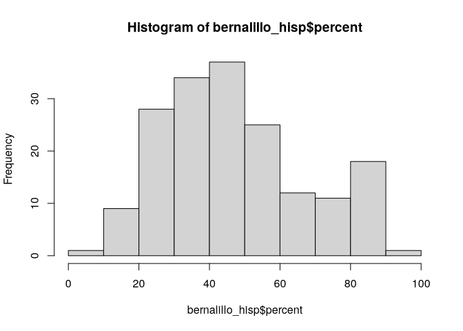<!-- -->

``` r
bernalillo_asian <- bernalillo_race |> 
  filter(variable == "Asian")

tm_shape(bernalillo_asian) +
  tm_polygons(fill = "percent")
```

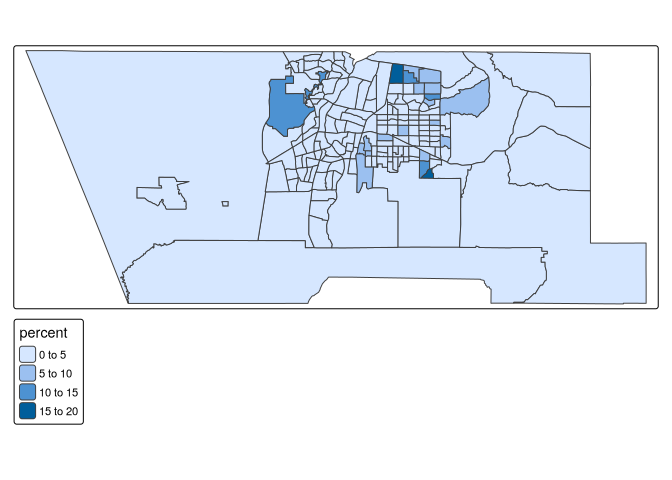<!-- -->

``` r
hist(bernalillo_asian$percent)
```

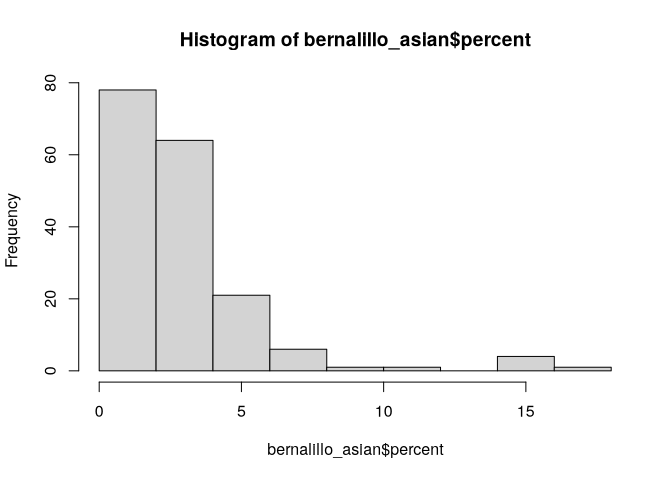<!-- -->

``` r
tm_shape(bernalillo_asian) +
  tm_polygons(fill = "percent", 
              style = "quantile", 
              n = 5, 
              palette = "Greens", 
              title = "2020 US Census") +
  tm_layout(title = "Percent Asian\n by Census Tract",
            frame = F, legend.outside = T)
```

    ## 

    ## ── tmap v3 code detected ───────────────────────────────────────────────────────

    ## [v3->v4] `tm_polygons()`: instead of `style = "quantile"`, use fill.scale =
    ## `tm_scale_intervals()`.
    ## ℹ Migrate the argument(s) 'style', 'n', 'palette' (rename to 'values') to
    ##   'tm_scale_intervals(<HERE>)'
    ## [v3->v4] `tm_polygons()`: migrate the argument(s) related to the legend of the
    ## visual variable `fill` namely 'title' to 'fill.legend = tm_legend(<HERE>)'
    ## [v3->v4] `tm_layout()`: use `tm_title()` instead of `tm_layout(title = )`
    ## [cols4all] color palettes: use palettes from the R package cols4all. Run
    ## `cols4all::c4a_gui()` to explore them. The old palette name "Greens" is named
    ## "brewer.greens"
    ## Multiple palettes called "greens" found: "brewer.greens", "matplotlib.greens". The first one, "brewer.greens", is returned.

<!-- -->

``` r
tm_shape(bernalillo_asian) + 
  tm_polygons(col = "percent",
          style = "jenks",
          n = 5,
          palette = "Purples",
          title = "2020 US Census",
          legend.hist = TRUE) + 
  tm_layout(title = "Percent Asian\nby Census tract",
            frame = FALSE,
            legend.outside = TRUE,
            bg.color = "grey70",
            legend.hist.width = 5,
            fontfamily = "Verdana")
```

    ## 

    ## ── tmap v3 code detected ───────────────────────────────────────────────────────

    ## [v3->v4] `tm_polygons()`: instead of `style = "jenks"`, use fill.scale =
    ## `tm_scale_intervals()`.
    ## ℹ Migrate the argument(s) 'style', 'n', 'palette' (rename to 'values') to
    ##   'tm_scale_intervals(<HERE>)'
    ## [v3->v4] `tm_polygons()`: use 'fill' for the fill color of polygons/symbols
    ## (instead of 'col'), and 'col' for the outlines (instead of 'border.col').
    ## [v3->v4] `tm_polygons()`: migrate the argument(s) related to the legend of the
    ## visual variable `fill` namely 'title' to 'fill.legend = tm_legend(<HERE>)'
    ## [v3->v4] `tm_polygons()`: use `fill.chart = tm_chart_histogram()` instead of
    ## `legend.hist = TRUE`.
    ## [v3->v4] `tm_layout()`: use text.fontfamily instead of fontfamily
    ## [v3->v4] `tm_layout()`: use `tm_title()` instead of `tm_layout(title = )`
    ## [cols4all] color palettes: use palettes from the R package cols4all. Run
    ## `cols4all::c4a_gui()` to explore them. The old palette name "Purples" is named
    ## "brewer.purples"
    ## Multiple palettes called "purples" found: "brewer.purples", "matplotlib.purples". The first one, "brewer.purples", is returned.

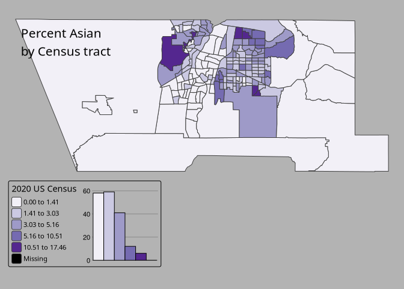<!-- -->

## Reference elements

``` r
library(mapboxapi)
```

    ## Usage of the Mapbox APIs is governed by the Mapbox Terms of Service.
    ## Please visit https://www.mapbox.com/legal/tos/ for more information.

``` r
readRenviron("~/.Renviron")
```

``` r
bernalillo_tiles <- get_static_tiles(
  location = bernalillo_hisp, 
  zoom = 10,
  style_id = "light-v9",
  username = "mapbox"
)
```

    ## Attribution is required if using Mapbox tiles on a map.
    ## Add the text '(c) Mapbox, (c) OpenStreetMap' to your map for proper attribution.

``` r
tm_shape(bernalillo_tiles) + 
  tm_rgb() + 
  tm_shape(bernalillo_hisp) + 
  tm_polygons(col = "percent",
          style = "jenks",
          n = 5,
          palette = "Greens",
          title = "2020 US Census",
          alpha = 0.5) +
  tm_layout(title = "Percent Hispanic\nby Census tract",
            legend.outside = TRUE,
            fontfamily = "Verdana") + 
  tm_scale_bar(position = c("left", "bottom")) + 
  tm_compass(position = c("right", "top")) + 
  tm_credits("(c) Mapbox, OSM    ", 
             bg.color = "white",
             position = c("RIGHT", "BOTTOM"))
```

    ## 

    ## ── tmap v3 code detected ───────────────────────────────────────────────────────

    ## [v3->v4] `tm_polygons()`: instead of `style = "jenks"`, use fill.scale =
    ## `tm_scale_intervals()`.
    ## ℹ Migrate the argument(s) 'style', 'n', 'palette' (rename to 'values') to
    ##   'tm_scale_intervals(<HERE>)'
    ## [v3->v4] `tm_polygons()`: use `fill_alpha` instead of `alpha`.
    ## [v3->v4] `tm_polygons()`: migrate the argument(s) related to the legend of the
    ## visual variable `fill` namely 'title' to 'fill.legend = tm_legend(<HERE>)'
    ## [v3->v4] `tm_layout()`: use text.fontfamily instead of fontfamily
    ## [v3->v4] `tm_layout()`: use `tm_title()` instead of `tm_layout(title = )`
    ## ! `tm_scale_bar()` is deprecated. Please use `tm_scalebar()` instead.
    ## [cols4all] color palettes: use palettes from the R package cols4all. Run
    ## `cols4all::c4a_gui()` to explore them. The old palette name "Greens" is named
    ## "brewer.greens"
    ## Multiple palettes called "greens" found: "brewer.greens", "matplotlib.greens". The first one, "brewer.greens", is returned.

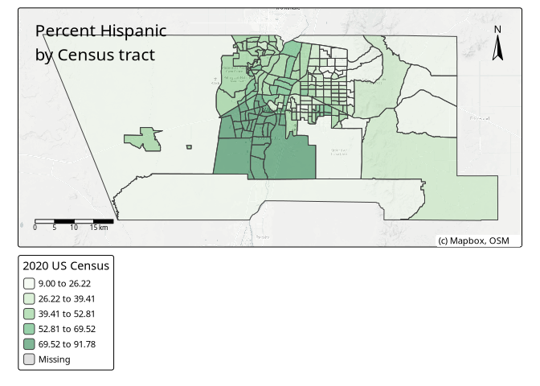<!-- -->

## Graduated symbols

``` r
tm_shape(bernalillo_hisp) + 
  tm_polygons() + 
  tm_bubbles(size = "value", alpha = 0.5, 
             col = "navy",
             title.size = "Hispanic - 2020 US Census") + 
  tm_layout(legend.outside = TRUE,
            legend.outside.position = "bottom")
```

    ## 

    ## ── tmap v3 code detected ───────────────────────────────────────────────────────

    ## [v3->v4] `tm_bubbles()`: use `fill_alpha` instead of `alpha`.

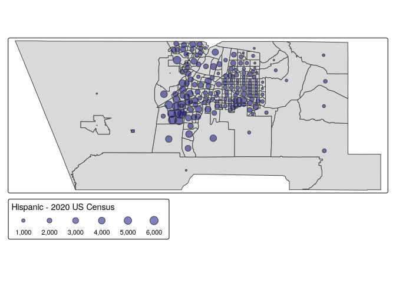<!-- -->

## Faceted maps

``` r
tm_shape(bernalillo_race) + 
  tm_facets(by = "variable", scale.factor = 4) + 
  tm_polygons(fill = "percent",
          fill.scale = tm_scale_intervals(
            style = "jenks",
            #pal = "brewer.blues",
            n = 6
          ),
          #n = 6,
          #palette = "brewer.blues",
          fill.legend = tm_legend("Percent (2020 US Census)")) + 
  tm_layout(bg.color = "grey", 
            panel.label.bg.color = "white")
```

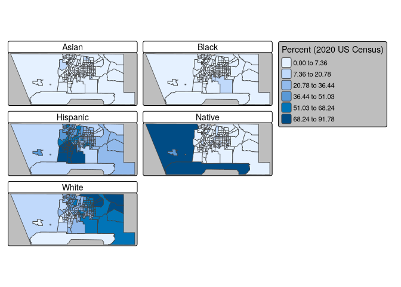<!-- -->

``` r
bernalillo_race
```

    ## Simple feature collection with 880 features and 6 fields
    ## Geometry type: POLYGON
    ## Dimension:     XY
    ## Bounding box:  xmin: -107.1972 ymin: 34.86928 xmax: -106.1497 ymax: 35.21946
    ## Geodetic CRS:  NAD83
    ## # A tibble: 880 × 7
    ##    GEOID    NAME  variable value summary_value                  geometry percent
    ##  * <chr>    <chr> <chr>    <dbl>         <dbl>             <POLYGON [°]>   <dbl>
    ##  1 3500100… Cens… Hispanic  2188          4368 ((-106.6277 35.10917, -1…   50.1 
    ##  2 3500100… Cens… White     1122          4368 ((-106.6277 35.10917, -1…   25.7 
    ##  3 3500100… Cens… Black      197          4368 ((-106.6277 35.10917, -1…    4.51
    ##  4 3500100… Cens… Native     581          4368 ((-106.6277 35.10917, -1…   13.3 
    ##  5 3500100… Cens… Asian       93          4368 ((-106.6277 35.10917, -1…    2.13
    ##  6 3500100… Cens… Hispanic  1717          4189 ((-106.5064 35.07402, -1…   41.0 
    ##  7 3500100… Cens… White     1598          4189 ((-106.5064 35.07402, -1…   38.1 
    ##  8 3500100… Cens… Black      215          4189 ((-106.5064 35.07402, -1…    5.13
    ##  9 3500100… Cens… Native     316          4189 ((-106.5064 35.07402, -1…    7.54
    ## 10 3500100… Cens… Asian      142          4189 ((-106.5064 35.07402, -1…    3.39
    ## # ℹ 870 more rows

## Dot-density maps

``` r
bernalillo_dots <- bernalillo_race |> 
  as_dot_density(
    value = "value", 
    values_per_dot = 100, 
    group = "variable"
  )
```

``` r
background_tracts <- filter(bernalillo_race, variable == "Hispanic")

tm_shape(background_tracts) +
  tm_polygons(col = "grey", 
              fill.scale = tm_scale(
                
              ))  +
  tm_shape(bernalillo_dots) +
  tm_dots(col = "variable", palette = "Set1", 
          size = 0.005, title = "1 dot = 100 people") +
  tm_layout(legend.outside = T) +
  tm_title("Race/ethnicity\n2020 Census")
```

    ## 

    ## ── tmap v3 code detected ───────────────────────────────────────────────────────

    ## [v3->v4] `tm_tm_dots()`: migrate the argument(s) related to the scale of the
    ## visual variable `fill` namely 'palette' (rename to 'values') to fill.scale =
    ## tm_scale(<HERE>).
    ## [tm_dots()] Argument `title` unknown.
    ## [cols4all] color palettes: use palettes from the R package cols4all. Run
    ## `cols4all::c4a_gui()` to explore them. The old palette name "Set1" is named
    ## "brewer.set1"

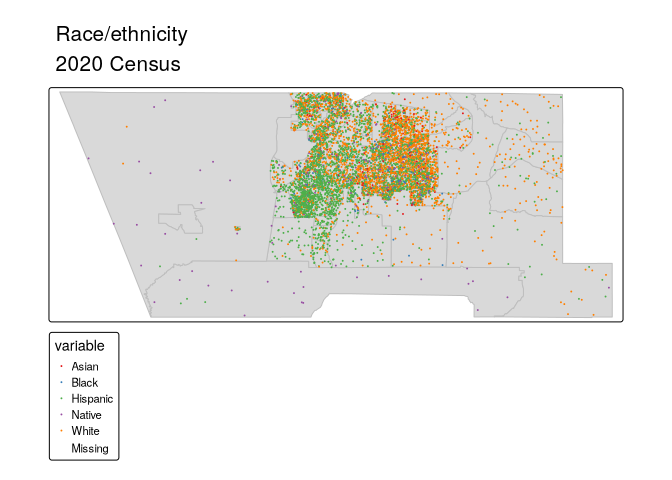<!-- -->
