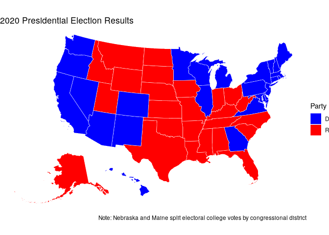
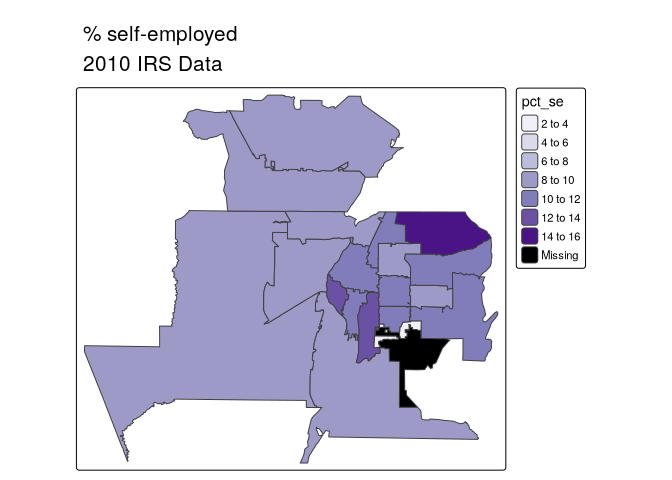
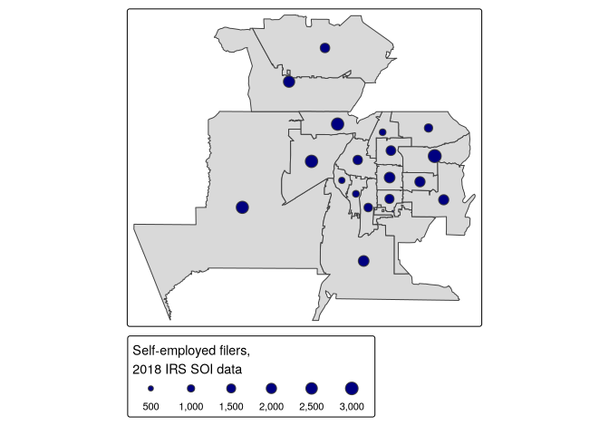
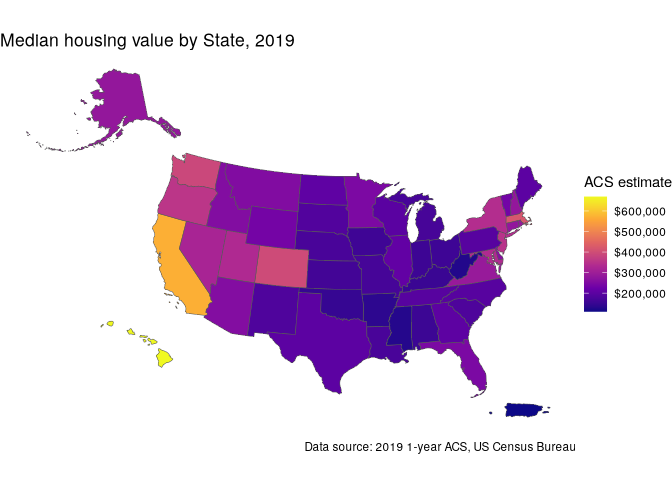
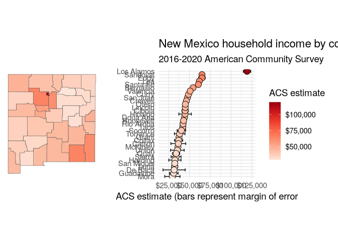

# Cartographic workflows with non-Census Data

## National election mapping with tigris shapes

``` r
library(tidyverse)
```

    ## ── Attaching core tidyverse packages ──────────────────────── tidyverse 2.0.0 ──
    ## ✔ dplyr     1.1.4     ✔ readr     2.1.5
    ## ✔ forcats   1.0.0     ✔ stringr   1.5.1
    ## ✔ ggplot2   3.5.1     ✔ tibble    3.2.1
    ## ✔ lubridate 1.9.4     ✔ tidyr     1.3.1
    ## ✔ purrr     1.0.4     
    ## ── Conflicts ────────────────────────────────────────── tidyverse_conflicts() ──
    ## ✖ dplyr::filter() masks stats::filter()
    ## ✖ dplyr::lag()    masks stats::lag()
    ## ℹ Use the conflicted package (<http://conflicted.r-lib.org/>) to force all conflicts to become errors

``` r
library(tigris)
```

    ## To enable caching of data, set `options(tigris_use_cache = TRUE)`
    ## in your R script or .Rprofile.

``` r
options(tigris_use_cache = TRUE)
```

``` r
# Data source: https://cookpolitical.com/2020-national-popular-vote-tracker
vote2020 <- read_csv("data/votes.csv")
```

    ## New names:
    ## Rows: 61 Columns: 22
    ## ── Column specification
    ## ──────────────────────────────────────────────────────── Delimiter: "," chr
    ## (10): state, called, final, dem_percent, rep_percent, other_percent, dem... dbl
    ## (7): EV, X, Y, State_num, Center_X, Center_Y, 2016 Margin num (4): dem_votes,
    ## rep_votes, other_votes, Total 2016 Votes lgl (1): ...20
    ## ℹ Use `spec()` to retrieve the full column specification for this data. ℹ
    ## Specify the column types or set `show_col_types = FALSE` to quiet this message.
    ## • `` -> `...20`

``` r
names(vote2020)
```

    ##  [1] "state"            "called"           "final"            "dem_votes"       
    ##  [5] "rep_votes"        "other_votes"      "dem_percent"      "rep_percent"     
    ##  [9] "other_percent"    "dem_this_margin"  "margin_shift"     "vote_change"     
    ## [13] "stateid"          "EV"               "X"                "Y"               
    ## [17] "State_num"        "Center_X"         "Center_Y"         "...20"           
    ## [21] "2016 Margin"      "Total 2016 Votes"

``` r
spec(vote2020)
```

    ## cols(
    ##   state = col_character(),
    ##   called = col_character(),
    ##   final = col_character(),
    ##   dem_votes = col_number(),
    ##   rep_votes = col_number(),
    ##   other_votes = col_number(),
    ##   dem_percent = col_character(),
    ##   rep_percent = col_character(),
    ##   other_percent = col_character(),
    ##   dem_this_margin = col_character(),
    ##   margin_shift = col_character(),
    ##   vote_change = col_character(),
    ##   stateid = col_character(),
    ##   EV = col_double(),
    ##   X = col_double(),
    ##   Y = col_double(),
    ##   State_num = col_double(),
    ##   Center_X = col_double(),
    ##   Center_Y = col_double(),
    ##   ...20 = col_logical(),
    ##   `2016 Margin` = col_double(),
    ##   `Total 2016 Votes` = col_number()
    ## )

``` r
us_states <- states(cb = T, resolution = "20m") |> 
  filter(NAME != "Puerto Rico") |> 
  shift_geometry()
```

    ## Retrieving data for the year 2021

``` r
us_states_joined <- us_states |> 
  left_join(vote2020, by = c("NAME" = "state"))
```

Before proceeding we’ll want to do some quality checks. In
[`left_join()`](https://dplyr.tidyverse.org/reference/mutate-joins.html),
values must match exactly between `NAME` and `state` to merge
correctly - and this is not always guaranteed when using data from
different sources. Let’s check to see if we have any problems:

``` r
table(is.na(us_states_joined$state))
```

    ## 
    ## FALSE 
    ##    51

``` r
setdiff(vote2020$state, us_states$NAME)
```

    ## [1] "U.S. Total"            "15 Key Battlegrounds"  "Non-Battlegrounds"    
    ## [4] "Maine 2nd District"    "Nebraska 2nd District" "Maine 1st District"   
    ## [7] "Nebraska 1st District" "Nebraska 3rd District"

``` r
us_states_joined |> ggplot(aes(fill = called)) +
  geom_sf(color = "white", lwd = 0.2) +
  scale_fill_manual(values = c("blue", "red")) +
  theme_void() +
  labs(fill = "Party", 
       title = "2020 Presidential Election Results", 
       caption = "Note: Nebraska and Maine split electoral college votes by congressional district")
```

<!-- -->

## Working with ZCTAs (zip codes)

The US Census Bureau allows for an approximation of zip code mapping
with Zip Code Tabulation Areas, or ZCTAs. ZCTAs are shapes built from
Census blocks in which the most common zip code for addresses in each
block determines how blocks are allocated to corresponding ZCTAs. While
ZCTAs are not recommended for spatial analysis due to these
irregularities, they can be useful for visualizing data distributions
when no other granular geographies are available.

An example of this is the [Internal Revenue Service’s Statistics of
Income (SOI)
data](https://www.irs.gov/statistics/soi-tax-stats-individual-income-tax-statistics-2018-zip-code-data-soi),
which includes a wide range of indicators derived from tax returns. The
most detailed geography available is the zip code level in this dataset,
meaning that within-county visualizations require using ZCTAs. Let’s
read in the data for 2018 from the IRS website:

``` r
irs_data <- read_csv("https://www.irs.gov/pub/irs-soi/18zpallnoagi.csv")
```

    ## Rows: 27658 Columns: 153
    ## ── Column specification ────────────────────────────────────────────────────────
    ## Delimiter: ","
    ## chr   (3): STATEFIPS, STATE, ZIPCODE
    ## dbl (150): AGI_STUB, N1, MARS1, MARS2, MARS4, ELF, CPREP, PREP, DIR_DEP, N2,...
    ## 
    ## ℹ Use `spec()` to retrieve the full column specification for this data.
    ## ℹ Specify the column types or set `show_col_types = FALSE` to quiet this message.

``` r
ncol(irs_data)
```

    ## [1] 153

The dataset contains 153 columns [which are identified in the linked
codebook](https://www.irs.gov/pub/irs-soi/18zpdoc.docx). Geographies are
identified by the `ZIPCODE` column, which shows aggregated data by state
(`ZIPCODE == "000000"`) and by zip code. We might be interested in
understanding the geography of self-employment income within a given
region. We’ll retain the variables `N09400`, which represents the number
of tax returns with self-employment tax, and `N1`, which represents the
total number of returns.

``` r
self_employment <- irs_data |> 
  select(ZIPCODE, self_emp = N09400, total = N1)
```

``` r
library(mapview)
library(tigris)
options(tigris_use_cache = T)

abq_zctas <- zctas(
  cb = T,
  starts_with = c("871"),
  year = 2018
)

#mapview(abq_zctas)
```

``` r
names(abq_zctas)
```

    ## [1] "ZCTA5CE10"  "AFFGEOID10" "GEOID10"    "ALAND10"    "AWATER10"  
    ## [6] "geometry"

``` r
abq_se_data <- abq_zctas |> 
  left_join(self_employment, by = c("GEOID10" = "ZIPCODE")) |> 
  mutate(pct_se = 100 * self_emp / total) |> 
  select(GEOID10, self_emp, pct_se)
abq_se_data
```

    ## Simple feature collection with 20 features and 3 fields
    ## Geometry type: MULTIPOLYGON
    ## Dimension:     XY
    ## Bounding box:  xmin: -107.0988 ymin: 34.87003 xmax: -106.404 ymax: 35.37914
    ## Geodetic CRS:  NAD83
    ## First 10 features:
    ##    GEOID10 self_emp    pct_se                       geometry
    ## 1    87109     1780  9.388186 MULTIPOLYGON (((-106.6096 3...
    ## 2    87121     2820  8.798752 MULTIPOLYGON (((-106.7009 3...
    ## 3    87116       60  3.750000 MULTIPOLYGON (((-106.57 35....
    ## 4    87120     2890  9.598140 MULTIPOLYGON (((-106.7979 3...
    ## 5    87111     3160 11.322107 MULTIPOLYGON (((-106.5608 3...
    ## 6    87108     1570 10.508701 MULTIPOLYGON (((-106.6046 3...
    ## 7    87117       NA        NA MULTIPOLYGON (((-106.6087 3...
    ## 8    87104      740 12.780656 MULTIPOLYGON (((-106.6923 3...
    ## 9    87107     1650 11.836442 MULTIPOLYGON (((-106.6879 3...
    ## 10   87123     1960 10.261780 MULTIPOLYGON (((-106.5518 3...

``` r
library(tmap)
tm_shape(abq_se_data, projection = 32113) +
  tm_fill(col = "pct_se", palette = "Purples") +
  tm_title("% self-employed\n2010 IRS Data")
```

    ## 

    ## ── tmap v3 code detected ───────────────────────────────────────────────────────

    ## [v3->v4] `tm_shape()`: use `crs` instead of `projection`.
    ## [v3->v4] `tm_tm_polygons()`: migrate the argument(s) related to the scale of
    ## the visual variable `fill` namely 'palette' (rename to 'values') to fill.scale
    ## = tm_scale(<HERE>).
    ## [v3->v4] `tm_polygons()`: use 'fill' for the fill color of polygons/symbols
    ## (instead of 'col'), and 'col' for the outlines (instead of 'border.col').
    ## [cols4all] color palettes: use palettes from the R package cols4all. Run
    ## `cols4all::c4a_gui()` to explore them. The old palette name "Purples" is named
    ## "brewer.purples"
    ## Multiple palettes called "purples" found: "brewer.purples", "matplotlib.purples". The first one, "brewer.purples", is returned.

<!-- -->

The choropleth map shows that self-employment filings are more common in
suburban Boston ZCTAs than nearer to the urban core, generally speaking.
However, we might also be interested in understanding where most
self-employment income filings are located rather than their share
relative to the total number of returns filed. This requires visualizing
the `self_emp` column directly. As discussed earlier in this chapter, a
graduated symbol map with
[`tm_bubbles()`](https://rdrr.io/pkg/tmap/man/tm_symbols.html) is
preferable to a choropleth map for this purpose.

``` r
tm_shape(abq_se_data) +
  tm_polygons() +
  tm_bubbles(size = "self_emp", fill_alpha = 0.5, 
             col = "navy", 
             title.size = "Self-employed filers,\n2018 IRS SOI data")
```

    ## 

    ## ── tmap v3 code detected ───────────────────────────────────────────────────────

<!-- -->

# Interactive mapping

Let’s start by getting some illustrative data on the percentage of the
population aged 25 and up with a bachelor’s degree or higher from the
2016-2020 ACS.

``` r
library(tidycensus)
bern_bachelors <- get_acs(
  geography = "tract",
  variables = "DP02_0068P",
  state = "NM", 
  county = "Bernalillo",
  year = 2020,
  geometry = T
)
```

    ## Getting data from the 2016-2020 5-year ACS

    ## Using the ACS Data Profile

``` r
library(mapview)
mapview(bern_bachelors, zcol = "estimate")
```

``` r
ttm()
tm_shape(bern_bachelors) +
  tm_fill(col = "estimate", palette = "magma",
          alpha = 0.5)
ttm()
```

## Leaflet

``` r
library(leaflet)

pal <- colorNumeric(
  palette = "magma",
  domain = bern_bachelors$estimate
)

pal(c(10, 20, 30, 40, 50))
```

    ## [1] "#150E39" "#440F76" "#721F81" "#A1307E" "#D1416F"

``` r
leaflet() |> 
  addProviderTiles(providers$Stadia.StamenTonerLite) |> 
  addPolygons(data = bern_bachelors, 
              color = ~pal(estimate),
              weight = 0.5, 
              smoothFactor = 0.2,
              fillOpacity = 0.5,
              label = ~estimate) |> 
  addLegend(
    position = "bottomright",
    pal = pal,
    values = bern_bachelors$estimate,
    title = "% with bachelor's<br/>degree"
  )
```

``` r
library(ggiraph)
library(scales)
```

    ## 
    ## Attaching package: 'scales'

    ## The following object is masked from 'package:purrr':
    ## 
    ##     discard

    ## The following object is masked from 'package:readr':
    ## 
    ##     col_factor

``` r
us_value <- get_acs(
  geography = "state",
  variables = "B25077_001",
  year = 2019,
  survey = "acs1",
  geometry = TRUE,
  resolution = "20m"
)
```

    ## Getting data from the 2019 1-year ACS

    ## The 1-year ACS provides data for geographies with populations of 65,000 and greater.

``` r
us_value_shifted <- us_value |> 
  shift_geometry(position = "outside") |> 
  mutate(tooltip = paste(NAME, estimate, sep = ": "))

gg <- ggplot(us_value_shifted, aes(fill = estimate)) +
  geom_sf_interactive(aes(tooltip = tooltip, data_id = NAME), 
                      size = 0.1) +
  scale_fill_viridis_c(option = "plasma", labels = label_dollar()) +
  labs(title = "Median housing value by State, 2019",
       caption = "Data source: 2019 1-year ACS, US Census Bureau",
       fill = "ACS estimate") + 
  theme_void()   

gg
```

<!-- -->

``` r
girafe(ggobj = gg) |> 
  girafe_options(opts_hover(css = "fill:cyan"),
                 opts_zoom(max = 10))
```

## Migration flows

``` r
abq_inflows <- get_flows(
  geography = "county",
  state = "NM",
  county = "Bernalillo",
  geometry = T
) |> 
  filter(variable == "MOVEDIN") |> 
  na.omit() |> 
  arrange(desc(estimate))
abq_inflows
```

    ## Simple feature collection with 777 features and 7 fields
    ## Active geometry column: centroid1
    ## Geometry type: POINT
    ## Dimension:     XY
    ## Bounding box:  xmin: -106.6702 ymin: 35.05131 xmax: -106.6702 ymax: 35.05131
    ## Geodetic CRS:  NAD83
    ## # A tibble: 777 × 9
    ##    GEOID1 GEOID2 FULL1_NAME                   FULL2_NAME variable estimate   moe
    ##    <chr>  <chr>  <chr>                        <chr>      <chr>       <dbl> <dbl>
    ##  1 35001  35043  Bernalillo County, New Mexi… Sandoval … MOVEDIN      3019   648
    ##  2 35001  35061  Bernalillo County, New Mexi… Valencia … MOVEDIN      1744   510
    ##  3 35001  35049  Bernalillo County, New Mexi… Santa Fe … MOVEDIN      1300   359
    ##  4 35001  35013  Bernalillo County, New Mexi… Doña Ana … MOVEDIN      1160   497
    ##  5 35001  35031  Bernalillo County, New Mexi… McKinley … MOVEDIN       814   418
    ##  6 35001  35045  Bernalillo County, New Mexi… San Juan … MOVEDIN       799   340
    ##  7 35001  04013  Bernalillo County, New Mexi… Maricopa … MOVEDIN       707   272
    ##  8 35001  06037  Bernalillo County, New Mexi… Los Angel… MOVEDIN       665   289
    ##  9 35001  35057  Bernalillo County, New Mexi… Torrance … MOVEDIN       487   263
    ## 10 35001  35055  Bernalillo County, New Mexi… Taos Coun… MOVEDIN       443   382
    ## # ℹ 767 more rows
    ## # ℹ 2 more variables: centroid1 <POINT [°]>, centroid2 <POINT [°]>

``` r
library(mapdeck)

key <- "pk.eyJ1IjoiYmlzY290dHkiLCJhIjoiY2x0azc2eGo5MHhkYTJqb3lndG44bjN3OSJ9.KVJqBYZMqDW_E9JisfCiLg"

abq_inflows |> 
  slice_max(estimate, n = 30) |> 
  mutate(weight = estimate / 500) |> 
  mapdeck(token = key) |> 
  add_arc(origin = "centroid2",
          destination = "centroid1",
          stroke_width = "weight", 
          update_view = F)
```

## Linking maps and charts

### Choropleth with margin of error plot

``` r
library(tidycensus)
library(ggiraph)
library(tidyverse)
library(patchwork)
library(scales)
```

``` r
nm_income <- get_acs(
  geography = "county",
  variables = "B19013_001",
  state = "NM",
  year = 2020,
  geometry = T
) |> 
  mutate(NAME = str_remove(NAME, " County, New Mexico"))
```

    ## Getting data from the 2016-2020 5-year ACS

``` r
nm_map <- ggplot(nm_income, aes(fill = estimate)) +
  geom_sf_interactive(aes(data_id = GEOID)) +
  scale_fill_distiller(palette = "Reds",
                       direction = 1,
                       guide = "none") +
  theme_void()
```

``` r
nm_plot <- ggplot(nm_income, aes(x = estimate,
                                 y = reorder(NAME, estimate),
                                 fill = estimate)) +
  geom_errorbar(aes(xmin = estimate - moe, xmax = estimate + moe)) +
  geom_point_interactive(aes(data_id = GEOID),
                         color = "black", size = 4, shape = 21) +
  scale_fill_distiller(palette = "Reds", direction = 1,
                       labels = label_dollar()) +
  scale_x_continuous(labels = label_dollar()) +
  labs(title = "New Mexico household income by county",
       subtitle = "2016-2020 American Community Survey",
       y = "", x = "ACS estimate (bars represent margin of error",
       fill = "ACS estimate") +
  theme_minimal(base_size = 14)
```

``` r
library(patchwork)
nm_map + nm_plot
```

<!-- -->

``` r
girafe(ggobj = nm_map + nm_plot,
       width_svg = 10, height_svg = 5) |> 
  girafe_options(opts_hover(css = "fill:cyan;"))
```
