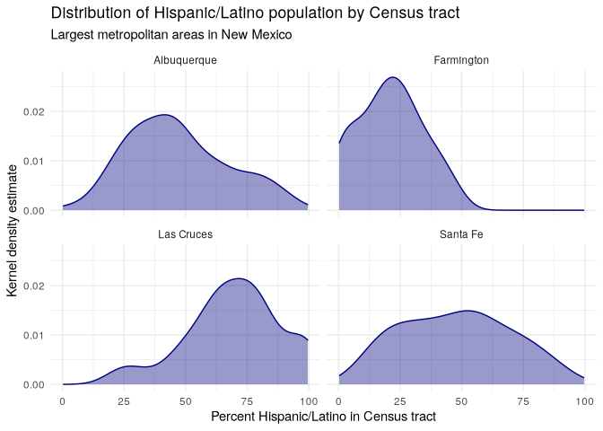
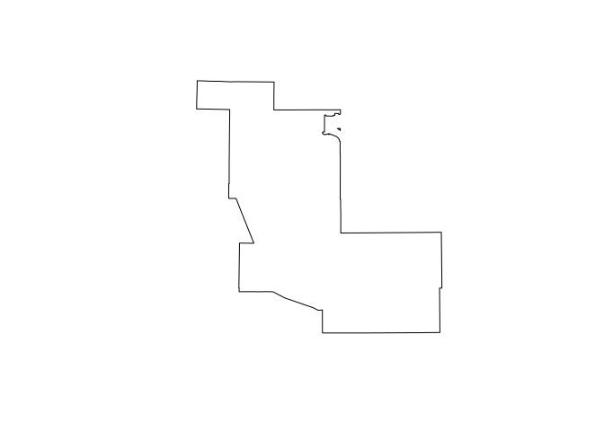

# Spatial joins

## Point in polygon

``` r
library(tidyverse)
```

    ## ── Attaching core tidyverse packages ──────────────────────── tidyverse 2.0.0 ──
    ## ✔ dplyr     1.1.4     ✔ readr     2.1.5
    ## ✔ forcats   1.0.0     ✔ stringr   1.5.1
    ## ✔ ggplot2   3.5.1     ✔ tibble    3.2.1
    ## ✔ lubridate 1.9.4     ✔ tidyr     1.3.1
    ## ✔ purrr     1.0.4     
    ## ── Conflicts ────────────────────────────────────────── tidyverse_conflicts() ──
    ## ✖ dplyr::filter() masks stats::filter()
    ## ✖ dplyr::lag()    masks stats::lag()
    ## ℹ Use the conflicted package (<http://conflicted.r-lib.org/>) to force all conflicts to become errors

``` r
library(sf)
```

    ## Linking to GEOS 3.13.1, GDAL 3.10.2, PROJ 9.6.0; sf_use_s2() is TRUE

``` r
library(tidycensus)
library(mapview)
options(tigris_use_cache = T)
```

``` r
gainesville_patients <- tibble(
  patient_id = 1:10,
  longitude = c(-82.308131, -82.311972, -82.361748, -82.374377, 
                -82.38177, -82.259461, -82.367436, -82.404031, 
                -82.43289, -82.461844),
  latitude = c(29.645933, 29.655195, 29.621759, 29.653576, 
               29.677201, 29.674923, 29.71099, 29.711587, 
               29.648227, 29.624037)
)
```

``` r
gainesvill_sf <- gainesville_patients |> 
  st_as_sf(coords = c("longitude", "latitude"),
           crs = 4326) |> 
  st_transform(6440)
```

``` r
mapview(
  gainesvill_sf,
  col.regions = "red",
  legend = F
)
```

> Get the health insurance data

``` r
alachua_insurance <- get_acs(
  geography = "tract",
  variables = "DP03_0096P",
  state = "FL",
  county = "Alachua",
  year = 2019, 
  geometry = T
) |> 
  select(GEOID, pct_insured = estimate, 
         pct_insured_moe = moe) |> 
  st_transform(6440)
```

    ## Getting data from the 2015-2019 5-year ACS

    ## Using the ACS Data Profile

``` r
mapview(
  alachua_insurance,
  zcol = "pct_insured",
  layer.name = "% with health</br>insurance"
) +
  mapview(
    gainesvill_sf,
    col.regions = "red",
    legend = F
  )
```

``` r
patients_joined <- st_join(
  gainesvill_sf,
  alachua_insurance
)
patients_joined
```

    ## Simple feature collection with 10 features and 4 fields
    ## Geometry type: POINT
    ## Dimension:     XY
    ## Bounding box:  xmin: 797379.2 ymin: 70862.57 xmax: 816865.2 ymax: 80741.87
    ## Projected CRS: NAD83(2011) / Florida North
    ## # A tibble: 10 × 5
    ##    patient_id            geometry GEOID       pct_insured pct_insured_moe
    ##  *      <int>         <POINT [m]> <chr>             <dbl>           <dbl>
    ##  1          1 (812216.7 73640.25) 12001000700        81.6             7  
    ##  2          2 (811825.2 74659.57) 12001000500        91               5.1
    ##  3          3 (807076.4 70862.57) 12001001515        85.2             6.2
    ##  4          4 (805787.7 74365.85) 12001001603        88.3             5.1
    ##  5          5  (805023.4 76970.8) 12001001100        96.2             2.7
    ##  6          6 (816865.2 76944.63) 12001001902        86               5.9
    ##  7          7 (806340.6 80741.36) 12001001803        92.3             4  
    ##  8          8   (802799 80741.87) 12001001813        97.9             1.4
    ##  9          9 (800134.3 73668.88) 12001002207        95.7             2.4
    ## 10         10 (797379.2 70937.49) 12001002205        96.5             1.6

## Group-wise spatial analysis

``` r
library(tidycensus)
library(tidyverse)
library(sf)

# CRS: NAD83(2011) / Texas Centric Albers Equal Area
nm_cbsa <- get_acs(
  geography = "cbsa",
  variables = "B01003_001",
  year = 2019,
  survey = "acs1",
  geometry = TRUE
) %>%
  filter(str_detect(NAME, "NM")) %>%
  slice_max(estimate, n = 4) %>%
  st_transform(32113)
```

    ## Getting data from the 2019 1-year ACS

    ## The 1-year ACS provides data for geographies with populations of 65,000 and greater.

``` r
nrow(nm_cbsa)
```

    ## [1] 4

``` r
pct_hispanic <- get_acs(
  geography = "tract",
  variables = "DP05_0071P",
  state = "NM",
  year = 2019,
  geometry = TRUE
) |> 
  st_transform(32113)
```

    ## Getting data from the 2015-2019 5-year ACS

    ## Using the ACS Data Profile

``` r
nrow(pct_hispanic)
```

    ## [1] 499

> Compute and visualize spatial join

``` r
hispanic_by_metro <- st_join(
  pct_hispanic,
  nm_cbsa,
  join = st_within,
  suffix = c("_tracts", "_metro"),
  left = F # inner join
)
nrow(pct_hispanic)
```

    ## [1] 499

``` r
nrow(hispanic_by_metro)
```

    ## [1] 327

``` r
hispanic_by_metro |> 
  mutate(NAME_metro = str_replace(NAME_metro, ", NM Metro Area", "")) |> 
  ggplot() +
  geom_density(aes(x = estimate_tracts), 
               color = "navy", fill = "navy",
               alpha = 0.4) +
  theme_minimal() +
  facet_wrap(~NAME_metro) +
  labs(title = "Distribution of Hispanic/Latino population by Census tract",
       subtitle = "Largest metropolitan areas in New Mexico",
       y = "Kernel density estimate",
       x = "Percent Hispanic/Latino in Census tract")
```

    ## Warning: Removed 1 row containing non-finite outside the scale range
    ## (`stat_density()`).

<!-- -->

``` r
median_by_metro <- hispanic_by_metro |> 
  group_by(NAME_metro) |> 
  summarise(median_hispanic = median(estimate_tracts, na.rm=T))
median_by_metro
```

    ## Simple feature collection with 4 features and 2 fields
    ## Geometry type: GEOMETRY
    ## Dimension:     XY
    ## Bounding box:  xmin: 247907.5 ymin: 86857.51 xmax: 588010.2 ymax: 669022.6
    ## Projected CRS: NAD83 / New Mexico Central
    ## # A tibble: 4 × 3
    ##   NAME_metro                 median_hispanic                            geometry
    ##   <chr>                                <dbl>                      <GEOMETRY [m]>
    ## 1 Albuquerque, NM Metro Area            44.4 MULTIPOLYGON (((441966.2 397107, 4…
    ## 2 Farmington, NM Metro Area             21.5 POLYGON ((248695.3 585943.2, 24872…
    ## 3 Las Cruces, NM Metro Area             70.4 POLYGON ((464018.3 98268.2, 464126…
    ## 4 Santa Fe, NM Metro Area               49.4 POLYGON ((500584.5 458486.2, 50058…

``` r
plot(median_by_metro[1,]$geometry)
```

<!-- -->
