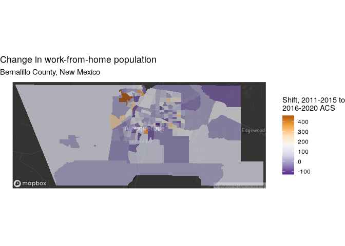

# Small area time-series

``` r
library(tidycensus)
library(tidyverse)
```

    ## ── Attaching core tidyverse packages ──────────────────────── tidyverse 2.0.0 ──
    ## ✔ dplyr     1.1.4     ✔ readr     2.1.5
    ## ✔ forcats   1.0.0     ✔ stringr   1.5.1
    ## ✔ ggplot2   3.5.1     ✔ tibble    3.2.1
    ## ✔ lubridate 1.9.4     ✔ tidyr     1.3.1
    ## ✔ purrr     1.0.4     
    ## ── Conflicts ────────────────────────────────────────── tidyverse_conflicts() ──
    ## ✖ dplyr::filter() masks stats::filter()
    ## ✖ dplyr::lag()    masks stats::lag()
    ## ℹ Use the conflicted package (<http://conflicted.r-lib.org/>) to force all conflicts to become errors

``` r
library(tigris)
```

    ## To enable caching of data, set `options(tigris_use_cache = TRUE)`
    ## in your R script or .Rprofile.

``` r
library(sf)
```

    ## Linking to GEOS 3.13.1, GDAL 3.10.2, PROJ 9.6.0; sf_use_s2() is TRUE

``` r
options(tigris_use_cache = T)
```

> Number of people working from home

``` r
wfh_15 <- get_acs(
  geography = "tract", 
  variables = "B08006_017",
  year = 2015,
  state = "NM", 
  county = "Bernalillo", 
  geometry = T
) |> 
  select(estimate) |> 
  st_transform(32113)
```

    ## Getting data from the 2011-2015 5-year ACS

``` r
wfh_20 <- get_acs(
  geography = "tract", 
  variables = "B08006_017",
  year = 2020,
  state = "NM", 
  county = "Bernalillo", 
  geometry = T
) |> 
  st_transform(32113)
```

    ## Getting data from the 2016-2020 5-year ACS

## Area-weighted areal interpolation

``` r
wfh_interpolate_aw <- st_interpolate_aw(
  wfh_15,
  wfh_20,
  extensive = T
) |> 
  mutate(GEOID = wfh_20$GEOID)
```

    ## Warning in st_interpolate_aw.sf(wfh_15, wfh_20, extensive = T):
    ## st_interpolate_aw assumes attributes are constant or uniform over areas of x

    ## Warning in NextMethod(): number of items to replace is not a multiple of
    ## replacement length

## Population-weighted areal interpolation

``` r
bernalillo_blocks <- blocks(
  state = "NM",
  county = "Bernalillo",
  year = 2020
)

wfh_interpolate_pw <- interpolate_pw(
  wfh_15,
  wfh_20,
  to_id = "GEOID",
  extensive = T,
  weights = bernalillo_blocks,
  weight_column = "POP20",
  crs = 32113
)
nrow(wfh_interpolate_pw)
```

    ## [1] 176

## Making comparisons

``` r
library(mapboxapi)
```

    ## Usage of the Mapbox APIs is governed by the Mapbox Terms of Service.
    ## Please visit https://www.mapbox.com/legal/tos/ for more information.

``` r
wfh_shift <- wfh_20 |> 
  left_join(st_drop_geometry(wfh_interpolate_pw),
            by = "GEOID",
            suffix = c("_2020","_2015")) |> 
  mutate(wfh_shift = estimate_2020 - estimate_2015)

bernalillo_basemap <- layer_static_mapbox(
  location = wfh_shift,
  style_id = "dark-v9",
  username = "mapbox"
)

ggplot() +
  bernalillo_basemap +
  geom_sf(data = wfh_shift, aes(fill = wfh_shift),
          color = NA, alpha = 0.7) +
  scale_fill_distiller(palette = "PuOr", direction = -1) +
  labs(fill = "Shift, 2011-2015 to\n2016-2020 ACS",
       title = "Change in work-from-home population",
       subtitle = "Bernalillo County, New Mexico") +
  theme_void()
```

<!-- -->
