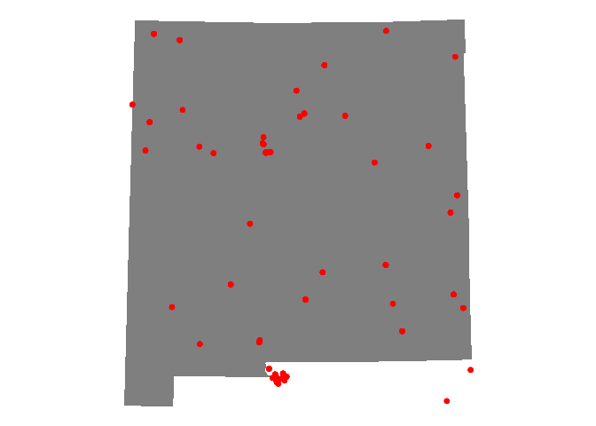
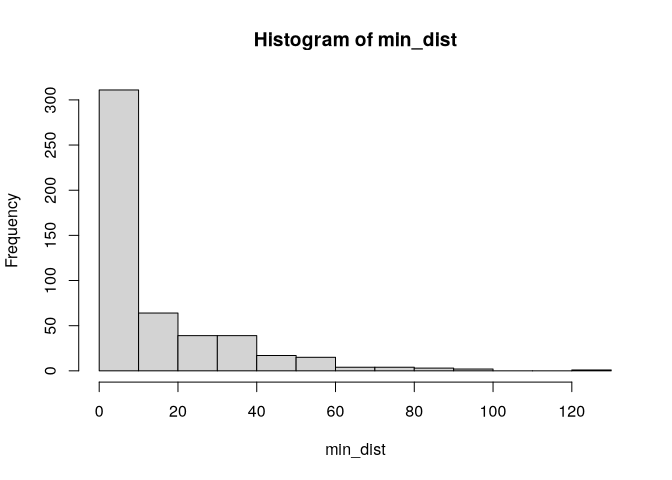
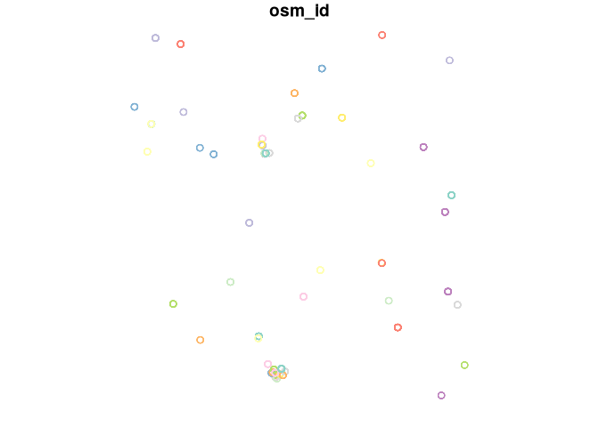
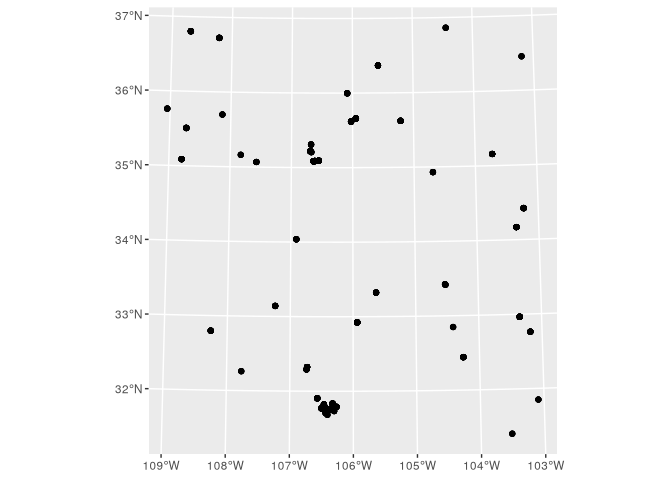
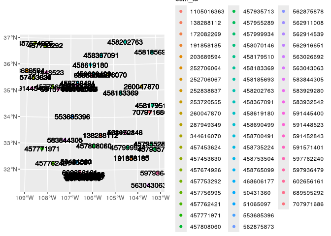

# Distance and proximity analysis

``` r
library(tidycensus)
library(tidyverse)
```

    ## ── Attaching core tidyverse packages ──────────────────────── tidyverse 2.0.0 ──
    ## ✔ dplyr     1.1.4     ✔ readr     2.1.5
    ## ✔ forcats   1.0.0     ✔ stringr   1.5.1
    ## ✔ ggplot2   3.5.1     ✔ tibble    3.2.1
    ## ✔ lubridate 1.9.4     ✔ tidyr     1.3.1
    ## ✔ purrr     1.0.4     
    ## ── Conflicts ────────────────────────────────────────── tidyverse_conflicts() ──
    ## ✖ dplyr::filter() masks stats::filter()
    ## ✖ dplyr::lag()    masks stats::lag()
    ## ℹ Use the conflicted package (<http://conflicted.r-lib.org/>) to force all conflicts to become errors

``` r
library(tigris)
```

    ## To enable caching of data, set `options(tigris_use_cache = TRUE)`
    ## in your R script or .Rprofile.

``` r
library(sf)
```

    ## Linking to GEOS 3.13.1, GDAL 3.10.2, PROJ 9.6.0; sf_use_s2() is TRUE

``` r
options(tigris_use_cache = T)
```

``` r
nm_tracts <- tracts("NM", cb = TRUE, year = 2019) %>%
  st_transform(32113)
```

``` r
library(osmdata)
```

    ## Data (c) OpenStreetMap contributors, ODbL 1.0. https://www.openstreetmap.org/copyright

``` r
available_tags("amenity")
```

    ## # A tibble: 137 × 2
    ##    Key     Value          
    ##    <chr>   <chr>          
    ##  1 amenity animal_boarding
    ##  2 amenity animal_breeding
    ##  3 amenity animal_shelter 
    ##  4 amenity animal_training
    ##  5 amenity arts_centre    
    ##  6 amenity atm            
    ##  7 amenity baby_hatch     
    ##  8 amenity baking_oven    
    ##  9 amenity bank           
    ## 10 amenity bar            
    ## # ℹ 127 more rows

``` r
nm_bb <- getbb("New Mexico")
```

``` r
nm_hospitals <- nm_bb |> 
  opq() |> 
  add_osm_feature(key = "amenity", value = "hospital") |> 
  osmdata_sf()

nm_hospitals <- nm_hospitals$osm_polygons |> 
  st_transform(32113)

trauma <- nm_hospitals |> 
  filter(str_detect(emergency, "yes")) |> 
  st_cast(to = 'POINT')
```

    ## Warning in st_cast.sf(filter(nm_hospitals, str_detect(emergency, "yes")), :
    ## repeating attributes for all sub-geometries for which they may not be constant

## Distances

``` r
nm_trauma <-  trauma |> 
  st_filter(nm_tracts,
            .predicate = st_is_within_distance,
            dist = 100000)
```

``` r
ggplot() +
  geom_sf(data = nm_tracts, color = "NA", fill = "grey50") +
  geom_sf(data = nm_trauma, color = "red") +
  theme_void()
```

<!-- -->

``` r
dist <- nm_tracts |> 
  st_centroid() |> 
  st_distance(nm_trauma)
```

    ## Warning: st_centroid assumes attributes are constant over geometries

``` r
dist[1:5, 1:5]
```

    ## Units: [m]
    ##          [,1]     [,2]     [,3]     [,4]     [,5]
    ## [1,] 400473.0 400467.1 400466.6 400474.1 400476.7
    ## [2,] 480374.4 480371.9 480401.3 480404.9 480406.1
    ## [3,] 305891.3 305888.2 305915.7 305919.9 305921.3
    ## [4,] 287720.6 287714.8 287710.0 287717.5 287720.2
    ## [5,] 405236.0 405230.9 405244.9 405251.6 405253.9

The dense matrix shows distances (in meters) between the first five
Census tracts in the dataset and the first five hospitals. When
considering *accessibility*, we may be interested in the distance to the
*nearest* hospital to each Census tract.

``` r
min_dist <- dist |> 
  apply(1, min) |> 
  as.vector() |> 
  magrittr::divide_by(1000)

hist(min_dist)
```

<!-- -->

``` r
plot(nm_trauma['osm_id'])
```

<!-- -->

``` r
ggplot(nm_trauma) +
  geom_sf()
```

<!-- -->

``` r
pnt <- nm_trauma$geometry[1,]
class(pnt)
```

    ## [1] "sfc_POINT" "sfc"

``` r
st_coordinates(pnt)[,1]
```

    ##        X 
    ## 454828.6

## Travel times

``` r
library(mapboxapi)
```

    ## Usage of the Mapbox APIs is governed by the Mapbox Terms of Service.
    ## Please visit https://www.mapbox.com/legal/tos/ for more information.

``` r
times <- mb_matrix(nm_tracts, nm_trauma,
                   allow_large_matrix = TRUE)
```

## Catchment areas with buffers and isochrones

``` r
ggplot(nm_trauma) +
  geom_sf(aes(color = osm_id)) +
  geom_text(label = nm_trauma$osm_id, 
             x = st_coordinates(nm_trauma$geometry)[,1], 
             y = st_coordinates(nm_trauma$geometry)[,2])
```

<!-- -->

``` r
guadalupe_county <- nm_trauma[nm_trauma$osm_id == "458183369",][1,]

buf5km <- st_buffer(guadalupe_county, dist = 5000)
```

``` r
iso15min <- mb_isochrone(
  guadalupe_county,
  time = 15,
  profile = "driving-traffic",
  depart_at = "2025-04-19T10:00"
)
```

``` r
iso15min_p <- st_transform(iso15min, 32113)
buf5km_p <- st_transform(buf5km, 32113)
```

``` r
library(leaflet)
library(leafsync)
```

``` r
hospital_icon <- makeAwesomeIcon(icon = "ios-medical",
                                 markerColor = "red",
                                 library = "ion")

m2 <- leaflet() |> 
  addProviderTiles(providers$Esri.WorldStreetMap) |> 
  addPolygons(data = iso15min) |> 
  addAwesomeMarkers(data = st_transform(guadalupe_county, 4326),
                    icon = hospital_icon)
  
m1 <- leaflet() |> 
  addProviderTiles(providers$Esri.WorldStreetMap) |> 
  addPolygons(data = st_transform(buf5km, 4326)) |> 
  addAwesomeMarkers(data =  st_transform(guadalupe_county, 4326),
                    icon = hospital_icon)

sync(m1, m2)
```

<div style="display:inline;width:49%;float:left;border-style:solid;border-color:#BEBEBE;border-width:1px 1px 1px 1px;">
<div class="leaflet html-widget html-fill-item" id="htmlwidget-2666" style="width:100%;height:400px;"></div>
<script type="application/json" data-for="htmlwidget-2666">{"x":{"options":{"crs":{"crsClass":"L.CRS.EPSG3857","code":null,"proj4def":null,"projectedBounds":null,"options":{}}},"calls":[{"method":"addProviderTiles","args":["Esri.WorldStreetMap",null,null,{"errorTileUrl":"","noWrap":false,"detectRetina":false}]},{"method":"addPolygons","args":[[[[{"lng":[-104.6399330442215,-104.6400540949238,-104.6403247470455,-104.6407442461933,-104.6413114303626,-104.642024733256,-104.6428821887044,-104.6438814361765,-104.6450197273616,-104.6462939338052,-104.6477005555769,-104.6492357309434,-104.6508952470224,-104.6526745513843,-104.6545687645713,-104.6565726934993,-104.6586808457035,-104.6608874443913,-104.6631864442589,-104.6655715480299,-104.6680362236704,-104.670573722234,-104.6731770962882,-104.6758392188728,-104.6785528029394,-104.6813104212188,-104.6841045264648,-104.6869274720177,-104.6897715326351,-104.6926289255319,-104.6954918315755,-104.6983524165776,-104.7012028526271,-104.7040353394066,-104.706842125436,-104.7096155291855,-104.712347960003,-104.7150319387987,-104.7176601184319,-104.7202253037458,-104.7227204711959,-104.7251387880197,-104.7274736308952,-104.7297186040392,-104.7318675566951,-104.7339145999636,-104.7358541229297,-104.737680808043,-104.7393896457079,-104.7409759480451,-104.7424353617841,-104.7437638802539,-104.7449578544351,-104.7460140030455,-104.7469294216283,-104.7477015906177,-104.7483283823595,-104.7488080670648,-104.7491393176807,-104.7493212136611,-104.7493532436283,-104.7492353069151,-104.7489677139813,-104.7485511857033,-104.7479868515364,-104.7472762465526,-104.7464213073624,-104.7454243669283,-104.7442881482849,-104.743015757179,-104.7416106736523,-104.7400767425843,-104.7384181632247,-104.7366394777401,-104.7347455588076,-104.7327415962874,-104.7306330830121,-104.7284257997303,-104.7261257992463,-104.7237393897994,-104.7212731177286,-104.7187337494712,-104.7161282529444,-104.7134637783626,-104.7107476385433,-104.7079872887568,-104.7051903061766,-104.702364368987,-104.6995172352076,-104.6966567212936,-104.6937906805723,-104.6909269815762,-104.6880734863342,-104.6852380286807,-104.6824283926456,-104.6796522909838,-104.6769173439065,-104.6742310580722,-104.671600805898,-104.6690338052478,-104.6665370995552,-104.6641175384363,-104.6617817588454,-104.6595361668288,-104.6573869199233,-104.6553399102522,-104.6534007483621,-104.6515747478474,-104.649866910803,-104.6482819141452,-104.646824096839,-104.6454974480646,-104.6443055963566,-104.6432517997428,-104.6423389369113,-104.6415694994264,-104.6409455850155,-104.6404688919427,-104.6401407144843,-104.6399619395161,-104.6399330442215],"lat":[34.92901238233102,34.926655307867,34.92430667969777,34.9219729339214,34.91966046532221,34.91737560986339,34.91512462734665,34.9129136842857,34.9107488370402,34.90863601525626,34.90658100565802,34.90458943623468,34.90266676086549,34.90081824442442,34.89904894840471,34.89736371710216,34.89576716439424,34.89426366115094,34.89285732331093,34.89155200065522,34.89035126630871,34.88925840699731,34.88827641408738,34.88740797543105,34.88665546803959,34.8860209516043,34.88550616288244,34.88511251096306,34.88484107342561,34.88469259340147,34.88466747754651,34.88476579492978,34.88498727684185,34.88533131752272,34.88579697580813,34.8863829776891,34.88708771977863,34.88790927367599,34.88884539121678,34.88989351059525,34.89105076334208,34.89231398213919,34.89367970945068,34.89514420694666,34.89670346569486,34.89835321709258,34.90008894450958,34.90190589561099,34.90379909532642,34.90576335943095,34.9077933087011,34.90988338360756,34.91202785950507,34.91422086227823,34.91645638440105,34.91872830136633,34.92103038844059,34.92335633769888,34.92569977529287,34.92805427890546,34.93041339534394,34.93277065822391,34.93511960569514,34.93745379816117,34.93976683594371,34.94205237684349,34.94430415354898,34.94651599084521,34.94868182257508,34.95079570830634,34.95285184965803,34.95484460624122,34.95676851116993,34.95861828609888,34.9603888557466,34.96207536186315,34.96367317660393,34.96517791527185,34.96658544839267,34.96789191308959,34.96909372372529,34.97018758178174,34.97117048495012,34.97203973540531,34.97279294724175,34.97342805305006,34.9739433096157,34.97433730272379,34.9746089510567,34.97475750917356,34.97478256956289,34.97468406376331,34.97446226254861,34.97411777517711,34.97365154770718,34.9730648603839,34.97235932410408,34.97153687596989,34.97059977394314,34.96955059061585,34.96839220611422,34.96712780015609,34.96576084328415,34.96429508729965,34.96273455492312,34.96108352871143,34.95934653926189,34.95752835273651,34.95563395774122,34.95366855159666,34.95163752603872,34.9495464523887,34.94740106623431,34.94520725166386,34.94297102509757,34.94069851876063,34.93839596384376,34.9360696733977,34.93372602500887,34.93137144330388,34.92901238233102]}]]],null,null,{"interactive":true,"className":"","stroke":true,"color":"#03F","weight":5,"opacity":0.5,"fill":true,"fillColor":"#03F","fillOpacity":0.2,"smoothFactor":1,"noClip":false},null,null,null,{"interactive":false,"permanent":false,"direction":"auto","opacity":1,"offset":[0,0],"textsize":"10px","textOnly":false,"className":"","sticky":true},null]},{"method":"addAwesomeMarkers","args":[34.92972519999999,-104.6946422,{"icon":"ios-medical","markerColor":"red","iconColor":"white","spin":false,"squareMarker":false,"iconRotate":0,"font":"monospace","prefix":"ion"},null,null,{"interactive":true,"draggable":false,"keyboard":true,"title":"","alt":"","zIndexOffset":0,"opacity":1,"riseOnHover":false,"riseOffset":250},null,null,null,null,null,{"interactive":false,"permanent":false,"direction":"auto","opacity":1,"offset":[0,0],"textsize":"10px","textOnly":false,"className":"","sticky":true},null]}],"limits":{"lat":[34.88466747754651,34.97478256956289],"lng":[-104.7493532436283,-104.6399330442215]}},"evals":[],"jsHooks":[]}</script>
</div>
<div style="display:inline;width:49%;float:left;border-style:solid;border-color:#BEBEBE;border-width:1px 1px 1px 1px;">
<div class="leaflet html-widget html-fill-item" id="htmlwidget-9693" style="width:100%;height:400px;"></div>
<script type="application/json" data-for="htmlwidget-9693">{"x":{"options":{"crs":{"crsClass":"L.CRS.EPSG3857","code":null,"proj4def":null,"projectedBounds":null,"options":{}}},"calls":[{"method":"addProviderTiles","args":["Esri.WorldStreetMap",null,null,{"errorTileUrl":"","noWrap":false,"detectRetina":false}]},{"method":"addPolygons","args":[[[[{"lng":[-104.693642,-104.693924,-104.693008,-104.693642,-104.695009,-104.695642,-104.696975,-104.697642,-104.701642,-104.702266,-104.702642,-104.703839,-104.702904,-104.702642,-104.698642,-104.697642,-104.694642,-104.694054,-104.692642,-104.691642,-104.688642,-104.687642,-104.685642,-104.685346,-104.685896,-104.68507,-104.683272,-104.682832,-104.679432,-104.679449,-104.679256,-104.678455,-104.678439,-104.682034,-104.681954,-104.683007,-104.683203,-104.683802,-104.683642,-104.682458,-104.681642,-104.675642,-104.675481,-104.677256,-104.677642,-104.678642,-104.679642,-104.680642,-104.681225,-104.682913,-104.682741,-104.680642,-104.678642,-104.678367,-104.679089,-104.677801,-104.676039,-104.675642,-104.674642,-104.674331,-104.67354,-104.673338,-104.672493,-104.672344,-104.671544,-104.67135,-104.670546,-104.670355,-104.669547,-104.66936,-104.668549,-104.668364,-104.667505,-104.668351,-104.668537,-104.66931,-104.669642,-104.67393,-104.674642,-104.675642,-104.675201,-104.675296,-104.676888,-104.67674,-104.676127,-104.674642,-104.673642,-104.673202,-104.674047,-104.672832,-104.668009,-104.666642,-104.666374,-104.665553,-104.665377,-104.664555,-104.664382,-104.663556,-104.663386,-104.662557,-104.662391,-104.661559,-104.661395,-104.660519,-104.660403,-104.659563,-104.659642,-104.661742,-104.661959,-104.662755,-104.663007,-104.663642,-104.667642,-104.668642,-104.672082,-104.671984,-104.669642,-104.668642,-104.664472,-104.665294,-104.665642,-104.673642,-104.674726,-104.673642,-104.672642,-104.664642,-104.664027,-104.663642,-104.659642,-104.659412,-104.658529,-104.65842,-104.657533,-104.657535,-104.65843,-104.658541,-104.659441,-104.659545,-104.66045,-104.66058,-104.661456,-104.66158,-104.662457,-104.662581,-104.663459,-104.663581,-104.664461,-104.664582,-104.666464,-104.666642,-104.668466,-104.668642,-104.670468,-104.670642,-104.672471,-104.672642,-104.674473,-104.674586,-104.675475,-104.675587,-104.677477,-104.677642,-104.683482,-104.683642,-104.686486,-104.68659,-104.687487,-104.687591,-104.688488,-104.688642,-104.690642,-104.69082,-104.692706,-104.692846,-104.693715,-104.69388,-104.696742,-104.696974,-104.697901,-104.698642,-104.7003,-104.700366,-104.699489,-104.699539,-104.703642,-104.704642,-104.706688,-104.707687,-104.707788,-104.712692,-104.712642,-104.709826,-104.709826,-104.714468,-104.714585,-104.715724,-104.714811,-104.714699,-104.713817,-104.71373,-104.712826,-104.712704,-104.70984,-104.709642,-104.707851,-104.707713,-104.706859,-104.706716,-104.705869,-104.705719,-104.704877,-104.704783,-104.704924,-104.7058,-104.704976,-104.704756,-104.704,-104.703765,-104.703024,-104.702773,-104.701075,-104.700868,-104.701642,-104.703216,-104.703507,-104.704256,-104.704517,-104.705279,-104.705525,-104.706305,-104.706532,-104.707323,-104.707538,-104.707965,-104.709319,-104.709336,-104.708542,-104.708349,-104.706506,-104.706557,-104.707392,-104.707527,-104.708422,-104.70857,-104.70943,-104.709573,-104.711443,-104.711642,-104.714455,-104.714581,-104.715463,-104.715584,-104.716472,-104.716642,-104.716819,-104.717735,-104.717851,-104.722642,-104.7234,-104.723642,-104.723837,-104.725447,-104.725584,-104.726642,-104.726803,-104.728696,-104.728805,-104.729697,-104.729806,-104.731697,-104.731808,-104.733642,-104.733809,-104.735698,-104.735811,-104.738642,-104.738813,-104.742642,-104.742817,-104.751642,-104.751896,-104.762642,-104.762828,-104.76873,-104.769642,-104.772911,-104.773642,-104.776642,-104.776785,-104.775873,-104.776047,-104.774269,-104.774642,-104.775216,-104.778084,-104.778335,-104.77748,-104.780222,-104.780526,-104.785642,-104.785911,-104.790642,-104.790884,-104.794642,-104.794913,-104.796737,-104.796935,-104.798745,-104.79896,-104.800754,-104.800987,-104.802765,-104.803023,-104.804778,-104.805061,-104.806795,-104.807116,-104.808817,-104.809157,-104.810847,-104.811189,-104.812884,-104.813913,-104.814292,-104.813363,-104.813226,-104.812481,-104.812642,-104.813642,-104.813898,-104.814954,-104.815211,-104.815642,-104.81897,-104.814642,-104.814063,-104.812425,-104.8121,-104.810642,-104.809642,-104.808483,-104.808176,-104.806501,-104.806229,-104.804515,-104.804271,-104.802527,-104.802306,-104.800536,-104.800331,-104.798545,-104.798355,-104.796552,-104.796376,-104.792562,-104.793412,-104.793642,-104.810642,-104.810894,-104.811642,-104.864642,-104.865035,-104.866779,-104.867139,-104.869005,-104.868255,-104.868642,-104.870186,-104.870297,-104.869385,-104.869642,-104.886642,-104.887642,-104.896642,-104.897642,-104.900642,-104.901642,-104.905642,-104.906176,-104.906642,-104.925642,-104.925895,-104.925642,-104.907642,-104.906642,-104.897642,-104.886642,-104.877642,-104.876642,-104.870642,-104.870642,-104.87208,-104.872642,-104.875844,-104.871642,-104.870642,-104.869446,-104.869083,-104.868271,-104.867642,-104.866919,-104.865985,-104.865642,-104.865047,-104.863751,-104.868828,-104.868126,-104.867642,-104.834642,-104.833642,-104.812642,-104.812426,-104.811642,-104.792642,-104.792519,-104.793377,-104.793549,-104.794357,-104.794544,-104.795337,-104.795495,-104.803642,-104.804642,-104.805193,-104.804797,-104.802642,-104.802183,-104.803164,-104.804148,-104.803833,-104.80249,-104.799642,-104.796478,-104.796084,-104.796815,-104.796642,-104.796296,-104.795355,-104.794903,-104.7938,-104.791642,-104.790642,-104.78442,-104.789642,-104.790642,-104.793792,-104.793743,-104.792937,-104.792738,-104.791924,-104.791776,-104.7909,-104.790728,-104.78953,-104.789266,-104.788642,-104.788019,-104.78783,-104.787987,-104.790642,-104.784642,-104.78443,-104.780642,-104.780375,-104.779526,-104.765642,-104.765345,-104.764642,-104.755642,-104.75532,-104.754642,-104.745642,-104.745293,-104.744526,-104.741642,-104.741279,-104.738573,-104.738267,-104.737526,-104.735642,-104.735476,-104.733642,-104.733477,-104.732441,-104.732241,-104.731526,-104.730588,-104.73048,-104.728642,-104.728481,-104.726589,-104.726483,-104.725557,-104.726459,-104.726449,-104.725577,-104.725445,-104.724576,-104.724441,-104.72354,-104.724434,-104.724535,-104.725422,-104.725567,-104.726414,-104.726565,-104.727409,-104.727563,-104.728403,-104.728561,-104.729396,-104.729642,-104.729908,-104.731377,-104.731553,-104.73335,-104.733642,-104.739642,-104.740642,-104.741832,-104.742642,-104.746088,-104.746642,-104.750197,-104.746196,-104.746035,-104.743642,-104.742642,-104.739642,-104.738642,-104.732495,-104.732642,-104.734306,-104.734526,-104.735276,-104.736642,-104.738642,-104.739642,-104.741102,-104.742376,-104.743968,-104.745718,-104.744642,-104.742972,-104.74126,-104.739847,-104.738642,-104.73781,-104.735061,-104.733762,-104.732642,-104.730195,-104.726343,-104.7261,-104.724144,-104.723901,-104.724247,-104.723571,-104.723117,-104.724214,-104.725942,-104.726642,-104.728642,-104.730023,-104.730813,-104.73074,-104.729927,-104.729734,-104.728908,-104.728728,-104.727893,-104.727725,-104.726887,-104.726722,-104.72588,-104.72572,-104.724875,-104.724719,-104.723869,-104.723754,-104.72286,-104.722748,-104.72185,-104.721846,-104.722709,-104.72284,-104.723708,-104.723836,-104.724706,-104.724642,-104.722642,-104.722471,-104.720589,-104.720477,-104.719589,-104.71948,-104.71759,-104.718467,-104.718579,-104.719446,-104.719446,-104.716838,-104.716702,-104.715814,-104.715642,-104.715486,-104.713592,-104.713489,-104.712591,-104.71249,-104.710592,-104.711473,-104.711642,-104.712714,-104.712867,-104.716374,-104.716355,-104.714929,-104.714642,-104.714424,-104.710642,-104.709823,-104.709642,-104.707642,-104.707497,-104.705595,-104.7055,-104.702572,-104.704485,-104.704642,-104.706472,-104.706642,-104.708642,-104.708859,-104.71072,-104.710884,-104.711727,-104.711912,-104.718642,-104.719236,-104.721359,-104.721033,-104.718642,-104.717843,-104.716642,-104.716222,-104.714642,-104.714301,-104.712642,-104.71235,-104.711642,-104.709923,-104.709642,-104.702831,-104.702704,-104.701821,-104.701721,-104.700786,-104.700642,-104.700504,-104.699573,-104.700495,-104.700568,-104.700495,-104.699594,-104.699498,-104.696786,-104.696689,-104.695642,-104.696504,-104.696508,-104.694578,-104.698493,-104.698591,-104.700468,-104.700468,-104.695791,-104.695579,-104.69558,-104.696516,-104.696579,-104.697515,-104.697599,-104.698514,-104.698599,-104.699513,-104.699577,-104.700511,-104.700598,-104.70151,-104.701598,-104.702509,-104.702575,-104.703508,-104.703597,-104.704507,-104.704574,-104.705505,-104.705596,-104.706504,-104.706596,-104.707503,-104.707595,-104.708501,-104.708595,-104.7095,-104.709571,-104.710499,-104.710594,-104.712497,-104.712594,-104.713496,-104.713593,-104.714495,-104.714593,-104.715494,-104.715593,-104.716493,-104.716592,-104.717492,-104.717592,-104.71782,-104.719704,-104.719831,-104.720707,-104.720844,-104.726642,-104.727408,-104.727642,-104.735642,-104.736058,-104.738642,-104.739138,-104.740836,-104.741642,-104.742892,-104.743642,-104.747752,-104.748152,-104.747526,-104.747205,-104.746642,-104.74616,-104.747638,-104.746958,-104.744642,-104.743642,-104.742642,-104.740642,-104.739642,-104.737642,-104.737251,-104.736642,-104.726642,-104.725882,-104.725642,-104.722642,-104.722446,-104.721579,-104.721455,-104.719583,-104.719591,-104.720489,-104.720591,-104.721488,-104.721591,-104.722488,-104.72259,-104.723487,-104.72359,-104.725485,-104.72559,-104.726484,-104.726589,-104.727483,-104.727589,-104.728481,-104.728588,-104.730479,-104.730588,-104.731478,-104.731587,-104.732477,-104.732587,-104.733476,-104.733642,-104.733819,-104.735703,-104.735837,-104.736744,-104.736752,-104.735878,-104.735764,-104.734905,-104.734774,-104.734912,-104.735736,-104.735931,-104.737799,-104.737967,-104.738642,-104.742642,-104.743224,-104.744477,-104.746119,-104.747401,-104.748642,-104.749504,-104.755642,-104.755904,-104.755275,-104.755033,-104.753867,-104.754642,-104.755902,-104.756149,-104.757245,-104.757443,-104.759069,-104.760201,-104.759642,-104.759126,-104.757874,-104.756642,-104.755642,-104.753642,-104.753231,-104.751423,-104.751259,-104.751642,-104.754795,-104.751642,-104.751323,-104.750642,-104.744642,-104.743888,-104.743642,-104.737556,-104.738469,-104.738584,-104.739467,-104.739584,-104.740466,-104.740583,-104.741464,-104.741583,-104.743461,-104.743582,-104.74446,-104.744581,-104.745458,-104.74558,-104.746456,-104.74658,-104.748453,-104.748579,-104.749451,-104.749578,-104.750449,-104.750577,-104.751447,-104.751577,-104.752445,-104.752576,-104.754441,-104.754575,-104.755439,-104.755642,-104.755862,-104.756717,-104.756875,-104.757722,-104.757889,-104.758727,-104.758905,-104.759734,-104.759924,-104.76074,-104.760945,-104.764826,-104.765024,-104.767642,-104.768642,-104.775174,-104.778567,-104.769642,-104.768642,-104.765458,-104.765287,-104.762642,-104.762344,-104.761547,-104.761364,-104.760554,-104.760386,-104.75956,-104.759401,-104.758565,-104.758417,-104.757569,-104.757539,-104.758433,-104.758572,-104.760428,-104.760571,-104.761426,-104.76157,-104.762424,-104.762569,-104.764419,-104.764568,-104.765417,-104.765567,-104.767412,-104.767565,-104.76841,-104.768564,-104.770405,-104.770642,-104.774642,-104.774931,-104.775743,-104.775958,-104.777642,-104.778322,-104.778531,-104.779294,-104.780509,-104.782186,-104.782642,-104.789642,-104.790184,-104.791528,-104.789642,-104.788642,-104.781642,-104.780791,-104.779045,-104.777642,-104.776545,-104.776357,-104.774519,-104.776392,-104.776642,-104.778388,-104.778642,-104.780384,-104.780642,-104.783378,-104.783554,-104.785374,-104.785552,-104.787369,-104.787551,-104.789365,-104.789642,-104.792358,-104.792547,-104.794352,-104.794545,-104.796348,-104.796642,-104.79934,-104.799541,-104.801334,-104.801539,-104.803328,-104.803642,-104.806319,-104.806534,-104.808312,-104.808532,-104.810306,-104.810529,-104.812299,-104.812642,-104.817281,-104.817521,-104.819272,-104.819642,-104.822259,-104.822514,-104.82425,-104.824511,-104.826241,-104.826642,-104.829226,-104.829503,-104.831215,-104.831499,-104.833204,-104.833642,-104.836186,-104.836489,-104.838173,-104.838484,-104.84016,-104.84048,-104.842145,-104.842642,-104.844642,-104.845642,-104.847129,-104.847461,-104.849124,-104.849642,-104.851642,-104.852642,-104.854107,-104.854642,-104.8561,-104.856642,-104.858642,-104.859642,-104.861078,-104.861642,-104.863068,-104.863642,-104.865948,-104.867452,-104.868427,-104.868642,-104.868708,-104.867203,-104.868369,-104.869642,-104.870642,-104.87201,-104.872642,-104.874642,-104.875642,-104.876642,-104.877642,-104.878942,-104.879642,-104.881642,-104.88223,-104.883869,-104.884642,-104.885834,-104.886642,-104.887787,-104.888012,-104.890642,-104.890772,-104.892233,-104.890642,-104.890453,-104.887642,-104.887209,-104.885642,-104.885117,-104.883642,-104.882642,-104.881642,-104.880642,-104.878642,-104.878008,-104.876642,-104.875642,-104.874642,-104.873642,-104.871642,-104.87094,-104.869264,-104.868925,-104.867247,-104.866642,-104.861431,-104.861059,-104.862005,-104.861883,-104.860642,-104.859872,-104.858198,-104.857642,-104.855642,-104.854851,-104.852844,-104.851171,-104.850642,-104.848642,-104.847827,-104.846157,-104.845821,-104.844642,-104.843642,-104.841642,-104.840808,-104.83913,-104.838803,-104.837115,-104.836798,-104.8351,-104.834642,-104.832642,-104.831642,-104.830073,-104.829642,-104.82806,-104.827642,-104.825049,-104.824776,-104.823037,-104.822773,-104.821026,-104.820642,-104.818017,-104.817766,-104.816007,-104.815763,-104.813999,-104.813642,-104.81099,-104.810757,-104.808981,-104.808754,-104.806974,-104.806752,-104.804966,-104.804642,-104.801959,-104.801747,-104.799952,-104.799642,-104.797945,-104.797642,-104.79494,-104.79474,-104.792933,-104.792642,-104.790928,-104.790642,-104.787922,-104.787735,-104.785917,-104.785733,-104.783912,-104.783732,-104.781907,-104.781642,-104.778902,-104.778728,-104.776898,-104.776642,-104.774554,-104.774369,-104.773547,-104.773349,-104.77254,-104.772326,-104.771471,-104.771222,-104.770642,-104.770002,-104.769813,-104.770958,-104.771742,-104.771931,-104.772734,-104.772766,-104.770886,-104.770642,-104.768881,-104.768642,-104.766877,-104.76672,-104.765873,-104.765719,-104.763869,-104.763717,-104.762866,-104.762716,-104.760863,-104.760715,-104.75986,-104.759642,-104.759419,-104.757525,-104.75756,-104.758391,-104.758517,-104.758363,-104.757546,-104.757346,-104.755539,-104.755324,-104.752464,-104.752242,-104.751431,-104.751054,-104.751194,-104.752498,-104.749647,-104.750089,-104.749866,-104.750832,-104.750995,-104.753642,-104.753954,-104.755642,-104.75593,-104.756735,-104.756772,-104.755891,-104.755767,-104.755876,-104.757714,-104.756854,-104.756712,-104.755851,-104.755711,-104.754848,-104.754711,-104.753846,-104.75371,-104.752844,-104.752709,-104.750841,-104.750708,-104.749839,-104.749707,-104.748836,-104.748707,-104.747834,-104.747706,-104.746832,-104.746705,-104.74483,-104.744704,-104.743828,-104.743704,-104.742826,-104.742703,-104.741824,-104.741702,-104.739822,-104.739702,-104.73882,-104.738701,-104.737818,-104.7377,-104.736816,-104.7367,-104.735814,-104.735699,-104.733813,-104.733642,-104.730642,-104.730454,-104.727539,-104.727432,-104.725526,-104.725558,-104.726383,-104.726548,-104.72735,-104.72853,-104.730271,-104.730514,-104.731233,-104.731359,-104.73229,-104.732359,-104.73391,-104.7342,-104.735612,-104.733642,-104.732291,-104.731671,-104.732178,-104.731271,-104.731006,-104.729961,-104.729851,-104.729021,-104.728764,-104.726977,-104.726749,-104.725947,-104.725741,-104.72493,-104.724779,-104.723898,-104.723642,-104.723396,-104.720642,-104.720355,-104.717642,-104.717302,-104.713642,-104.711642,-104.709642,-104.7083,-104.707381,-104.706642,-104.705642,-104.704642,-104.702197,-104.709642,-104.710642,-104.712642,-104.715642,-104.715971,-104.718738,-104.718922,-104.722763,-104.722877,-104.723642,-104.726745,-104.726844,-104.728642,-104.728831,-104.731726,-104.730808,-104.730697,-104.729807,-104.729697,-104.728805,-104.728696,-104.726804,-104.726696,-104.725802,-104.725695,-104.724801,-104.724695,-104.7238,-104.723695,-104.721799,-104.721694,-104.720797,-104.720694,-104.719796,-104.719693,-104.718795,-104.718693,-104.716794,-104.716693,-104.715793,-104.715692,-104.714792,-104.714692,-104.713791,-104.713692,-104.71279,-104.712691,-104.711789,-104.711691,-104.710788,-104.710691,-104.708787,-104.708714,-104.707785,-104.707689,-104.706784,-104.706689,-104.705783,-104.705689,-104.705498,-104.704568,-104.704484,-104.703561,-104.703468,-104.702583,-104.702454,-104.701544,-104.701428,-104.700531,-104.700409,-104.699562,-104.699395,-104.698557,-104.698375,-104.697551,-104.697357,-104.696544,-104.696335,-104.695536,-104.69531,-104.694527,-104.694254,-104.693508,-104.693213,-104.691377,-104.691242,-104.692801,-104.693076,-104.692439,-104.691642,-104.690992,-104.690292,-104.689642,-104.684424,-104.687937,-104.687987,-104.687325,-104.687642,-104.688227,-104.689364,-104.689842,-104.690152,-104.691783,-104.692038,-104.692769,-104.692991,-104.693753,-104.693959,-104.694744,-104.694932,-104.695736,-104.695913,-104.69673,-104.696896,-104.697724,-104.697881,-104.698719,-104.698858,-104.699744,-104.699838,-104.700705,-104.700819,-104.701726,-104.701804,-104.702719,-104.698816,-104.698701,-104.696835,-104.696642,-104.693868,-104.693642,-104.69091,-104.690642,-104.687979,-104.687759,-104.686045,-104.685642,-104.682376,-104.681899,-104.680642,-104.680314,-104.68101,-104.681263,-104.686642,-104.687508,-104.689297,-104.689642,-104.692369,-104.692642,-104.695416,-104.695642,-104.698444,-104.698579,-104.700468,-104.700642,-104.702692,-104.7028,-104.704712,-104.70378,-104.703688,-104.702779,-104.702687,-104.701777,-104.701687,-104.700776,-104.700687,-104.699775,-104.699686,-104.698774,-104.698708,-104.697773,-104.697685,-104.696771,-104.696685,-104.695771,-104.695706,-104.694769,-104.694705,-104.693768,-104.693642,-104.692578,-104.69251,-104.690598,-104.690509,-104.686597,-104.686504,-104.685596,-104.685503,-104.684595,-104.684502,-104.681594,-104.681499,-104.680594,-104.680497,-104.678642,-104.678494,-104.676642,-104.676492,-104.674642,-104.67449,-104.672591,-104.672488,-104.67159,-104.671485,-104.669642,-104.669482,-104.667561,-104.667558,-104.668469,-104.668555,-104.669461,-104.669642,-104.678642,-104.679425,-104.679642,-104.682412,-104.682465,-104.681642,-104.676642,-104.675642,-104.672535,-104.676642,-104.677642,-104.680771,-104.680719,-104.677864,-104.677642,-104.667828,-104.667733,-104.666821,-104.666702,-104.663821,-104.663642,-104.662586,-104.662472,-104.660555,-104.660468,-104.659583,-104.659465,-104.658583,-104.65946,-104.659551,-104.65946,-104.658581,-104.658458,-104.655642,-104.655451,-104.651576,-104.651444,-104.650541,-104.651436,-104.651435,-104.649849,-104.649711,-104.648847,-104.648744,-104.648843,-104.649709,-104.64984,-104.653642,-104.653831,-104.656704,-104.656821,-104.657701,-104.657819,-104.659729,-104.659815,-104.660699,-104.660813,-104.662698,-104.662809,-104.665642,-104.665804,-104.667695,-104.667801,-104.669694,-104.669798,-104.670694,-104.670797,-104.671694,-104.6718,-104.676642,-104.676789,-104.678691,-104.678787,-104.67969,-104.679786,-104.682689,-104.682783,-104.683689,-104.683781,-104.684688,-104.684779,-104.687688,-104.686795,-104.686795,-104.689496,-104.689595,-104.690686,-104.690707,-104.690493,-104.688792,-104.688716,-104.688789,-104.690687,-104.689778,-104.689642,-104.684782,-104.684714,-104.684488,-104.682567,-104.683483,-104.683454,-104.68183,-104.681695,-104.680591,-104.680489,-104.677564,-104.677586,-104.678473,-104.678585,-104.679468,-104.679583,-104.680463,-104.680581,-104.681706,-104.681836,-104.683448,-104.68345,-104.678824,-104.678642,-104.678458,-104.67758,-104.677452,-104.675832,-104.67583,-104.676732,-104.675817,-104.675726,-104.674805,-104.674642,-104.673589,-104.673482,-104.671588,-104.671479,-104.666586,-104.666553,-104.667457,-104.667457,-104.664826,-104.664729,-104.663812,-104.663642,-104.663471,-104.661585,-104.661554,-104.662464,-104.662463,-104.661582,-104.661462,-104.660551,-104.663376,-104.663376,-104.662559,-104.662407,-104.659865,-104.659712,-104.658838,-104.65855,-104.658456,-104.657549,-104.657454,-104.656579,-104.65645,-104.655578,-104.655448,-104.654577,-104.654447,-104.653577,-104.653445,-104.652542,-104.653409,-104.653558,-104.654372,-104.654333,-104.652952,-104.652734,-104.651896,-104.651721,-104.650642,-104.650437,-104.649573,-104.649434,-104.647572,-104.647431,-104.646571,-104.646427,-104.644642,-104.644424,-104.643569,-104.643421,-104.641568,-104.641562,-104.642401,-104.642642,-104.645394,-104.645642,-104.646742,-104.646955,-104.649642,-104.65001,-104.651274,-104.65129,-104.648539,-104.648271,-104.647642,-104.646007,-104.645799,-104.644557,-104.644379,-104.643509,-104.644373,-104.64437,-104.643551,-104.643364,-104.642501,-104.644261,-104.644452,-104.644261,-104.641496,-104.641463,-104.642271,-104.642456,-104.642206,-104.641079,-104.640768,-104.639642,-104.639327,-104.638481,-104.638314,-104.637474,-104.637512,-104.639206,-104.639206,-104.636642,-104.635523,-104.635274,-104.634518,-104.634264,-104.632511,-104.632235,-104.631432,-104.631212,-104.629492,-104.629172,-104.626471,-104.626129,-104.620642,-104.618414,-104.619273,-104.619261,-104.617367,-104.617009,-104.616169,-104.616077,-104.616876,-104.617173,-104.617814,-104.61805,-104.619716,-104.619685,-104.618642,-104.618347,-104.617515,-104.616451,-104.616067,-104.615039,-104.615103,-104.615938,-104.616059,-104.617027,-104.616983,-104.619642,-104.62482,-104.625149,-104.627798,-104.628095,-104.629852,-104.628897,-104.629145,-104.630783,-104.63104,-104.631772,-104.632027,-104.632768,-104.633012,-104.633764,-104.633999,-104.635756,-104.635975,-104.636803,-104.636963,-104.637747,-104.637953,-104.638745,-104.63894,-104.639788,-104.63993,-104.640783,-104.640921,-104.64178,-104.641908,-104.642773,-104.642897,-104.643768,-104.643642,-104.640885,-104.640723,-104.639882,-104.639721,-104.638876,-104.638874,-104.639719,-104.639756,-104.638902,-104.638733,-104.636642,-104.636046,-104.635642,-104.634177,-104.633995,-104.634642,-104.63545,-104.637219,-104.637514,-104.640369,-104.640642,-104.641716,-104.641863,-104.642723,-104.641915,-104.641642,-104.640009,-104.639642,-104.635438,-104.635528,-104.636642,-104.641241,-104.641523,-104.643351,-104.643553,-104.644401,-104.644714,-104.644856,-104.645748,-104.645769,-104.644022,-104.643864,-104.642823,-104.643642,-104.645093,-104.646109,-104.646538,-104.647354,-104.647563,-104.648711,-104.648846,-104.649709,-104.649842,-104.650741,-104.650712,-104.648867,-104.648875,-104.650409,-104.650567,-104.652436,-104.652707,-104.652837,-104.653707,-104.653834,-104.654706,-104.654832,-104.656736,-104.656827,-104.657734,-104.657826,-104.658703,-104.658824,-104.659702,-104.659731,-104.656825,-104.656642,-104.651837,-104.651642,-104.651438,-104.650574,-104.650433,-104.649572,-104.649428,-104.64857,-104.648424,-104.646642,-104.645865,-104.645642,-104.643877,-104.643642,-104.640892,-104.640642,-104.638903,-104.63873,-104.637909,-104.637642,-104.635642,-104.635334,-104.634538,-104.634322,-104.633534,-104.633287,-104.632521,-104.631255,-104.629041,-104.629041,-104.630766,-104.631006,-104.63176,-104.631967,-104.632748,-104.632953,-104.633744,-104.633939,-104.63937,-104.639553,-104.640378,-104.640556,-104.642391,-104.642642,-104.645406,-104.645642,-104.647642,-104.647853,-104.648712,-104.648847,-104.64971,-104.649843,-104.650716,-104.65092,-104.657642,-104.657839,-104.665642,-104.665813,-104.669697,-104.668809,-104.668809,-104.669698,-104.669727,-104.668849,-104.668744,-104.668845,-104.669707,-104.669828,-104.670701,-104.670697,-104.670471,-104.668584,-104.668466,-104.666582,-104.666461,-104.659838,-104.659838,-104.660742,-104.660852,-104.662432,-104.662541,-104.663439,-104.663541,-104.663439,-104.662642,-104.664642,-104.664823,-104.666701,-104.666817,-104.668699,-104.668811,-104.673642,-104.673817,-104.674642,-104.675468,-104.675587,-104.676726,-104.676642,-104.674592,-104.674489,-104.668799,-104.668642,-104.668483,-104.666642,-104.665802,-104.665642,-104.659806,-104.659642,-104.65381,-104.653642,-104.647815,-104.647642,-104.645642,-104.64544,-104.641642,-104.641429,-104.638642,-104.638443,-104.637574,-104.652642,-104.653382,-104.653382,-104.636642,-104.636438,-104.635574,-104.635434,-104.634573,-104.634433,-104.633536,-104.634425,-104.634642,-104.636642,-104.636874,-104.638411,-104.638412,-104.633642,-104.632863,-104.632642,-104.631571,-104.631426,-104.63057,-104.630424,-104.629569,-104.629422,-104.628568,-104.62842,-104.627568,-104.627416,-104.626567,-104.626414,-104.625566,-104.625412,-104.624565,-104.62441,-104.623564,-104.623408,-104.622525,-104.622404,-104.621562,-104.621402,-104.620562,-104.620399,-104.619561,-104.619397,-104.61856,-104.618392,-104.617559,-104.61739,-104.616558,-104.616388,-104.615557,-104.615385,-104.614556,-104.61438,-104.613554,-104.613377,-104.612553,-104.612374,-104.611552,-104.611372,-104.610552,-104.612283,-104.612642,-104.615081,-104.615642,-104.616695,-104.61372,-104.613469,-104.611054,-104.610642,-104.60955,-104.609363,-104.608549,-104.60836,-104.607548,-104.607357,-104.606546,-104.606351,-104.605545,-104.605347,-104.604543,-104.604344,-104.603542,-104.60334,-104.602541,-104.602334,-104.601539,-104.60133,-104.600537,-104.600326,-104.599536,-104.599322,-104.598535,-104.598314,-104.597532,-104.59731,-104.596531,-104.596305,-104.595529,-104.594296,-104.593468,-104.593287,-104.592523,-104.592282,-104.590519,-104.590642,-104.594313,-104.592642,-104.588514,-104.588256,-104.587512,-104.58725,-104.585508,-104.58523,-104.584504,-104.584225,-104.581496,-104.581195,-104.578486,-104.578293,-104.57756,-104.577551,-104.576857,-104.576771,-104.575642,-104.575136,-104.574378,-104.574317,-104.576016,-104.576642,-104.577857,-104.578145,-104.579067,-104.576323,-104.574923,-104.573642,-104.572453,-104.567433,-104.567092,-104.563404,-104.563061,-104.559366,-104.559019,-104.556326,-104.555975,-104.552254,-104.552205,-104.552856,-104.552642,-104.552198,-104.55122,-104.54814,-104.547765,-104.546974,-104.546726,-104.545842,-104.545683,-104.544675,-104.544642,-104.544631,-104.545521,-104.545575,-104.546382,-104.546527,-104.547255,-104.547486,-104.551051,-104.55137,-104.554973,-104.555294,-104.557929,-104.558255,-104.561888,-104.562216,-104.565857,-104.565959,-104.56695,-104.565912,-104.561788,-104.566642,-104.567392,-104.568642,-104.570829,-104.571159,-104.573814,-104.574145,-104.576802,-104.577112,-104.579791,-104.580082,-104.582781,-104.583056,-104.583779,-104.584048,-104.585773,-104.586032,-104.586771,-104.587025,-104.587769,-104.588018,-104.588771,-104.589012,-104.590762,-104.590999,-104.59176,-104.591993,-104.592816,-104.592987,-104.594754,-104.594976,-104.595753,-104.595971,-104.596751,-104.596966,-104.597749,-104.597961,-104.598748,-104.598956,-104.599746,-104.599952,-104.600745,-104.600947,-104.601743,-104.601943,-104.602742,-104.602938,-104.60374,-104.603934,-104.604739,-104.60493,-104.605738,-104.605926,-104.606736,-104.606923,-104.607735,-104.607919,-104.608734,-104.608915,-104.609732,-104.609912,-104.610731,-104.610908,-104.61173,-104.611905,-104.612729,-104.612902,-104.613728,-104.613899,-104.614727,-104.614896,-104.615726,-104.615893,-104.616725,-104.61689,-104.617724,-104.617887,-104.618723,-104.618884,-104.619722,-104.619881,-104.620721,-104.620879,-104.62176,-104.621876,-104.62272,-104.622873,-104.623719,-104.623871,-104.624718,-104.624868,-104.625717,-104.625866,-104.626716,-104.626864,-104.627716,-104.627861,-104.628715,-104.628859,-104.629714,-104.629857,-104.630713,-104.630855,-104.631713,-104.631853,-104.632712,-104.63285,-104.633711,-104.633848,-104.63471,-104.634846,-104.63571,-104.635843,-104.636709,-104.636841,-104.637741,-104.636861,-104.636743,-104.634851,-104.634642,-104.632828,-104.632642,-104.627876,-104.627642,-104.621892,-104.621642,-104.616902,-104.616642,-104.611642,-104.610916,-104.610642,-104.541016,-104.518656,-104.542642,-104.54333,-104.544802,-104.545022,-104.544296,-104.544398,-104.548642,-104.549083,-104.548341,-104.548642,-104.549913,-104.550642,-104.567642,-104.568923,-104.569054,-104.570801,-104.571208,-104.571205,-104.570308,-104.570642,-104.611642,-104.612366,-104.612642,-104.615738,-104.61408,-104.613642,-104.612168,-104.611642,-104.610241,-104.609642,-104.607639,-104.610642,-104.611381,-104.613109,-104.613457,-104.615191,-104.615501,-104.617271,-104.617526,-104.619334,-104.619545,-104.620369,-104.620642,-104.623392,-104.623642,-104.626738,-104.624836,-104.624642,-104.622839,-104.622642,-104.620841,-104.620642,-104.618843,-104.618642,-104.616846,-104.616642,-104.614848,-104.614642,-104.611852,-104.611712,-104.609855,-104.609713,-104.607858,-104.607714,-104.60586,-104.605715,-104.603863,-104.603716,-104.601866,-104.601717,-104.599869,-104.599718,-104.597872,-104.597719,-104.595875,-104.59572,-104.593878,-104.593721,-104.591882,-104.591642,-104.589642,-104.588642,-104.586891,-104.586725,-104.584895,-104.584726,-104.582898,-104.582728,-104.580902,-104.580729,-104.578906,-104.578731,-104.57691,-104.576732,-104.574915,-104.574733,-104.57292,-104.572735,-104.570924,-104.570737,-104.568929,-104.568642,-104.565936,-104.56574,-104.563941,-104.563742,-104.561947,-104.561744,-104.559952,-104.559746,-104.557958,-104.557748,-104.555965,-104.55575,-104.55397,-104.553752,-104.551977,-104.551754,-104.549983,-104.549757,-104.547991,-104.547759,-104.545998,-104.545642,-104.543009,-104.542765,-104.541018,-104.540768,-104.539026,-104.538771,-104.537035,-104.536774,-104.535045,-104.534777,-104.533055,-104.53278,-104.531065,-104.530642,-104.52814,-104.526642,-104.524642,-104.523642,-104.521642,-104.519824,-104.518642,-104.517642,-104.516642,-104.515642,-104.513642,-104.512642,-104.509642,-104.508642,-104.505642,-104.504642,-104.501642,-104.501266,-104.499642,-104.497642,-104.496642,-104.473642,-104.472642,-104.471316,-104.465642,-104.465356,-104.462007,-104.465642,-104.46569,-104.471642,-104.472517,-104.472642,-104.497642,-104.497974,-104.499642,-104.501642,-104.501998,-104.502642,-104.505642,-104.506022,-104.506642,-104.509642,-104.510044,-104.510642,-104.513642,-104.514462,-104.516642,-104.517642,-104.520541,-104.520925,-104.523642,-104.526786,-104.524642,-104.524251,-104.52671,-104.530292,-104.530683,-104.531642,-104.533197,-104.543121,-104.544012,-104.545101,-104.547283,-104.547524,-104.549292,-104.549528,-104.551292,-104.551519,-104.553292,-104.55351,-104.555293,-104.555504,-104.557293,-104.557497,-104.559293,-104.55949,-104.561294,-104.561485,-104.563294,-104.563479,-104.565294,-104.565473,-104.567295,-104.567642,-104.570354,-104.570547,-104.572293,-104.572458,-104.574293,-104.574642,-104.576293,-104.576642,-104.578294,-104.578642,-104.580294,-104.580642,-104.582294,-104.582642,-104.584295,-104.584642,-104.586295,-104.586642,-104.588295,-104.588642,-104.590296,-104.590642,-104.593401,-104.593562,-104.595294,-104.595422,-104.597294,-104.597642,-104.599294,-104.599642,-104.601295,-104.601642,-104.603295,-104.603642,-104.605295,-104.605642,-104.607296,-104.607642,-104.609296,-104.609642,-104.611296,-104.611642,-104.613297,-104.613642,-104.616435,-104.616574,-104.618294,-104.6184,-104.619642,-104.620294,-104.620642,-104.621642,-104.622294,-104.622642,-104.623642,-104.624295,-104.624642,-104.625642,-104.626296,-104.626642,-104.627712,-104.627864,-104.628755,-104.627894,-104.627732,-104.626934,-104.626788,-104.62696,-104.627821,-104.628113,-104.627057,-104.626823,-104.627096,-104.628829,-104.629036,-104.627642,-104.624189,-104.627886,-104.628299,-104.627713,-104.628642,-104.629909,-104.630237,-104.629396,-104.629442,-104.634642,-104.635303,-104.635642,-104.635932,-104.636739,-104.636947,-104.637745,-104.637958,-104.638803,-104.638976,-104.63976,-104.637642,-104.636642,-104.633315,-104.632642,-104.631893,-104.631642,-104.631549,-104.632642,-104.635642,-104.636642,-104.639642,-104.639996,-104.640761,-104.640781,-104.640089,-104.637642,-104.635805,-104.637642,-104.638642,-104.642642,-104.643076,-104.643788,-104.643875,-104.644881,-104.644826,-104.642642,-104.641642,-104.63981,-104.640642,-104.641642,-104.64582,-104.64616,-104.64693,-104.646949,-104.64796,-104.647971,-104.647642,-104.644899,-104.649,-104.648928,-104.6465,-104.647106,-104.64706,-104.645541,-104.645381,-104.64473,-104.645642,-104.646257,-104.647642,-104.649788,-104.649642,-104.649224,-104.650981,-104.651328,-104.652211,-104.652434,-104.653538,-104.654382,-104.654642,-104.654779,-104.653987,-104.653886,-104.653981,-104.653036,-104.653106,-104.652142,-104.653849,-104.652642,-104.651213,-104.651298,-104.652668,-104.651285,-104.649313,-104.649327,-104.648438,-104.648359,-104.647373,-104.647386,-104.646395,-104.646408,-104.645415,-104.645424,-104.644432,-104.644235,-104.643445,-104.643642,-104.649184,-104.651652,-104.649184,-104.642517,-104.642283,-104.641469,-104.641305,-104.640479,-104.640323,-104.639537,-104.639336,-104.638493,-104.639332,-104.639531,-104.640294,-104.641022,-104.640642,-104.637502,-104.639321,-104.639642,-104.642204,-104.642642,-104.644642,-104.645642,-104.646987,-104.647642,-104.648821,-104.646642,-104.645951,-104.644205,-104.643846,-104.641642,-104.640642,-104.638642,-104.637979,-104.637749,-104.63655,-104.636374,-104.635511,-104.635383,-104.634515,-104.634391,-104.63356,-104.633399,-104.632562,-104.632407,-104.631564,-104.631413,-104.630566,-104.630531,-104.632362,-104.632642,-104.635642,-104.636642,-104.638952,-104.639336,-104.637642,-104.636642,-104.632554,-104.634437,-104.634642,-104.637443,-104.637642,-104.637894,-104.638726,-104.638897,-104.639725,-104.639882,-104.640642,-104.642404,-104.642642,-104.644642,-104.644855,-104.645642,-104.648432,-104.648642,-104.648854,-104.652426,-104.652536,-104.653642,-104.652829,-104.652736,-104.652829,-104.653737,-104.653835,-104.656449,-104.656449,-104.655547,-104.655583,-104.655848,-104.657436,-104.657543,-104.657466,-104.656584,-104.656586,-104.659476,-104.659587,-104.660642,-104.660821,-104.663465,-104.663642,-104.663809,-104.670462,-104.670462,-104.665642,-104.665562,-104.670642,-104.670797,-104.671701,-104.671798,-104.676642,-104.676805,-104.678696,-104.678806,-104.68472,-104.681801,-104.681642,-104.675807,-104.675642,-104.673809,-104.673698,-104.67281,-104.672698,-104.670813,-104.670642,-104.668815,-104.6687,-104.666818,-104.666701,-104.66482,-104.664642,-104.662823,-104.662703,-104.661825,-104.661703,-104.660826,-104.660704,-104.659828,-104.659705,-104.658831,-104.658737,-104.657835,-104.657742,-104.656845,-104.656747,-104.655856,-104.655749,-104.655753,-104.655863,-104.656754,-104.656757,-104.652949,-104.652843,-104.653043,-104.654794,-104.655944,-104.655024,-104.655642,-104.656188,-104.65728,-104.657374,-104.656176,-104.654512,-104.654482,-104.657721,-104.657881,-104.658763,-104.658886,-104.659765,-104.659892,-104.660726,-104.660898,-104.661728,-104.661901,-104.662729,-104.662904,-104.663775,-104.663821,-104.662049,-104.661642,-104.657235,-104.656323,-104.656687,-104.657016,-104.658642,-104.662642,-104.663762,-104.664008,-104.664846,-104.664951,-104.666036,-104.666347,-104.665976,-104.664355,-104.666046,-104.666642,-104.670642,-104.67109,-104.673642,-104.673988,-104.674818,-104.674642,-104.669102,-104.666672,-104.670869,-104.670013,-104.668736,-104.670642,-104.673464,-104.675642,-104.676011,-104.676829,-104.677022,-104.677836,-104.677843,-104.67685,-104.676854,-104.677066,-104.678099,-104.678478,-104.680485,-104.680114,-104.680642,-104.681797,-104.682169,-104.682899,-104.683229,-104.684642,-104.685302,-104.685433,-104.686642,-104.689642,-104.690642,-104.692893,-104.692642,-104.691345,-104.69121,-104.693121,-104.693642],"lat":[35.035749,35.033725,35.032725,35.032255,35.032092,35.031293,35.031393,35.032199,35.031983,35.032102,35.032867,35.032725,35.032463,35.031551,35.031265,35.030228,35.030134,35.029313,35.029084,35.028059,35.028014,35.027004,35.026983,35.026429,35.025725,35.025297,35.025355,35.026915,35.026935,35.022725,35.022112,35.021725,35.019725,35.019117,35.016725,35.01609,35.014286,35.013566,35.013287,35.013541,35.015087,35.0149,35.011725,35.011339,35.010515,35.010487,35.00944,35.009402,35.008308,35.006996,35.005627,35.00712,35.005644,35.006725,35.007725,35.008884,35.009122,35.0099,35.009888,35.008036,35.007828,35.00703,35.006725,35.005023,35.004823,35.004018,35.003822,35.003012,35.00282,35.002007,35.001819,35.001003,35.000725,35.000434,34.99962,34.999393,34.998537,34.998438,34.999042,34.99897,34.998166,34.996725,34.994725,34.993725,34.99421,34.994245,34.993283,34.994725,34.995725,34.996915,34.997092,34.998868,34.997994,34.997814,34.99699,34.996813,34.995986,34.995811,34.994982,34.99481,34.992977,34.992808,34.991972,34.991848,34.988965,34.988805,34.987603,34.987625,34.988408,34.988612,34.98936,34.989543,34.989464,34.990393,34.990165,34.989383,34.989073,34.988017,34.987725,34.987377,34.986527,34.986036,34.984725,34.984487,34.985224,34.984918,34.98511,34.985887,34.985848,34.984956,34.984725,34.980947,34.980725,34.978725,34.978513,34.972725,34.972524,34.966725,34.966533,34.963663,34.963539,34.962663,34.96254,34.961664,34.961542,34.960664,34.960544,34.959665,34.959547,34.958637,34.958549,34.957638,34.957551,34.956639,34.956554,34.95564,34.955556,34.954669,34.954558,34.95367,34.95356,34.952643,34.952565,34.951646,34.951569,34.950673,34.95057,34.949674,34.949571,34.948648,34.948645,34.949548,34.949662,34.950522,34.950652,34.951487,34.951625,34.952393,34.952725,34.955152,34.953725,34.952725,34.951879,34.950622,34.950471,34.949413,34.948725,34.94868,34.949579,34.949675,34.950814,34.950909,34.952541,34.952551,34.951668,34.951725,34.951894,34.952782,34.9529,34.954725,34.954909,34.955787,34.955923,34.956827,34.956934,34.957796,34.957942,34.958799,34.958952,34.959802,34.95996,34.965725,34.966443,34.966725,34.967059,34.967839,34.968083,34.968848,34.969107,34.969856,34.971158,34.972725,34.973499,34.972299,34.97159,34.971339,34.9706,34.970362,34.969608,34.969388,34.968615,34.968406,34.967621,34.968402,34.968402,34.966031,34.965825,34.965019,34.964725,34.96364,34.963475,34.960725,34.960505,34.959653,34.959513,34.958656,34.958526,34.957628,34.957538,34.956664,34.956546,34.954667,34.954555,34.953643,34.955549,34.955725,34.959516,34.959604,34.959483,34.958597,34.95953,34.95953,34.957667,34.957645,34.958564,34.958671,34.959563,34.959671,34.960561,34.96067,34.96156,34.961642,34.962558,34.962669,34.963556,34.96364,34.964554,34.964639,34.965551,34.965635,34.966471,34.966657,34.967539,34.967638,34.968335,34.968456,34.96947,34.96952,34.969868,34.970725,34.974725,34.976725,34.978253,34.977299,34.975167,34.973725,34.972563,34.972305,34.969609,34.969618,34.970456,34.970613,34.972484,34.972596,34.973454,34.97363,34.974433,34.974622,34.975407,34.975613,34.976381,34.976603,34.977345,34.977589,34.978306,34.978572,34.979251,34.97955,34.98021,34.980521,34.981178,34.981483,34.982455,34.991725,34.992725,34.994309,34.994725,34.997148,34.995572,34.993725,34.992725,34.982725,34.982242,34.981725,34.981136,34.980305,34.979942,34.979268,34.979014,34.977993,34.977885,34.977191,34.976866,34.976138,34.975852,34.975096,34.97484,34.974062,34.973831,34.973037,34.972823,34.972012,34.971815,34.970991,34.970805,34.970495,34.969613,34.9696,34.970473,34.970599,34.970535,34.971333,34.971588,34.973228,34.974725,34.975725,34.977112,34.975725,34.973725,34.972725,34.971525,34.971394,34.972479,34.972449,34.972073,34.972432,34.972007,34.971962,34.972191,34.9734,34.973255,34.972978,34.972195,34.972154,34.971047,34.971005,34.969967,34.969943,34.969022,34.968968,34.967437,34.967163,34.966325,34.965725,34.965085,34.966013,34.964922,34.963285,34.962725,34.956336,34.963002,34.963383,34.962675,34.96513,34.965725,34.96654,34.967209,34.968921,34.968872,34.968152,34.968502,34.967941,34.967851,34.967837,34.966725,34.96646,34.964632,34.96444,34.963627,34.96342,34.956578,34.956098,34.956822,34.956725,34.95557,34.955229,34.954725,34.953247,34.952725,34.952535,34.952573,34.955063,34.954889,34.948725,34.947725,34.946688,34.947379,34.947725,34.953725,34.954883,34.955024,34.954076,34.954725,34.955349,34.956397,34.956575,34.961826,34.96202,34.962821,34.963007,34.964725,34.964983,34.965811,34.965837,34.965102,34.964913,34.965102,34.965725,34.96738,34.967836,34.967832,34.966938,34.96683,34.965992,34.965842,34.965822,34.965022,34.964874,34.964817,34.964047,34.963886,34.963813,34.963074,34.962841,34.962811,34.962089,34.961794,34.9611,34.960841,34.960809,34.959892,34.959808,34.95889,34.958725,34.958127,34.957841,34.957779,34.956888,34.956806,34.955886,34.955778,34.954884,34.954725,34.954542,34.948918,34.94879,34.947922,34.947791,34.946926,34.946725,34.946517,34.943725,34.943505,34.94165,34.941497,34.940648,34.940492,34.939646,34.939486,34.938644,34.938479,34.937599,34.93846,34.93846,34.937636,34.937433,34.93657,34.936503,34.935482,34.935536,34.936415,34.936279,34.937236,34.936725,34.936171,34.935332,34.935045,34.93401,34.933963,34.93493,34.934872,34.934567,34.934389,34.933609,34.933359,34.931507,34.931469,34.930448,34.930185,34.928459,34.928051,34.92565,34.925576,34.927055,34.927343,34.92893,34.928995,34.929893,34.930144,34.931845,34.931893,34.929173,34.929025,34.928268,34.926725,34.924984,34.924725,34.924654,34.927725,34.929153,34.929425,34.930438,34.930491,34.932345,34.932725,34.933823,34.93401,34.934817,34.934991,34.935811,34.935976,34.936808,34.93697,34.937805,34.937963,34.938803,34.938958,34.939802,34.939952,34.941725,34.941943,34.944725,34.944933,34.948521,34.948658,34.949528,34.94966,34.950531,34.950661,34.952815,34.952804,34.951896,34.951778,34.95089,34.950779,34.949887,34.949777,34.94955,34.948662,34.948529,34.946921,34.946921,34.947785,34.947897,34.948801,34.947881,34.947775,34.946878,34.946776,34.945877,34.945775,34.945556,34.944633,34.944654,34.945501,34.945457,34.943012,34.943012,34.943844,34.942944,34.942815,34.942906,34.943805,34.943798,34.94287,34.942773,34.941868,34.941725,34.941568,34.940643,34.940555,34.939635,34.939626,34.940509,34.940648,34.941483,34.941641,34.942456,34.942522,34.942319,34.939725,34.937334,34.937049,34.937926,34.937972,34.937146,34.936919,34.936066,34.935884,34.935018,34.934871,34.935006,34.935853,34.935914,34.936787,34.936905,34.939725,34.939869,34.940795,34.939864,34.939725,34.939578,34.938725,34.937873,34.937774,34.93687,34.936869,34.937772,34.937793,34.937587,34.93486,34.934725,34.934575,34.932674,34.932551,34.930899,34.930874,34.931725,34.929725,34.929599,34.927725,34.927598,34.925682,34.925597,34.924682,34.924596,34.922725,34.922594,34.920681,34.920593,34.919681,34.919592,34.917725,34.917591,34.91668,34.91659,34.914725,34.914588,34.912679,34.912587,34.911679,34.911586,34.909678,34.909584,34.908678,34.908583,34.906725,34.906582,34.904677,34.90458,34.903677,34.903579,34.902676,34.902578,34.901676,34.901577,34.900676,34.900576,34.899675,34.899575,34.898675,34.903548,34.903663,34.904536,34.90466,34.905523,34.905608,34.905491,34.904602,34.904543,34.90531,34.905499,34.906229,34.906532,34.907418,34.907475,34.908303,34.907835,34.906725,34.906609,34.907288,34.907355,34.906725,34.904725,34.904409,34.906147,34.906101,34.905053,34.904993,34.903967,34.903937,34.903117,34.902921,34.902845,34.902965,34.903839,34.903827,34.902921,34.902789,34.901913,34.901784,34.897674,34.897572,34.896674,34.896571,34.895674,34.895571,34.894673,34.89457,34.893673,34.893568,34.892673,34.892566,34.891672,34.891566,34.890672,34.890564,34.889671,34.889562,34.888671,34.888561,34.88767,34.88756,34.88667,34.886559,34.885642,34.886548,34.886664,34.88853,34.888725,34.890725,34.890961,34.892725,34.892988,34.893725,34.895456,34.895632,34.896437,34.896569,34.8974,34.897563,34.897516,34.897307,34.89556,34.895202,34.893484,34.893258,34.892587,34.892474,34.893987,34.894358,34.896116,34.897725,34.897857,34.896985,34.895725,34.894725,34.891526,34.891152,34.889725,34.887328,34.888725,34.889957,34.89003,34.890976,34.890944,34.890137,34.889725,34.884725,34.884231,34.883725,34.88322,34.882044,34.881885,34.881848,34.881971,34.882842,34.882725,34.882552,34.881667,34.88155,34.880667,34.880549,34.879666,34.879547,34.878666,34.878544,34.877665,34.877543,34.876664,34.876541,34.875663,34.875539,34.874663,34.874536,34.873662,34.873534,34.872661,34.872532,34.87166,34.87153,34.87066,34.870528,34.869659,34.869524,34.868658,34.868522,34.867623,34.868505,34.86865,34.869493,34.869645,34.870478,34.87064,34.871462,34.871634,34.872443,34.872627,34.873422,34.873541,34.874344,34.874511,34.87548,34.875257,34.874725,34.873983,34.872959,34.872909,34.87208,34.871884,34.871024,34.87082,34.870003,34.869814,34.868982,34.868808,34.867966,34.867803,34.86695,34.866798,34.865725,34.865516,34.864655,34.864511,34.863654,34.863509,34.862653,34.862507,34.861652,34.861502,34.860651,34.8605,34.85965,34.859495,34.858648,34.858493,34.857647,34.857488,34.856605,34.85659,34.857436,34.857625,34.85841,34.858565,34.858405,34.857614,34.857377,34.855592,34.855269,34.854475,34.854119,34.853267,34.852725,34.852413,34.853215,34.852959,34.853874,34.854128,34.855893,34.855822,34.85501,34.854725,34.854475,34.853599,34.853471,34.852597,34.852467,34.851595,34.851461,34.850637,34.850457,34.849635,34.849452,34.848634,34.848448,34.847585,34.847441,34.84663,34.846435,34.845628,34.845431,34.844576,34.844423,34.843624,34.843417,34.842622,34.842411,34.841567,34.841402,34.840617,34.840395,34.839615,34.839389,34.838612,34.838382,34.837551,34.836364,34.835604,34.835355,34.834538,34.834342,34.833597,34.833333,34.832594,34.832324,34.831522,34.831309,34.830586,34.830298,34.829582,34.829287,34.828503,34.828269,34.827572,34.827256,34.826567,34.826243,34.825563,34.825228,34.824472,34.824465,34.823461,34.823212,34.822544,34.822207,34.821443,34.821433,34.820428,34.82019,34.819418,34.819183,34.818405,34.818393,34.817386,34.817161,34.816371,34.816151,34.815356,34.815419,34.816916,34.816941,34.817286,34.81666,34.814725,34.813452,34.813298,34.81229,34.812093,34.811264,34.811239,34.810223,34.810207,34.809194,34.809025,34.808155,34.808116,34.807313,34.806952,34.806036,34.805917,34.804979,34.80487,34.804095,34.803817,34.802855,34.802725,34.80266,34.803536,34.80355,34.804292,34.804463,34.8052,34.805399,34.806359,34.80634,34.807317,34.80729,34.808091,34.808252,34.809227,34.809215,34.8102,34.810183,34.811023,34.811347,34.812008,34.81233,34.81312,34.813514,34.813725,34.814362,34.814966,34.815074,34.815955,34.816281,34.817052,34.817044,34.817934,34.818927,34.819254,34.820013,34.820008,34.82091,34.82124,34.821904,34.821986,34.822981,34.822978,34.823891,34.824213,34.824886,34.825198,34.825881,34.826183,34.826951,34.826947,34.827941,34.828156,34.828936,34.829143,34.829931,34.830132,34.830859,34.83112,34.831856,34.832109,34.832914,34.8331,34.833849,34.83409,34.834846,34.835082,34.8359,34.836073,34.83684,34.837064,34.837837,34.838057,34.838835,34.839049,34.839885,34.840042,34.84083,34.841035,34.841878,34.842028,34.842875,34.843023,34.843823,34.844016,34.844869,34.845011,34.845866,34.846005,34.846818,34.847,34.847816,34.847995,34.848815,34.84899,34.849856,34.849985,34.850811,34.850981,34.851851,34.851813,34.850998,34.85082,34.850018,34.849828,34.849041,34.848725,34.840145,34.836726,34.841085,34.849725,34.851409,34.851626,34.852436,34.852633,34.853725,34.853969,34.854845,34.854964,34.855843,34.85596,34.856803,34.856956,34.857802,34.857952,34.8588,34.858949,34.859799,34.859946,34.860798,34.860943,34.861832,34.860948,34.860725,34.859643,34.859474,34.858725,34.855005,34.854821,34.854021,34.853828,34.853044,34.852725,34.850125,34.849725,34.838725,34.838277,34.837725,34.837725,34.840725,34.848725,34.851725,34.854373,34.854562,34.855413,34.855576,34.856438,34.856632,34.857725,34.857974,34.858725,34.862492,34.862797,34.862937,34.863795,34.863934,34.864794,34.864931,34.865793,34.865929,34.866793,34.866927,34.867792,34.867924,34.868791,34.868922,34.86979,34.869919,34.87079,34.870917,34.871789,34.871915,34.872788,34.872913,34.873787,34.873911,34.874787,34.874909,34.875786,34.875907,34.876785,34.876905,34.877785,34.877903,34.878784,34.878901,34.879783,34.879899,34.880783,34.880897,34.881782,34.881896,34.882809,34.882816,34.881914,34.881828,34.880936,34.880725,34.879641,34.879466,34.87763,34.877433,34.875613,34.875354,34.874597,34.874316,34.869725,34.868725,34.867442,34.866993,34.866283,34.865725,34.865403,34.864374,34.864725,34.865725,34.866354,34.867725,34.868725,34.872725,34.873104,34.873847,34.87406,34.874832,34.87503,34.875824,34.876013,34.877725,34.877981,34.880843,34.879972,34.879858,34.879013,34.878882,34.878065,34.877921,34.875967,34.876014,34.877067,34.876986,34.876143,34.876201,34.877278,34.877725,34.878419,34.877465,34.879513,34.879549,34.880396,34.880629,34.881445,34.881605,34.88249,34.882608,34.882622,34.883523,34.883627,34.884537,34.884725,34.884891,34.88578,34.88589,34.88678,34.886888,34.887779,34.887887,34.888779,34.888885,34.889778,34.889884,34.890778,34.890883,34.891778,34.891882,34.892777,34.89288,34.893777,34.893879,34.894776,34.894878,34.895776,34.895877,34.896776,34.896876,34.897775,34.897875,34.898775,34.898874,34.899775,34.899873,34.900774,34.900872,34.901774,34.901871,34.902774,34.90287,34.904725,34.904868,34.906772,34.906866,34.907772,34.907866,34.908772,34.90587,34.905725,34.902883,34.902725,34.899899,34.899784,34.897913,34.897725,34.894939,34.894725,34.892959,34.892805,34.891973,34.89181,34.890992,34.890817,34.890011,34.889823,34.889032,34.888831,34.888057,34.887841,34.886114,34.88586,34.885155,34.883725,34.880725,34.878884,34.877725,34.877522,34.877846,34.879075,34.879375,34.881106,34.881725,34.88243,34.88307,34.883725,34.885307,34.88431,34.883447,34.883526,34.885215,34.886584,34.887329,34.887598,34.889376,34.889615,34.890409,34.890624,34.891436,34.891631,34.892455,34.892637,34.893472,34.893643,34.894486,34.894648,34.896509,34.896725,34.89953,34.899662,34.901548,34.901725,34.904564,34.904725,34.904899,34.905784,34.905918,34.906826,34.906951,34.907844,34.907993,34.90887,34.909062,34.909842,34.910128,34.910952,34.910991,34.909468,34.908623,34.909725,34.910357,34.912105,34.912505,34.911591,34.91138,34.910571,34.910452,34.909598,34.909499,34.908619,34.908527,34.907662,34.907551,34.906641,34.906675,34.910568,34.910725,34.910863,34.912771,34.912862,34.91477,34.91486,34.91577,34.915859,34.91777,34.917858,34.918769,34.918857,34.920725,34.920856,34.922768,34.922854,34.923768,34.923854,34.925725,34.925852,34.927725,34.927851,34.928788,34.928725,34.923857,34.92377,34.922859,34.922771,34.920863,34.920771,34.919865,34.919772,34.918866,34.918773,34.917869,34.917773,34.916871,34.916798,34.915873,34.915799,34.914875,34.9148,34.913877,34.913777,34.91288,34.912777,34.911882,34.911804,34.910885,34.910725,34.908725,34.908552,34.906725,34.906544,34.904632,34.904617,34.904508,34.903614,34.903495,34.896725,34.894922,34.895058,34.896134,34.896725,34.897339,34.896433,34.896597,34.901802,34.901947,34.902832,34.902911,34.904725,34.904904,34.905785,34.905904,34.908809,34.908782,34.907896,34.907812,34.9069,34.906784,34.905902,34.905785,34.905543,34.904725,34.903908,34.903786,34.90291,34.902819,34.901916,34.901791,34.900924,34.900725,34.900519,34.897932,34.897932,34.898794,34.89893,34.899725,34.902525,34.902659,34.903527,34.90363,34.904536,34.904664,34.907546,34.907666,34.908548,34.908638,34.909553,34.909668,34.910555,34.910669,34.911558,34.911643,34.912563,34.912672,34.913566,34.913673,34.914569,34.914673,34.915571,34.915674,34.917568,34.917651,34.918578,34.918677,34.91958,34.919677,34.920582,34.920678,34.921585,34.921679,34.922586,34.922679,34.924588,34.924679,34.924878,34.926573,34.926579,34.925678,34.925681,34.930725,34.929875,34.929875,34.931725,34.932579,34.93277,34.932861,34.933793,34.933865,34.934797,34.93388,34.933725,34.933566,34.927913,34.927913,34.931778,34.931776,34.930878,34.930725,34.928669,34.928556,34.927668,34.927551,34.926666,34.926546,34.925664,34.925661,34.926531,34.926531,34.923918,34.923907,34.924814,34.92291,34.922788,34.921915,34.921915,34.924537,34.924725,34.9249,34.927725,34.927888,34.928804,34.928778,34.927885,34.927779,34.926888,34.926782,34.924725,34.92454,34.92291,34.922909,34.925725,34.925895,34.92681,34.925896,34.925783,34.923725,34.923547,34.920904,34.920785,34.919905,34.919725,34.919459,34.917991,34.917808,34.916961,34.916948,34.917795,34.917921,34.918817,34.916912,34.916819,34.915913,34.915788,34.913917,34.913789,34.912919,34.91279,34.911921,34.911791,34.910923,34.910725,34.910492,34.909641,34.909455,34.907035,34.907035,34.907817,34.907979,34.908804,34.908826,34.90693,34.906794,34.905933,34.905795,34.904937,34.904796,34.90394,34.903833,34.902944,34.902799,34.901947,34.9018,34.896645,34.896484,34.895603,34.895477,34.89259,34.892626,34.893412,34.893556,34.894357,34.894357,34.891077,34.890829,34.888097,34.887911,34.88809,34.890725,34.890811,34.887989,34.887725,34.887456,34.884997,34.884816,34.883004,34.882725,34.882344,34.881725,34.881106,34.880725,34.878725,34.878353,34.877725,34.875162,34.875162,34.876851,34.87688,34.87604,34.875725,34.874053,34.873725,34.871595,34.871289,34.870161,34.869926,34.870844,34.869093,34.868849,34.868104,34.866857,34.865133,34.864725,34.863155,34.861876,34.860196,34.857897,34.856238,34.85603,34.853954,34.852725,34.851725,34.85,34.848358,34.847725,34.844725,34.843959,34.842256,34.841897,34.841133,34.840799,34.839683,34.839794,34.84043,34.840598,34.841534,34.84315,34.843725,34.848725,34.849429,34.850725,34.851725,34.854725,34.857412,34.857547,34.859219,34.861569,34.863273,34.864725,34.865725,34.866222,34.867585,34.868327,34.868595,34.86934,34.869599,34.870355,34.870603,34.872368,34.873611,34.875392,34.875725,34.877404,34.87762,34.878415,34.878623,34.880427,34.880725,34.882437,34.882725,34.884446,34.884725,34.889459,34.889725,34.89247,34.892725,34.893848,34.893968,34.894806,34.894965,34.896804,34.896959,34.899493,34.899648,34.900725,34.900985,34.902816,34.902927,34.903129,34.90396,34.90426,34.905725,34.906373,34.905533,34.905302,34.904597,34.904452,34.903613,34.903651,34.904505,34.904806,34.904998,34.905882,34.906092,34.906947,34.907521,34.90884,34.90826,34.908324,34.907606,34.907434,34.906636,34.906484,34.905654,34.906512,34.906725,34.908725,34.910105,34.911947,34.913725,34.914104,34.913176,34.912192,34.910621,34.910437,34.908646,34.908657,34.910522,34.910658,34.911525,34.911725,34.912795,34.91295,34.915492,34.915492,34.91465,34.914519,34.91366,34.914531,34.914661,34.915533,34.915661,34.917535,34.917632,34.91954,34.919633,34.920542,34.920664,34.921543,34.921665,34.922725,34.922908,34.923818,34.92392,34.924824,34.923929,34.923794,34.922934,34.922796,34.921939,34.921797,34.920944,34.920837,34.920948,34.92184,34.92196,34.922844,34.922975,34.923852,34.923986,34.924813,34.924992,34.925863,34.92587,34.925033,34.924829,34.924045,34.923834,34.92108,34.920846,34.919113,34.919123,34.920327,34.921601,34.922361,34.922607,34.925401,34.925619,34.926415,34.926624,34.927428,34.927453,34.926636,34.926461,34.925639,34.925474,34.924603,34.924489,34.923611,34.923616,34.924514,34.924656,34.92552,34.925657,34.926524,34.926652,34.927447,34.927622,34.928528,34.928641,34.929555,34.929671,34.929892,34.931559,34.93167,34.932725,34.932932,34.934725,34.935522,34.935661,34.936539,34.936667,34.93878,34.937896,34.937783,34.936901,34.936785,34.935906,34.935921,34.93853,34.938725,34.942515,34.942515,34.939725,34.939522,34.938725,34.937928,34.937631,34.937633,34.938545,34.938667,34.939551,34.939668,34.940556,34.940644,34.941551,34.941638,34.941551,34.94067,34.940725,34.943799,34.943776,34.941878,34.941882,34.942804,34.941884,34.941805,34.941885,34.942805,34.942889,34.943807,34.943893,34.94481,34.944898,34.945812,34.945813,34.944928,34.944822,34.942938,34.942824,34.941925,34.941657,34.941595,34.941465,34.939985,34.939827,34.93893,34.938794,34.936933,34.936795,34.935935,34.935725,34.935508,34.934614,34.934611,34.935493,34.935493,34.932956,34.932836,34.932946,34.933833,34.933797,34.931942,34.931798,34.930944,34.930798,34.929946,34.929799,34.928947,34.9288,34.926951,34.926801,34.925953,34.925801,34.924955,34.924802,34.923957,34.923803,34.922959,34.922843,34.920963,34.920805,34.919966,34.919806,34.918968,34.918807,34.91797,34.917807,34.915975,34.915809,34.914978,34.91481,34.91398,34.913811,34.912982,34.912811,34.910988,34.910813,34.90999,34.909814,34.908993,34.908815,34.907995,34.907816,34.907366,34.906508,34.906164,34.905218,34.904725,34.903803,34.904725,34.905137,34.905878,34.905818,34.905004,34.904819,34.904007,34.90382,34.903011,34.902821,34.901017,34.900823,34.90002,34.899824,34.899024,34.898825,34.898027,34.897827,34.896034,34.895829,34.895038,34.89483,34.894042,34.893831,34.893046,34.892833,34.891053,34.890835,34.890057,34.889837,34.889062,34.888838,34.887071,34.886899,34.88508,34.884844,34.884085,34.882848,34.881465,34.880725,34.880138,34.879853,34.879112,34.878855,34.878118,34.87686,34.875137,34.874863,34.874143,34.871871,34.870173,34.867881,34.866074,34.865807,34.864816,34.86451,34.863596,34.863339,34.862231,34.861725,34.859725,34.859099,34.858193,34.85794,34.857228,34.856725,34.856406,34.858006,34.858073,34.858915,34.853935,34.852275,34.848964,34.847306,34.844002,34.842348,34.840041,34.838393,34.835114,34.834288,34.833725,34.832785,34.833281,34.833148,34.830227,34.828603,34.828393,34.827641,34.827526,34.826685,34.826692,34.826214,34.826736,34.826846,34.827793,34.827985,34.82884,34.829113,34.830881,34.834316,34.835997,34.839395,34.841073,34.843438,34.845112,34.848479,34.850151,34.85351,34.854725,34.855725,34.856995,34.857725,34.858326,34.857475,34.857427,34.859539,34.861208,34.863553,34.865223,34.867566,34.869256,34.871577,34.873285,34.875586,34.876312,34.876588,34.87832,34.879594,34.880335,34.880596,34.881342,34.881599,34.882349,34.882596,34.884356,34.885605,34.886368,34.886607,34.887374,34.887551,34.88938,34.890613,34.891391,34.891615,34.892396,34.892616,34.894401,34.894618,34.895406,34.89562,34.896411,34.896621,34.897416,34.897623,34.89942,34.899624,34.900425,34.900626,34.901429,34.901627,34.902433,34.902628,34.904437,34.90463,34.905441,34.905631,34.906445,34.906632,34.907449,34.907633,34.909452,34.909635,34.910456,34.910636,34.911459,34.911637,34.912462,34.912638,34.914466,34.914639,34.915469,34.91564,34.916472,34.916641,34.917475,34.917642,34.919478,34.919643,34.920481,34.920644,34.921483,34.921645,34.922486,34.922646,34.923489,34.923608,34.925491,34.925648,34.926494,34.926649,34.927496,34.927649,34.928499,34.92865,34.930501,34.930651,34.931504,34.931652,34.932506,34.932652,34.933508,34.933653,34.93551,34.935654,34.936513,34.936655,34.937515,34.937655,34.938517,34.938656,34.94052,34.940657,34.941522,34.941658,34.943524,34.943659,34.944526,34.944725,34.944944,34.947725,34.947934,34.948817,34.948911,34.949819,34.949959,34.950844,34.950975,34.951851,34.951985,34.952857,34.952862,34.952999,34.953864,34.954099,34.954725,34.955364,34.957037,34.957885,34.957105,34.956071,34.955481,34.955411,34.956725,34.957725,34.958736,34.957996,34.955425,34.955502,34.956725,34.958725,34.960884,34.960725,34.958725,34.957725,34.955512,34.955587,34.955449,34.954589,34.954629,34.955163,34.955974,34.956251,34.957067,34.957324,34.958235,34.958728,34.959278,34.958464,34.958192,34.95754,34.957274,34.956584,34.956354,34.955609,34.955417,34.954628,34.954452,34.953598,34.953475,34.952601,34.952725,34.952919,34.953823,34.953922,34.954824,34.954924,34.955825,34.955926,34.956826,34.956929,34.957828,34.957931,34.958829,34.958935,34.959795,34.959938,34.960796,34.960941,34.961797,34.961943,34.962798,34.962946,34.963799,34.963949,34.9648,34.964952,34.965801,34.965955,34.966802,34.966958,34.967803,34.967961,34.968804,34.968965,34.969846,34.969848,34.970849,34.970974,34.971808,34.971978,34.972809,34.972981,34.973811,34.973985,34.974812,34.974989,34.975814,34.975993,34.976815,34.976998,34.977816,34.978003,34.978818,34.979007,34.97982,34.980012,34.98087,34.981019,34.981823,34.982024,34.982825,34.98303,34.983827,34.984035,34.984829,34.985041,34.985831,34.986048,34.986833,34.987053,34.987835,34.98806,34.988837,34.989066,34.98984,34.990074,34.990842,34.991081,34.991905,34.992092,34.992848,34.993101,34.993851,34.994109,34.994854,34.995118,34.995857,34.996128,34.99686,34.997138,34.997863,34.998148,34.998939,34.999223,35.00095,35.001019,35.00196,35.002099,35.003907,35.0041,35.004982,35.004986,35.006076,35.005997,35.007261,35.007014,35.008391,35.008033,35.00948,35.009055,35.010349,35.01055,35.010079,35.011087,35.011355,35.01038,35.010399,35.010569,35.01144,35.011725,35.01187,35.010773,35.010785,35.010851,35.012077,35.012368,35.011057,35.010898,35.011394,35.010081,35.009907,35.010416,35.009105,35.008918,35.009435,35.008127,35.007928,35.008453,35.007545,35.007465,35.006469,35.006624,35.006008,35.006233,35.005725,35.005302,35.004725,35.002725,35.001376,35.000766,35.000513,34.99928,34.994204,34.994095,34.993184,34.993366,34.992607,34.992375,34.991611,34.991375,34.990602,34.990375,34.989593,34.989376,34.988587,34.988376,34.98758,34.987376,34.986573,34.986377,34.985568,34.985377,34.984562,34.984377,34.983556,34.983378,34.982467,34.982437,34.98163,34.981376,34.980541,34.980376,34.979444,34.979376,34.978438,34.978377,34.977434,34.977377,34.976428,34.976377,34.975423,34.975378,34.974419,34.974378,34.973414,34.973378,34.972409,34.972379,34.971406,34.971484,34.970645,34.970377,34.969505,34.969377,34.968393,34.968377,34.967389,34.967378,34.966387,34.966378,34.965383,34.965378,34.96438,34.964379,34.963378,34.963379,34.962374,34.962379,34.961372,34.96138,34.96037,34.960518,34.959657,34.959377,34.958483,34.958624,34.958377,34.957361,34.957626,34.957377,34.956359,34.956627,34.956378,34.955357,34.955628,34.955379,34.954355,34.954656,34.956503,34.956725,34.956977,34.958815,34.959017,34.959725,34.962407,34.962725,34.968725,34.96914,34.970725,34.971272,34.971538,34.972725,34.974117,34.974725,34.975482,34.976725,34.977725,34.978003,34.976992,34.975725,34.974971,34.974525,34.974555,34.974386,34.973573,34.974436,34.974628,34.97742,34.977623,34.97941,34.979725,34.982391,34.982843,34.98295,34.982002,34.982053,34.981382,34.981474,34.980985,34.981725,34.983245,34.983438,34.984469,34.984536,34.985372,34.985606,34.987864,34.988172,34.991252,34.991725,34.992199,34.993295,34.993489,34.994292,34.994579,34.996725,34.997725,34.999909,35.000158,34.999294,34.999725,34.999981,35.001198,35.001547,35.003207,35.003725,35.005725,35.006725,35.007725,35.008162,35.008725,35.009725,35.012011,35.012725,35.013261,35.014143,35.014624,35.015465,35.015725,35.015877,35.01534,35.015089,35.013579,35.01439,35.014307,35.016386,35.018039,35.018725,35.021934,35.023829,35.023986,35.025418,35.023725,35.02338,35.022725,35.020725,35.019725,35.017725,35.016725,35.015519,35.015324,35.013725,35.011381,35.010725,35.010082,35.007725,35.005725,35.004929,35.002725,35.001725,34.999725,34.998725,34.996725,34.995725,34.993725,34.992725,34.990132,34.989725,34.988515,34.988267,34.987725,34.987183,34.98685,34.984084,34.983725,34.981062,34.980725,34.978045,34.97783,34.976031,34.975725,34.975415,34.974614,34.974377,34.972346,34.971911,34.971725,34.971404,34.970544,34.970287,34.969484,34.96941,34.968344,34.96807,34.967065,34.966725,34.966283,34.967034,34.967288,34.967929,34.967951,34.968921,34.968893,34.969062,34.969832,34.969817,34.967993,34.967725,34.965985,34.965725,34.962976,34.962808,34.960968,34.960805,34.958961,34.958803,34.956954,34.956801,34.955725,34.955445,34.95457,34.954478,34.955402,34.955035,34.954725,34.954146,34.953048,34.952814,34.95252,34.951624,34.951526,34.950627,34.951473,34.951642,34.95247,34.952643,34.953485,34.953605,34.953487,34.952612,34.952617,34.953512,34.953619,34.953515,34.952624,34.953513,34.953509,34.951725,34.951636,34.951912,34.953725,34.954538,34.954725,34.956532,34.956532,34.954919,34.954725,34.950666,34.953519,34.953519,34.952626,34.948901,34.948783,34.947669,34.947559,34.94667,34.946643,34.948546,34.948548,34.946645,34.948558,34.948545,34.946905,34.94681,34.945725,34.945648,34.946571,34.946667,34.947569,34.947645,34.948563,34.948671,34.949561,34.949725,34.949884,34.950805,34.95089,34.951808,34.951892,34.952781,34.952893,34.953781,34.953896,34.954811,34.954898,34.955783,34.955901,34.956784,34.956903,34.957815,34.957906,34.958786,34.958908,34.959786,34.959909,34.960787,34.960911,34.961788,34.961914,34.964725,34.964918,34.970725,34.970928,34.976725,34.976939,34.977725,34.981725,34.982504,34.982725,34.985725,34.986032,34.989725,34.990324,34.990573,34.991725,34.992725,34.995631,34.993725,34.992725,34.990725,34.989191,34.988855,34.987725,34.987647,34.990486,34.990725,34.992481,34.992602,34.994476,34.994641,34.99647,34.99664,34.997467,34.997638,34.998463,34.998725,35.001725,35.002132,35.002954,35.003318,35.006045,35.00677,35.005725,35.00439,35.004516,35.003605,35.00436,35.004725,35.007725,35.008725,35.010725,35.013059,35.013725,35.014322,35.01545,35.01547,35.016277,35.016541,35.01738,35.017725,35.018941,35.019185,35.019725,35.020498,35.022096,35.022725,35.023169,35.020547,35.020532,35.021357,35.021725,35.023345,35.023725,35.025725,35.026725,35.028725,35.029301,35.029725,35.03189,35.031725,35.030725,35.029433,35.02957,35.031198,35.031468,35.032139,35.032385,35.031725,35.030517,35.029344,35.029421,35.030273,35.030474,35.031228,35.031428,35.032725,35.034246,35.035749]}]]],null,null,{"interactive":true,"className":"","stroke":true,"color":"#03F","weight":5,"opacity":0.5,"fill":true,"fillColor":"#03F","fillOpacity":0.2,"smoothFactor":1,"noClip":false},null,null,null,{"interactive":false,"permanent":false,"direction":"auto","opacity":1,"offset":[0,0],"textsize":"10px","textOnly":false,"className":"","sticky":true},null]},{"method":"addAwesomeMarkers","args":[34.92972519999999,-104.6946422,{"icon":"ios-medical","markerColor":"red","iconColor":"white","spin":false,"squareMarker":false,"iconRotate":0,"font":"monospace","prefix":"ion"},null,null,{"interactive":true,"draggable":false,"keyboard":true,"title":"","alt":"","zIndexOffset":0,"opacity":1,"riseOnHover":false,"riseOffset":250},null,null,null,null,null,{"interactive":false,"permanent":false,"direction":"auto","opacity":1,"offset":[0,0],"textsize":"10px","textOnly":false,"className":"","sticky":true},null]}],"limits":{"lat":[34.80266,35.035749],"lng":[-104.925895,-104.462007]}},"evals":[],"jsHooks":[]}</script>
</div>
<script>
HTMLWidgets.addPostRenderHandler(function() {
var leaf_widgets = {};
                Array.prototype.map.call(
                 document.querySelectorAll(".leaflet"),
                   function(ldiv){
                     if (HTMLWidgets.find("#" + ldiv.id) && HTMLWidgets.find("#" + ldiv.id).getMap()) {
                        leaf_widgets[ldiv.id] = HTMLWidgets.find("#" + ldiv.id).getMap();
                     }
                   }
                );
               &#10;
leaf_widgets['htmlwidget-9693'].sync(leaf_widgets['htmlwidget-2666'],{syncCursor: true, noInitialSync: true});
leaf_widgets['htmlwidget-2666'].sync(leaf_widgets['htmlwidget-9693'],{syncCursor: true, noInitialSync: true});
&#10;});
</script>

## Demographic estimates for zones with areal interpolation

``` r
guadalupe_poverty <- get_acs(
  geography = "block group",
  variables = c(poverty_denom = "B17010_001",
                poverty_num = "B17010_002"),
  state = "NM",
  county = "Guadalupe",
  geometry = T,
  output = "wide",
  year = 2020
) |> 
  select(poverty_denomE, poverty_numE) |> 
  st_transform(32113)
```

    ## Getting data from the 2016-2020 5-year ACS

We can then use population-weighted areal interpolation with
interpolate_pw() function in tidycensus to estimate family poverty in
both the buffer zone and the isochrone. Block weights for Polk County
are obtained with tigris, and both the numerator and denominator columns
are interpolated.

``` r
library(glue)

guadalupe_blocks <- blocks(
  state = "NM",
  county = "Guadalupe",
  year = 2020
)


buffer_pov <- interpolate_pw(
  from = guadalupe_poverty,
  to = buf5km,
  extensive = T,
  weights = guadalupe_blocks,
  weight_column = "POP20",
  crs = 32113
) |> 
  mutate(pct_poverty = 100 * (poverty_numE / poverty_denomE))

iso_pov <- interpolate_pw(
  from = guadalupe_poverty,
  to = iso15min,
  extensive = T,
  weights = guadalupe_blocks,
  weight_column = "POP20",
  crs = 32113
) |> 
  mutate(pct_poverty = 100 * (poverty_numE / poverty_denomE))
```

``` r
data.frame(
  "Method" = c("5km buffer", "15 min isochrome"),
  "Families in poverty" = c(buffer_pov[1,]$poverty_numE, 
                            iso_pov[1,]$poverty_numE),
  "Total families" = c(buffer_pov[1,]$poverty_denomE, 
                       iso_pov[1,]$poverty_denomE),
  "Percent" = c(buffer_pov[1,]$pct_poverty, 
                iso_pov[1,]$pct_poverty)
)
```

    ##             Method Families.in.poverty Total.families  Percent
    ## 1       5km buffer            84.54933       460.8770 18.34531
    ## 2 15 min isochrome            48.71774       329.7669 14.77339
