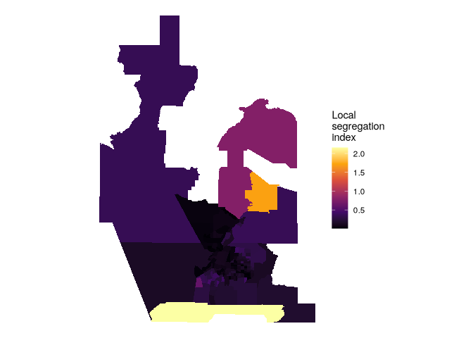
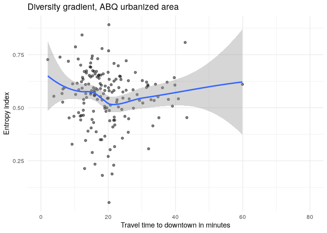

# Modeling segregation and diversity

``` r
library(tidycensus)
library(tidyverse)
```

    ## ── Attaching core tidyverse packages ──────────────────────── tidyverse 2.0.0 ──
    ## ✔ dplyr     1.1.4     ✔ readr     2.1.5
    ## ✔ forcats   1.0.0     ✔ stringr   1.5.1
    ## ✔ ggplot2   3.5.1     ✔ tibble    3.2.1
    ## ✔ lubridate 1.9.4     ✔ tidyr     1.3.1
    ## ✔ purrr     1.0.4     
    ## ── Conflicts ────────────────────────────────────────── tidyverse_conflicts() ──
    ## ✖ dplyr::filter() masks stats::filter()
    ## ✖ dplyr::lag()    masks stats::lag()
    ## ℹ Use the conflicted package (<http://conflicted.r-lib.org/>) to force all conflicts to become errors

``` r
library(segregation)
library(tigris)
```

    ## To enable caching of data, set `options(tigris_use_cache = TRUE)`
    ## in your R script or .Rprofile.

``` r
library(sf)
```

    ## Linking to GEOS 3.13.1, GDAL 3.10.2, PROJ 9.6.0; sf_use_s2() is TRUE

## Data Preparation

``` r
nm_acs_data <- get_acs(
  geography = "tract",
  variables = c(
    white = "B03002_003",
    black = "B03002_004",
    native = "B03002_005",
    asian = "B03002_006",
    hispanic = "B03002_012"
  ),
  state = "NM",
  geometry = T,
  year = 2019
)
```

    ## Getting data from the 2015-2019 5-year ACS

    ## Downloading feature geometry from the Census website.  To cache shapefiles for use in future sessions, set `options(tigris_use_cache = TRUE)`.

    ##   |                                                                              |                                                                      |   0%  |                                                                              |=                                                                     |   2%  |                                                                              |==                                                                    |   2%  |                                                                              |==                                                                    |   3%  |                                                                              |===                                                                   |   4%  |                                                                              |====                                                                  |   6%  |                                                                              |=====                                                                 |   7%  |                                                                              |=====                                                                 |   8%  |                                                                              |======                                                                |   8%  |                                                                              |======                                                                |   9%  |                                                                              |=======                                                               |  10%  |                                                                              |=======                                                               |  11%  |                                                                              |========                                                              |  12%  |                                                                              |=========                                                             |  12%  |                                                                              |=========                                                             |  13%  |                                                                              |==========                                                            |  14%  |                                                                              |==========                                                            |  15%  |                                                                              |===========                                                           |  15%  |                                                                              |===========                                                           |  16%  |                                                                              |============                                                          |  17%  |                                                                              |=============                                                         |  18%  |                                                                              |=============                                                         |  19%  |                                                                              |==============                                                        |  19%  |                                                                              |==============                                                        |  20%  |                                                                              |===============                                                       |  21%  |                                                                              |===============                                                       |  22%  |                                                                              |================                                                      |  22%  |                                                                              |================                                                      |  23%  |                                                                              |=================                                                     |  24%  |                                                                              |==================                                                    |  25%  |                                                                              |===================                                                   |  27%  |                                                                              |====================                                                  |  28%  |                                                                              |====================                                                  |  29%  |                                                                              |=====================                                                 |  30%  |                                                                              |======================                                                |  31%  |                                                                              |=======================                                               |  33%  |                                                                              |========================                                              |  34%  |                                                                              |=========================                                             |  35%  |                                                                              |=========================                                             |  36%  |                                                                              |==========================                                            |  37%  |                                                                              |==========================                                            |  38%  |                                                                              |============================                                          |  40%  |                                                                              |==============================                                        |  43%  |                                                                              |================================                                      |  46%  |                                                                              |==================================                                    |  49%  |                                                                              |====================================                                  |  52%  |                                                                              |======================================                                |  55%  |                                                                              |========================================                              |  58%  |                                                                              |===========================================                           |  61%  |                                                                              |=============================================                         |  64%  |                                                                              |===============================================                       |  67%  |                                                                              |=================================================                     |  69%  |                                                                              |===================================================                   |  72%  |                                                                              |=====================================================                 |  75%  |                                                                              |=======================================================               |  78%  |                                                                              |=========================================================             |  81%  |                                                                              |===========================================================           |  84%  |                                                                              |=============================================================         |  87%  |                                                                              |===============================================================       |  90%  |                                                                              |=================================================================     |  93%  |                                                                              |===================================================================   |  96%  |                                                                              |===================================================================== |  98%  |                                                                              |======================================================================| 100%

``` r
us_urban_areas <- get_acs(
  geography = "urban area",
  variables = "B01001_001",
  geometry = T,
  year = 2019,
  survey = "acs1"
) |> 
  filter(estimate >= 500000) |> 
  transmute(urban_name = str_remove(NAME,
                                    fixed(", NM Urbanized Area (2010)")))
```

    ## Getting data from the 2019 1-year ACS

    ## The 1-year ACS provides data for geographies with populations of 65,000 and greater.

    ## Downloading feature geometry from the Census website.  To cache shapefiles for use in future sessions, set `options(tigris_use_cache = TRUE)`.

    ##   |                                                                              |                                                                      |   0%  |                                                                              |                                                                      |   1%  |                                                                              |=                                                                     |   1%  |                                                                              |=                                                                     |   2%  |                                                                              |==                                                                    |   2%  |                                                                              |==                                                                    |   3%  |                                                                              |===                                                                   |   4%  |                                                                              |===                                                                   |   5%  |                                                                              |====                                                                  |   5%  |                                                                              |====                                                                  |   6%  |                                                                              |=====                                                                 |   7%  |                                                                              |=====                                                                 |   8%  |                                                                              |======                                                                |   8%  |                                                                              |======                                                                |   9%  |                                                                              |=======                                                               |   9%  |                                                                              |=======                                                               |  10%  |                                                                              |=======                                                               |  11%  |                                                                              |========                                                              |  11%  |                                                                              |========                                                              |  12%  |                                                                              |=========                                                             |  12%  |                                                                              |=========                                                             |  13%  |                                                                              |==========                                                            |  14%  |                                                                              |==========                                                            |  15%  |                                                                              |===========                                                           |  15%  |                                                                              |===========                                                           |  16%  |                                                                              |============                                                          |  17%  |                                                                              |============                                                          |  18%  |                                                                              |=============                                                         |  18%  |                                                                              |=============                                                         |  19%  |                                                                              |==============                                                        |  19%  |                                                                              |==============                                                        |  20%  |                                                                              |==============                                                        |  21%  |                                                                              |===============                                                       |  21%  |                                                                              |===============                                                       |  22%  |                                                                              |================                                                      |  22%  |                                                                              |================                                                      |  23%  |                                                                              |================                                                      |  24%  |                                                                              |=================                                                     |  24%  |                                                                              |=================                                                     |  25%  |                                                                              |==================                                                    |  25%  |                                                                              |==================                                                    |  26%  |                                                                              |===================                                                   |  26%  |                                                                              |===================                                                   |  27%  |                                                                              |===================                                                   |  28%  |                                                                              |====================                                                  |  28%  |                                                                              |====================                                                  |  29%  |                                                                              |=====================                                                 |  29%  |                                                                              |=====================                                                 |  30%  |                                                                              |=====================                                                 |  31%  |                                                                              |======================                                                |  31%  |                                                                              |======================                                                |  32%  |                                                                              |=======================                                               |  32%  |                                                                              |=======================                                               |  33%  |                                                                              |=======================                                               |  34%  |                                                                              |========================                                              |  34%  |                                                                              |========================                                              |  35%  |                                                                              |=========================                                             |  35%  |                                                                              |=========================                                             |  36%  |                                                                              |==========================                                            |  36%  |                                                                              |==========================                                            |  37%  |                                                                              |==========================                                            |  38%  |                                                                              |===========================                                           |  38%  |                                                                              |===========================                                           |  39%  |                                                                              |============================                                          |  39%  |                                                                              |============================                                          |  40%  |                                                                              |============================                                          |  41%  |                                                                              |=============================                                         |  41%  |                                                                              |=============================                                         |  42%  |                                                                              |==============================                                        |  42%  |                                                                              |==============================                                        |  43%  |                                                                              |==============================                                        |  44%  |                                                                              |===============================                                       |  44%  |                                                                              |===============================                                       |  45%  |                                                                              |================================                                      |  45%  |                                                                              |================================                                      |  46%  |                                                                              |=================================                                     |  46%  |                                                                              |=================================                                     |  47%  |                                                                              |=================================                                     |  48%  |                                                                              |==================================                                    |  48%  |                                                                              |==================================                                    |  49%  |                                                                              |===================================                                   |  49%  |                                                                              |===================================                                   |  50%  |                                                                              |===================================                                   |  51%  |                                                                              |====================================                                  |  51%  |                                                                              |====================================                                  |  52%  |                                                                              |=====================================                                 |  52%  |                                                                              |=====================================                                 |  53%  |                                                                              |=====================================                                 |  54%  |                                                                              |======================================                                |  54%  |                                                                              |======================================                                |  55%  |                                                                              |=======================================                               |  55%  |                                                                              |=======================================                               |  56%  |                                                                              |========================================                              |  56%  |                                                                              |========================================                              |  57%  |                                                                              |========================================                              |  58%  |                                                                              |=========================================                             |  58%  |                                                                              |=========================================                             |  59%  |                                                                              |==========================================                            |  59%  |                                                                              |==========================================                            |  60%  |                                                                              |==========================================                            |  61%  |                                                                              |===========================================                           |  61%  |                                                                              |===========================================                           |  62%  |                                                                              |============================================                          |  62%  |                                                                              |============================================                          |  63%  |                                                                              |============================================                          |  64%  |                                                                              |=============================================                         |  64%  |                                                                              |=============================================                         |  65%  |                                                                              |==============================================                        |  65%  |                                                                              |==============================================                        |  66%  |                                                                              |===============================================                       |  66%  |                                                                              |===============================================                       |  67%  |                                                                              |===============================================                       |  68%  |                                                                              |================================================                      |  68%  |                                                                              |================================================                      |  69%  |                                                                              |=================================================                     |  69%  |                                                                              |=================================================                     |  70%  |                                                                              |=================================================                     |  71%  |                                                                              |==================================================                    |  71%  |                                                                              |==================================================                    |  72%  |                                                                              |===================================================                   |  72%  |                                                                              |===================================================                   |  73%  |                                                                              |===================================================                   |  74%  |                                                                              |====================================================                  |  74%  |                                                                              |====================================================                  |  75%  |                                                                              |=====================================================                 |  75%  |                                                                              |=====================================================                 |  76%  |                                                                              |======================================================                |  76%  |                                                                              |======================================================                |  77%  |                                                                              |======================================================                |  78%  |                                                                              |=======================================================               |  78%  |                                                                              |=======================================================               |  79%  |                                                                              |========================================================              |  79%  |                                                                              |========================================================              |  80%  |                                                                              |========================================================              |  81%  |                                                                              |=========================================================             |  81%  |                                                                              |=========================================================             |  82%  |                                                                              |==========================================================            |  82%  |                                                                              |==========================================================            |  83%  |                                                                              |==========================================================            |  84%  |                                                                              |===========================================================           |  84%  |                                                                              |===========================================================           |  85%  |                                                                              |============================================================          |  85%  |                                                                              |============================================================          |  86%  |                                                                              |=============================================================         |  87%  |                                                                              |=============================================================         |  88%  |                                                                              |==============================================================        |  88%  |                                                                              |==============================================================        |  89%  |                                                                              |===============================================================       |  89%  |                                                                              |===============================================================       |  90%  |                                                                              |===============================================================       |  91%  |                                                                              |================================================================      |  91%  |                                                                              |================================================================      |  92%  |                                                                              |=================================================================     |  92%  |                                                                              |=================================================================     |  93%  |                                                                              |==================================================================    |  94%  |                                                                              |==================================================================    |  95%  |                                                                              |===================================================================   |  95%  |                                                                              |===================================================================   |  96%  |                                                                              |====================================================================  |  97%  |                                                                              |====================================================================  |  98%  |                                                                              |===================================================================== |  98%  |                                                                              |===================================================================== |  99%  |                                                                              |======================================================================|  99%  |                                                                              |======================================================================| 100%

> Join tracts and urbanized areas

``` r
nm_urban_data <- nm_acs_data |> 
  st_join(us_urban_areas, left = FALSE) |> 
  select(-NAME) |> 
  st_drop_geometry()
```

``` r
head(nm_urban_data)
```

    ##          GEOID variable estimate moe  urban_name
    ## 11 35001002402    white      502 156 Albuquerque
    ## 12 35001002402    black      300 342 Albuquerque
    ## 13 35001002402   native      483 409 Albuquerque
    ## 14 35001002402    asian       24  41 Albuquerque
    ## 15 35001002402 hispanic     6373 880 Albuquerque
    ## 31 35001000712    white     1868 295 Albuquerque

## Dissimilarity index

$$
D = \frac{1}{2}\sum_{i=1}^N\left| \frac{a_i}{A}-\frac{b_i}{B} \right|
$$

where ai represents the population of group A in a given areal unit i; A
is the total population of that group in the study region (e.g. a
metropolitan area); and bi and B are the equivalent metrics for the
second group. The index ranges from a low of 0 to a high of 1, where 0
represents perfect integration between the two groups and 1 represents
complete segregation. This index is implemented in the **segregation**
package with the
[`dissimilarity()`](https://elbersb.github.io/segregation/reference/dissimilarity.html)
function.

> Dissimilarity White and Hispanic in Albuquerque

``` r
nm_urban_data <- nm_urban_data |> 
  mutate(urban_name = str_remove(urban_name,
                                    fixed(", TX--NM Urbanized Area (2010)")))
```

``` r
nm_urban_data |> 
  filter(variable %in% c("white", "hispanic"),
         urban_name == "Albuquerque") |> 
  dissimilarity(
    group = "variable",
    unit = "GEOID",
    weight = "estimate"
  )
```

    ##      stat       est
    ##    <char>     <num>
    ## 1:      D 0.3522387

> The same exercise for SF-Oakland gives D = 0.5135526

``` r
nm_urban_data |> 
  filter(variable %in% c("white", "hispanic")) |>
  group_by(urban_name) |> 
  group_modify(~
    dissimilarity(.x,
      group = "variable",
      unit = "GEOID",
      weight = "estimate"
    )
  ) |> 
  arrange(desc(est))
```

    ## # A tibble: 2 × 3
    ## # Groups:   urban_name [2]
    ##   urban_name  stat    est
    ##   <chr>       <chr> <dbl>
    ## 1 El Paso     D     0.526
    ## 2 Albuquerque D     0.352

> El Paso is much more segregated than Albuquerque

## Multigroup segregation indices

Mutual Information Index $M$:

$$
M(\text{T}) = \sum_{u=1}^U \sum_{g=1}^G p_{ug}\log\frac{p_{ug}}{p_u p_g}
$$

where U is the total number of units u, G is the total number of groups
g, and pug is the joint probability of being in unit u and group g, with
pu and pg referring to unit and group probabilities.

Theil’s H:

$$
H(\text{T}) = \frac{M(\text{T})}{E(\text{T})}
$$

where E(T) is the entropy of T, normalizing H to range between values of
0 and 1.

``` r
mutual_within(
  data = nm_urban_data,
  group = "variable",
  unit = "GEOID",
  weight = "estimate",
  within = "urban_name",
  wide = T
)
```

    ## Key: <urban_name>
    ##     urban_name          M          p         H ent_ratio
    ##         <char>      <num>      <num>     <num>     <num>
    ## 1: Albuquerque 0.14852706 0.94826654 0.1432678  1.016980
    ## 2:     El Paso 0.04567688 0.05173346 0.1612313  0.277909

> Why are these results seemingly opposite of the single-group
> comparison?
>
> `mutual_local` breaks down the M into unit-level scores

``` r
abq_local_seg <-  nm_urban_data |> 
  filter(urban_name == "Albuquerque") |> 
  mutual_local(
    group = "variable",
    unit = "GEOID",
    weight = "estimate",
    wide = T
  )
head(abq_local_seg)
```

    ## Key: <GEOID>
    ##          GEOID         ls           p
    ##         <char>      <num>       <num>
    ## 1: 35001000107 0.27340399 0.003123126
    ## 2: 35001000108 0.14187996 0.003657345
    ## 3: 35001000109 0.15474486 0.003085885
    ## 4: 35001000110 0.09810773 0.004851632
    ## 5: 35001000111 0.16823423 0.003757511
    ## 6: 35001000112 0.21281609 0.002568360

``` r
abq_tracts_seg <- tracts("NM", cb = T, year = 2019) |> 
  inner_join(abq_local_seg, by = "GEOID")
```

``` r
abq_tracts_seg |> 
  ggplot(aes(fill = ls)) +
  geom_sf(color = NA) +
  coord_sf(crs = 32113) +
  scale_fill_viridis_c(option = "inferno") +
  theme_void() +
  labs(fill = "Local\nsegregation\nindex")
```

<!-- -->

## Diversity gradient

Expectation is that diversity decreases with distance from urban center.
The entropy index is

$$
E=\sum_{r=1}^n Q_r \ln\frac{1}{Q_r}
$$

where $Q_r$ is the proportion of group $r$’s proportion of the
population in the geographic unit.

``` r
abq_entropy <- nm_urban_data |> 
  filter(urban_name == "Albuquerque") |> 
  group_by(GEOID) |> 
  group_modify(~data.frame(entropy = entropy(
    data = .x,
    group = "variable",
    weight = "estimate",
    base = 5 # number of groups in the calculation
  )))

abq_entropy_geo <- tracts("NM", cb = T, year = 2019) |> 
  inner_join(abq_entropy, by = "GEOID")
```

> get driving times

``` r
library(mapboxapi)
```

    ## Usage of the Mapbox APIs is governed by the Mapbox Terms of Service.
    ## Please visit https://www.mapbox.com/legal/tos/ for more information.

``` r
abq_city_hall <- mb_geocode("City Hall, Albuquerque NM")

minutes_to_downtown <- mb_matrix(abq_entropy_geo, abq_city_hall)
```

    ## Splitting your matrix request into smaller chunks and re-assembling the result.

    ## Using feature centroids for origins

    ## ■■■■■■■■■ 25% | ETA: 3s ■■■■■■■■■■■■ 38% | ETA: 4s ■■■■■■■■■■■■■■■■ 50% | ETA:
    ## 3s ■■■■■■■■■■■■■■■■■■■■ 62% | ETA: 3s ■■■■■■■■■■■■■■■■■■■■■■■ 75% | ETA: 2s
    ## ■■■■■■■■■■■■■■■■■■■■■■■■■■■ 88% | ETA: 1s

``` r
abq_entropy_geo$minutes <- as.numeric(minutes_to_downtown)

ggplot(abq_entropy_geo, aes(x = minutes_to_downtown, y = entropy)) +
  geom_point(alpha = 0.5) +
  geom_smooth(method = "loess") +
  theme_minimal() +
  scale_x_continuous(limits = c(0, 80)) +
  labs(title = "Diversity gradient, ABQ urbanized area",
       x = "Travel time to downtown in minutes",
       y = "Entropy index")
```

    ## `geom_smooth()` using formula = 'y ~ x'

    ## Warning: Removed 2 rows containing non-finite outside the scale range
    ## (`stat_smooth()`).

    ## Warning: Removed 2 rows containing missing values or values outside the scale range
    ## (`geom_point()`).

<!-- -->

There seems to be no relationship to diversity and travel time.!
