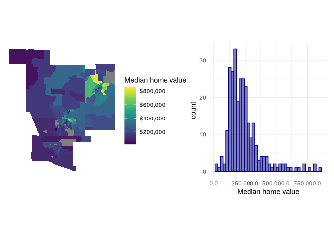
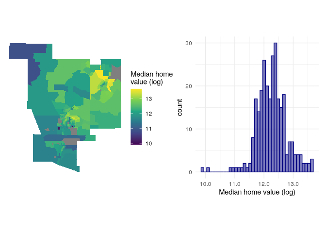
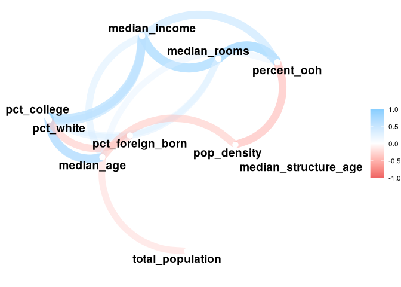
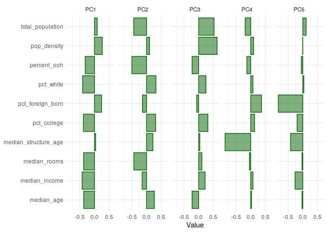
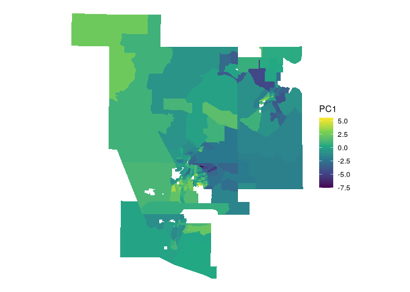

# 08.2-Regression Modeling Census Data

Demographic statistics are typically highly correlated, and spatial
information tends to be autocorrelated spatially, so many predictors are
not independent.

This exercise looks at median home values.

## Data setup and esda

``` r
library(tidycensus)
library(sf)
```

    ## Linking to GEOS 3.13.1, GDAL 3.10.2, PROJ 9.6.0; sf_use_s2() is TRUE

``` r
library(tidyverse)
```

    ## ── Attaching core tidyverse packages ──────────────────────── tidyverse 2.0.0 ──
    ## ✔ dplyr     1.1.4     ✔ readr     2.1.5
    ## ✔ forcats   1.0.0     ✔ stringr   1.5.1
    ## ✔ ggplot2   3.5.1     ✔ tibble    3.2.1
    ## ✔ lubridate 1.9.4     ✔ tidyr     1.3.1
    ## ✔ purrr     1.0.4

    ## ── Conflicts ────────────────────────────────────────── tidyverse_conflicts() ──
    ## ✖ dplyr::filter() masks stats::filter()
    ## ✖ dplyr::lag()    masks stats::lag()
    ## ℹ Use the conflicted package (<http://conflicted.r-lib.org/>) to force all conflicts to become errors

``` r
nm_counties <- c("Valencia", "Bernalillo","Sandoval", 
                 "Santa Fe", "Los Alamos")

variables_to_get <- c(
  median_value = "B25077_001",
  median_rooms = "B25018_001",
  median_income = "DP03_0062",
  total_population = "B01003_001",
  median_age = "B01002_001",
  pct_college = "DP02_0068P",
  pct_foreign_born = "DP02_0094P",
  pct_white = "DP05_0077P",
  median_year_built = "B25037_001",
  percent_ooh = "DP04_0046P"
)

abq_data <- get_acs(
  geography = "tract", 
  variables = variables_to_get,
  state = "NM",
  geometry = T,
  county = nm_counties,
  output = "wide",
  year = 2020
) |> 
  select(-NAME) |> 
  st_transform(32113)
```

    ## Getting data from the 2016-2020 5-year ACS
    ## Downloading feature geometry from the Census website.  To cache shapefiles for use in future sessions, set `options(tigris_use_cache = TRUE)`.
    ## Fetching data by table type ("B/C", "S", "DP") and combining the result.

    ##   |                                                                              |                                                                      |   0%  |                                                                              |=                                                                     |   1%  |                                                                              |=                                                                     |   2%  |                                                                              |==                                                                    |   2%  |                                                                              |==                                                                    |   3%  |                                                                              |==                                                                    |   4%  |                                                                              |===                                                                   |   4%  |                                                                              |===                                                                   |   5%  |                                                                              |====                                                                  |   5%  |                                                                              |====                                                                  |   6%  |                                                                              |=====                                                                 |   7%  |                                                                              |======                                                                |   9%  |                                                                              |=======                                                               |   9%  |                                                                              |=======                                                               |  10%  |                                                                              |=======                                                               |  11%  |                                                                              |========                                                              |  11%  |                                                                              |========                                                              |  12%  |                                                                              |=========                                                             |  13%  |                                                                              |==========                                                            |  14%  |                                                                              |==========                                                            |  15%  |                                                                              |===========                                                           |  16%  |                                                                              |============                                                          |  17%  |                                                                              |============                                                          |  18%  |                                                                              |=============                                                         |  18%  |                                                                              |=============                                                         |  19%  |                                                                              |==============                                                        |  20%  |                                                                              |===============                                                       |  21%  |                                                                              |================                                                      |  22%  |                                                                              |================                                                      |  23%  |                                                                              |=================                                                     |  24%  |                                                                              |==================                                                    |  25%  |                                                                              |==================                                                    |  26%  |                                                                              |===================                                                   |  27%  |                                                                              |====================                                                  |  28%  |                                                                              |====================                                                  |  29%  |                                                                              |=====================                                                 |  30%  |                                                                              |=======================                                               |  33%  |                                                                              |=========================                                             |  35%  |                                                                              |==========================                                            |  37%  |                                                                              |============================                                          |  40%  |                                                                              |=============================                                         |  42%  |                                                                              |===============================                                       |  44%  |                                                                              |=================================                                     |  47%  |                                                                              |==================================                                    |  49%  |                                                                              |====================================                                  |  51%  |                                                                              |======================================                                |  54%  |                                                                              |=======================================                               |  56%  |                                                                              |=========================================                             |  58%  |                                                                              |===========================================                           |  61%  |                                                                              |============================================                          |  63%  |                                                                              |==============================================                        |  66%  |                                                                              |================================================                      |  68%  |                                                                              |=================================================                     |  70%  |                                                                              |===================================================                   |  73%  |                                                                              |====================================================                  |  75%  |                                                                              |======================================================                |  77%  |                                                                              |========================================================              |  80%  |                                                                              |=========================================================             |  82%  |                                                                              |===========================================================           |  84%  |                                                                              |=============================================================         |  87%  |                                                                              |==============================================================        |  89%  |                                                                              |================================================================      |  91%  |                                                                              |==================================================================    |  94%  |                                                                              |===================================================================   |  96%  |                                                                              |===================================================================== |  98%  |                                                                              |======================================================================| 100%

``` r
head(abq_data)
```

    ## Simple feature collection with 6 features and 21 fields
    ## Geometry type: POLYGON
    ## Dimension:     XY
    ## Bounding box:  xmin: 474178.5 ymin: 454549.2 xmax: 479030.6 ymax: 458392.5
    ## Projected CRS: NAD83 / New Mexico Central
    ## # A tibble: 6 × 22
    ##   GEOID       median_valueE median_valueM median_roomsE median_roomsM
    ##   <chr>               <dbl>         <dbl>         <dbl>         <dbl>
    ## 1 35001000107        371700         17742           6.7           0.6
    ## 2 35001000108        236100         11071           4.9           1.2
    ## 3 35001000109        261500         10628           6.9           0.2
    ## 4 35001000110        217800          9528           4.7           0.5
    ## 5 35001000111        226100          8486           6.4           0.3
    ## 6 35001000112        283500         18244           6             0.4
    ## # ℹ 17 more variables: total_populationE <dbl>, total_populationM <dbl>,
    ## #   median_ageE <dbl>, median_ageM <dbl>, median_year_builtE <dbl>,
    ## #   median_year_builtM <dbl>, median_incomeE <dbl>, median_incomeM <dbl>,
    ## #   pct_collegeE <dbl>, pct_collegeM <dbl>, pct_foreign_bornE <dbl>,
    ## #   pct_foreign_bornM <dbl>, pct_whiteE <dbl>, pct_whiteM <dbl>,
    ## #   percent_oohE <dbl>, percent_oohM <dbl>, geometry <POLYGON [m]>

## Visualization

``` r
library(tidyverse)
library(patchwork)

mhv_map <- ggplot(abq_data, aes(fill = median_valueE)) +
  geom_sf(color = NA) +
  scale_fill_viridis_c(labels = scales::label_dollar()) +
  theme_void() +
  labs(fill = "Median home value")

mhv_histogram <- ggplot(abq_data, aes(x = median_valueE)) +
  geom_histogram(alpha = 0.5, fill = "navy", color = "navy",
                 bins = 40) +
  theme_minimal() +
  scale_x_continuous(labels = scales::label_number(accuracy = 0.1)) +
  labs(x = "Median home value")

mhv_map + mhv_histogram
```

    ## Warning: Removed 18 rows containing non-finite outside the scale range
    ## (`stat_bin()`).

<!-- -->

> to make the right-skewed distribution more normal, apply log
> transformation

``` r
mhv_map_log <- ggplot(abq_data, aes(fill = log(median_valueE))) +
  geom_sf(color = NA) +
  scale_fill_viridis_c() +
  theme_void() +
  labs(fill = "Median home\nvalue (log)")

mhv_histogram_log <- ggplot(abq_data, aes(x = log(median_valueE))) +
  geom_histogram(alpha = 0.5, fill = "navy", color = "navy",
                 bins = 40) +
  theme_minimal() +
  scale_x_continuous(labels = scales::label_number(accuracy = 0.1)) +
  labs(x = "Median home value (log)")

mhv_map_log + mhv_histogram_log
```

    ## Warning: Removed 18 rows containing non-finite outside the scale range
    ## (`stat_bin()`).

<!-- -->

## Feature engineering

> add population density and median age of housing structures

``` r
library(units)
```

    ## udunits database from /nix/store/ix91mbkvnbc5v50mvfxim62jibg3c4xl-r-units-0.8-5/library/units/share/udunits/udunits2.xml

``` r
abq_data_for_model <- abq_data |> 
  mutate(pop_density = as.numeric(set_units(total_populationE / st_area(geometry), "1/km2")),
         median_structure_age = 2018 - median_year_builtE)  |> 
    select(!ends_with("M")) |> 
  rename_with(.fn = ~str_remove(.x, "E$")) |> 
  na.omit()
```

``` r
head(abq_data_for_model, 3)
```

    ## Simple feature collection with 3 features and 13 fields
    ## Geometry type: POLYGON
    ## Dimension:     XY
    ## Bounding box:  xmin: 474178.5 ymin: 455756.7 xmax: 479030.6 ymax: 458392.5
    ## Projected CRS: NAD83 / New Mexico Central
    ## # A tibble: 3 × 14
    ##   GEOID  median_value median_rooms total_population median_age median_year_built
    ##   <chr>         <dbl>        <dbl>            <dbl>      <dbl>             <dbl>
    ## 1 35001…       371700          6.7             2489       54.7              1979
    ## 2 35001…       236100          4.9             2828       38.5              1975
    ## 3 35001…       261500          6.9             2321       48.5              1968
    ## # ℹ 8 more variables: median_income <dbl>, pct_college <dbl>,
    ## #   pct_foreign_born <dbl>, pct_white <dbl>, percent_ooh <dbl>,
    ## #   geometry <POLYGON [m]>, pop_density <dbl>, median_structure_age <dbl>

## First regression model

The formula can be supplied as a string or unquoted in the function
call.

``` r
formula <- "log(median_value) ~ median_rooms + median_income + pct_college + pct_foreign_born + pct_white + median_age + median_structure_age + percent_ooh + pop_density + total_population"

model1 <- lm(formula = formula, data = abq_data_for_model)

summary(model1)
```

    ## 
    ## Call:
    ## lm(formula = formula, data = abq_data_for_model)
    ## 
    ## Residuals:
    ##      Min       1Q   Median       3Q      Max 
    ## -1.35324 -0.11161  0.01791  0.13641  0.95129 
    ## 
    ## Coefficients:
    ##                        Estimate Std. Error t value Pr(>|t|)    
    ## (Intercept)           1.084e+01  1.629e-01  66.566  < 2e-16 ***
    ## median_rooms          3.927e-02  3.665e-02   1.071  0.28496    
    ## median_income         2.705e-06  1.187e-06   2.280  0.02340 *  
    ## pct_college           1.919e-02  1.787e-03  10.740  < 2e-16 ***
    ## pct_foreign_born     -6.087e-03  2.340e-03  -2.601  0.00981 ** 
    ## pct_white            -4.980e-03  1.675e-03  -2.973  0.00322 ** 
    ## median_age            1.643e-02  2.649e-03   6.203  2.1e-09 ***
    ## median_structure_age -7.824e-05  1.347e-04  -0.581  0.56173    
    ## percent_ooh          -1.485e-03  1.559e-03  -0.952  0.34192    
    ## pop_density          -3.051e-06  2.021e-05  -0.151  0.88013    
    ## total_population      9.461e-06  1.138e-05   0.831  0.40663    
    ## ---
    ## Signif. codes:  0 '***' 0.001 '**' 0.01 '*' 0.05 '.' 0.1 ' ' 1
    ## 
    ## Residual standard error: 0.2633 on 267 degrees of freedom
    ## Multiple R-squared:  0.7498, Adjusted R-squared:  0.7404 
    ## F-statistic:    80 on 10 and 267 DF,  p-value: < 2.2e-16

> percent going to college and median age are positively correlated,
> while percentage foreign born and non-hispanic white is negatively
> correlated. R2 value suggests that the model accounts for ~73% of the
> variance of median_value.
>
> Check for collinearity

``` r
library(corrr)

abq_estimates <- abq_data_for_model |> 
  select(-GEOID, -median_value, -median_year_built) |> 
  st_drop_geometry()

correlations <- correlate(abq_estimates, method = "pearson")
```

    ## Correlation computed with
    ## • Method: 'pearson'
    ## • Missing treated using: 'pairwise.complete.obs'

``` r
network_plot(correlations)
```

<!-- -->

Collinearity can be diagnosed further by calculating the *variance
inflation factor* (VIF) for the model, which takes into account not just
pairwise correlations but the extent to which predictors are collinear
with all other predictors. A VIF value of 1 indicates no collinearity;
VIF values above 5 suggest a level of collinearity that has a
problematic influence on model interpretation.

``` r
library(car)
```

    ## Loading required package: carData

    ## 
    ## Attaching package: 'car'

    ## The following object is masked from 'package:dplyr':
    ## 
    ##     recode

    ## The following object is masked from 'package:purrr':
    ## 
    ##     some

``` r
vif(model1)
```

    ##         median_rooms        median_income          pct_college 
    ##             4.623107             4.229291             4.482952 
    ##     pct_foreign_born            pct_white           median_age 
    ##             1.325880             4.796283             2.463857 
    ## median_structure_age          percent_ooh          pop_density 
    ##             1.039876             3.902300             1.726530 
    ##     total_population 
    ##             1.304286

None are above 5, otherwise can remove and re-run. I’ll remove the
highest.

``` r
formula2 <- "log(median_value) ~ median_income + pct_college + pct_foreign_born + pct_white + median_age + median_structure_age + percent_ooh + pop_density + total_population"

model2 <- lm(formula = formula2, data = abq_data_for_model)

summary(model2)
```

    ## 
    ## Call:
    ## lm(formula = formula2, data = abq_data_for_model)
    ## 
    ## Residuals:
    ##      Min       1Q   Median       3Q      Max 
    ## -1.34443 -0.12166  0.01455  0.14466  0.93794 
    ## 
    ## Coefficients:
    ##                        Estimate Std. Error t value Pr(>|t|)    
    ## (Intercept)           1.095e+01  1.291e-01  84.811  < 2e-16 ***
    ## median_income         3.311e-06  1.044e-06   3.172  0.00169 ** 
    ## pct_college           1.893e-02  1.770e-03  10.692  < 2e-16 ***
    ## pct_foreign_born     -6.451e-03  2.316e-03  -2.785  0.00573 ** 
    ## pct_white            -4.696e-03  1.654e-03  -2.838  0.00488 ** 
    ## median_age            1.620e-02  2.641e-03   6.135 3.04e-09 ***
    ## median_structure_age -9.379e-05  1.339e-04  -0.700  0.48430    
    ## percent_ooh          -4.578e-04  1.230e-03  -0.372  0.71012    
    ## pop_density           5.679e-07  1.993e-05   0.028  0.97729    
    ## total_population      1.117e-05  1.127e-05   0.990  0.32288    
    ## ---
    ## Signif. codes:  0 '***' 0.001 '**' 0.01 '*' 0.05 '.' 0.1 ' ' 1
    ## 
    ## Residual standard error: 0.2634 on 268 degrees of freedom
    ## Multiple R-squared:  0.7487, Adjusted R-squared:  0.7403 
    ## F-statistic: 88.71 on 9 and 268 DF,  p-value: < 2.2e-16

> R value doesn’t change but median_income becomes a stronger predictor.

``` r
vif(model2)
```

    ##        median_income          pct_college     pct_foreign_born 
    ##             3.270337             4.396543             1.298034 
    ##            pct_white           median_age median_structure_age 
    ##             4.675702             2.448224             1.027793 
    ##          percent_ooh          pop_density     total_population 
    ##             2.428313             1.678313             1.278799

## Dimension reduction (PCA)

``` r
pca <- prcomp(
  formula = ~.,
  data = abq_estimates,
  scale. = TRUE,
  center = TRUE
)

summary(pca)
```

    ## Importance of components:
    ##                           PC1    PC2    PC3    PC4     PC5     PC6     PC7
    ## Standard deviation     1.9643 1.3074 1.1091 1.0000 0.90214 0.73548 0.64834
    ## Proportion of Variance 0.3859 0.1709 0.1230 0.1000 0.08139 0.05409 0.04203
    ## Cumulative Proportion  0.3859 0.5568 0.6798 0.7798 0.86119 0.91528 0.95732
    ##                            PC8     PC9   PC10
    ## Standard deviation     0.41191 0.38361 0.3316
    ## Proportion of Variance 0.01697 0.01472 0.0110
    ## Cumulative Proportion  0.97429 0.98900 1.0000

> relate components back to variables

``` r
pca_tibble <- pca$rotation |> 
  as_tibble(rownames = "predictor")
pca_tibble
```

    ## # A tibble: 10 × 11
    ##    predictor         PC1    PC2     PC3     PC4      PC5     PC6     PC7     PC8
    ##    <chr>           <dbl>  <dbl>   <dbl>   <dbl>    <dbl>   <dbl>   <dbl>   <dbl>
    ##  1 median_rooms  -0.371  -0.435  0.109  -0.0456 -0.0277  -0.259  -0.212   0.175 
    ##  2 total_popula…  0.0928 -0.439  0.526  -0.190   0.114    0.670   0.137  -0.0818
    ##  3 median_age    -0.368   0.265 -0.225   0.0250 -0.0272   0.481  -0.572  -0.405 
    ##  4 median_income -0.424  -0.152  0.220   0.0760 -0.265   -0.272   0.235  -0.603 
    ##  5 pct_college   -0.380   0.308  0.315   0.131  -0.196    0.0269  0.333   0.105 
    ##  6 pct_foreign_…  0.241  -0.142 -0.0661  0.369  -0.836    0.207  -0.0775  0.157 
    ##  7 pct_white     -0.406   0.320  0.249   0.0753  0.0356   0.163  -0.0584  0.567 
    ##  8 percent_ooh   -0.316  -0.501 -0.224  -0.133  -0.0499  -0.0542 -0.256   0.269 
    ##  9 pop_density    0.265   0.102  0.629   0.0985 -0.00351 -0.319  -0.606  -0.0628
    ## 10 median_struc…  0.0394  0.214  0.0385 -0.877  -0.417   -0.0639 -0.0314  0.0274
    ## # ℹ 2 more variables: PC9 <dbl>, PC10 <dbl>

``` r
pca_tibble |> 
  select(predictor:PC5) |> 
  pivot_longer(PC1:PC5, names_to = "component", values_to = "value") |> 
  ggplot(aes(x = value, y = predictor)) +
  geom_col(fill = "darkgreen", color = "darkgreen", alpha = 0.5) +
  facet_wrap(~component, nrow = 1) +
  labs(y = NULL, x = "Value") +
  theme_minimal()
```

<!-- -->

`percent_ooh`, `pct_white`, `pct_college`, `median_rooms`,
`median_income` and `median_age` load negatively, `pop_density` and
`foregn_born` load positively.

``` r
components <- predict(pca, abq_estimates)

abq_pca <- abq_data_for_model |> 
  select(GEOID, median_value) |> 
  cbind(components)

ggplot(abq_pca, aes(fill = PC1)) +
  geom_sf(color = NA) +
  theme_void() +
  scale_fill_viridis_c()
```

<!-- -->

``` r
pca_formula <- paste0("log(median_value) ~ ",
                      paste0('PC', 1:6, collapse = ' + '))

pca_model <- lm(formula = pca_formula, data = abq_pca)

summary(pca_model)
```

    ## 
    ## Call:
    ## lm(formula = pca_formula, data = abq_pca)
    ## 
    ## Residuals:
    ##      Min       1Q   Median       3Q      Max 
    ## -1.66875 -0.14405 -0.00523  0.16635  1.07199 
    ## 
    ## Coefficients:
    ##              Estimate Std. Error t value Pr(>|t|)    
    ## (Intercept) 12.267085   0.017378 705.907  < 2e-16 ***
    ## PC1         -0.198483   0.008863 -22.395  < 2e-16 ***
    ## PC2          0.104493   0.013316   7.847 9.88e-14 ***
    ## PC3          0.088747   0.015697   5.654 3.98e-08 ***
    ## PC4          0.038798   0.017408   2.229   0.0267 *  
    ## PC5         -0.052349   0.019298  -2.713   0.0071 ** 
    ## PC6          0.040936   0.023671   1.729   0.0849 .  
    ## ---
    ## Signif. codes:  0 '***' 0.001 '**' 0.01 '*' 0.05 '.' 0.1 ' ' 1
    ## 
    ## Residual standard error: 0.2897 on 271 degrees of freedom
    ## Multiple R-squared:  0.6925, Adjusted R-squared:  0.6857 
    ## F-statistic: 101.7 on 6 and 271 DF,  p-value: < 2.2e-16
