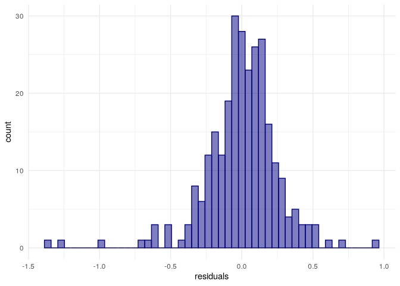
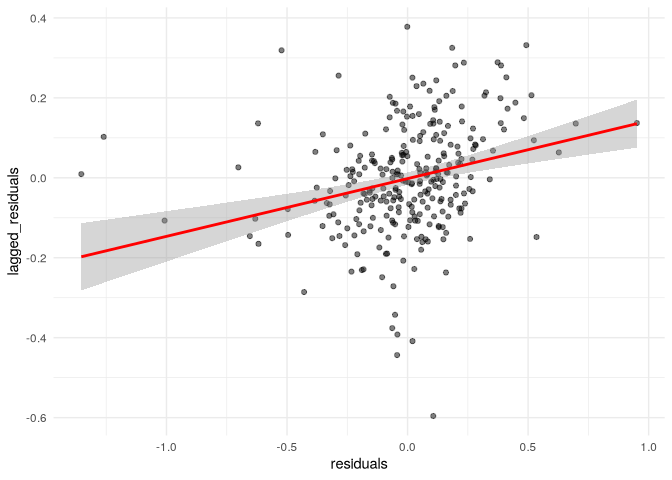

``` r
library(tidycensus)
library(tidyverse)
```

    ## ── Attaching core tidyverse packages ──────────────────────── tidyverse 2.0.0 ──
    ## ✔ dplyr     1.1.4     ✔ readr     2.1.5
    ## ✔ forcats   1.0.0     ✔ stringr   1.5.1
    ## ✔ ggplot2   3.5.1     ✔ tibble    3.2.1
    ## ✔ lubridate 1.9.4     ✔ tidyr     1.3.1
    ## ✔ purrr     1.0.4     
    ## ── Conflicts ────────────────────────────────────────── tidyverse_conflicts() ──
    ## ✖ dplyr::filter() masks stats::filter()
    ## ✖ dplyr::lag()    masks stats::lag()
    ## ℹ Use the conflicted package (<http://conflicted.r-lib.org/>) to force all conflicts to become errors

``` r
library(sf)
```

    ## Linking to GEOS 3.13.1, GDAL 3.10.2, PROJ 9.6.0; sf_use_s2() is TRUE

# Spatial regression

> check residuals for model

``` r
nm_counties <- c("Valencia", "Bernalillo","Sandoval", 
                 "Santa Fe", "Los Alamos")

variables_to_get <- c(
  median_value = "B25077_001",
  median_rooms = "B25018_001",
  median_income = "DP03_0062",
  total_population = "B01003_001",
  median_age = "B01002_001",
  pct_college = "DP02_0068P",
  pct_foreign_born = "DP02_0094P",
  pct_white = "DP05_0077P",
  median_year_built = "B25037_001",
  percent_ooh = "DP04_0046P"
)

abq_data <- get_acs(
  geography = "tract", 
  variables = variables_to_get,
  state = "NM",
  geometry = T,
  county = nm_counties,
  output = "wide",
  year = 2020
) |> 
  select(-NAME) |> 
  st_transform(32113)
```

    ## Getting data from the 2016-2020 5-year ACS

    ## Downloading feature geometry from the Census website.  To cache shapefiles for use in future sessions, set `options(tigris_use_cache = TRUE)`.

    ## Fetching data by table type ("B/C", "S", "DP") and combining the result.

    ##   |                                                                              |                                                                      |   0%  |                                                                              |=                                                                     |   1%  |                                                                              |=                                                                     |   2%  |                                                                              |==                                                                    |   3%  |                                                                              |==                                                                    |   4%  |                                                                              |===                                                                   |   4%  |                                                                              |===                                                                   |   5%  |                                                                              |====                                                                  |   6%  |                                                                              |=====                                                                 |   7%  |                                                                              |======                                                                |   8%  |                                                                              |======                                                                |   9%  |                                                                              |=======                                                               |   9%  |                                                                              |=======                                                               |  10%  |                                                                              |=======                                                               |  11%  |                                                                              |========                                                              |  11%  |                                                                              |========                                                              |  12%  |                                                                              |=========                                                             |  12%  |                                                                              |=========                                                             |  13%  |                                                                              |==========                                                            |  14%  |                                                                              |==========                                                            |  15%  |                                                                              |===========                                                           |  15%  |                                                                              |===========                                                           |  16%  |                                                                              |============                                                          |  17%  |                                                                              |============                                                          |  18%  |                                                                              |=============                                                         |  18%  |                                                                              |=============                                                         |  19%  |                                                                              |==============                                                        |  20%  |                                                                              |===============                                                       |  21%  |                                                                              |===============                                                       |  22%  |                                                                              |================                                                      |  23%  |                                                                              |=================                                                     |  24%  |                                                                              |==================                                                    |  25%  |                                                                              |==================                                                    |  26%  |                                                                              |===================                                                   |  28%  |                                                                              |====================                                                  |  28%  |                                                                              |====================                                                  |  29%  |                                                                              |=====================                                                 |  30%  |                                                                              |=======================                                               |  33%  |                                                                              |=========================                                             |  35%  |                                                                              |==========================                                            |  37%  |                                                                              |============================                                          |  40%  |                                                                              |=============================                                         |  42%  |                                                                              |===============================                                       |  44%  |                                                                              |=================================                                     |  47%  |                                                                              |==================================                                    |  49%  |                                                                              |====================================                                  |  51%  |                                                                              |======================================                                |  54%  |                                                                              |=======================================                               |  56%  |                                                                              |=========================================                             |  58%  |                                                                              |===========================================                           |  61%  |                                                                              |============================================                          |  63%  |                                                                              |==============================================                        |  66%  |                                                                              |================================================                      |  68%  |                                                                              |=================================================                     |  70%  |                                                                              |===================================================                   |  73%  |                                                                              |====================================================                  |  75%  |                                                                              |======================================================                |  77%  |                                                                              |========================================================              |  80%  |                                                                              |=========================================================             |  82%  |                                                                              |===========================================================           |  84%  |                                                                              |=============================================================         |  87%  |                                                                              |==============================================================        |  89%  |                                                                              |================================================================      |  91%  |                                                                              |==================================================================    |  94%  |                                                                              |===================================================================   |  96%  |                                                                              |===================================================================== |  98%  |                                                                              |======================================================================| 100%

``` r
library(units)
```

    ## udunits database from /nix/store/ix91mbkvnbc5v50mvfxim62jibg3c4xl-r-units-0.8-5/library/units/share/udunits/udunits2.xml

``` r
abq_data_for_model <- abq_data |> 
  mutate(pop_density = as.numeric(set_units(total_populationE / st_area(geometry), "1/km2")),
         median_structure_age = 2018 - median_year_builtE)  |> 
    select(!ends_with("M")) |> 
  rename_with(.fn = ~str_remove(.x, "E$")) |> 
  na.omit()

formula1 <- "log(median_value) ~ median_rooms + median_income + pct_college + pct_foreign_born + pct_white + median_age + median_structure_age + percent_ooh + pop_density + total_population"

model1 <- lm(formula = formula1, data = abq_data_for_model)

summary(model1)
```

    ## 
    ## Call:
    ## lm(formula = formula1, data = abq_data_for_model)
    ## 
    ## Residuals:
    ##      Min       1Q   Median       3Q      Max 
    ## -1.35324 -0.11161  0.01791  0.13641  0.95129 
    ## 
    ## Coefficients:
    ##                        Estimate Std. Error t value Pr(>|t|)    
    ## (Intercept)           1.084e+01  1.629e-01  66.566  < 2e-16 ***
    ## median_rooms          3.927e-02  3.665e-02   1.071  0.28496    
    ## median_income         2.705e-06  1.187e-06   2.280  0.02340 *  
    ## pct_college           1.919e-02  1.787e-03  10.740  < 2e-16 ***
    ## pct_foreign_born     -6.087e-03  2.340e-03  -2.601  0.00981 ** 
    ## pct_white            -4.980e-03  1.675e-03  -2.973  0.00322 ** 
    ## median_age            1.643e-02  2.649e-03   6.203  2.1e-09 ***
    ## median_structure_age -7.824e-05  1.347e-04  -0.581  0.56173    
    ## percent_ooh          -1.485e-03  1.559e-03  -0.952  0.34192    
    ## pop_density          -3.051e-06  2.021e-05  -0.151  0.88013    
    ## total_population      9.461e-06  1.138e-05   0.831  0.40663    
    ## ---
    ## Signif. codes:  0 '***' 0.001 '**' 0.01 '*' 0.05 '.' 0.1 ' ' 1
    ## 
    ## Residual standard error: 0.2633 on 267 degrees of freedom
    ## Multiple R-squared:  0.7498, Adjusted R-squared:  0.7404 
    ## F-statistic:    80 on 10 and 267 DF,  p-value: < 2.2e-16

``` r
abq_data_for_model$residuals <- residuals(model1)

ggplot(abq_data_for_model, aes(x = residuals)) +
  geom_histogram(bins = 50, alpha = 0.5, 
                 color = "navy", fill = "navy") +
  theme_minimal()
```

<!-- -->

> Evaluate the degree that the model’s performance depends on spatial
> autocorrelation

``` r
library(spdep)
```

    ## Loading required package: spData

    ## To access larger datasets in this package, install the spDataLarge
    ## package with: `install.packages('spDataLarge',
    ## repos='https://nowosad.github.io/drat/', type='source')`

``` r
wts <- abq_data_for_model |> 
  poly2nb() |> 
  nb2listw()

moran.test(abq_data_for_model$residuals, wts)
```

    ## 
    ##  Moran I test under randomisation
    ## 
    ## data:  abq_data_for_model$residuals  
    ## weights: wts    
    ## 
    ## Moran I statistic standard deviate = 4.2239, p-value = 1.2e-05
    ## alternative hypothesis: greater
    ## sample estimates:
    ## Moran I statistic       Expectation          Variance 
    ##       0.144484192      -0.003610108       0.001229262

> Low but statistically significant

``` r
abq_data_for_model$lagged_residuals <- lag.listw(wts, abq_data_for_model$residuals)

ggplot(abq_data_for_model, aes(x = residuals, y = lagged_residuals)) +
  theme_minimal() +
  geom_point(alpha = 0.5) +
  geom_smooth(method = "lm", color = "red")
```

    ## `geom_smooth()` using formula = 'y ~ x'

<!-- -->

> The residuals have positive autocorrelation, so must use spatial
> regression methods

## Spatial regression methods

> Spatial lag models account for \*spatial spillover effects\*, spatial
> error models include a spatial lag in the error term to account for
> spatial processes in the residuals.

### Spatial lag models

By including a spatial lag of the outcome variable, the model accounts
for spatial spillover effects.

$$
Y_i=\alpha+\rho Y_{lag−i}+\sum_k \beta_kX_{ki}+ϵ_i
$$ where

$$
Y_{lag−i}=\sum_j w_{ij}Y_j
$$

``` r
library(spatialreg)
```

    ## Loading required package: Matrix

    ## 
    ## Attaching package: 'Matrix'

    ## The following objects are masked from 'package:tidyr':
    ## 
    ##     expand, pack, unpack

    ## 
    ## Attaching package: 'spatialreg'

    ## The following objects are masked from 'package:spdep':
    ## 
    ##     get.ClusterOption, get.coresOption, get.mcOption,
    ##     get.VerboseOption, get.ZeroPolicyOption, set.ClusterOption,
    ##     set.coresOption, set.mcOption, set.VerboseOption,
    ##     set.ZeroPolicyOption

``` r
lag_model <- lagsarlm(
  formula = formula1,
  data = abq_data_for_model,
  listw = wts
)

summary(lag_model, Nagelkerke = TRUE)
```

    ## 
    ## Call:lagsarlm(formula = formula1, data = abq_data_for_model, listw = wts)
    ## 
    ## Residuals:
    ##      Min       1Q   Median       3Q      Max 
    ## -1.37695 -0.10198  0.01478  0.14316  0.92452 
    ## 
    ## Type: lag 
    ## Coefficients: (asymptotic standard errors) 
    ##                         Estimate  Std. Error z value  Pr(>|z|)
    ## (Intercept)           8.0992e+00  6.9261e-01 11.6937 < 2.2e-16
    ## median_rooms          4.6700e-02  3.4737e-02  1.3444  0.178824
    ## median_income         1.9963e-06  1.1376e-06  1.7549  0.079282
    ## pct_college           1.6914e-02  1.7695e-03  9.5585 < 2.2e-16
    ## pct_foreign_born     -5.2493e-03  2.2293e-03 -2.3547  0.018539
    ## pct_white            -4.5135e-03  1.5856e-03 -2.8467  0.004418
    ## median_age            1.3598e-02  2.5558e-03  5.3204 1.036e-07
    ## median_structure_age -3.9948e-05  1.2762e-04 -0.3130  0.754260
    ## percent_ooh          -7.4147e-04  1.4839e-03 -0.4997  0.617293
    ## pop_density           5.1361e-06  1.9181e-05  0.2678  0.788880
    ## total_population      1.0521e-05  1.0772e-05  0.9767  0.328704
    ## 
    ## Rho: 0.2324, LR test value: 16.732, p-value: 4.3058e-05
    ## Asymptotic standard error: 0.05717
    ##     z-value: 4.0651, p-value: 4.8017e-05
    ## Wald statistic: 16.525, p-value: 4.8017e-05
    ## 
    ## Log likelihood: -9.552758 for lag model
    ## ML residual variance (sigma squared): 0.062112, (sigma: 0.24922)
    ## Nagelkerke pseudo-R-squared: 0.76439 
    ## Number of observations: 278 
    ## Number of parameters estimated: 13 
    ## AIC: 45.106, (AIC for lm: 59.837)
    ## LM test for residual autocorrelation
    ## test value: 0.96815, p-value: 0.32514

Similar results but much less dramatic. Rho is positive and
statistically significant, indicative of spatial spillover effects.

### Spatial error models

$$
Y_i=\alpha + \sum_k \beta_kX_{ki}+u_i
$$

where

$$
u_i=\lambda u_{lag−i}+\epsilon
$$

and

$$
u_{lag−i}=\sum_j w_{ij}u_j
$$

``` r
error_model <- errorsarlm(
  formula = formula1,
  data = abq_data_for_model,
  listw = wts
)

summary(error_model, Nagelkirke = T)
```

    ## 
    ## Call:errorsarlm(formula = formula1, data = abq_data_for_model, listw = wts)
    ## 
    ## Residuals:
    ##       Min        1Q    Median        3Q       Max 
    ## -1.383558 -0.105179  0.019384  0.128205  0.931486 
    ## 
    ## Type: error 
    ## Coefficients: (asymptotic standard errors) 
    ##                         Estimate  Std. Error z value  Pr(>|z|)
    ## (Intercept)           1.0929e+01  1.6317e-01 66.9757 < 2.2e-16
    ## median_rooms          4.1894e-02  3.5408e-02  1.1832  0.236740
    ## median_income         2.4612e-06  1.1590e-06  2.1236  0.033704
    ## pct_college           1.8135e-02  1.8165e-03  9.9838 < 2.2e-16
    ## pct_foreign_born     -6.9087e-03  2.3626e-03 -2.9242  0.003453
    ## pct_white            -3.1129e-03  1.7269e-03 -1.8026  0.071457
    ## median_age            1.2647e-02  2.7310e-03  4.6310 3.639e-06
    ## median_structure_age -3.3358e-05  1.2498e-04 -0.2669  0.789534
    ## percent_ooh          -1.0656e-03  1.4999e-03 -0.7105  0.477409
    ## pop_density           2.3407e-06  2.1705e-05  0.1078  0.914123
    ## total_population      1.0590e-05  1.0933e-05  0.9686  0.332757
    ## 
    ## Lambda: 0.36729, LR test value: 15.763, p-value: 7.1791e-05
    ## Asymptotic standard error: 0.082357
    ##     z-value: 4.4597, p-value: 8.2061e-06
    ## Wald statistic: 19.889, p-value: 8.2061e-06
    ## 
    ## Log likelihood: -10.03704 for error model
    ## ML residual variance (sigma squared): 0.061358, (sigma: 0.24771)
    ## Number of observations: 278 
    ## Number of parameters estimated: 13 
    ## AIC: 46.074, (AIC for lm: 59.837)

> large and significant $\lambda$ illustrates the importance of
> accounting for spatial autocorrelation.

## Selecting the model

The two types of models can also be evaluated with respect to some
quantitative metrics. For example, we can re-compute Moran’s I over the
model residuals to see if the spatial model has resolved our problems
with spatial dependence

``` r
moran.test(lag_model$residuals, wts)
```

    ## 
    ##  Moran I test under randomisation
    ## 
    ## data:  lag_model$residuals  
    ## weights: wts    
    ## 
    ## Moran I statistic standard deviate = 0.88542, p-value = 0.188
    ## alternative hypothesis: greater
    ## sample estimates:
    ## Moran I statistic       Expectation          Variance 
    ##       0.027365373      -0.003610108       0.001223878

``` r
moran.test(error_model$residuals, wts)
```

    ## 
    ##  Moran I test under randomisation
    ## 
    ## data:  error_model$residuals  
    ## weights: wts    
    ## 
    ## Moran I statistic standard deviate = -0.45016, p-value = 0.6737
    ## alternative hypothesis: greater
    ## sample estimates:
    ## Moran I statistic       Expectation          Variance 
    ##      -0.019360238      -0.003610108       0.001224123

> Both models reduce Moran’s $I$, but the error model does better.

``` r
lm.RStests(
  model1,
  wts,
  test = c("LMerr", "LMlag", "RLMerr", "RLMlag")
)
```

    ## 
    ##  Rao's score (a.k.a Lagrange multiplier) diagnostics for spatial
    ##  dependence
    ## 
    ## data:  
    ## model: lm(formula = formula1, data = abq_data_for_model)
    ## test weights: wts
    ## 
    ## RSerr = 16.294, df = 1, p-value = 5.424e-05
    ## 
    ## 
    ##  Rao's score (a.k.a Lagrange multiplier) diagnostics for spatial
    ##  dependence
    ## 
    ## data:  
    ## model: lm(formula = formula1, data = abq_data_for_model)
    ## test weights: wts
    ## 
    ## RSlag = 18.807, df = 1, p-value = 1.446e-05
    ## 
    ## 
    ##  Rao's score (a.k.a Lagrange multiplier) diagnostics for spatial
    ##  dependence
    ## 
    ## data:  
    ## model: lm(formula = formula1, data = abq_data_for_model)
    ## test weights: wts
    ## 
    ## adjRSerr = 2.9398, df = 1, p-value = 0.08642
    ## 
    ## 
    ##  Rao's score (a.k.a Lagrange multiplier) diagnostics for spatial
    ##  dependence
    ## 
    ## data:  
    ## model: lm(formula = formula1, data = abq_data_for_model)
    ## test weights: wts
    ## 
    ## adjRSlag = 5.4533, df = 1, p-value = 0.01953

All are large an statistically significant.
