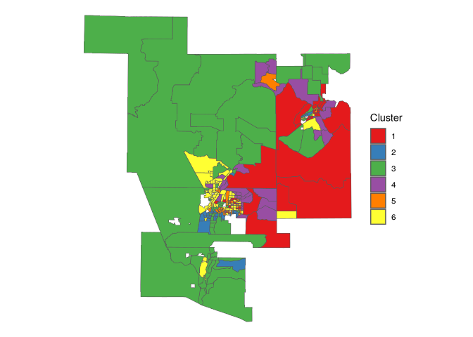
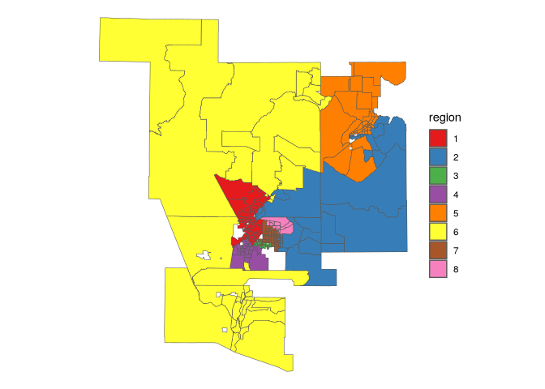

# Classification and clustering of ACS data

Two examples of unsupervised machine learning:

- *geodemographic classification*: identifying clusters based on
  demographic characteristics
- *regionalization*: partitioning into regions that are spatially
  contiguous and share demographic features

## Data prep

``` r
library(tidycensus)
library(tidyverse)
```

    ## ── Attaching core tidyverse packages ──────────────────────── tidyverse 2.0.0 ──
    ## ✔ dplyr     1.1.4     ✔ readr     2.1.5
    ## ✔ forcats   1.0.0     ✔ stringr   1.5.1
    ## ✔ ggplot2   3.5.1     ✔ tibble    3.2.1
    ## ✔ lubridate 1.9.4     ✔ tidyr     1.3.1
    ## ✔ purrr     1.0.4     
    ## ── Conflicts ────────────────────────────────────────── tidyverse_conflicts() ──
    ## ✖ dplyr::filter() masks stats::filter()
    ## ✖ dplyr::lag()    masks stats::lag()
    ## ℹ Use the conflicted package (<http://conflicted.r-lib.org/>) to force all conflicts to become errors

``` r
library(sf)
```

    ## Linking to GEOS 3.13.1, GDAL 3.10.2, PROJ 9.6.0; sf_use_s2() is TRUE

``` r
nm_counties <- c("Valencia", "Bernalillo","Sandoval", 
                 "Santa Fe", "Los Alamos")

variables_to_get <- c(
  median_value = "B25077_001",
  median_rooms = "B25018_001",
  median_income = "DP03_0062",
  total_population = "B01003_001",
  median_age = "B01002_001",
  pct_college = "DP02_0068P",
  pct_foreign_born = "DP02_0094P",
  pct_white = "DP05_0077P",
  median_year_built = "B25037_001",
  percent_ooh = "DP04_0046P"
)

abq_data <- get_acs(
  geography = "tract", 
  variables = variables_to_get,
  state = "NM",
  geometry = T,
  county = nm_counties,
  output = "wide",
  year = 2020
) |> 
  select(-NAME) |> 
  st_transform(32113)
```

    ## Getting data from the 2016-2020 5-year ACS
    ## Downloading feature geometry from the Census website.  To cache shapefiles for use in future sessions, set `options(tigris_use_cache = TRUE)`.
    ## Fetching data by table type ("B/C", "S", "DP") and combining the result.

    ##   |                                                                              |                                                                      |   0%  |                                                                              |=                                                                     |   1%  |                                                                              |=                                                                     |   2%  |                                                                              |==                                                                    |   2%  |                                                                              |==                                                                    |   3%  |                                                                              |==                                                                    |   4%  |                                                                              |===                                                                   |   4%  |                                                                              |===                                                                   |   5%  |                                                                              |====                                                                  |   6%  |                                                                              |=====                                                                 |   6%  |                                                                              |=====                                                                 |   7%  |                                                                              |======                                                                |   8%  |                                                                              |======                                                                |   9%  |                                                                              |=======                                                               |   9%  |                                                                              |=======                                                               |  10%  |                                                                              |========                                                              |  11%  |                                                                              |========                                                              |  12%  |                                                                              |=========                                                             |  12%  |                                                                              |=========                                                             |  13%  |                                                                              |==========                                                            |  14%  |                                                                              |==========                                                            |  15%  |                                                                              |===========                                                           |  15%  |                                                                              |===========                                                           |  16%  |                                                                              |============                                                          |  17%  |                                                                              |============                                                          |  18%  |                                                                              |=============                                                         |  18%  |                                                                              |=============                                                         |  19%  |                                                                              |==============                                                        |  20%  |                                                                              |===============                                                       |  21%  |                                                                              |================                                                      |  22%  |                                                                              |================                                                      |  23%  |                                                                              |=================                                                     |  24%  |                                                                              |==================                                                    |  25%  |                                                                              |==================                                                    |  26%  |                                                                              |===================                                                   |  28%  |                                                                              |====================                                                  |  28%  |                                                                              |====================                                                  |  29%  |                                                                              |=====================                                                 |  30%  |                                                                              |=======================                                               |  33%  |                                                                              |=========================                                             |  35%  |                                                                              |==========================                                            |  37%  |                                                                              |============================                                          |  40%  |                                                                              |=============================                                         |  42%  |                                                                              |===============================                                       |  44%  |                                                                              |=================================                                     |  47%  |                                                                              |==================================                                    |  49%  |                                                                              |====================================                                  |  51%  |                                                                              |======================================                                |  54%  |                                                                              |=======================================                               |  56%  |                                                                              |=========================================                             |  58%  |                                                                              |===========================================                           |  61%  |                                                                              |============================================                          |  63%  |                                                                              |==============================================                        |  66%  |                                                                              |================================================                      |  68%  |                                                                              |=================================================                     |  70%  |                                                                              |===================================================                   |  73%  |                                                                              |====================================================                  |  75%  |                                                                              |======================================================                |  77%  |                                                                              |========================================================              |  80%  |                                                                              |=========================================================             |  82%  |                                                                              |===========================================================           |  84%  |                                                                              |=============================================================         |  87%  |                                                                              |==============================================================        |  89%  |                                                                              |================================================================      |  91%  |                                                                              |==================================================================    |  94%  |                                                                              |===================================================================   |  96%  |                                                                              |===================================================================== |  98%  |                                                                              |======================================================================| 100%

``` r
library(units)
```

    ## udunits database from /nix/store/ix91mbkvnbc5v50mvfxim62jibg3c4xl-r-units-0.8-5/library/units/share/udunits/udunits2.xml

``` r
abq_data_for_model <- abq_data |> 
  mutate(pop_density = as.numeric(set_units(total_populationE / st_area(geometry), "1/km2")),
         median_structure_age = 2018 - median_year_builtE)  |> 
    select(!ends_with("M")) |> 
  rename_with(.fn = ~str_remove(.x, "E$")) |> 
  na.omit()

formula1 <- "log(median_value) ~ median_rooms + median_income + pct_college + pct_foreign_born + pct_white + median_age + median_structure_age + percent_ooh + pop_density + total_population"

model1 <- lm(formula = formula1, data = abq_data_for_model)
```

``` r
library(corrr)

abq_estimates <- abq_data_for_model |> 
  select(-GEOID, -median_value, -median_year_built) |> 
  st_drop_geometry()


pca <- prcomp(
  formula = ~.,
  data = abq_estimates,
  scale. = TRUE,
  center = TRUE
)

components <- predict(pca, abq_estimates)

abq_pca <- abq_data_for_model |> 
  select(GEOID, median_value) |> 
  cbind(components)
```

## Geodemographic classification

Involves dimension reduction followed by a clustering algorithm, in this
case K-means.

``` r
set.seed(1967)

abq_kmeans <- abq_pca |> 
  st_drop_geometry() |> 
  select(PC1:PC8) |> 
  kmeans(centers = 6)

table(abq_kmeans$cluster)
```

    ## 
    ##  1  2  3  4  5  6 
    ## 38 32 60 36 41 71

> explore the geographic space and variable space

``` r
abq_clusters <- abq_pca |> 
  mutate(cluster = as.character(abq_kmeans$cluster))

abq_clusters |> 
  ggplot(aes(fill = cluster)) +
  geom_sf(size = 0.1) +
  scale_fill_brewer(palette = "Set1") +
  theme_void() +
  labs(fill = "Cluster")
```

<!-- -->

``` r
library(plotly)

cluster_plot <- ggplot(abq_clusters,
                       aes(x = PC1, y = PC2,
                           color = cluster)) +
  geom_point() +
  scale_color_brewer(palette = "Set1") +
  theme_minimal()

ggplotly(cluster_plot) |> 
  layout(legend = list(orientation = "h", y = -0.15,
                       x = 0.2, title = "Cluster"))
```

## Spatial clustering and regionalization

Introducing spatial constraints. with the SKATER algorithm. SKATER
relies on the concept of *minimum spanning trees*, where a connectivity
graph is drawn between all observations in the dataset with graph edges
weighted by the attribute similarity between observations. The graph is
then “pruned” by removing edges that connect observations that are not
similar to one another.

``` r
library(spdep)
```

    ## Loading required package: spData

    ## To access larger datasets in this package, install the spDataLarge
    ## package with: `install.packages('spDataLarge',
    ## repos='https://nowosad.github.io/drat/', type='source')`

``` r
input_vars <- abq_pca |> 
  select(PC1:PC8) |> 
  st_drop_geometry() |> 
  as.data.frame()

skater_nbrs <- poly2nb(abq_pca, queen = T)
costs <- nbcosts(skater_nbrs, input_vars)
skater_weights <- nb2listw(skater_nbrs, costs, style = "B")
```

> Create the minimum spanning tree

``` r
mst <- mstree(skater_weights)

regions <- skater(
  mst[,1:2],
  input_vars,
  ncuts = 7, # creates ncuts + 1 regions
  crit = 10 # minimum tracts per region
)
```

``` r
abq_clusters$region <- as.character(regions$group)

abq_clusters |> 
  ggplot(aes(fill = region)) +
  geom_sf(size = 0.1) +
  scale_fill_brewer(palette = "Set1") +
  theme_void()
```

<!-- -->
