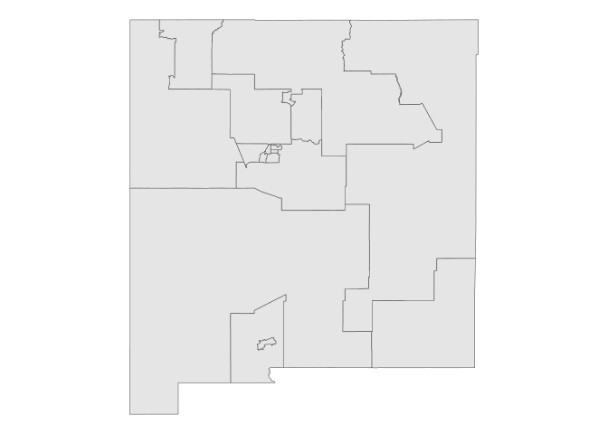

# Census Microdata

## Basic usage

``` r
library(tidycensus)
```

Request 1-year 2023 ACS with sex, age and household type

``` r
nm_pums <- get_pums(
  variables = c("SEX", "AGEP", "HHT"),
  state = "NM",
  survey = "acs1",
  year = 2023
)
```

    ## Getting data from the 2023 1-year ACS Public Use Microdata Sample

    ## Downloading: 16 kB     Downloading: 16 kB     Downloading: 32 kB     Downloading: 32 kB     Downloading: 48 kB     Downloading: 48 kB     Downloading: 65 kB     Downloading: 65 kB     Downloading: 65 kB     Downloading: 65 kB     Downloading: 74 kB     Downloading: 74 kB     Downloading: 74 kB     Downloading: 74 kB     Downloading: 110 kB     Downloading: 110 kB     Downloading: 110 kB     Downloading: 110 kB     Downloading: 120 kB     Downloading: 120 kB     Downloading: 120 kB     Downloading: 120 kB     Downloading: 150 kB     Downloading: 150 kB     Downloading: 160 kB     Downloading: 160 kB     Downloading: 170 kB     Downloading: 170 kB     Downloading: 180 kB     Downloading: 180 kB     Downloading: 180 kB     Downloading: 180 kB     Downloading: 210 kB     Downloading: 210 kB     Downloading: 210 kB     Downloading: 210 kB     Downloading: 230 kB     Downloading: 230 kB     Downloading: 240 kB     Downloading: 240 kB     Downloading: 240 kB     Downloading: 240 kB     Downloading: 260 kB     Downloading: 260 kB     Downloading: 260 kB     Downloading: 260 kB     Downloading: 280 kB     Downloading: 280 kB     Downloading: 280 kB     Downloading: 280 kB     Downloading: 290 kB     Downloading: 290 kB     Downloading: 290 kB     Downloading: 290 kB     Downloading: 310 kB     Downloading: 310 kB     Downloading: 310 kB     Downloading: 310 kB     Downloading: 330 kB     Downloading: 330 kB     Downloading: 340 kB     Downloading: 340 kB     Downloading: 360 kB     Downloading: 360 kB     Downloading: 360 kB     Downloading: 360 kB     Downloading: 380 kB     Downloading: 380 kB     Downloading: 380 kB     Downloading: 380 kB     Downloading: 410 kB     Downloading: 410 kB     Downloading: 410 kB     Downloading: 410 kB     Downloading: 420 kB     Downloading: 420 kB     Downloading: 420 kB     Downloading: 420 kB     Downloading: 420 kB     Downloading: 420 kB     Downloading: 440 kB     Downloading: 440 kB     Downloading: 440 kB     Downloading: 440 kB     Downloading: 470 kB     Downloading: 470 kB     Downloading: 470 kB     Downloading: 470 kB     Downloading: 470 kB     Downloading: 470 kB     Downloading: 490 kB     Downloading: 490 kB     Downloading: 490 kB     Downloading: 490 kB     Downloading: 490 kB     Downloading: 490 kB     Downloading: 500 kB     Downloading: 500 kB     Downloading: 500 kB     Downloading: 500 kB     Downloading: 500 kB     Downloading: 500 kB     Downloading: 550 kB     Downloading: 550 kB     Downloading: 550 kB     Downloading: 550 kB     Downloading: 560 kB     Downloading: 560 kB     Downloading: 560 kB     Downloading: 560 kB     Downloading: 570 kB     Downloading: 570 kB     Downloading: 570 kB     Downloading: 570 kB     Downloading: 600 kB     Downloading: 600 kB     Downloading: 600 kB     Downloading: 600 kB     Downloading: 620 kB     Downloading: 620 kB     Downloading: 620 kB     Downloading: 620 kB     Downloading: 640 kB     Downloading: 640 kB     Downloading: 640 kB     Downloading: 640 kB     Downloading: 670 kB     Downloading: 670 kB     Downloading: 690 kB     Downloading: 690 kB     Downloading: 690 kB     Downloading: 690 kB     Downloading: 690 kB     Downloading: 690 kB     Downloading: 690 kB     Downloading: 690 kB     Downloading: 700 kB     Downloading: 700 kB     Downloading: 700 kB     Downloading: 700 kB     Downloading: 700 kB     Downloading: 700 kB     Downloading: 730 kB     Downloading: 730 kB     Downloading: 730 kB     Downloading: 730 kB     Downloading: 750 kB     Downloading: 750 kB     Downloading: 750 kB     Downloading: 750 kB     Downloading: 750 kB     Downloading: 750 kB     Downloading: 760 kB     Downloading: 760 kB     Downloading: 760 kB     Downloading: 760 kB     Downloading: 760 kB     Downloading: 760 kB     Downloading: 760 kB     Downloading: 760 kB     Downloading: 800 kB     Downloading: 800 kB     Downloading: 800 kB     Downloading: 800 kB     Downloading: 800 kB     Downloading: 800 kB     Downloading: 810 kB     Downloading: 810 kB     Downloading: 810 kB     Downloading: 810 kB     Downloading: 810 kB     Downloading: 810 kB     Downloading: 810 kB     Downloading: 810 kB     Downloading: 830 kB     Downloading: 830 kB     Downloading: 830 kB     Downloading: 830 kB     Downloading: 830 kB     Downloading: 830 kB     Downloading: 830 kB     Downloading: 830 kB     Downloading: 860 kB     Downloading: 860 kB     Downloading: 880 kB     Downloading: 880 kB     Downloading: 880 kB     Downloading: 880 kB     Downloading: 880 kB     Downloading: 880 kB     Downloading: 880 kB     Downloading: 880 kB     Downloading: 900 kB     Downloading: 900 kB     Downloading: 900 kB     Downloading: 900 kB     Downloading: 900 kB     Downloading: 900 kB     Downloading: 910 kB     Downloading: 910 kB     Downloading: 920 kB     Downloading: 920 kB     Downloading: 920 kB     Downloading: 920 kB     Downloading: 940 kB     Downloading: 940 kB     Downloading: 940 kB     Downloading: 940 kB     Downloading: 940 kB     Downloading: 940 kB     Downloading: 960 kB     Downloading: 960 kB     Downloading: 960 kB     Downloading: 960 kB     Downloading: 960 kB     Downloading: 960 kB     Downloading: 960 kB     Downloading: 960 kB     Downloading: 960 kB     Downloading: 960 kB     Downloading: 970 kB     Downloading: 970 kB     Downloading: 970 kB     Downloading: 970 kB     Downloading: 990 kB     Downloading: 990 kB     Downloading: 1 MB     Downloading: 1 MB     Downloading: 1 MB     Downloading: 1 MB     Downloading: 1 MB     Downloading: 1 MB     Downloading: 1 MB     Downloading: 1 MB     Downloading: 1 MB     Downloading: 1 MB     Downloading: 1 MB     Downloading: 1 MB     Downloading: 1 MB     Downloading: 1 MB     Downloading: 1 MB     Downloading: 1 MB     Downloading: 1 MB     Downloading: 1 MB     Downloading: 1 MB     Downloading: 1 MB     Downloading: 1.1 MB     Downloading: 1.1 MB     Downloading: 1.1 MB     Downloading: 1.1 MB

``` r
head(nm_pums)
```

    ## # A tibble: 6 × 8
    ##   SERIALNO      SPORDER  WGTP PWGTP  AGEP STATE HHT   SEX  
    ##   <chr>           <dbl> <dbl> <dbl> <dbl> <chr> <chr> <chr>
    ## 1 2023GQ0000173       1     0    22    69 35    b     1    
    ## 2 2023GQ0000226       1     0    73    45 35    b     2    
    ## 3 2023GQ0000669       1     0    90    83 35    b     1    
    ## 4 2023GQ0001863       1     0    24    17 35    b     1    
    ## 5 2023GQ0001901       1     0    21    61 35    b     2    
    ## 6 2023GQ0002004       1     0   119    74 35    b     1

``` r
nrow(nm_pums)
```

    ## [1] 20737

- `SERIALNO`: a serial number that uniquely identifies households in the
  sample;
- `SPORDER`: the order of the person in the household, which when
  combined with `SERIALNO` uniquely identifies a person;
- `WGTP`: the household weight;
- `PWGTP`: the person weight;
- `ST`: the state FIPS code.

In general, the weights can be interpreted as the number of observations
represented by the row, so `PWGPT` is the number of people.

Inferences about population characteristics can be made by summing over
the weights columns. For example, let’s say we want to get an estimate
of the number of people in New Mexico who are 50 years old in 2019, and
compare this with the total population in New Mexico.

``` r
library(tidyverse)
```

    ## ── Attaching core tidyverse packages ──────────────────────── tidyverse 2.0.0 ──
    ## ✔ dplyr     1.1.4     ✔ readr     2.1.5
    ## ✔ forcats   1.0.0     ✔ stringr   1.5.1
    ## ✔ ggplot2   3.5.1     ✔ tibble    3.2.1
    ## ✔ lubridate 1.9.4     ✔ tidyr     1.3.1
    ## ✔ purrr     1.0.4     
    ## ── Conflicts ────────────────────────────────────────── tidyverse_conflicts() ──
    ## ✖ dplyr::filter() masks stats::filter()
    ## ✖ dplyr::lag()    masks stats::lag()
    ## ℹ Use the conflicted package (<http://conflicted.r-lib.org/>) to force all conflicts to become errors

``` r
nm_age_50 <- filter(nm_pums, AGEP == 50)

print(sum(nm_pums$PWGTP))
```

    ## [1] 2114371

``` r
print(sum(nm_age_50$PWGTP))
```

    ## [1] 22220

> There is a column for households and one for persons

``` r
nm_hh_example <- filter(nm_pums, SERIALNO == "2023HU0000811")
nm_hh_example
```

    ## # A tibble: 5 × 8
    ##   SERIALNO      SPORDER  WGTP PWGTP  AGEP STATE HHT   SEX  
    ##   <chr>           <dbl> <dbl> <dbl> <dbl> <chr> <chr> <chr>
    ## 1 2023HU0000811       1   236   236    37 35    1     1    
    ## 2 2023HU0000811       2   236    96    36 35    1     2    
    ## 3 2023HU0000811       3   236   103    16 35    1     1    
    ## 4 2023HU0000811       4   236   144     9 35    1     2    
    ## 5 2023HU0000811       5   236   187    21 35    1     2

Household includes two males ages 37 and 16, three females 37, 9 and 21.
HHT of 1 means married couple household.

To determine the number of households in the dataset, sum the WGTP
column per household.

``` r
nm_households <- filter(nm_pums, SPORDER == 1)

sum(nm_households$WGTP)
```

    ## [1] 856580

### Including vacant units

``` r
nm_with_vacant <- get_pums(
  variables = c("SEX", "AGEP", "HHT"),
  state = "NM",
  survey = "acs1",
  year = 2023,
  return_vacant = TRUE
) |> 
  arrange(VACS)
```

    ## Getting data from the 2023 1-year ACS Public Use Microdata Sample

    ## You have requested information on vacant units; setting `return_vacant` to TRUE

    ## Downloading: 7.6 kB     Downloading: 7.6 kB     Downloading: 24 kB     Downloading: 24 kB     Downloading: 32 kB     Downloading: 32 kB     Downloading: 32 kB     Downloading: 32 kB     Downloading: 40 kB     Downloading: 40 kB     Downloading: 48 kB     Downloading: 48 kB     Downloading: 57 kB     Downloading: 57 kB     Downloading: 57 kB     Downloading: 57 kB     Downloading: 65 kB     Downloading: 65 kB     Downloading: 73 kB     Downloading: 73 kB     Downloading: 73 kB     Downloading: 73 kB     Downloading: 81 kB     Downloading: 81 kB     Downloading: 81 kB     Downloading: 81 kB     Downloading: 110 kB     Downloading: 110 kB     Downloading: 110 kB     Downloading: 110 kB     Downloading: 110 kB     Downloading: 110 kB     Downloading: 110 kB     Downloading: 110 kB     Downloading: 110 kB     Downloading: 110 kB     Downloading: 120 kB     Downloading: 120 kB     Downloading: 140 kB     Downloading: 140 kB     Downloading: 160 kB     Downloading: 160 kB     Downloading: 170 kB     Downloading: 170 kB     Downloading: 190 kB     Downloading: 190 kB     Downloading: 190 kB     Downloading: 190 kB     Downloading: 200 kB     Downloading: 200 kB     Downloading: 200 kB     Downloading: 200 kB     Downloading: 220 kB     Downloading: 220 kB     Downloading: 240 kB     Downloading: 240 kB     Downloading: 250 kB     Downloading: 250 kB     Downloading: 250 kB     Downloading: 250 kB     Downloading: 270 kB     Downloading: 270 kB     Downloading: 290 kB     Downloading: 290 kB     Downloading: 290 kB     Downloading: 290 kB     Downloading: 290 kB     Downloading: 290 kB     Downloading: 300 kB     Downloading: 300 kB     Downloading: 300 kB     Downloading: 300 kB     Downloading: 320 kB     Downloading: 320 kB     Downloading: 320 kB     Downloading: 320 kB     Downloading: 340 kB     Downloading: 340 kB     Downloading: 350 kB     Downloading: 350 kB     Downloading: 350 kB     Downloading: 350 kB     Downloading: 350 kB     Downloading: 350 kB     Downloading: 350 kB     Downloading: 350 kB     Downloading: 350 kB     Downloading: 350 kB     Downloading: 350 kB     Downloading: 350 kB     Downloading: 370 kB     Downloading: 370 kB     Downloading: 370 kB     Downloading: 370 kB     Downloading: 380 kB     Downloading: 380 kB     Downloading: 400 kB     Downloading: 400 kB     Downloading: 410 kB     Downloading: 410 kB     Downloading: 410 kB     Downloading: 410 kB     Downloading: 410 kB     Downloading: 410 kB     Downloading: 410 kB     Downloading: 410 kB     Downloading: 450 kB     Downloading: 450 kB     Downloading: 450 kB     Downloading: 450 kB     Downloading: 450 kB     Downloading: 450 kB     Downloading: 450 kB     Downloading: 450 kB     Downloading: 480 kB     Downloading: 480 kB     Downloading: 480 kB     Downloading: 480 kB     Downloading: 500 kB     Downloading: 500 kB     Downloading: 510 kB     Downloading: 510 kB     Downloading: 510 kB     Downloading: 510 kB     Downloading: 510 kB     Downloading: 510 kB     Downloading: 530 kB     Downloading: 530 kB     Downloading: 540 kB     Downloading: 540 kB     Downloading: 540 kB     Downloading: 540 kB     Downloading: 540 kB     Downloading: 540 kB     Downloading: 540 kB     Downloading: 540 kB     Downloading: 540 kB     Downloading: 540 kB     Downloading: 560 kB     Downloading: 560 kB     Downloading: 560 kB     Downloading: 560 kB     Downloading: 580 kB     Downloading: 580 kB     Downloading: 580 kB     Downloading: 580 kB     Downloading: 580 kB     Downloading: 580 kB     Downloading: 580 kB     Downloading: 580 kB     Downloading: 590 kB     Downloading: 590 kB     Downloading: 590 kB     Downloading: 590 kB     Downloading: 610 kB     Downloading: 610 kB     Downloading: 610 kB     Downloading: 610 kB     Downloading: 610 kB     Downloading: 610 kB     Downloading: 610 kB     Downloading: 610 kB     Downloading: 610 kB     Downloading: 610 kB     Downloading: 610 kB     Downloading: 610 kB     Downloading: 630 kB     Downloading: 630 kB     Downloading: 640 kB     Downloading: 640 kB     Downloading: 640 kB     Downloading: 640 kB     Downloading: 640 kB     Downloading: 640 kB     Downloading: 640 kB     Downloading: 640 kB     Downloading: 640 kB     Downloading: 640 kB     Downloading: 660 kB     Downloading: 660 kB     Downloading: 660 kB     Downloading: 660 kB     Downloading: 680 kB     Downloading: 680 kB     Downloading: 680 kB     Downloading: 680 kB     Downloading: 680 kB     Downloading: 680 kB     Downloading: 680 kB     Downloading: 680 kB     Downloading: 680 kB     Downloading: 680 kB     Downloading: 680 kB     Downloading: 680 kB     Downloading: 680 kB     Downloading: 680 kB     Downloading: 690 kB     Downloading: 690 kB     Downloading: 690 kB     Downloading: 690 kB     Downloading: 710 kB     Downloading: 710 kB     Downloading: 710 kB     Downloading: 710 kB     Downloading: 720 kB     Downloading: 720 kB     Downloading: 720 kB     Downloading: 720 kB     Downloading: 740 kB     Downloading: 740 kB     Downloading: 740 kB     Downloading: 740 kB     Downloading: 740 kB     Downloading: 740 kB     Downloading: 760 kB     Downloading: 760 kB     Downloading: 760 kB     Downloading: 760 kB     Downloading: 760 kB     Downloading: 760 kB     Downloading: 770 kB     Downloading: 770 kB     Downloading: 770 kB     Downloading: 770 kB     Downloading: 790 kB     Downloading: 790 kB     Downloading: 790 kB     Downloading: 790 kB     Downloading: 790 kB     Downloading: 790 kB     Downloading: 790 kB     Downloading: 790 kB     Downloading: 800 kB     Downloading: 800 kB     Downloading: 800 kB     Downloading: 800 kB     Downloading: 800 kB     Downloading: 800 kB     Downloading: 800 kB     Downloading: 800 kB     Downloading: 800 kB     Downloading: 800 kB     Downloading: 820 kB     Downloading: 820 kB     Downloading: 820 kB     Downloading: 820 kB     Downloading: 820 kB     Downloading: 820 kB     Downloading: 840 kB     Downloading: 840 kB     Downloading: 840 kB     Downloading: 840 kB     Downloading: 850 kB     Downloading: 850 kB     Downloading: 850 kB     Downloading: 850 kB     Downloading: 850 kB     Downloading: 850 kB     Downloading: 870 kB     Downloading: 870 kB     Downloading: 870 kB     Downloading: 870 kB     Downloading: 870 kB     Downloading: 870 kB     Downloading: 870 kB     Downloading: 870 kB     Downloading: 890 kB     Downloading: 890 kB     Downloading: 890 kB     Downloading: 890 kB     Downloading: 890 kB     Downloading: 890 kB     Downloading: 900 kB     Downloading: 900 kB     Downloading: 920 kB     Downloading: 920 kB     Downloading: 920 kB     Downloading: 920 kB     Downloading: 920 kB     Downloading: 920 kB     Downloading: 940 kB     Downloading: 940 kB     Downloading: 940 kB     Downloading: 940 kB     Downloading: 940 kB     Downloading: 940 kB     Downloading: 960 kB     Downloading: 960 kB     Downloading: 960 kB     Downloading: 960 kB     Downloading: 960 kB     Downloading: 960 kB     Downloading: 960 kB     Downloading: 960 kB     Downloading: 960 kB     Downloading: 960 kB     Downloading: 990 kB     Downloading: 990 kB     Downloading: 990 kB     Downloading: 990 kB     Downloading: 990 kB     Downloading: 990 kB     Downloading: 990 kB     Downloading: 990 kB     Downloading: 1 MB     Downloading: 1 MB     Downloading: 1 MB     Downloading: 1 MB     Downloading: 1 MB     Downloading: 1 MB     Downloading: 1 MB     Downloading: 1 MB     Downloading: 1 MB     Downloading: 1 MB     Downloading: 1 MB     Downloading: 1 MB     Downloading: 1.1 MB     Downloading: 1.1 MB     Downloading: 1.1 MB     Downloading: 1.1 MB     Downloading: 1.1 MB     Downloading: 1.1 MB     Downloading: 1.1 MB     Downloading: 1.1 MB     Downloading: 1.1 MB     Downloading: 1.1 MB     Downloading: 1.1 MB     Downloading: 1.1 MB     Downloading: 1.1 MB     Downloading: 1.1 MB     Downloading: 1.1 MB     Downloading: 1.1 MB     Downloading: 1.1 MB     Downloading: 1.1 MB     Downloading: 1.1 MB     Downloading: 1.1 MB     Downloading: 1.1 MB     Downloading: 1.1 MB     Downloading: 1.1 MB     Downloading: 1.1 MB     Downloading: 1.2 MB     Downloading: 1.2 MB     Downloading: 1.2 MB     Downloading: 1.2 MB     Downloading: 3.7 kB     Downloading: 3.7 kB     Downloading: 12 kB     Downloading: 12 kB     Downloading: 43 kB     Downloading: 43 kB     Downloading: 43 kB     Downloading: 43 kB

``` r
head(nm_with_vacant)
```

    ## # A tibble: 6 × 9
    ##   SERIALNO      SPORDER  WGTP PWGTP  AGEP STATE VACS  HHT   SEX  
    ##   <chr>           <dbl> <dbl> <dbl> <dbl> <chr> <chr> <chr> <chr>
    ## 1 2023HU0016584      NA   377    NA    NA 35    1     b     <NA> 
    ## 2 2023HU0041166      NA   218    NA    NA 35    1     b     <NA> 
    ## 3 2023HU0045496      NA   335    NA    NA 35    1     b     <NA> 
    ## 4 2023HU0046652      NA   267    NA    NA 35    1     b     <NA> 
    ## 5 2023HU0050349      NA    48    NA    NA 35    1     b     <NA> 
    ## 6 2023HU0061970      NA   209    NA    NA 35    1     b     <NA>

Vacant housing units do not have person-level characteristics

## Working with PUMS variables

``` r
View(pums_variables)
```

- `var_code` gives you the variable codes that should be supplied to the
  `variables` parameter (as a character vector) in
  [`get_pums()`](https://walker-data.com/tidycensus/reference/get_pums.html).
  These variables will be represented in the columns of your output
  dataset.
- `var_label` is a more informative description of the variable’s topic.
- `data_type` is one of `"chr"`, for categorical variables that will be
  returned as R character strings, or `"num"`, for variables that will
  be returned as numeric.
- `val_min` and `val_max` provide information about the meaning of the
  data values. For categorical variables, these two columns will be the
  same; for numeric variables, they will give you the possible range of
  data values.
- `val_label` contains the value labels, which are particularly
  important for understanding the content of categorical variables.

### Recoding PUMS variables

Get additional contextual information

``` r
nm_pums_recoded <- get_pums(
  variables = c("SEX", "AGEP", "HHT"),
  state = "NM",
  survey = "acs1",
  year = 2023,
  recode = TRUE
)
```

    ## Getting data from the 2023 1-year ACS Public Use Microdata Sample

    ## Downloading: 24 kB     Downloading: 24 kB     Downloading: 57 kB     Downloading: 57 kB     Downloading: 57 kB     Downloading: 57 kB     Downloading: 64 kB     Downloading: 64 kB     Downloading: 65 kB     Downloading: 65 kB     Downloading: 98 kB     Downloading: 98 kB     Downloading: 110 kB     Downloading: 110 kB     Downloading: 110 kB     Downloading: 110 kB     Downloading: 120 kB     Downloading: 120 kB     Downloading: 120 kB     Downloading: 120 kB     Downloading: 140 kB     Downloading: 140 kB     Downloading: 170 kB     Downloading: 170 kB     Downloading: 170 kB     Downloading: 170 kB     Downloading: 190 kB     Downloading: 190 kB     Downloading: 190 kB     Downloading: 190 kB     Downloading: 190 kB     Downloading: 190 kB     Downloading: 190 kB     Downloading: 190 kB     Downloading: 200 kB     Downloading: 200 kB     Downloading: 200 kB     Downloading: 200 kB     Downloading: 220 kB     Downloading: 220 kB     Downloading: 220 kB     Downloading: 220 kB     Downloading: 240 kB     Downloading: 240 kB     Downloading: 240 kB     Downloading: 240 kB     Downloading: 250 kB     Downloading: 250 kB     Downloading: 250 kB     Downloading: 250 kB     Downloading: 250 kB     Downloading: 250 kB     Downloading: 270 kB     Downloading: 270 kB     Downloading: 290 kB     Downloading: 290 kB     Downloading: 290 kB     Downloading: 290 kB     Downloading: 300 kB     Downloading: 300 kB     Downloading: 300 kB     Downloading: 300 kB     Downloading: 300 kB     Downloading: 300 kB     Downloading: 300 kB     Downloading: 300 kB     Downloading: 300 kB     Downloading: 300 kB     Downloading: 320 kB     Downloading: 320 kB     Downloading: 320 kB     Downloading: 320 kB     Downloading: 350 kB     Downloading: 350 kB     Downloading: 350 kB     Downloading: 350 kB     Downloading: 350 kB     Downloading: 350 kB     Downloading: 370 kB     Downloading: 370 kB     Downloading: 370 kB     Downloading: 370 kB     Downloading: 380 kB     Downloading: 380 kB     Downloading: 380 kB     Downloading: 380 kB     Downloading: 410 kB     Downloading: 410 kB     Downloading: 410 kB     Downloading: 410 kB     Downloading: 430 kB     Downloading: 430 kB     Downloading: 450 kB     Downloading: 450 kB     Downloading: 450 kB     Downloading: 450 kB     Downloading: 450 kB     Downloading: 450 kB     Downloading: 450 kB     Downloading: 450 kB     Downloading: 450 kB     Downloading: 450 kB     Downloading: 480 kB     Downloading: 480 kB     Downloading: 480 kB     Downloading: 480 kB     Downloading: 500 kB     Downloading: 500 kB     Downloading: 500 kB     Downloading: 500 kB     Downloading: 500 kB     Downloading: 500 kB     Downloading: 510 kB     Downloading: 510 kB     Downloading: 510 kB     Downloading: 510 kB     Downloading: 510 kB     Downloading: 510 kB     Downloading: 510 kB     Downloading: 510 kB     Downloading: 530 kB     Downloading: 530 kB     Downloading: 540 kB     Downloading: 540 kB     Downloading: 540 kB     Downloading: 540 kB     Downloading: 540 kB     Downloading: 540 kB     Downloading: 540 kB     Downloading: 540 kB     Downloading: 560 kB     Downloading: 560 kB     Downloading: 560 kB     Downloading: 560 kB     Downloading: 580 kB     Downloading: 580 kB     Downloading: 580 kB     Downloading: 580 kB     Downloading: 580 kB     Downloading: 580 kB     Downloading: 590 kB     Downloading: 590 kB     Downloading: 590 kB     Downloading: 590 kB     Downloading: 600 kB     Downloading: 600 kB     Downloading: 600 kB     Downloading: 600 kB     Downloading: 600 kB     Downloading: 600 kB     Downloading: 600 kB     Downloading: 600 kB     Downloading: 620 kB     Downloading: 620 kB     Downloading: 640 kB     Downloading: 640 kB     Downloading: 640 kB     Downloading: 640 kB     Downloading: 640 kB     Downloading: 640 kB     Downloading: 640 kB     Downloading: 640 kB     Downloading: 640 kB     Downloading: 640 kB     Downloading: 640 kB     Downloading: 640 kB     Downloading: 640 kB     Downloading: 640 kB     Downloading: 650 kB     Downloading: 650 kB     Downloading: 650 kB     Downloading: 650 kB     Downloading: 650 kB     Downloading: 650 kB     Downloading: 670 kB     Downloading: 670 kB     Downloading: 670 kB     Downloading: 670 kB     Downloading: 670 kB     Downloading: 670 kB     Downloading: 690 kB     Downloading: 690 kB     Downloading: 690 kB     Downloading: 690 kB     Downloading: 690 kB     Downloading: 690 kB     Downloading: 700 kB     Downloading: 700 kB     Downloading: 700 kB     Downloading: 700 kB     Downloading: 700 kB     Downloading: 700 kB     Downloading: 700 kB     Downloading: 700 kB     Downloading: 700 kB     Downloading: 700 kB     Downloading: 700 kB     Downloading: 700 kB     Downloading: 720 kB     Downloading: 720 kB     Downloading: 720 kB     Downloading: 720 kB     Downloading: 740 kB     Downloading: 740 kB     Downloading: 740 kB     Downloading: 740 kB     Downloading: 750 kB     Downloading: 750 kB     Downloading: 770 kB     Downloading: 770 kB     Downloading: 770 kB     Downloading: 770 kB     Downloading: 770 kB     Downloading: 770 kB     Downloading: 770 kB     Downloading: 770 kB     Downloading: 770 kB     Downloading: 770 kB     Downloading: 790 kB     Downloading: 790 kB     Downloading: 790 kB     Downloading: 790 kB     Downloading: 810 kB     Downloading: 810 kB     Downloading: 810 kB     Downloading: 810 kB     Downloading: 830 kB     Downloading: 830 kB     Downloading: 830 kB     Downloading: 830 kB     Downloading: 830 kB     Downloading: 830 kB     Downloading: 830 kB     Downloading: 830 kB     Downloading: 830 kB     Downloading: 830 kB     Downloading: 850 kB     Downloading: 850 kB     Downloading: 850 kB     Downloading: 850 kB     Downloading: 850 kB     Downloading: 850 kB     Downloading: 880 kB     Downloading: 880 kB     Downloading: 880 kB     Downloading: 880 kB     Downloading: 880 kB     Downloading: 880 kB     Downloading: 880 kB     Downloading: 880 kB     Downloading: 890 kB     Downloading: 890 kB     Downloading: 890 kB     Downloading: 890 kB     Downloading: 890 kB     Downloading: 890 kB     Downloading: 890 kB     Downloading: 890 kB     Downloading: 890 kB     Downloading: 890 kB     Downloading: 910 kB     Downloading: 910 kB     Downloading: 930 kB     Downloading: 930 kB     Downloading: 940 kB     Downloading: 940 kB     Downloading: 960 kB     Downloading: 960 kB     Downloading: 960 kB     Downloading: 960 kB     Downloading: 960 kB     Downloading: 960 kB     Downloading: 960 kB     Downloading: 960 kB     Downloading: 960 kB     Downloading: 960 kB     Downloading: 960 kB     Downloading: 960 kB     Downloading: 980 kB     Downloading: 980 kB     Downloading: 1,000 kB     Downloading: 1,000 kB     Downloading: 1,000 kB     Downloading: 1,000 kB     Downloading: 1 MB     Downloading: 1 MB     Downloading: 1 MB     Downloading: 1 MB     Downloading: 1 MB     Downloading: 1 MB     Downloading: 1 MB     Downloading: 1 MB     Downloading: 1 MB     Downloading: 1 MB     Downloading: 1 MB     Downloading: 1 MB     Downloading: 1 MB     Downloading: 1 MB     Downloading: 1.1 MB     Downloading: 1.1 MB     Downloading: 1.1 MB     Downloading: 1.1 MB

``` r
head(nm_pums_recoded)
```

    ## # A tibble: 6 × 11
    ##   SERIALNO     SPORDER  WGTP PWGTP  AGEP STATE HHT   SEX   STATE_label HHT_label
    ##   <chr>          <dbl> <dbl> <dbl> <dbl> <chr> <chr> <chr> <ord>       <ord>    
    ## 1 2023HU09468…       1    61    61    64 35    1     1     New Mexico… Married …
    ## 2 2023HU09468…       2    61    51    62 35    1     2     New Mexico… Married …
    ## 3 2023HU09468…       3    61    86     6 35    1     1     New Mexico… Married …
    ## 4 2023HU09469…       1    19    20    62 35    1     1     New Mexico… Married …
    ## 5 2023HU09469…       2    19    17    63 35    1     2     New Mexico… Married …
    ## 6 2023HU09469…       1    93    93    74 35    6     2     New Mexico… Nonfamil…
    ## # ℹ 1 more variable: SEX_label <ord>

### Variable filters

To reduce the size of the data returned, can subset by filtering
variables. For example to return only women between 30 and 49 from
5-year PUMS

``` r
nm_pums_filtered <- get_pums(
  variables = c("SEX", "AGEP", "HHT"),
  state = "NM",
  survey = "acs5",
  variables_filter = list(
    SEX = 2,
    AGEP = 30:49
  ),
  year = 2023
)
```

    ## Getting data from the 2019-2023 5-year ACS Public Use Microdata Sample

    ## Downloading: 16 kB     Downloading: 16 kB     Downloading: 24 kB     Downloading: 24 kB     Downloading: 24 kB     Downloading: 24 kB     Downloading: 32 kB     Downloading: 32 kB     Downloading: 32 kB     Downloading: 32 kB     Downloading: 48 kB     Downloading: 48 kB     Downloading: 48 kB     Downloading: 48 kB     Downloading: 65 kB     Downloading: 65 kB     Downloading: 65 kB     Downloading: 65 kB     Downloading: 73 kB     Downloading: 73 kB     Downloading: 73 kB     Downloading: 73 kB     Downloading: 89 kB     Downloading: 89 kB     Downloading: 98 kB     Downloading: 98 kB     Downloading: 110 kB     Downloading: 110 kB     Downloading: 110 kB     Downloading: 110 kB     Downloading: 130 kB     Downloading: 130 kB     Downloading: 130 kB     Downloading: 130 kB     Downloading: 150 kB     Downloading: 150 kB     Downloading: 150 kB     Downloading: 150 kB     Downloading: 150 kB     Downloading: 150 kB     Downloading: 150 kB     Downloading: 150 kB     Downloading: 170 kB     Downloading: 170 kB     Downloading: 170 kB     Downloading: 170 kB     Downloading: 200 kB     Downloading: 200 kB     Downloading: 200 kB     Downloading: 200 kB     Downloading: 200 kB     Downloading: 200 kB     Downloading: 220 kB     Downloading: 220 kB     Downloading: 220 kB     Downloading: 220 kB     Downloading: 230 kB     Downloading: 230 kB     Downloading: 230 kB     Downloading: 230 kB     Downloading: 230 kB     Downloading: 230 kB     Downloading: 250 kB     Downloading: 250 kB     Downloading: 270 kB     Downloading: 270 kB     Downloading: 270 kB     Downloading: 270 kB     Downloading: 280 kB     Downloading: 280 kB     Downloading: 280 kB     Downloading: 280 kB     Downloading: 300 kB     Downloading: 300 kB     Downloading: 300 kB     Downloading: 300 kB     Downloading: 320 kB     Downloading: 320 kB     Downloading: 330 kB     Downloading: 330 kB     Downloading: 330 kB     Downloading: 330 kB     Downloading: 330 kB     Downloading: 330 kB     Downloading: 350 kB     Downloading: 350 kB     Downloading: 350 kB     Downloading: 350 kB     Downloading: 370 kB     Downloading: 370 kB     Downloading: 370 kB     Downloading: 370 kB     Downloading: 370 kB     Downloading: 370 kB     Downloading: 370 kB     Downloading: 370 kB     Downloading: 390 kB     Downloading: 390 kB     Downloading: 400 kB     Downloading: 400 kB     Downloading: 400 kB     Downloading: 400 kB     Downloading: 400 kB     Downloading: 400 kB     Downloading: 400 kB     Downloading: 400 kB     Downloading: 400 kB     Downloading: 400 kB     Downloading: 400 kB     Downloading: 400 kB     Downloading: 420 kB     Downloading: 420 kB     Downloading: 420 kB     Downloading: 420 kB     Downloading: 440 kB     Downloading: 440 kB     Downloading: 440 kB     Downloading: 440 kB     Downloading: 440 kB     Downloading: 440 kB     Downloading: 450 kB     Downloading: 450 kB     Downloading: 470 kB     Downloading: 470 kB     Downloading: 470 kB     Downloading: 470 kB     Downloading: 470 kB     Downloading: 470 kB     Downloading: 470 kB     Downloading: 470 kB     Downloading: 490 kB     Downloading: 490 kB     Downloading: 500 kB     Downloading: 500 kB     Downloading: 500 kB     Downloading: 500 kB     Downloading: 500 kB     Downloading: 500 kB     Downloading: 500 kB     Downloading: 500 kB     Downloading: 510 kB     Downloading: 510 kB     Downloading: 510 kB     Downloading: 510 kB     Downloading: 520 kB     Downloading: 520 kB     Downloading: 530 kB     Downloading: 530 kB     Downloading: 530 kB     Downloading: 530 kB

``` r
head(nm_pums_filtered)
```

    ## # A tibble: 6 × 8
    ##   SERIALNO      SPORDER  WGTP PWGTP  AGEP STATE HHT   SEX  
    ##   <chr>           <dbl> <dbl> <dbl> <dbl> <chr> <chr> <chr>
    ## 1 2020HU0869372       1     3     3    49 35    1     2    
    ## 2 2020HU0869372       2     3     1    37 35    1     2    
    ## 3 2020HU0870204       1    28    28    37 35    1     2    
    ## 4 2020HU0870541       2   118    68    32 35    2     2    
    ## 5 2020HU0870702       1     4     3    30 35    3     2    
    ## 6 2020HU0870775       1     2     2    44 35    1     2

``` r
wy_pums_filtered <- get_pums(
  variables = c("SEX", "AGEP", "HHT"),
  state = "WY",
  survey = "acs5",
  variables_filter = list(
    SEX = 2,
    AGEP = 30:49
  ),
  year = 2019
)
```

    ## Getting data from the 2015-2019 5-year ACS Public Use Microdata Sample

    ## Downloading: 7.6 kB     Downloading: 7.6 kB     Downloading: 7.6 kB     Downloading: 7.6 kB     Downloading: 16 kB     Downloading: 16 kB     Downloading: 24 kB     Downloading: 24 kB     Downloading: 24 kB     Downloading: 24 kB     Downloading: 32 kB     Downloading: 32 kB     Downloading: 48 kB     Downloading: 48 kB     Downloading: 48 kB     Downloading: 48 kB     Downloading: 48 kB     Downloading: 48 kB     Downloading: 57 kB     Downloading: 57 kB     Downloading: 57 kB     Downloading: 57 kB     Downloading: 73 kB     Downloading: 73 kB     Downloading: 73 kB     Downloading: 73 kB     Downloading: 81 kB     Downloading: 81 kB     Downloading: 81 kB     Downloading: 81 kB     Downloading: 89 kB     Downloading: 89 kB     Downloading: 89 kB     Downloading: 89 kB     Downloading: 110 kB     Downloading: 110 kB     Downloading: 120 kB     Downloading: 120 kB     Downloading: 120 kB     Downloading: 120 kB     Downloading: 120 kB     Downloading: 120 kB     Downloading: 130 kB     Downloading: 130 kB     Downloading: 130 kB     Downloading: 130 kB     Downloading: 130 kB     Downloading: 130 kB     Downloading: 170 kB     Downloading: 170 kB     Downloading: 170 kB     Downloading: 170 kB

## Public Use Microdata Areas

Smallest available geographies identiifiable in PUMS datasets, usually
between 100k and 200k people, redrawn with each census.

``` r
library(tigris)
```

    ## To enable caching of data, set `options(tigris_use_cache = TRUE)`
    ## in your R script or .Rprofile.

``` r
options(tigris_use_cache = T)

nm_pumas <- pumas(state = "NM", cb = T, year = 2020)
```

    ## The 2020 CB PUMAs use the new 2020 PUMA boundary definitions.

``` r
nm_pumas |> 
  ggplot() +
  geom_sf() +
  theme_void()
```

<!-- -->

``` r
nrow(nm_pumas)
```

    ## [1] 17

``` r
unique(nm_pumas$NAMELSAD20)
```

    ##  [1] "San Juan County (NE)--Farmington, Bloomfield & Aztec Cities PUMA"          
    ##  [2] "Valencia County, Torrance County & East Mountain PUMA"                     
    ##  [3] "Northwest New Mexico Navajo Nation PUMA"                                   
    ##  [4] "Eastern New Mexico PUMA"                                                   
    ##  [5] "Southwest New Mexico PUMA"                                                 
    ##  [6] "North Central New Mexico PUMA"                                             
    ##  [7] "Sandoval County New Mexico PUMA"                                           
    ##  [8] "Santa Fe County New Mexico PUMA"                                           
    ##  [9] "Albuquerque NW PUMA"                                                       
    ## [10] "Albuquerque SE PUMA"                                                       
    ## [11] "Albuquerque Near NE PUMA"                                                  
    ## [12] "Doña Ana County (Outer) PUMA"                                              
    ## [13] "Albuquerque SW PUMA"                                                       
    ## [14] "Albuquerque Far NE PUMA"                                                   
    ## [15] "Doña Ana County Central--Las Cruces, Mesilla Cities & University Park PUMA"
    ## [16] "Albuquerque N Central PUMA"                                                
    ## [17] "Lea and Eddy County PUMA"

## Working with PUMAs in PUMS data

``` r
nm_age_by_puma <- get_pums(
  variables = c("PUMA", "AGEP"),
  state = "NM",
  survey = "acs5",
  year = 2023
)
```

    ## Getting data from the 2019-2023 5-year ACS Public Use Microdata Sample

    ## Downloading: 3.7 kB     Downloading: 3.7 kB     Downloading: 7.6 kB     Downloading: 7.6 kB     Downloading: 16 kB     Downloading: 16 kB     Downloading: 16 kB     Downloading: 16 kB     Downloading: 16 kB     Downloading: 16 kB     Downloading: 16 kB     Downloading: 16 kB     Downloading: 24 kB     Downloading: 24 kB     Downloading: 24 kB     Downloading: 24 kB     Downloading: 32 kB     Downloading: 32 kB     Downloading: 40 kB     Downloading: 40 kB     Downloading: 48 kB     Downloading: 48 kB     Downloading: 48 kB     Downloading: 48 kB     Downloading: 65 kB     Downloading: 65 kB     Downloading: 65 kB     Downloading: 65 kB     Downloading: 73 kB     Downloading: 73 kB     Downloading: 73 kB     Downloading: 73 kB     Downloading: 89 kB     Downloading: 89 kB     Downloading: 89 kB     Downloading: 89 kB     Downloading: 110 kB     Downloading: 110 kB     Downloading: 110 kB     Downloading: 110 kB     Downloading: 120 kB     Downloading: 120 kB     Downloading: 130 kB     Downloading: 130 kB     Downloading: 130 kB     Downloading: 130 kB     Downloading: 150 kB     Downloading: 150 kB     Downloading: 150 kB     Downloading: 150 kB     Downloading: 150 kB     Downloading: 150 kB     Downloading: 160 kB     Downloading: 160 kB     Downloading: 180 kB     Downloading: 180 kB     Downloading: 180 kB     Downloading: 180 kB     Downloading: 180 kB     Downloading: 180 kB     Downloading: 180 kB     Downloading: 180 kB     Downloading: 200 kB     Downloading: 200 kB     Downloading: 200 kB     Downloading: 200 kB     Downloading: 210 kB     Downloading: 210 kB     Downloading: 210 kB     Downloading: 210 kB     Downloading: 240 kB     Downloading: 240 kB     Downloading: 240 kB     Downloading: 240 kB     Downloading: 240 kB     Downloading: 240 kB     Downloading: 260 kB     Downloading: 260 kB     Downloading: 260 kB     Downloading: 260 kB     Downloading: 260 kB     Downloading: 260 kB     Downloading: 260 kB     Downloading: 260 kB     Downloading: 310 kB     Downloading: 310 kB     Downloading: 310 kB     Downloading: 310 kB     Downloading: 330 kB     Downloading: 330 kB     Downloading: 330 kB     Downloading: 330 kB     Downloading: 330 kB     Downloading: 330 kB     Downloading: 330 kB     Downloading: 330 kB     Downloading: 330 kB     Downloading: 330 kB     Downloading: 340 kB     Downloading: 340 kB     Downloading: 370 kB     Downloading: 370 kB     Downloading: 370 kB     Downloading: 370 kB     Downloading: 390 kB     Downloading: 390 kB     Downloading: 400 kB     Downloading: 400 kB     Downloading: 400 kB     Downloading: 400 kB     Downloading: 400 kB     Downloading: 400 kB     Downloading: 400 kB     Downloading: 400 kB     Downloading: 420 kB     Downloading: 420 kB     Downloading: 440 kB     Downloading: 440 kB     Downloading: 440 kB     Downloading: 440 kB     Downloading: 440 kB     Downloading: 440 kB     Downloading: 450 kB     Downloading: 450 kB     Downloading: 450 kB     Downloading: 450 kB     Downloading: 470 kB     Downloading: 470 kB     Downloading: 470 kB     Downloading: 470 kB     Downloading: 490 kB     Downloading: 490 kB     Downloading: 500 kB     Downloading: 500 kB     Downloading: 500 kB     Downloading: 500 kB     Downloading: 500 kB     Downloading: 500 kB     Downloading: 520 kB     Downloading: 520 kB     Downloading: 520 kB     Downloading: 520 kB     Downloading: 530 kB     Downloading: 530 kB     Downloading: 530 kB     Downloading: 530 kB     Downloading: 550 kB     Downloading: 550 kB     Downloading: 550 kB     Downloading: 550 kB     Downloading: 560 kB     Downloading: 560 kB     Downloading: 560 kB     Downloading: 560 kB     Downloading: 590 kB     Downloading: 590 kB     Downloading: 590 kB     Downloading: 590 kB     Downloading: 590 kB     Downloading: 590 kB     Downloading: 590 kB     Downloading: 590 kB     Downloading: 590 kB     Downloading: 590 kB     Downloading: 590 kB     Downloading: 590 kB     Downloading: 610 kB     Downloading: 610 kB     Downloading: 610 kB     Downloading: 610 kB     Downloading: 630 kB     Downloading: 630 kB     Downloading: 630 kB     Downloading: 630 kB     Downloading: 640 kB     Downloading: 640 kB     Downloading: 660 kB     Downloading: 660 kB     Downloading: 660 kB     Downloading: 660 kB     Downloading: 660 kB     Downloading: 660 kB     Downloading: 680 kB     Downloading: 680 kB     Downloading: 680 kB     Downloading: 680 kB     Downloading: 690 kB     Downloading: 690 kB     Downloading: 690 kB     Downloading: 690 kB     Downloading: 690 kB     Downloading: 690 kB     Downloading: 710 kB     Downloading: 710 kB     Downloading: 720 kB     Downloading: 720 kB     Downloading: 720 kB     Downloading: 720 kB     Downloading: 720 kB     Downloading: 720 kB     Downloading: 750 kB     Downloading: 750 kB     Downloading: 750 kB     Downloading: 750 kB     Downloading: 750 kB     Downloading: 750 kB     Downloading: 770 kB     Downloading: 770 kB     Downloading: 770 kB     Downloading: 770 kB     Downloading: 780 kB     Downloading: 780 kB     Downloading: 780 kB     Downloading: 780 kB     Downloading: 780 kB     Downloading: 780 kB     Downloading: 780 kB     Downloading: 780 kB     Downloading: 780 kB     Downloading: 780 kB     Downloading: 780 kB     Downloading: 780 kB     Downloading: 820 kB     Downloading: 820 kB     Downloading: 820 kB     Downloading: 820 kB     Downloading: 820 kB     Downloading: 820 kB     Downloading: 820 kB     Downloading: 820 kB     Downloading: 830 kB     Downloading: 830 kB     Downloading: 830 kB     Downloading: 830 kB     Downloading: 830 kB     Downloading: 830 kB     Downloading: 850 kB     Downloading: 850 kB     Downloading: 850 kB     Downloading: 850 kB     Downloading: 850 kB     Downloading: 850 kB     Downloading: 850 kB     Downloading: 850 kB     Downloading: 850 kB     Downloading: 850 kB     Downloading: 850 kB     Downloading: 850 kB     Downloading: 870 kB     Downloading: 870 kB     Downloading: 880 kB     Downloading: 880 kB     Downloading: 880 kB     Downloading: 880 kB     Downloading: 880 kB     Downloading: 880 kB     Downloading: 900 kB     Downloading: 900 kB     Downloading: 900 kB     Downloading: 900 kB     Downloading: 910 kB     Downloading: 910 kB     Downloading: 910 kB     Downloading: 910 kB     Downloading: 910 kB     Downloading: 910 kB     Downloading: 910 kB     Downloading: 910 kB     Downloading: 920 kB     Downloading: 920 kB     Downloading: 930 kB     Downloading: 930 kB     Downloading: 940 kB     Downloading: 940 kB     Downloading: 940 kB     Downloading: 940 kB     Downloading: 960 kB     Downloading: 960 kB     Downloading: 960 kB     Downloading: 960 kB     Downloading: 980 kB     Downloading: 980 kB     Downloading: 980 kB     Downloading: 980 kB     Downloading: 980 kB     Downloading: 980 kB     Downloading: 980 kB     Downloading: 980 kB     Downloading: 980 kB     Downloading: 980 kB     Downloading: 980 kB     Downloading: 980 kB     Downloading: 990 kB     Downloading: 990 kB     Downloading: 1 MB     Downloading: 1 MB     Downloading: 1 MB     Downloading: 1 MB     Downloading: 1 MB     Downloading: 1 MB     Downloading: 1 MB     Downloading: 1 MB     Downloading: 1 MB     Downloading: 1 MB     Downloading: 1 MB     Downloading: 1 MB     Downloading: 1 MB     Downloading: 1 MB     Downloading: 1 MB     Downloading: 1 MB     Downloading: 1 MB     Downloading: 1 MB     Downloading: 1 MB     Downloading: 1 MB     Downloading: 1 MB     Downloading: 1 MB     Downloading: 1 MB     Downloading: 1 MB     Downloading: 1 MB     Downloading: 1 MB     Downloading: 1 MB     Downloading: 1 MB     Downloading: 1 MB     Downloading: 1 MB     Downloading: 1.1 MB     Downloading: 1.1 MB     Downloading: 1.1 MB     Downloading: 1.1 MB     Downloading: 1.1 MB     Downloading: 1.1 MB     Downloading: 1.1 MB     Downloading: 1.1 MB     Downloading: 1.1 MB     Downloading: 1.1 MB     Downloading: 1.1 MB     Downloading: 1.1 MB     Downloading: 1.1 MB     Downloading: 1.1 MB     Downloading: 1.1 MB     Downloading: 1.1 MB     Downloading: 1.1 MB     Downloading: 1.1 MB     Downloading: 1.1 MB     Downloading: 1.1 MB     Downloading: 1.1 MB     Downloading: 1.1 MB     Downloading: 1.1 MB     Downloading: 1.1 MB     Downloading: 1.1 MB     Downloading: 1.1 MB     Downloading: 1.2 MB     Downloading: 1.2 MB     Downloading: 1.2 MB     Downloading: 1.2 MB     Downloading: 1.2 MB     Downloading: 1.2 MB     Downloading: 1.2 MB     Downloading: 1.2 MB     Downloading: 1.2 MB     Downloading: 1.2 MB     Downloading: 1.2 MB     Downloading: 1.2 MB     Downloading: 1.2 MB     Downloading: 1.2 MB     Downloading: 1.2 MB     Downloading: 1.2 MB     Downloading: 1.2 MB     Downloading: 1.2 MB     Downloading: 1.2 MB     Downloading: 1.2 MB     Downloading: 1.2 MB     Downloading: 1.2 MB     Downloading: 1.2 MB     Downloading: 1.2 MB     Downloading: 1.2 MB     Downloading: 1.2 MB     Downloading: 1.2 MB     Downloading: 1.2 MB     Downloading: 1.2 MB     Downloading: 1.2 MB     Downloading: 1.2 MB     Downloading: 1.2 MB     Downloading: 1.2 MB     Downloading: 1.2 MB     Downloading: 1.2 MB     Downloading: 1.2 MB     Downloading: 1.2 MB     Downloading: 1.2 MB     Downloading: 1.2 MB     Downloading: 1.2 MB     Downloading: 1.2 MB     Downloading: 1.2 MB     Downloading: 1.2 MB     Downloading: 1.2 MB     Downloading: 1.2 MB     Downloading: 1.2 MB     Downloading: 1.2 MB     Downloading: 1.2 MB     Downloading: 1.2 MB     Downloading: 1.2 MB     Downloading: 1.3 MB     Downloading: 1.3 MB     Downloading: 1.3 MB     Downloading: 1.3 MB     Downloading: 1.3 MB     Downloading: 1.3 MB     Downloading: 1.3 MB     Downloading: 1.3 MB     Downloading: 1.3 MB     Downloading: 1.3 MB     Downloading: 1.3 MB     Downloading: 1.3 MB     Downloading: 1.3 MB     Downloading: 1.3 MB     Downloading: 1.3 MB     Downloading: 1.3 MB     Downloading: 1.3 MB     Downloading: 1.3 MB     Downloading: 1.3 MB     Downloading: 1.3 MB     Downloading: 1.3 MB     Downloading: 1.3 MB     Downloading: 1.3 MB     Downloading: 1.3 MB     Downloading: 1.3 MB     Downloading: 1.3 MB     Downloading: 1.3 MB     Downloading: 1.3 MB     Downloading: 1.3 MB     Downloading: 1.3 MB     Downloading: 1.3 MB     Downloading: 1.3 MB     Downloading: 1.3 MB     Downloading: 1.3 MB     Downloading: 1.3 MB     Downloading: 1.3 MB     Downloading: 1.3 MB     Downloading: 1.3 MB     Downloading: 1.3 MB     Downloading: 1.3 MB     Downloading: 1.3 MB     Downloading: 1.3 MB     Downloading: 1.3 MB     Downloading: 1.3 MB     Downloading: 1.3 MB     Downloading: 1.3 MB     Downloading: 1.4 MB     Downloading: 1.4 MB     Downloading: 1.4 MB     Downloading: 1.4 MB     Downloading: 1.4 MB     Downloading: 1.4 MB     Downloading: 1.4 MB     Downloading: 1.4 MB     Downloading: 1.4 MB     Downloading: 1.4 MB     Downloading: 1.4 MB     Downloading: 1.4 MB     Downloading: 1.4 MB     Downloading: 1.4 MB     Downloading: 1.4 MB     Downloading: 1.4 MB     Downloading: 1.4 MB     Downloading: 1.4 MB     Downloading: 1.4 MB     Downloading: 1.4 MB     Downloading: 1.4 MB     Downloading: 1.4 MB     Downloading: 1.4 MB     Downloading: 1.4 MB     Downloading: 1.4 MB     Downloading: 1.4 MB     Downloading: 1.4 MB     Downloading: 1.4 MB     Downloading: 1.4 MB     Downloading: 1.4 MB     Downloading: 1.4 MB     Downloading: 1.4 MB     Downloading: 1.4 MB     Downloading: 1.4 MB     Downloading: 1.4 MB     Downloading: 1.4 MB     Downloading: 1.4 MB     Downloading: 1.4 MB     Downloading: 1.4 MB     Downloading: 1.4 MB     Downloading: 1.4 MB     Downloading: 1.4 MB     Downloading: 1.4 MB     Downloading: 1.4 MB     Downloading: 1.4 MB     Downloading: 1.4 MB     Downloading: 1.4 MB     Downloading: 1.4 MB     Downloading: 1.4 MB     Downloading: 1.4 MB     Downloading: 1.4 MB     Downloading: 1.4 MB     Downloading: 1.4 MB     Downloading: 1.4 MB     Downloading: 1.4 MB     Downloading: 1.4 MB     Downloading: 1.5 MB     Downloading: 1.5 MB     Downloading: 1.5 MB     Downloading: 1.5 MB     Downloading: 1.5 MB     Downloading: 1.5 MB     Downloading: 1.5 MB     Downloading: 1.5 MB     Downloading: 1.5 MB     Downloading: 1.5 MB     Downloading: 1.5 MB     Downloading: 1.5 MB     Downloading: 1.5 MB     Downloading: 1.5 MB     Downloading: 1.5 MB     Downloading: 1.5 MB     Downloading: 1.5 MB     Downloading: 1.5 MB     Downloading: 1.5 MB     Downloading: 1.5 MB     Downloading: 1.5 MB     Downloading: 1.5 MB     Downloading: 1.5 MB     Downloading: 1.5 MB     Downloading: 1.5 MB     Downloading: 1.5 MB     Downloading: 1.5 MB     Downloading: 1.5 MB     Downloading: 1.5 MB     Downloading: 1.5 MB     Downloading: 1.5 MB     Downloading: 1.5 MB     Downloading: 1.5 MB     Downloading: 1.5 MB     Downloading: 1.6 MB     Downloading: 1.6 MB     Downloading: 1.6 MB     Downloading: 1.6 MB     Downloading: 1.6 MB     Downloading: 1.6 MB     Downloading: 1.6 MB     Downloading: 1.6 MB     Downloading: 1.6 MB     Downloading: 1.6 MB     Downloading: 1.6 MB     Downloading: 1.6 MB     Downloading: 1.6 MB     Downloading: 1.6 MB     Downloading: 1.6 MB     Downloading: 1.6 MB     Downloading: 1.6 MB     Downloading: 1.6 MB     Downloading: 1.6 MB     Downloading: 1.6 MB     Downloading: 1.6 MB     Downloading: 1.6 MB     Downloading: 1.6 MB     Downloading: 1.6 MB     Downloading: 1.6 MB     Downloading: 1.6 MB     Downloading: 1.6 MB     Downloading: 1.6 MB     Downloading: 1.6 MB     Downloading: 1.6 MB     Downloading: 1.7 MB     Downloading: 1.7 MB     Downloading: 1.7 MB     Downloading: 1.7 MB     Downloading: 1.7 MB     Downloading: 1.7 MB     Downloading: 1.7 MB     Downloading: 1.7 MB     Downloading: 1.7 MB     Downloading: 1.7 MB     Downloading: 1.7 MB     Downloading: 1.7 MB     Downloading: 1.7 MB     Downloading: 1.7 MB     Downloading: 1.7 MB     Downloading: 1.7 MB     Downloading: 1.7 MB     Downloading: 1.7 MB     Downloading: 1.7 MB     Downloading: 1.7 MB     Downloading: 1.7 MB     Downloading: 1.7 MB     Downloading: 1.7 MB     Downloading: 1.7 MB     Downloading: 1.7 MB     Downloading: 1.7 MB     Downloading: 1.7 MB     Downloading: 1.7 MB     Downloading: 1.7 MB     Downloading: 1.7 MB     Downloading: 1.7 MB     Downloading: 1.7 MB     Downloading: 1.7 MB     Downloading: 1.7 MB     Downloading: 1.7 MB     Downloading: 1.7 MB     Downloading: 1.8 MB     Downloading: 1.8 MB     Downloading: 1.8 MB     Downloading: 1.8 MB     Downloading: 1.8 MB     Downloading: 1.8 MB     Downloading: 1.8 MB     Downloading: 1.8 MB     Downloading: 1.8 MB     Downloading: 1.8 MB     Downloading: 1.8 MB     Downloading: 1.8 MB     Downloading: 1.8 MB     Downloading: 1.8 MB     Downloading: 1.8 MB     Downloading: 1.8 MB     Downloading: 1.8 MB     Downloading: 1.8 MB     Downloading: 1.8 MB     Downloading: 1.8 MB     Downloading: 1.8 MB     Downloading: 1.8 MB     Downloading: 1.8 MB     Downloading: 1.8 MB     Downloading: 1.8 MB     Downloading: 1.8 MB     Downloading: 1.8 MB     Downloading: 1.8 MB     Downloading: 1.9 MB     Downloading: 1.9 MB     Downloading: 1.9 MB     Downloading: 1.9 MB     Downloading: 1.9 MB     Downloading: 1.9 MB     Downloading: 1.9 MB     Downloading: 1.9 MB     Downloading: 1.9 MB     Downloading: 1.9 MB     Downloading: 1.9 MB     Downloading: 1.9 MB     Downloading: 1.9 MB     Downloading: 1.9 MB     Downloading: 1.9 MB     Downloading: 1.9 MB     Downloading: 1.9 MB     Downloading: 1.9 MB     Downloading: 1.9 MB     Downloading: 1.9 MB     Downloading: 1.9 MB     Downloading: 1.9 MB     Downloading: 1.9 MB     Downloading: 1.9 MB     Downloading: 1.9 MB     Downloading: 1.9 MB     Downloading: 1.9 MB     Downloading: 1.9 MB     Downloading: 1.9 MB     Downloading: 1.9 MB     Downloading: 1.9 MB     Downloading: 1.9 MB     Downloading: 1.9 MB     Downloading: 1.9 MB     Downloading: 1.9 MB     Downloading: 1.9 MB     Downloading: 1.9 MB     Downloading: 1.9 MB     Downloading: 1.9 MB     Downloading: 1.9 MB     Downloading: 1.9 MB     Downloading: 1.9 MB     Downloading: 1.9 MB     Downloading: 1.9 MB     Downloading: 1.9 MB     Downloading: 1.9 MB     Downloading: 1.9 MB     Downloading: 1.9 MB     Downloading: 2 MB     Downloading: 2 MB     Downloading: 2 MB     Downloading: 2 MB     Downloading: 2 MB     Downloading: 2 MB     Downloading: 2 MB     Downloading: 2 MB     Downloading: 2 MB     Downloading: 2 MB     Downloading: 2 MB     Downloading: 2 MB     Downloading: 2 MB     Downloading: 2 MB     Downloading: 2 MB     Downloading: 2 MB     Downloading: 2 MB     Downloading: 2 MB     Downloading: 2 MB     Downloading: 2 MB     Downloading: 2 MB     Downloading: 2 MB     Downloading: 2 MB     Downloading: 2 MB     Downloading: 2 MB     Downloading: 2 MB     Downloading: 2 MB     Downloading: 2 MB     Downloading: 2 MB     Downloading: 2 MB     Downloading: 2 MB     Downloading: 2 MB     Downloading: 2 MB     Downloading: 2 MB     Downloading: 2 MB     Downloading: 2 MB     Downloading: 2.1 MB     Downloading: 2.1 MB     Downloading: 2.1 MB     Downloading: 2.1 MB     Downloading: 2.1 MB     Downloading: 2.1 MB     Downloading: 2.1 MB     Downloading: 2.1 MB     Downloading: 2.1 MB     Downloading: 2.1 MB     Downloading: 2.1 MB     Downloading: 2.1 MB     Downloading: 2.1 MB     Downloading: 2.1 MB     Downloading: 2.1 MB     Downloading: 2.1 MB     Downloading: 2.1 MB     Downloading: 2.1 MB     Downloading: 2.1 MB     Downloading: 2.1 MB     Downloading: 2.1 MB     Downloading: 2.1 MB     Downloading: 2.1 MB     Downloading: 2.1 MB     Downloading: 2.1 MB     Downloading: 2.1 MB     Downloading: 2.1 MB     Downloading: 2.1 MB     Downloading: 2.1 MB     Downloading: 2.1 MB     Downloading: 2.1 MB     Downloading: 2.1 MB     Downloading: 2.1 MB     Downloading: 2.1 MB     Downloading: 2.1 MB     Downloading: 2.1 MB     Downloading: 2.1 MB     Downloading: 2.1 MB     Downloading: 2.1 MB     Downloading: 2.1 MB     Downloading: 2.2 MB     Downloading: 2.2 MB     Downloading: 2.2 MB     Downloading: 2.2 MB     Downloading: 2.2 MB     Downloading: 2.2 MB     Downloading: 2.2 MB     Downloading: 2.2 MB     Downloading: 2.2 MB     Downloading: 2.2 MB     Downloading: 2.2 MB     Downloading: 2.2 MB     Downloading: 2.2 MB     Downloading: 2.2 MB     Downloading: 2.2 MB     Downloading: 2.2 MB     Downloading: 2.2 MB     Downloading: 2.2 MB     Downloading: 2.2 MB     Downloading: 2.2 MB     Downloading: 2.2 MB     Downloading: 2.2 MB     Downloading: 2.2 MB     Downloading: 2.2 MB     Downloading: 2.2 MB     Downloading: 2.2 MB     Downloading: 2.3 MB     Downloading: 2.3 MB     Downloading: 2.3 MB     Downloading: 2.3 MB     Downloading: 2.3 MB     Downloading: 2.3 MB     Downloading: 2.3 MB     Downloading: 2.3 MB     Downloading: 2.3 MB     Downloading: 2.3 MB     Downloading: 2.3 MB     Downloading: 2.3 MB     Downloading: 2.3 MB     Downloading: 2.3 MB     Downloading: 2.3 MB     Downloading: 2.3 MB     Downloading: 2.3 MB     Downloading: 2.3 MB     Downloading: 2.3 MB     Downloading: 2.3 MB     Downloading: 2.3 MB     Downloading: 2.3 MB     Downloading: 2.3 MB     Downloading: 2.3 MB     Downloading: 2.3 MB     Downloading: 2.3 MB     Downloading: 2.3 MB     Downloading: 2.3 MB     Downloading: 2.3 MB     Downloading: 2.3 MB     Downloading: 2.3 MB     Downloading: 2.3 MB     Downloading: 2.3 MB     Downloading: 2.3 MB     Downloading: 2.3 MB     Downloading: 2.3 MB     Downloading: 2.3 MB     Downloading: 2.3 MB     Downloading: 2.3 MB     Downloading: 2.3 MB     Downloading: 2.3 MB     Downloading: 2.3 MB     Downloading: 2.3 MB     Downloading: 2.3 MB     Downloading: 2.3 MB     Downloading: 2.3 MB     Downloading: 2.3 MB     Downloading: 2.3 MB     Downloading: 2.3 MB     Downloading: 2.3 MB     Downloading: 2.3 MB     Downloading: 2.3 MB     Downloading: 2.3 MB     Downloading: 2.3 MB     Downloading: 2.3 MB     Downloading: 2.3 MB     Downloading: 2.3 MB     Downloading: 2.3 MB     Downloading: 2.3 MB     Downloading: 2.3 MB     Downloading: 2.4 MB     Downloading: 2.4 MB     Downloading: 2.4 MB     Downloading: 2.4 MB     Downloading: 2.4 MB     Downloading: 2.4 MB     Downloading: 2.4 MB     Downloading: 2.4 MB     Downloading: 2.4 MB     Downloading: 2.4 MB     Downloading: 2.4 MB     Downloading: 2.4 MB     Downloading: 2.4 MB     Downloading: 2.4 MB     Downloading: 2.4 MB     Downloading: 2.4 MB     Downloading: 2.4 MB     Downloading: 2.4 MB     Downloading: 2.4 MB     Downloading: 2.4 MB     Downloading: 2.4 MB     Downloading: 2.4 MB     Downloading: 2.4 MB     Downloading: 2.4 MB     Downloading: 2.4 MB     Downloading: 2.4 MB     Downloading: 2.4 MB     Downloading: 2.4 MB     Downloading: 2.4 MB     Downloading: 2.4 MB     Downloading: 2.4 MB     Downloading: 2.4 MB     Downloading: 2.4 MB     Downloading: 2.4 MB     Downloading: 2.4 MB     Downloading: 2.4 MB     Downloading: 2.4 MB     Downloading: 2.4 MB     Downloading: 2.4 MB     Downloading: 2.4 MB     Downloading: 2.4 MB     Downloading: 2.4 MB     Downloading: 2.4 MB     Downloading: 2.4 MB     Downloading: 2.4 MB     Downloading: 2.4 MB     Downloading: 2.4 MB     Downloading: 2.4 MB     Downloading: 2.5 MB     Downloading: 2.5 MB     Downloading: 2.5 MB     Downloading: 2.5 MB     Downloading: 2.5 MB     Downloading: 2.5 MB     Downloading: 2.5 MB     Downloading: 2.5 MB     Downloading: 2.5 MB     Downloading: 2.5 MB     Downloading: 2.5 MB     Downloading: 2.5 MB     Downloading: 2.5 MB     Downloading: 2.5 MB     Downloading: 2.5 MB     Downloading: 2.5 MB     Downloading: 2.5 MB     Downloading: 2.5 MB     Downloading: 2.5 MB     Downloading: 2.5 MB     Downloading: 2.5 MB     Downloading: 2.5 MB     Downloading: 2.5 MB     Downloading: 2.5 MB     Downloading: 2.5 MB     Downloading: 2.5 MB     Downloading: 2.5 MB     Downloading: 2.5 MB     Downloading: 2.5 MB     Downloading: 2.5 MB     Downloading: 2.5 MB     Downloading: 2.5 MB     Downloading: 2.5 MB     Downloading: 2.5 MB     Downloading: 2.5 MB     Downloading: 2.5 MB     Downloading: 2.5 MB     Downloading: 2.5 MB     Downloading: 2.5 MB     Downloading: 2.5 MB     Downloading: 2.5 MB     Downloading: 2.5 MB     Downloading: 2.5 MB     Downloading: 2.5 MB     Downloading: 2.5 MB     Downloading: 2.5 MB     Downloading: 2.5 MB     Downloading: 2.5 MB     Downloading: 2.5 MB     Downloading: 2.5 MB     Downloading: 2.5 MB     Downloading: 2.5 MB     Downloading: 2.5 MB     Downloading: 2.5 MB     Downloading: 2.5 MB     Downloading: 2.5 MB     Downloading: 2.6 MB     Downloading: 2.6 MB     Downloading: 2.6 MB     Downloading: 2.6 MB     Downloading: 2.6 MB     Downloading: 2.6 MB     Downloading: 2.6 MB     Downloading: 2.6 MB     Downloading: 2.6 MB     Downloading: 2.6 MB     Downloading: 2.6 MB     Downloading: 2.6 MB     Downloading: 2.6 MB     Downloading: 2.6 MB     Downloading: 2.6 MB     Downloading: 2.6 MB     Downloading: 2.6 MB     Downloading: 2.6 MB     Downloading: 2.6 MB     Downloading: 2.6 MB     Downloading: 2.6 MB     Downloading: 2.6 MB     Downloading: 2.6 MB     Downloading: 2.6 MB     Downloading: 2.6 MB     Downloading: 2.6 MB     Downloading: 2.6 MB     Downloading: 2.6 MB     Downloading: 2.6 MB     Downloading: 2.6 MB     Downloading: 2.6 MB     Downloading: 2.6 MB     Downloading: 2.6 MB     Downloading: 2.6 MB     Downloading: 2.6 MB     Downloading: 2.6 MB     Downloading: 2.6 MB     Downloading: 2.6 MB     Downloading: 2.6 MB     Downloading: 2.6 MB     Downloading: 2.6 MB     Downloading: 2.6 MB     Downloading: 2.6 MB     Downloading: 2.6 MB     Downloading: 2.6 MB     Downloading: 2.6 MB     Downloading: 2.6 MB     Downloading: 2.6 MB     Downloading: 2.6 MB     Downloading: 2.6 MB     Downloading: 2.6 MB     Downloading: 2.6 MB     Downloading: 2.6 MB     Downloading: 2.6 MB     Downloading: 2.6 MB     Downloading: 2.6 MB     Downloading: 2.6 MB     Downloading: 2.6 MB     Downloading: 2.6 MB     Downloading: 2.6 MB     Downloading: 2.6 MB     Downloading: 2.6 MB     Downloading: 2.6 MB     Downloading: 2.6 MB     Downloading: 2.7 MB     Downloading: 2.7 MB     Downloading: 2.7 MB     Downloading: 2.7 MB     Downloading: 2.7 MB     Downloading: 2.7 MB     Downloading: 2.7 MB     Downloading: 2.7 MB     Downloading: 2.7 MB     Downloading: 2.7 MB     Downloading: 2.7 MB     Downloading: 2.7 MB     Downloading: 2.7 MB     Downloading: 2.7 MB     Downloading: 2.7 MB     Downloading: 2.7 MB     Downloading: 2.7 MB     Downloading: 2.7 MB     Downloading: 2.7 MB     Downloading: 2.7 MB     Downloading: 2.7 MB     Downloading: 2.7 MB     Downloading: 2.7 MB     Downloading: 2.7 MB     Downloading: 2.7 MB     Downloading: 2.7 MB     Downloading: 2.7 MB     Downloading: 2.7 MB     Downloading: 2.7 MB     Downloading: 2.7 MB     Downloading: 2.7 MB     Downloading: 2.7 MB     Downloading: 2.7 MB     Downloading: 2.7 MB     Downloading: 2.7 MB     Downloading: 2.7 MB     Downloading: 2.7 MB     Downloading: 2.7 MB     Downloading: 2.7 MB     Downloading: 2.7 MB     Downloading: 2.7 MB     Downloading: 2.7 MB     Downloading: 2.7 MB     Downloading: 2.7 MB     Downloading: 2.7 MB     Downloading: 2.7 MB     Downloading: 2.7 MB     Downloading: 2.7 MB     Downloading: 2.8 MB     Downloading: 2.8 MB     Downloading: 2.8 MB     Downloading: 2.8 MB     Downloading: 2.8 MB     Downloading: 2.8 MB     Downloading: 2.8 MB     Downloading: 2.8 MB     Downloading: 2.8 MB     Downloading: 2.8 MB     Downloading: 2.8 MB     Downloading: 2.8 MB     Downloading: 2.8 MB     Downloading: 2.8 MB     Downloading: 2.8 MB     Downloading: 2.8 MB     Downloading: 2.8 MB     Downloading: 2.8 MB     Downloading: 2.8 MB     Downloading: 2.8 MB     Downloading: 2.8 MB     Downloading: 2.8 MB     Downloading: 2.8 MB     Downloading: 2.8 MB     Downloading: 2.8 MB     Downloading: 2.8 MB     Downloading: 2.8 MB     Downloading: 2.8 MB     Downloading: 2.8 MB     Downloading: 2.8 MB     Downloading: 2.8 MB     Downloading: 2.8 MB     Downloading: 2.8 MB     Downloading: 2.8 MB     Downloading: 2.8 MB     Downloading: 2.8 MB     Downloading: 2.8 MB     Downloading: 2.8 MB     Downloading: 2.8 MB     Downloading: 2.8 MB     Downloading: 2.8 MB     Downloading: 2.8 MB     Downloading: 2.8 MB     Downloading: 2.8 MB     Downloading: 2.8 MB     Downloading: 2.8 MB     Downloading: 2.8 MB     Downloading: 2.8 MB     Downloading: 2.8 MB     Downloading: 2.8 MB     Downloading: 2.8 MB     Downloading: 2.8 MB     Downloading: 2.8 MB     Downloading: 2.8 MB     Downloading: 2.8 MB     Downloading: 2.8 MB     Downloading: 2.8 MB     Downloading: 2.8 MB     Downloading: 2.8 MB     Downloading: 2.8 MB     Downloading: 2.8 MB     Downloading: 2.8 MB     Downloading: 2.9 MB     Downloading: 2.9 MB     Downloading: 2.9 MB     Downloading: 2.9 MB     Downloading: 2.9 MB     Downloading: 2.9 MB     Downloading: 2.9 MB     Downloading: 2.9 MB     Downloading: 2.9 MB     Downloading: 2.9 MB     Downloading: 2.9 MB     Downloading: 2.9 MB     Downloading: 2.9 MB     Downloading: 2.9 MB     Downloading: 2.9 MB     Downloading: 2.9 MB     Downloading: 2.9 MB     Downloading: 2.9 MB     Downloading: 2.9 MB     Downloading: 2.9 MB     Downloading: 2.9 MB     Downloading: 2.9 MB     Downloading: 2.9 MB     Downloading: 2.9 MB     Downloading: 2.9 MB     Downloading: 2.9 MB     Downloading: 2.9 MB     Downloading: 2.9 MB     Downloading: 2.9 MB     Downloading: 2.9 MB     Downloading: 2.9 MB     Downloading: 2.9 MB     Downloading: 2.9 MB     Downloading: 2.9 MB     Downloading: 2.9 MB     Downloading: 2.9 MB     Downloading: 2.9 MB     Downloading: 2.9 MB     Downloading: 2.9 MB     Downloading: 2.9 MB     Downloading: 3 MB     Downloading: 3 MB     Downloading: 3 MB     Downloading: 3 MB     Downloading: 3 MB     Downloading: 3 MB     Downloading: 3 MB     Downloading: 3 MB     Downloading: 3 MB     Downloading: 3 MB     Downloading: 3 MB     Downloading: 3 MB     Downloading: 3 MB     Downloading: 3 MB     Downloading: 3 MB     Downloading: 3 MB     Downloading: 3 MB     Downloading: 3 MB     Downloading: 3 MB     Downloading: 3 MB     Downloading: 3 MB     Downloading: 3 MB     Downloading: 3 MB     Downloading: 3 MB     Downloading: 3 MB     Downloading: 3 MB     Downloading: 3 MB     Downloading: 3 MB     Downloading: 3 MB     Downloading: 3 MB     Downloading: 3 MB     Downloading: 3 MB     Downloading: 3 MB     Downloading: 3 MB     Downloading: 3 MB     Downloading: 3 MB     Downloading: 3 MB     Downloading: 3 MB     Downloading: 3 MB     Downloading: 3 MB     Downloading: 3 MB     Downloading: 3 MB     Downloading: 3 MB     Downloading: 3 MB     Downloading: 3 MB     Downloading: 3 MB     Downloading: 3 MB     Downloading: 3 MB     Downloading: 3 MB     Downloading: 3 MB     Downloading: 3 MB     Downloading: 3 MB     Downloading: 3 MB     Downloading: 3 MB     Downloading: 3 MB     Downloading: 3 MB     Downloading: 3.1 MB     Downloading: 3.1 MB     Downloading: 3.1 MB     Downloading: 3.1 MB     Downloading: 3.1 MB     Downloading: 3.1 MB     Downloading: 3.1 MB     Downloading: 3.1 MB     Downloading: 3.1 MB     Downloading: 3.1 MB     Downloading: 3.1 MB     Downloading: 3.1 MB     Downloading: 3.1 MB     Downloading: 3.1 MB     Downloading: 3.1 MB     Downloading: 3.1 MB     Downloading: 3.1 MB     Downloading: 3.1 MB     Downloading: 3.1 MB     Downloading: 3.1 MB     Downloading: 3.1 MB     Downloading: 3.1 MB     Downloading: 3.1 MB     Downloading: 3.1 MB     Downloading: 3.1 MB     Downloading: 3.1 MB     Downloading: 3.1 MB     Downloading: 3.1 MB     Downloading: 3.1 MB     Downloading: 3.1 MB     Downloading: 3.1 MB     Downloading: 3.1 MB     Downloading: 3.1 MB     Downloading: 3.1 MB     Downloading: 3.1 MB     Downloading: 3.1 MB     Downloading: 3.1 MB     Downloading: 3.1 MB     Downloading: 3.1 MB     Downloading: 3.1 MB     Downloading: 3.1 MB     Downloading: 3.1 MB     Downloading: 3.1 MB     Downloading: 3.1 MB     Downloading: 3.1 MB     Downloading: 3.1 MB     Downloading: 3.1 MB     Downloading: 3.1 MB     Downloading: 3.1 MB     Downloading: 3.1 MB     Downloading: 3.1 MB     Downloading: 3.1 MB     Downloading: 3.2 MB     Downloading: 3.2 MB     Downloading: 3.2 MB     Downloading: 3.2 MB     Downloading: 3.2 MB     Downloading: 3.2 MB     Downloading: 3.2 MB     Downloading: 3.2 MB     Downloading: 3.2 MB     Downloading: 3.2 MB     Downloading: 3.2 MB     Downloading: 3.2 MB     Downloading: 3.2 MB     Downloading: 3.2 MB     Downloading: 3.2 MB     Downloading: 3.2 MB     Downloading: 3.2 MB     Downloading: 3.2 MB     Downloading: 3.2 MB     Downloading: 3.2 MB     Downloading: 3.2 MB     Downloading: 3.2 MB     Downloading: 3.2 MB     Downloading: 3.2 MB     Downloading: 3.2 MB     Downloading: 3.2 MB     Downloading: 3.2 MB     Downloading: 3.2 MB     Downloading: 3.2 MB     Downloading: 3.2 MB     Downloading: 3.2 MB     Downloading: 3.2 MB     Downloading: 3.2 MB     Downloading: 3.2 MB     Downloading: 3.2 MB     Downloading: 3.2 MB     Downloading: 3.2 MB     Downloading: 3.2 MB     Downloading: 3.2 MB     Downloading: 3.2 MB     Downloading: 3.2 MB     Downloading: 3.2 MB     Downloading: 3.2 MB     Downloading: 3.2 MB     Downloading: 3.2 MB     Downloading: 3.2 MB     Downloading: 3.2 MB     Downloading: 3.2 MB     Downloading: 3.2 MB     Downloading: 3.2 MB     Downloading: 3.2 MB     Downloading: 3.2 MB     Downloading: 3.3 MB     Downloading: 3.3 MB     Downloading: 3.3 MB     Downloading: 3.3 MB     Downloading: 3.3 MB     Downloading: 3.3 MB     Downloading: 3.3 MB     Downloading: 3.3 MB     Downloading: 3.3 MB     Downloading: 3.3 MB     Downloading: 3.3 MB     Downloading: 3.3 MB     Downloading: 3.3 MB     Downloading: 3.3 MB     Downloading: 3.3 MB     Downloading: 3.3 MB     Downloading: 3.3 MB     Downloading: 3.3 MB     Downloading: 3.3 MB     Downloading: 3.3 MB     Downloading: 3.3 MB     Downloading: 3.3 MB     Downloading: 3.3 MB     Downloading: 3.3 MB     Downloading: 3.3 MB     Downloading: 3.3 MB     Downloading: 3.3 MB     Downloading: 3.3 MB     Downloading: 3.3 MB     Downloading: 3.3 MB     Downloading: 3.3 MB     Downloading: 3.3 MB     Downloading: 3.3 MB     Downloading: 3.3 MB     Downloading: 3.3 MB     Downloading: 3.3 MB     Downloading: 3.3 MB     Downloading: 3.3 MB     Downloading: 3.3 MB     Downloading: 3.3 MB     Downloading: 3.3 MB     Downloading: 3.3 MB     Downloading: 3.3 MB     Downloading: 3.3 MB     Downloading: 3.3 MB     Downloading: 3.3 MB     Downloading: 3.3 MB     Downloading: 3.3 MB     Downloading: 3.3 MB     Downloading: 3.3 MB     Downloading: 3.3 MB     Downloading: 3.3 MB     Downloading: 3.4 MB     Downloading: 3.4 MB     Downloading: 3.4 MB     Downloading: 3.4 MB     Downloading: 3.4 MB     Downloading: 3.4 MB     Downloading: 3.4 MB     Downloading: 3.4 MB     Downloading: 3.4 MB     Downloading: 3.4 MB     Downloading: 3.4 MB     Downloading: 3.4 MB     Downloading: 3.4 MB     Downloading: 3.4 MB     Downloading: 3.4 MB     Downloading: 3.4 MB     Downloading: 3.4 MB     Downloading: 3.4 MB     Downloading: 3.4 MB     Downloading: 3.4 MB     Downloading: 3.4 MB     Downloading: 3.4 MB     Downloading: 3.4 MB     Downloading: 3.4 MB     Downloading: 3.4 MB     Downloading: 3.4 MB     Downloading: 3.4 MB     Downloading: 3.4 MB     Downloading: 3.4 MB     Downloading: 3.4 MB     Downloading: 3.4 MB     Downloading: 3.4 MB     Downloading: 3.4 MB     Downloading: 3.4 MB     Downloading: 3.4 MB     Downloading: 3.4 MB     Downloading: 3.4 MB     Downloading: 3.4 MB     Downloading: 3.4 MB     Downloading: 3.4 MB     Downloading: 3.4 MB     Downloading: 3.4 MB     Downloading: 3.4 MB     Downloading: 3.4 MB     Downloading: 3.4 MB     Downloading: 3.4 MB     Downloading: 3.4 MB     Downloading: 3.4 MB     Downloading: 3.4 MB     Downloading: 3.4 MB     Downloading: 3.4 MB     Downloading: 3.4 MB     Downloading: 3.4 MB     Downloading: 3.4 MB     Downloading: 3.4 MB     Downloading: 3.4 MB     Downloading: 3.4 MB     Downloading: 3.4 MB     Downloading: 3.5 MB     Downloading: 3.5 MB     Downloading: 3.5 MB     Downloading: 3.5 MB     Downloading: 3.5 MB     Downloading: 3.5 MB     Downloading: 3.5 MB     Downloading: 3.5 MB     Downloading: 3.5 MB     Downloading: 3.5 MB     Downloading: 3.5 MB     Downloading: 3.5 MB     Downloading: 3.5 MB     Downloading: 3.5 MB     Downloading: 3.5 MB     Downloading: 3.5 MB     Downloading: 3.5 MB     Downloading: 3.5 MB     Downloading: 3.5 MB     Downloading: 3.5 MB     Downloading: 3.5 MB     Downloading: 3.5 MB     Downloading: 3.5 MB     Downloading: 3.5 MB     Downloading: 3.5 MB     Downloading: 3.5 MB     Downloading: 3.5 MB     Downloading: 3.5 MB     Downloading: 3.5 MB     Downloading: 3.5 MB     Downloading: 3.5 MB     Downloading: 3.5 MB     Downloading: 3.5 MB     Downloading: 3.5 MB     Downloading: 3.5 MB     Downloading: 3.5 MB     Downloading: 3.5 MB     Downloading: 3.5 MB     Downloading: 3.5 MB     Downloading: 3.5 MB     Downloading: 3.5 MB     Downloading: 3.5 MB     Downloading: 3.5 MB     Downloading: 3.5 MB     Downloading: 3.5 MB     Downloading: 3.5 MB     Downloading: 3.5 MB     Downloading: 3.5 MB     Downloading: 3.5 MB     Downloading: 3.5 MB     Downloading: 3.5 MB     Downloading: 3.5 MB     Downloading: 3.5 MB     Downloading: 3.5 MB     Downloading: 3.5 MB     Downloading: 3.5 MB     Downloading: 3.6 MB     Downloading: 3.6 MB     Downloading: 3.6 MB     Downloading: 3.6 MB     Downloading: 3.6 MB     Downloading: 3.6 MB     Downloading: 3.6 MB     Downloading: 3.6 MB     Downloading: 3.6 MB     Downloading: 3.6 MB     Downloading: 3.6 MB     Downloading: 3.6 MB     Downloading: 3.6 MB     Downloading: 3.6 MB     Downloading: 3.6 MB     Downloading: 3.6 MB     Downloading: 3.6 MB     Downloading: 3.6 MB     Downloading: 3.6 MB     Downloading: 3.6 MB     Downloading: 3.6 MB     Downloading: 3.6 MB     Downloading: 3.6 MB     Downloading: 3.6 MB     Downloading: 3.6 MB     Downloading: 3.6 MB     Downloading: 3.6 MB     Downloading: 3.6 MB     Downloading: 3.6 MB     Downloading: 3.6 MB     Downloading: 3.6 MB     Downloading: 3.6 MB     Downloading: 3.6 MB     Downloading: 3.6 MB     Downloading: 3.6 MB     Downloading: 3.6 MB     Downloading: 3.6 MB     Downloading: 3.6 MB     Downloading: 3.6 MB     Downloading: 3.6 MB     Downloading: 3.6 MB     Downloading: 3.6 MB     Downloading: 3.6 MB     Downloading: 3.6 MB     Downloading: 3.6 MB     Downloading: 3.6 MB     Downloading: 3.6 MB     Downloading: 3.6 MB     Downloading: 3.6 MB     Downloading: 3.6 MB     Downloading: 3.6 MB     Downloading: 3.6 MB     Downloading: 3.7 MB     Downloading: 3.7 MB     Downloading: 3.7 MB     Downloading: 3.7 MB     Downloading: 3.7 MB     Downloading: 3.7 MB     Downloading: 3.7 MB     Downloading: 3.7 MB     Downloading: 3.7 MB     Downloading: 3.7 MB     Downloading: 3.7 MB     Downloading: 3.7 MB     Downloading: 3.7 MB     Downloading: 3.7 MB     Downloading: 3.7 MB     Downloading: 3.7 MB     Downloading: 3.7 MB     Downloading: 3.7 MB     Downloading: 3.7 MB     Downloading: 3.7 MB     Downloading: 3.7 MB     Downloading: 3.7 MB     Downloading: 3.7 MB     Downloading: 3.7 MB     Downloading: 3.7 MB     Downloading: 3.7 MB     Downloading: 3.7 MB     Downloading: 3.7 MB     Downloading: 3.7 MB     Downloading: 3.7 MB     Downloading: 3.7 MB     Downloading: 3.7 MB     Downloading: 3.7 MB     Downloading: 3.7 MB     Downloading: 3.7 MB     Downloading: 3.7 MB     Downloading: 3.7 MB     Downloading: 3.7 MB     Downloading: 3.7 MB     Downloading: 3.7 MB     Downloading: 3.7 MB     Downloading: 3.7 MB     Downloading: 3.7 MB     Downloading: 3.7 MB     Downloading: 3.7 MB     Downloading: 3.7 MB     Downloading: 3.7 MB     Downloading: 3.7 MB     Downloading: 3.7 MB     Downloading: 3.7 MB     Downloading: 3.7 MB     Downloading: 3.7 MB     Downloading: 3.7 MB     Downloading: 3.7 MB     Downloading: 3.7 MB     Downloading: 3.7 MB     Downloading: 3.7 MB     Downloading: 3.7 MB     Downloading: 3.7 MB     Downloading: 3.7 MB     Downloading: 3.7 MB     Downloading: 3.7 MB     Downloading: 3.7 MB     Downloading: 3.7 MB     Downloading: 3.7 MB     Downloading: 3.7 MB     Downloading: 3.8 MB     Downloading: 3.8 MB     Downloading: 3.8 MB     Downloading: 3.8 MB     Downloading: 3.8 MB     Downloading: 3.8 MB     Downloading: 3.8 MB     Downloading: 3.8 MB     Downloading: 3.8 MB     Downloading: 3.8 MB     Downloading: 3.8 MB     Downloading: 3.8 MB     Downloading: 3.8 MB     Downloading: 3.8 MB     Downloading: 3.8 MB     Downloading: 3.8 MB     Downloading: 3.8 MB     Downloading: 3.8 MB     Downloading: 3.8 MB     Downloading: 3.8 MB     Downloading: 3.8 MB     Downloading: 3.8 MB     Downloading: 3.8 MB     Downloading: 3.8 MB     Downloading: 3.8 MB     Downloading: 3.8 MB     Downloading: 3.8 MB     Downloading: 3.8 MB     Downloading: 3.8 MB     Downloading: 3.8 MB     Downloading: 3.8 MB     Downloading: 3.8 MB     Downloading: 3.8 MB     Downloading: 3.8 MB     Downloading: 3.8 MB     Downloading: 3.8 MB     Downloading: 3.8 MB     Downloading: 3.8 MB     Downloading: 3.8 MB     Downloading: 3.8 MB     Downloading: 3.8 MB     Downloading: 3.8 MB     Downloading: 3.8 MB     Downloading: 3.8 MB     Downloading: 3.9 MB     Downloading: 3.9 MB     Downloading: 3.9 MB     Downloading: 3.9 MB     Downloading: 3.9 MB     Downloading: 3.9 MB     Downloading: 3.9 MB     Downloading: 3.9 MB     Downloading: 3.9 MB     Downloading: 3.9 MB     Downloading: 3.9 MB     Downloading: 3.9 MB     Downloading: 3.9 MB     Downloading: 3.9 MB     Downloading: 3.9 MB     Downloading: 3.9 MB     Downloading: 3.9 MB     Downloading: 3.9 MB     Downloading: 3.9 MB     Downloading: 3.9 MB     Downloading: 3.9 MB     Downloading: 3.9 MB     Downloading: 3.9 MB     Downloading: 3.9 MB     Downloading: 3.9 MB     Downloading: 3.9 MB     Downloading: 3.9 MB     Downloading: 3.9 MB     Downloading: 3.9 MB     Downloading: 3.9 MB     Downloading: 3.9 MB     Downloading: 3.9 MB     Downloading: 3.9 MB     Downloading: 3.9 MB     Downloading: 3.9 MB     Downloading: 3.9 MB     Downloading: 3.9 MB     Downloading: 3.9 MB     Downloading: 3.9 MB     Downloading: 3.9 MB     Downloading: 3.9 MB     Downloading: 3.9 MB     Downloading: 3.9 MB     Downloading: 3.9 MB     Downloading: 3.9 MB     Downloading: 3.9 MB     Downloading: 3.9 MB     Downloading: 3.9 MB     Downloading: 3.9 MB     Downloading: 3.9 MB     Downloading: 3.9 MB     Downloading: 3.9 MB     Downloading: 3.9 MB     Downloading: 3.9 MB     Downloading: 3.9 MB     Downloading: 3.9 MB     Downloading: 3.9 MB     Downloading: 3.9 MB     Downloading: 3.9 MB     Downloading: 3.9 MB     Downloading: 3.9 MB     Downloading: 3.9 MB     Downloading: 3.9 MB     Downloading: 3.9 MB     Downloading: 3.9 MB     Downloading: 3.9 MB     Downloading: 3.9 MB     Downloading: 3.9 MB     Downloading: 4 MB     Downloading: 4 MB     Downloading: 4 MB     Downloading: 4 MB     Downloading: 4 MB     Downloading: 4 MB     Downloading: 4 MB     Downloading: 4 MB     Downloading: 4 MB     Downloading: 4 MB     Downloading: 4 MB     Downloading: 4 MB     Downloading: 4 MB     Downloading: 4 MB     Downloading: 4 MB     Downloading: 4 MB     Downloading: 4 MB     Downloading: 4 MB     Downloading: 4 MB     Downloading: 4 MB     Downloading: 4 MB     Downloading: 4 MB     Downloading: 4 MB     Downloading: 4 MB     Downloading: 4 MB     Downloading: 4 MB     Downloading: 4 MB     Downloading: 4 MB     Downloading: 4 MB     Downloading: 4 MB     Downloading: 4 MB     Downloading: 4 MB     Downloading: 4 MB     Downloading: 4 MB     Downloading: 4 MB     Downloading: 4 MB     Downloading: 4 MB     Downloading: 4 MB     Downloading: 4 MB     Downloading: 4 MB     Downloading: 4 MB     Downloading: 4 MB     Downloading: 4 MB     Downloading: 4 MB     Downloading: 4.1 MB     Downloading: 4.1 MB     Downloading: 4.1 MB     Downloading: 4.1 MB     Downloading: 4.1 MB     Downloading: 4.1 MB     Downloading: 4.1 MB     Downloading: 4.1 MB     Downloading: 4.1 MB     Downloading: 4.1 MB     Downloading: 4.1 MB     Downloading: 4.1 MB     Downloading: 4.1 MB     Downloading: 4.1 MB     Downloading: 4.1 MB     Downloading: 4.1 MB     Downloading: 4.1 MB     Downloading: 4.1 MB     Downloading: 4.1 MB     Downloading: 4.1 MB     Downloading: 4.1 MB     Downloading: 4.1 MB     Downloading: 4.1 MB     Downloading: 4.1 MB     Downloading: 4.1 MB     Downloading: 4.1 MB     Downloading: 4.1 MB     Downloading: 4.1 MB     Downloading: 4.1 MB     Downloading: 4.1 MB     Downloading: 4.1 MB     Downloading: 4.1 MB     Downloading: 4.1 MB     Downloading: 4.1 MB     Downloading: 4.1 MB     Downloading: 4.1 MB     Downloading: 4.1 MB     Downloading: 4.1 MB     Downloading: 4.1 MB     Downloading: 4.1 MB     Downloading: 4.1 MB     Downloading: 4.1 MB     Downloading: 4.1 MB     Downloading: 4.1 MB     Downloading: 4.1 MB     Downloading: 4.1 MB     Downloading: 4.1 MB     Downloading: 4.1 MB     Downloading: 4.1 MB     Downloading: 4.1 MB     Downloading: 4.1 MB     Downloading: 4.1 MB     Downloading: 4.1 MB     Downloading: 4.1 MB     Downloading: 4.1 MB     Downloading: 4.1 MB     Downloading: 4.1 MB     Downloading: 4.1 MB     Downloading: 4.1 MB     Downloading: 4.1 MB     Downloading: 4.1 MB     Downloading: 4.1 MB     Downloading: 4.1 MB     Downloading: 4.1 MB     Downloading: 4.2 MB     Downloading: 4.2 MB     Downloading: 4.2 MB     Downloading: 4.2 MB     Downloading: 4.2 MB     Downloading: 4.2 MB     Downloading: 4.2 MB     Downloading: 4.2 MB     Downloading: 4.2 MB     Downloading: 4.2 MB     Downloading: 4.2 MB     Downloading: 4.2 MB     Downloading: 4.2 MB     Downloading: 4.2 MB     Downloading: 4.2 MB     Downloading: 4.2 MB     Downloading: 4.2 MB     Downloading: 4.2 MB     Downloading: 4.2 MB     Downloading: 4.2 MB     Downloading: 4.2 MB     Downloading: 4.2 MB     Downloading: 4.2 MB     Downloading: 4.2 MB     Downloading: 4.2 MB     Downloading: 4.2 MB     Downloading: 4.2 MB     Downloading: 4.2 MB     Downloading: 4.2 MB     Downloading: 4.2 MB     Downloading: 4.2 MB     Downloading: 4.2 MB     Downloading: 4.2 MB     Downloading: 4.2 MB     Downloading: 4.2 MB     Downloading: 4.2 MB     Downloading: 4.2 MB     Downloading: 4.2 MB     Downloading: 4.2 MB     Downloading: 4.2 MB     Downloading: 4.2 MB     Downloading: 4.2 MB     Downloading: 4.2 MB     Downloading: 4.2 MB     Downloading: 4.2 MB     Downloading: 4.2 MB     Downloading: 4.2 MB     Downloading: 4.2 MB     Downloading: 4.3 MB     Downloading: 4.3 MB     Downloading: 4.3 MB     Downloading: 4.3 MB     Downloading: 4.3 MB     Downloading: 4.3 MB     Downloading: 4.3 MB     Downloading: 4.3 MB     Downloading: 4.3 MB     Downloading: 4.3 MB     Downloading: 4.3 MB     Downloading: 4.3 MB     Downloading: 4.3 MB     Downloading: 4.3 MB     Downloading: 4.3 MB     Downloading: 4.3 MB     Downloading: 4.3 MB     Downloading: 4.3 MB     Downloading: 4.3 MB     Downloading: 4.3 MB     Downloading: 4.3 MB     Downloading: 4.3 MB     Downloading: 4.3 MB     Downloading: 4.3 MB     Downloading: 4.3 MB     Downloading: 4.3 MB     Downloading: 4.3 MB     Downloading: 4.3 MB     Downloading: 4.3 MB     Downloading: 4.3 MB     Downloading: 4.3 MB     Downloading: 4.3 MB     Downloading: 4.3 MB     Downloading: 4.3 MB     Downloading: 4.3 MB     Downloading: 4.3 MB     Downloading: 4.3 MB     Downloading: 4.3 MB     Downloading: 4.3 MB     Downloading: 4.3 MB     Downloading: 4.3 MB     Downloading: 4.3 MB     Downloading: 4.3 MB     Downloading: 4.3 MB     Downloading: 4.3 MB     Downloading: 4.3 MB     Downloading: 4.3 MB     Downloading: 4.3 MB     Downloading: 4.3 MB     Downloading: 4.3 MB     Downloading: 4.3 MB     Downloading: 4.3 MB     Downloading: 4.3 MB     Downloading: 4.3 MB     Downloading: 4.3 MB     Downloading: 4.3 MB     Downloading: 4.3 MB     Downloading: 4.3 MB     Downloading: 4.3 MB     Downloading: 4.3 MB     Downloading: 4.3 MB     Downloading: 4.3 MB     Downloading: 4.4 MB     Downloading: 4.4 MB     Downloading: 4.4 MB     Downloading: 4.4 MB     Downloading: 4.4 MB     Downloading: 4.4 MB     Downloading: 4.4 MB     Downloading: 4.4 MB     Downloading: 4.4 MB     Downloading: 4.4 MB     Downloading: 4.4 MB     Downloading: 4.4 MB     Downloading: 4.4 MB     Downloading: 4.4 MB     Downloading: 4.4 MB     Downloading: 4.4 MB     Downloading: 4.4 MB     Downloading: 4.4 MB     Downloading: 4.4 MB     Downloading: 4.4 MB     Downloading: 4.4 MB     Downloading: 4.4 MB     Downloading: 4.4 MB     Downloading: 4.4 MB     Downloading: 4.4 MB     Downloading: 4.4 MB     Downloading: 4.4 MB     Downloading: 4.4 MB     Downloading: 4.4 MB     Downloading: 4.4 MB     Downloading: 4.4 MB     Downloading: 4.4 MB     Downloading: 4.4 MB     Downloading: 4.4 MB     Downloading: 4.4 MB     Downloading: 4.4 MB     Downloading: 4.4 MB     Downloading: 4.4 MB     Downloading: 4.4 MB     Downloading: 4.4 MB     Downloading: 4.4 MB     Downloading: 4.4 MB     Downloading: 4.4 MB     Downloading: 4.4 MB     Downloading: 4.4 MB     Downloading: 4.4 MB     Downloading: 4.4 MB     Downloading: 4.4 MB     Downloading: 4.4 MB     Downloading: 4.4 MB     Downloading: 4.4 MB     Downloading: 4.4 MB     Downloading: 4.4 MB     Downloading: 4.4 MB     Downloading: 4.4 MB     Downloading: 4.4 MB     Downloading: 4.4 MB     Downloading: 4.4 MB     Downloading: 4.4 MB     Downloading: 4.4 MB     Downloading: 4.4 MB     Downloading: 4.4 MB     Downloading: 4.4 MB     Downloading: 4.4 MB     Downloading: 4.4 MB     Downloading: 4.4 MB     Downloading: 4.5 MB     Downloading: 4.5 MB     Downloading: 4.5 MB     Downloading: 4.5 MB     Downloading: 4.5 MB     Downloading: 4.5 MB     Downloading: 4.5 MB     Downloading: 4.5 MB     Downloading: 4.5 MB     Downloading: 4.5 MB     Downloading: 4.5 MB     Downloading: 4.5 MB     Downloading: 4.5 MB     Downloading: 4.5 MB     Downloading: 4.5 MB     Downloading: 4.5 MB     Downloading: 4.5 MB     Downloading: 4.5 MB     Downloading: 4.5 MB     Downloading: 4.5 MB     Downloading: 4.5 MB     Downloading: 4.5 MB     Downloading: 4.5 MB     Downloading: 4.5 MB     Downloading: 4.5 MB     Downloading: 4.5 MB     Downloading: 4.5 MB     Downloading: 4.5 MB     Downloading: 4.5 MB     Downloading: 4.5 MB     Downloading: 4.5 MB     Downloading: 4.5 MB     Downloading: 4.5 MB     Downloading: 4.5 MB     Downloading: 4.5 MB     Downloading: 4.5 MB     Downloading: 4.5 MB     Downloading: 4.5 MB     Downloading: 4.5 MB     Downloading: 4.5 MB     Downloading: 4.5 MB     Downloading: 4.5 MB     Downloading: 4.5 MB     Downloading: 4.5 MB     Downloading: 4.5 MB     Downloading: 4.5 MB     Downloading: 4.5 MB     Downloading: 4.5 MB     Downloading: 4.5 MB     Downloading: 4.5 MB     Downloading: 4.5 MB     Downloading: 4.5 MB     Downloading: 4.5 MB     Downloading: 4.5 MB     Downloading: 4.5 MB     Downloading: 4.5 MB     Downloading: 4.5 MB     Downloading: 4.5 MB     Downloading: 4.5 MB     Downloading: 4.5 MB     Downloading: 4.5 MB     Downloading: 4.5 MB     Downloading: 4.6 MB     Downloading: 4.6 MB     Downloading: 4.6 MB     Downloading: 4.6 MB     Downloading: 4.6 MB     Downloading: 4.6 MB     Downloading: 4.6 MB     Downloading: 4.6 MB     Downloading: 4.6 MB     Downloading: 4.6 MB     Downloading: 4.6 MB     Downloading: 4.6 MB     Downloading: 4.6 MB     Downloading: 4.6 MB     Downloading: 4.6 MB     Downloading: 4.6 MB     Downloading: 4.6 MB     Downloading: 4.6 MB     Downloading: 4.6 MB     Downloading: 4.6 MB     Downloading: 4.6 MB     Downloading: 4.6 MB     Downloading: 4.6 MB     Downloading: 4.6 MB     Downloading: 4.6 MB     Downloading: 4.6 MB     Downloading: 4.6 MB     Downloading: 4.6 MB     Downloading: 4.6 MB     Downloading: 4.6 MB     Downloading: 4.6 MB     Downloading: 4.6 MB     Downloading: 4.6 MB     Downloading: 4.6 MB     Downloading: 4.6 MB     Downloading: 4.6 MB     Downloading: 4.6 MB     Downloading: 4.6 MB     Downloading: 4.6 MB     Downloading: 4.6 MB     Downloading: 4.6 MB     Downloading: 4.6 MB     Downloading: 4.6 MB     Downloading: 4.6 MB     Downloading: 4.6 MB     Downloading: 4.6 MB     Downloading: 4.6 MB     Downloading: 4.6 MB     Downloading: 4.6 MB     Downloading: 4.6 MB     Downloading: 4.6 MB     Downloading: 4.6 MB     Downloading: 4.7 MB     Downloading: 4.7 MB     Downloading: 4.7 MB     Downloading: 4.7 MB     Downloading: 4.7 MB     Downloading: 4.7 MB     Downloading: 4.7 MB     Downloading: 4.7 MB     Downloading: 4.7 MB     Downloading: 4.7 MB     Downloading: 4.7 MB     Downloading: 4.7 MB     Downloading: 4.7 MB     Downloading: 4.7 MB     Downloading: 4.7 MB     Downloading: 4.7 MB     Downloading: 4.7 MB     Downloading: 4.7 MB     Downloading: 4.7 MB     Downloading: 4.7 MB     Downloading: 4.7 MB     Downloading: 4.7 MB     Downloading: 4.7 MB     Downloading: 4.7 MB     Downloading: 4.7 MB     Downloading: 4.7 MB     Downloading: 4.7 MB     Downloading: 4.7 MB     Downloading: 4.7 MB     Downloading: 4.7 MB     Downloading: 4.7 MB     Downloading: 4.7 MB     Downloading: 4.7 MB     Downloading: 4.7 MB     Downloading: 4.7 MB     Downloading: 4.7 MB     Downloading: 4.7 MB     Downloading: 4.7 MB     Downloading: 4.7 MB     Downloading: 4.7 MB     Downloading: 4.7 MB     Downloading: 4.7 MB     Downloading: 4.7 MB     Downloading: 4.7 MB     Downloading: 4.7 MB     Downloading: 4.7 MB     Downloading: 4.7 MB     Downloading: 4.7 MB     Downloading: 4.7 MB     Downloading: 4.7 MB     Downloading: 4.8 MB     Downloading: 4.8 MB     Downloading: 4.8 MB     Downloading: 4.8 MB     Downloading: 4.8 MB     Downloading: 4.8 MB     Downloading: 4.8 MB     Downloading: 4.8 MB     Downloading: 4.8 MB     Downloading: 4.8 MB     Downloading: 4.8 MB     Downloading: 4.8 MB     Downloading: 4.8 MB     Downloading: 4.8 MB     Downloading: 4.8 MB     Downloading: 4.8 MB     Downloading: 4.8 MB     Downloading: 4.8 MB     Downloading: 4.8 MB     Downloading: 4.8 MB     Downloading: 4.8 MB     Downloading: 4.8 MB     Downloading: 4.8 MB     Downloading: 4.8 MB     Downloading: 4.8 MB     Downloading: 4.8 MB     Downloading: 4.8 MB     Downloading: 4.8 MB     Downloading: 4.8 MB     Downloading: 4.8 MB

``` r
head(nm_age_by_puma)
```

    ## # A tibble: 6 × 7
    ##   SERIALNO      SPORDER  WGTP PWGTP  AGEP PUMA  STATE
    ##   <chr>           <dbl> <dbl> <dbl> <dbl> <chr> <chr>
    ## 1 2019GQ0000234       1     0    15    84 00400 35   
    ## 2 2019GQ0000293       1     0     3    17 00100 35   
    ## 3 2019GQ0000421       1     0    16    59 00600 35   
    ## 4 2019GQ0000437       1     0    12    33 00400 35   
    ## 5 2019GQ0000613       1     0    12    30 00701 35   
    ## 6 2019GQ0000667       1     0    19    27 01100 35

PUMA IDs are replicated across states, so the `PUMA` column should be
combined with the `ST` column to uniquely identify PUMAs when performing
multi-state analyses.

The `puma` argument in
[`get_pums()`](https://walker-data.com/tidycensus/reference/get_pums.html)
can also be used to obtain data for a specific PUMA or multiple PUMAs.
Like the `variables_filter` parameter, `puma` uses a query on the API
side to reduce long download times for users only interested in a
geographical subset of data.

``` r
nm_puma_subset <- get_pums(
  variables = "AGEP",
  state = "NM",
  survey = "acs5",
  puma = "00400",
  year = 2023
)
```

    ## Getting data from the 2019-2023 5-year ACS Public Use Microdata Sample

    ## Downloading: 5.2 kB     Downloading: 5.2 kB     Downloading: 5.2 kB     Downloading: 5.2 kB     Downloading: 16 kB     Downloading: 16 kB     Downloading: 16 kB     Downloading: 16 kB     Downloading: 24 kB     Downloading: 24 kB     Downloading: 24 kB     Downloading: 24 kB     Downloading: 32 kB     Downloading: 32 kB     Downloading: 32 kB     Downloading: 32 kB     Downloading: 40 kB     Downloading: 40 kB     Downloading: 48 kB     Downloading: 48 kB     Downloading: 48 kB     Downloading: 48 kB     Downloading: 57 kB     Downloading: 57 kB     Downloading: 57 kB     Downloading: 57 kB     Downloading: 65 kB     Downloading: 65 kB     Downloading: 69 kB     Downloading: 69 kB     Downloading: 73 kB     Downloading: 73 kB     Downloading: 81 kB     Downloading: 81 kB     Downloading: 98 kB     Downloading: 98 kB     Downloading: 98 kB     Downloading: 98 kB     Downloading: 110 kB     Downloading: 110 kB     Downloading: 110 kB     Downloading: 110 kB     Downloading: 120 kB     Downloading: 120 kB     Downloading: 140 kB     Downloading: 140 kB     Downloading: 140 kB     Downloading: 140 kB     Downloading: 150 kB     Downloading: 150 kB     Downloading: 150 kB     Downloading: 150 kB     Downloading: 160 kB     Downloading: 160 kB     Downloading: 180 kB     Downloading: 180 kB     Downloading: 200 kB     Downloading: 200 kB     Downloading: 200 kB     Downloading: 200 kB     Downloading: 200 kB     Downloading: 200 kB     Downloading: 210 kB     Downloading: 210 kB     Downloading: 210 kB     Downloading: 210 kB     Downloading: 210 kB     Downloading: 210 kB     Downloading: 210 kB     Downloading: 210 kB     Downloading: 240 kB     Downloading: 240 kB     Downloading: 240 kB     Downloading: 240 kB     Downloading: 260 kB     Downloading: 260 kB     Downloading: 260 kB     Downloading: 260 kB     Downloading: 260 kB     Downloading: 260 kB     Downloading: 280 kB     Downloading: 280 kB     Downloading: 280 kB     Downloading: 280 kB     Downloading: 290 kB     Downloading: 290 kB     Downloading: 310 kB     Downloading: 310 kB     Downloading: 330 kB     Downloading: 330 kB     Downloading: 330 kB     Downloading: 330 kB     Downloading: 350 kB     Downloading: 350 kB     Downloading: 350 kB     Downloading: 350 kB     Downloading: 350 kB     Downloading: 350 kB     Downloading: 370 kB     Downloading: 370 kB     Downloading: 370 kB     Downloading: 370 kB     Downloading: 390 kB     Downloading: 390 kB     Downloading: 390 kB     Downloading: 390 kB

``` r
nm_puma_subset
```

    ## # A tibble: 7,769 × 7
    ##    SERIALNO      SPORDER  WGTP PWGTP  AGEP PUMA  STATE
    ##    <chr>           <dbl> <dbl> <dbl> <dbl> <chr> <chr>
    ##  1 2019GQ0000234       1     0    15    84 00400 35   
    ##  2 2019GQ0000437       1     0    12    33 00400 35   
    ##  3 2019GQ0001188       1     0     1    22 00400 35   
    ##  4 2019GQ0001279       1     0     5    26 00400 35   
    ##  5 2019GQ0003695       1     0     1    94 00400 35   
    ##  6 2019GQ0004797       1     0     3    17 00400 35   
    ##  7 2019GQ0006444       1     0     3    19 00400 35   
    ##  8 2019GQ0007744       1     0    17    19 00400 35   
    ##  9 2019GQ0009077       1     0    15    39 00400 35   
    ## 10 2019GQ0011447       1     0     2    67 00400 35   
    ## # ℹ 7,759 more rows

### Multi-state queries

``` r
two_state_puma_subset <- get_pums(
  variables = "AGEP",
  state = "multiple",
  survey = "acs5",
  puma = c("NM" = "00400", "AZ" = "00400"),
  year = 2023
)
```

    ## Getting data from the 2019-2023 5-year ACS Public Use Microdata Sample

    ## Downloading: 3.7 kB     Downloading: 3.7 kB     Downloading: 12 kB     Downloading: 12 kB     Downloading: 16 kB     Downloading: 16 kB     Downloading: 16 kB     Downloading: 16 kB     Downloading: 24 kB     Downloading: 24 kB     Downloading: 32 kB     Downloading: 32 kB     Downloading: 40 kB     Downloading: 40 kB     Downloading: 40 kB     Downloading: 40 kB     Downloading: 57 kB     Downloading: 57 kB     Downloading: 57 kB     Downloading: 57 kB     Downloading: 73 kB     Downloading: 73 kB     Downloading: 73 kB     Downloading: 73 kB     Downloading: 81 kB     Downloading: 81 kB     Downloading: 98 kB     Downloading: 98 kB     Downloading: 98 kB     Downloading: 98 kB     Downloading: 98 kB     Downloading: 98 kB     Downloading: 120 kB     Downloading: 120 kB     Downloading: 120 kB     Downloading: 120 kB     Downloading: 130 kB     Downloading: 130 kB     Downloading: 130 kB     Downloading: 130 kB     Downloading: 140 kB     Downloading: 140 kB     Downloading: 160 kB     Downloading: 160 kB     Downloading: 160 kB     Downloading: 160 kB     Downloading: 160 kB     Downloading: 160 kB     Downloading: 180 kB     Downloading: 180 kB     Downloading: 180 kB     Downloading: 180 kB     Downloading: 180 kB     Downloading: 180 kB     Downloading: 210 kB     Downloading: 210 kB     Downloading: 210 kB     Downloading: 210 kB     Downloading: 210 kB     Downloading: 210 kB     Downloading: 210 kB     Downloading: 210 kB     Downloading: 230 kB     Downloading: 230 kB     Downloading: 230 kB     Downloading: 230 kB     Downloading: 240 kB     Downloading: 240 kB     Downloading: 240 kB     Downloading: 240 kB     Downloading: 260 kB     Downloading: 260 kB     Downloading: 260 kB     Downloading: 260 kB     Downloading: 280 kB     Downloading: 280 kB     Downloading: 280 kB     Downloading: 280 kB     Downloading: 280 kB     Downloading: 280 kB     Downloading: 280 kB     Downloading: 280 kB     Downloading: 290 kB     Downloading: 290 kB     Downloading: 290 kB     Downloading: 290 kB     Downloading: 290 kB     Downloading: 290 kB     Downloading: 310 kB     Downloading: 310 kB     Downloading: 310 kB     Downloading: 310 kB     Downloading: 330 kB     Downloading: 330 kB     Downloading: 330 kB     Downloading: 330 kB     Downloading: 340 kB     Downloading: 340 kB     Downloading: 340 kB     Downloading: 340 kB     Downloading: 350 kB     Downloading: 350 kB     Downloading: 350 kB     Downloading: 350 kB     Downloading: 370 kB     Downloading: 370 kB     Downloading: 370 kB     Downloading: 370 kB     Downloading: 390 kB     Downloading: 390 kB     Downloading: 400 kB     Downloading: 400 kB     Downloading: 400 kB     Downloading: 400 kB     Downloading: 400 kB     Downloading: 400 kB     Downloading: 400 kB     Downloading: 400 kB     Downloading: 400 kB     Downloading: 400 kB     Downloading: 440 kB     Downloading: 440 kB     Downloading: 440 kB     Downloading: 440 kB     Downloading: 440 kB     Downloading: 440 kB     Downloading: 470 kB     Downloading: 470 kB     Downloading: 470 kB     Downloading: 470 kB     Downloading: 470 kB     Downloading: 470 kB     Downloading: 470 kB     Downloading: 470 kB     Downloading: 470 kB     Downloading: 470 kB     Downloading: 470 kB     Downloading: 470 kB     Downloading: 500 kB     Downloading: 500 kB     Downloading: 500 kB     Downloading: 500 kB     Downloading: 500 kB     Downloading: 500 kB     Downloading: 500 kB     Downloading: 500 kB     Downloading: 520 kB     Downloading: 520 kB     Downloading: 530 kB     Downloading: 530 kB     Downloading: 530 kB     Downloading: 530 kB     Downloading: 530 kB     Downloading: 530 kB     Downloading: 550 kB     Downloading: 550 kB     Downloading: 550 kB     Downloading: 550 kB     Downloading: 560 kB     Downloading: 560 kB     Downloading: 580 kB     Downloading: 580 kB     Downloading: 580 kB     Downloading: 580 kB     Downloading: 580 kB     Downloading: 580 kB     Downloading: 580 kB     Downloading: 580 kB     Downloading: 590 kB     Downloading: 590 kB     Downloading: 590 kB     Downloading: 590 kB     Downloading: 590 kB     Downloading: 590 kB     Downloading: 590 kB     Downloading: 590 kB     Downloading: 610 kB     Downloading: 610 kB     Downloading: 610 kB     Downloading: 610 kB     Downloading: 610 kB     Downloading: 610 kB     Downloading: 610 kB     Downloading: 610 kB     Downloading: 620 kB     Downloading: 620 kB     Downloading: 620 kB     Downloading: 620 kB     Downloading: 640 kB     Downloading: 640 kB     Downloading: 640 kB     Downloading: 640 kB     Downloading: 660 kB     Downloading: 660 kB     Downloading: 660 kB     Downloading: 660 kB     Downloading: 660 kB     Downloading: 660 kB     Downloading: 670 kB     Downloading: 670 kB     Downloading: 670 kB     Downloading: 670 kB

``` r
two_state_puma_subset
```

    ## # A tibble: 13,410 × 7
    ##    SERIALNO      SPORDER  WGTP PWGTP  AGEP PUMA  STATE
    ##    <chr>           <dbl> <dbl> <dbl> <dbl> <chr> <chr>
    ##  1 2019GQ0000234       1     0    15    84 00400 35   
    ##  2 2019GQ0000367       1     0    22    40 00400 04   
    ##  3 2019GQ0000437       1     0    12    33 00400 35   
    ##  4 2019GQ0001188       1     0     1    22 00400 35   
    ##  5 2019GQ0001279       1     0     5    26 00400 35   
    ##  6 2019GQ0002108       1     0     6    31 00400 04   
    ##  7 2019GQ0003276       1     0    21    32 00400 04   
    ##  8 2019GQ0003516       1     0    19    40 00400 04   
    ##  9 2019GQ0003695       1     0     1    94 00400 35   
    ## 10 2019GQ0004548       1     0     3    67 00400 04   
    ## # ℹ 13,400 more rows
