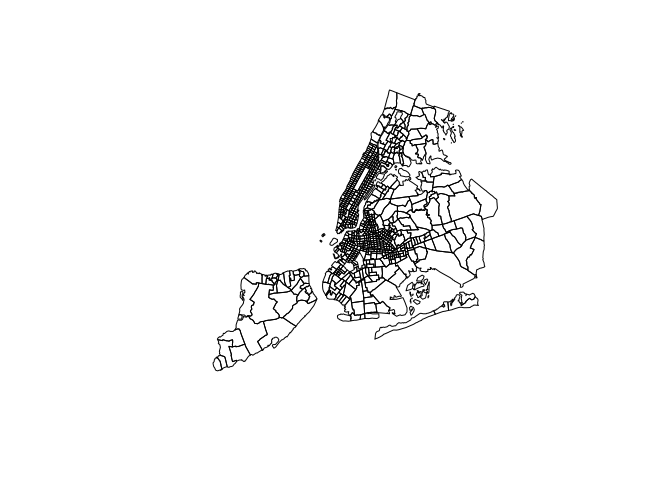
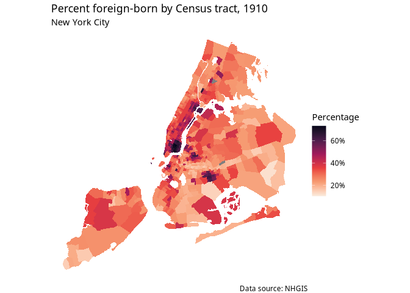
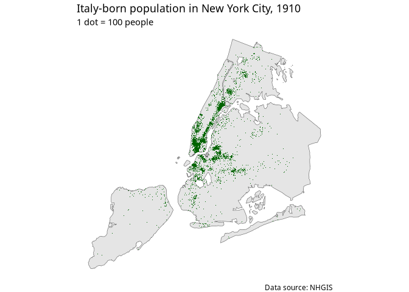

# Working with NHGIS historical data

The example in this section will illustrate an applied workflow using
NHGIS and its companion R package, **ipumsr** ([Ellis and Burk
2020](https://walker-data.com/census-r/references.html#ref-ellis_and_burk2020))
to map geographies of immigration in New York City from the 1910 Census.

``` r
library(ipumsr)
library(tidyverse)
```

``` r
nyc_1910_shp <- read_ipums_sf(
  "data/nhgis0001_shape/nhgis0001_shapefile_tl2000_us_tract_1910.zip",
  file_select = "US_tract_1910.shp")

nyc_data <- read_nhgis("data/nhgis0001_csv.zip")
```

    ## Use of data from NHGIS is subject to conditions including that users should cite the data appropriately. Use command `ipums_conditions()` for more details.

    ## Rows: 704 Columns: 42
    ## ── Column specification ────────────────────────────────────────────────────────
    ## Delimiter: ","
    ## chr  (7): GISJOIN, STATE, COUNTY, COUNTYA, PRETRACTA, TRACTA, AREANAME
    ## dbl (34): YEAR, STATEA, A6G001, A6G002, A6G003, A6G004, A6G005, A6G006, A6G0...
    ## lgl  (1): POSTTRCTA
    ## 
    ## ℹ Use `spec()` to retrieve the full column specification for this data.
    ## ℹ Specify the column types or set `show_col_types = FALSE` to quiet this message.

``` r
nyc_1910 <- ipums_shape_left_join(
  nyc_data,
  nyc_1910_shp,
  by = "GISJOIN"
) |> 
  filter(str_detect(GISJOIN, "G36"))
```

    ## Some observations were lost in the join (1285 observations in the shape file).
    ## See `join_failures(...)` for more details.

``` r
nyc_1910
```

    ## Simple feature collection with 704 features and 47 fields
    ## Geometry type: MULTIPOLYGON
    ## Dimension:     XY
    ## Bounding box:  xmin: 1810884 ymin: 544085.4 xmax: 1851324 ymax: 596805.5
    ## Projected CRS: USA_Contiguous_Albers_Equal_Area_Conic
    ## # A tibble: 704 × 48
    ##    GISJOIN  YEAR STATE STATEA COUNTY COUNTYA PRETRACTA TRACTA POSTTRCTA AREANAME
    ##  * <chr>   <dbl> <chr>  <dbl> <chr>  <chr>   <chr>     <chr>  <lgl>     <chr>   
    ##  1 G36006…  1910 New …     36 New Y… 061     B         0002   NA        Tract  …
    ##  2 G36006…  1910 New …     36 New Y… 061     B         0001   NA        Tract  …
    ##  3 G36004…  1910 New …     36 Kings  047     <NA>      0058   NA        Tract  …
    ##  4 G36004…  1910 New …     36 Kings  047     <NA>      0059   NA        Tract  …
    ##  5 G36004…  1910 New …     36 Kings  047     <NA>      0062   NA        Tract  …
    ##  6 G36004…  1910 New …     36 Kings  047     <NA>      0042   NA        Tract  …
    ##  7 G36004…  1910 New …     36 Kings  047     <NA>      0030   NA        Tract  …
    ##  8 G36004…  1910 New …     36 Kings  047     <NA>      0031   NA        Tract  …
    ##  9 G36004…  1910 New …     36 Kings  047     <NA>      0032   NA        Tract  …
    ## 10 G36004…  1910 New …     36 Kings  047     <NA>      0033   NA        Tract  …
    ## # ℹ 694 more rows
    ## # ℹ 38 more variables: A6G001 <dbl>, A6G002 <dbl>, A6G003 <dbl>, A6G004 <dbl>,
    ## #   A6G005 <dbl>, A6G006 <dbl>, A6G007 <dbl>, A6G008 <dbl>, A6G009 <dbl>,
    ## #   A6G010 <dbl>, A6G011 <dbl>, A6G012 <dbl>, A6G013 <dbl>, A6G014 <dbl>,
    ## #   A6G015 <dbl>, A6G016 <dbl>, A6G017 <dbl>, A6G018 <dbl>, A6G019 <dbl>,
    ## #   A6G020 <dbl>, A6G021 <dbl>, A6G022 <dbl>, A6G023 <dbl>, A6G024 <dbl>,
    ## #   A6G025 <dbl>, A60001 <dbl>, A60002 <dbl>, A60003 <dbl>, A60004 <dbl>, …

``` r
View(sf::st_drop_geometry(nyc_1910))
```

``` r
library(sf)
```

    ## Linking to GEOS 3.13.1, GDAL 3.10.2, PROJ 9.6.0; sf_use_s2() is TRUE

``` r
nyc_1910_p <- st_transform(nyc_1910, 6538)
plot(nyc_1910_p$geometry)
```

<!-- -->

As there is no “total population” column in the dataset, the code below
uses **dplyr**’s
[`rowwise()`](https://dplyr.tidyverse.org/reference/rowwise.html) and
[`c_across()`](https://dplyr.tidyverse.org/reference/c_across.html)
functions to perform row-wise calculations and sum across the columns
`A60001` through `A60007`.

Interestingly, there were only three races, white, black and other.
A60005 is described “foreign-born white”. There is no corresponding
category for non-white.

``` r
nyc_pctfb <- nyc_1910_p |> 
  rowwise() |> 
  mutate(total = sum(c_across(A60001:A60007))) |> 
  ungroup() |> 
  transmute(
    tract_id = GISJOIN,
    pct_fb = A60005 / total
  )
```

``` r
ggplot(nyc_pctfb, aes(fill = pct_fb)) +
  geom_sf(color = NA) +
  scale_fill_viridis_c(option = "rocket",
                       labels = scales::percent,
                       direction = -1) +
  theme_void(base_family = "Verdana") + 
  labs(title = "Percent foreign-born by Census tract, 1910",
       subtitle = "New York City",
       caption =  "Data source: NHGIS",
       fill = "Percentage")  
```

<!-- -->

For example, the number of Italy-born residents by Census tract is
represented in the column `A6G014`

``` r
library(tidycensus)

italy_dots <- nyc_1910_p |> 
  as_dot_density(
    value = "A6G014",
    values_per_dot = 100
  )

nyc_base <- nyc_1910_p |> 
  st_union()
```

``` r
ggplot() +
  geom_sf(data = nyc_base, size = 0.1) +
  geom_sf(data = italy_dots, shape = ".", color = "darkgreen") +
  theme_void(base_family = "Verdana") +
  labs(title = "Italy-born population in New York City, 1910",
       subtitle = "1 dot = 100 people",
       caption = "Data source: NHGIS")
```

<!-- -->

``` r
nyc_data$GISJOIN
```

    ##   [1] "G36004700001"  "G36004700002"  "G36004700003"  "G36004700004" 
    ##   [5] "G36004700005"  "G36004700006"  "G36004700007"  "G36004700008" 
    ##   [9] "G36004700009"  "G36004700010"  "G36004700011"  "G36004700012" 
    ##  [13] "G36004700013"  "G36004700014"  "G36004700015"  "G36004700016" 
    ##  [17] "G36004700017"  "G36004700018"  "G36004700019"  "G36004700020" 
    ##  [21] "G36004700021"  "G36004700022"  "G36004700023"  "G36004700024" 
    ##  [25] "G36004700025"  "G36004700026"  "G36004700027"  "G36004700028" 
    ##  [29] "G36004700029"  "G36004700030"  "G36004700031"  "G36004700032" 
    ##  [33] "G36004700033"  "G36004700034"  "G36004700035"  "G36004700036" 
    ##  [37] "G36004700037"  "G36004700038"  "G36004700039"  "G36004700040" 
    ##  [41] "G36004700041"  "G36004700042"  "G36004700043"  "G36004700044" 
    ##  [45] "G36004700045"  "G36004700046"  "G36004700047"  "G36004700048" 
    ##  [49] "G36004700049"  "G36004700050"  "G36004700051"  "G36004700052" 
    ##  [53] "G36004700053"  "G36004700054"  "G36004700055"  "G36004700056" 
    ##  [57] "G36004700057"  "G36004700058"  "G36004700059"  "G36004700060" 
    ##  [61] "G36004700061"  "G36004700062"  "G36004700063"  "G36004700064" 
    ##  [65] "G36004700065"  "G36004700066"  "G36004700067"  "G36004700068" 
    ##  [69] "G36004700069"  "G36004700070"  "G36004700071"  "G36004700072" 
    ##  [73] "G36004700073"  "G36004700074"  "G36004700075"  "G36004700076" 
    ##  [77] "G36004700077"  "G36004700078"  "G36004700079"  "G36004700080" 
    ##  [81] "G36004700081"  "G36004700082"  "G36004700084"  "G36004700085" 
    ##  [85] "G36004700086"  "G36004700087"  "G36004700088"  "G36004700089" 
    ##  [89] "G36004700090"  "G36004700091"  "G36004700092"  "G36004700093" 
    ##  [93] "G36004700094"  "G36004700095"  "G36004700096"  "G36004700097" 
    ##  [97] "G36004700098"  "G36004700099"  "G36004700100"  "G36004700101" 
    ## [101] "G36004700102"  "G36004700103"  "G36004700104"  "G36004700105" 
    ## [105] "G36004700106"  "G36004700107"  "G36004700108"  "G36004700109" 
    ## [109] "G36004700110"  "G36004700111"  "G36004700112"  "G36004700113" 
    ## [113] "G36004700114"  "G36004700115"  "G36004700116"  "G36004700117" 
    ## [117] "G36004700118"  "G36004700119"  "G36004700120"  "G36004700121" 
    ## [121] "G36004700122"  "G36004700123"  "G36004700124"  "G36004700125" 
    ## [125] "G36004700126"  "G36004700127"  "G36004700129"  "G36004700130" 
    ## [129] "G36004700131"  "G36004700132"  "G36004700133"  "G36004700134" 
    ## [133] "G36004700135"  "G36004700136"  "G36004700137"  "G36004700138" 
    ## [137] "G36004700139"  "G36004700140"  "G36004700141"  "G36004700142" 
    ## [141] "G36004700143"  "G36004700144"  "G36004700145"  "G36004700146" 
    ## [145] "G36004700147"  "G36004700148"  "G36004700149"  "G36004700150" 
    ## [149] "G36004700151"  "G36004700152"  "G36004700153"  "G36004700154" 
    ## [153] "G36004700155"  "G36004700156"  "G36004700157"  "G36004700158" 
    ## [157] "G36004700159"  "G36004700160"  "G36004700161"  "G36004700162" 
    ## [161] "G36004700163"  "G36004700164"  "G36004700165"  "G36004700166" 
    ## [165] "G36004700167"  "G36004700168"  "G36004700169"  "G36004700170" 
    ## [169] "G36004700171"  "G36004700172"  "G36004700173"  "G36004700174" 
    ## [173] "G36004700175"  "G36004700176"  "G36004700177"  "G36004700178" 
    ## [177] "G36004700179"  "G36004700180"  "G36004700181"  "G36004700182" 
    ## [181] "G36004700183"  "G36004700184"  "G36004700185"  "G36004700186" 
    ## [185] "G36004700187"  "G36004700188"  "G36004700189"  "G36004700190" 
    ## [189] "G36004700191"  "G36004700192"  "G36004700193"  "G36004700194" 
    ## [193] "G36004700195"  "G36004700196"  "G36004700197"  "G36004700198" 
    ## [197] "G36004700199"  "G36004700200"  "G36004700201"  "G36004700202" 
    ## [201] "G36004700203"  "G36004700204"  "G36004700205"  "G36004700206" 
    ## [205] "G36004700207"  "G36004700208"  "G36004700209"  "G36004700210" 
    ## [209] "G36004700211"  "G36004700212"  "G36004700213"  "G36004700214" 
    ## [213] "G36004700215"  "G36004700216"  "G36004700217"  "G36004700218" 
    ## [217] "G36004700219"  "G36004700220"  "G36004700221"  "G36004700222" 
    ## [221] "G36004700223"  "G36004700224"  "G36004700225"  "G36004700226" 
    ## [225] "G36004700227"  "G36004700228"  "G36004700229"  "G36004700230" 
    ## [229] "G36004700231"  "G36004700232"  "G36004700233"  "G36004700234" 
    ## [233] "G36004700235"  "G36004700236"  "G36004700237"  "G36004700238" 
    ## [237] "G36004700239"  "G36004700240"  "G36004700241"  "G36004700242" 
    ## [241] "G36004700243"  "G36004700244"  "G36004700245"  "G36004700246" 
    ## [245] "G36004700247"  "G36004700248"  "G36004700249"  "G36004700250" 
    ## [249] "G36004700251"  "G36004700252"  "G36004700253"  "G36004700254" 
    ## [253] "G36004700255"  "G36004700256"  "G36004700257"  "G36004700258" 
    ## [257] "G36004700259"  "G36004700260"  "G36004700261"  "G36004700262" 
    ## [261] "G36004700263"  "G36004700264"  "G36004700265"  "G36004700266" 
    ## [265] "G36004700267"  "G36004700268"  "G36004700269"  "G36004700270" 
    ## [269] "G36004700271"  "G36004700272"  "G36004700273"  "G36004700274" 
    ## [273] "G36004700275"  "G36004700276"  "G36004700277"  "G36004700278" 
    ## [277] "G36004700279"  "G36004700280"  "G36004700281"  "G36004700282" 
    ## [281] "G36004700283"  "G36004700284"  "G36004700285"  "G36004700286" 
    ## [285] "G36004700287"  "G36004700288"  "G36004700289"  "G36004700290" 
    ## [289] "G36004700291"  "G36004700292"  "G36004700293"  "G36004700294" 
    ## [293] "G36004700295"  "G36004700296"  "G36004700297"  "G36004700298" 
    ## [297] "G36004700299"  "G36004700300"  "G36004700301"  "G36004700302" 
    ## [301] "G36004700303"  "G36004700304"  "G36004700305"  "G36004700306" 
    ## [305] "G36004700307"  "G36004700308"  "G36004700309"  "G36004700310" 
    ## [309] "G36004700311"  "G36004700312"  "G36004700313"  "G36004700314" 
    ## [313] "G36004700315"  "G36004700316"  "G36004700317"  "G36004700318" 
    ## [317] "G36004700319"  "G36004700320"  "G36004700321"  "G36004700322" 
    ## [321] "G36004700323"  "G36004700324"  "G36004700325"  "G36004700326" 
    ## [325] "G36006100001"  "G36006100002"  "G36006100003"  "G36006100004" 
    ## [329] "G36006100005"  "G36006100006"  "G36006100007"  "G36006100008" 
    ## [333] "G36006100009"  "G36006100010"  "G36006100011"  "G36006100012" 
    ## [337] "G36006100013"  "G36006100014"  "G36006100015"  "G36006100016" 
    ## [341] "G36006100017"  "G36006100018"  "G36006100019"  "G36006100020" 
    ## [345] "G36006100021"  "G36006100022"  "G36006100023"  "G36006100024" 
    ## [349] "G36006100025"  "G36006100026"  "G36006100027"  "G36006100028" 
    ## [353] "G36006100029"  "G36006100030"  "G36006100031"  "G36006100032" 
    ## [357] "G36006100033"  "G36006100034"  "G36006100035"  "G36006100036" 
    ## [361] "G36006100037"  "G36006100038"  "G36006100039"  "G36006100040" 
    ## [365] "G36006100041"  "G36006100042"  "G36006100043"  "G36006100044" 
    ## [369] "G36006100045"  "G36006100046"  "G36006100047"  "G36006100048" 
    ## [373] "G36006100049"  "G36006100050"  "G36006100051"  "G36006100052" 
    ## [377] "G36006100053"  "G36006100054"  "G36006100055"  "G36006100056" 
    ## [381] "G36006100057"  "G36006100058"  "G36006100059"  "G36006100060" 
    ## [385] "G36006100061"  "G36006100062"  "G36006100063"  "G36006100064" 
    ## [389] "G36006100065"  "G36006100066"  "G36006100067"  "G36006100068" 
    ## [393] "G36006100069"  "G36006100070"  "G36006100071"  "G36006100072" 
    ## [397] "G36006100073"  "G36006100074"  "G36006100075"  "G36006100076" 
    ## [401] "G36006100077"  "G36006100078"  "G36006100079"  "G36006100080" 
    ## [405] "G36006100081"  "G36006100082"  "G36006100083"  "G36006100084" 
    ## [409] "G36006100085"  "G36006100086"  "G36006100087"  "G36006100088" 
    ## [413] "G36006100089"  "G36006100090"  "G36006100091"  "G36006100092" 
    ## [417] "G36006100093"  "G36006100094"  "G36006100095"  "G36006100096" 
    ## [421] "G36006100097"  "G36006100098"  "G36006100099"  "G36006100100" 
    ## [425] "G36006100101"  "G36006100102"  "G36006100103"  "G36006100104" 
    ## [429] "G36006100105"  "G36006100106"  "G36006100107"  "G36006100108" 
    ## [433] "G36006100109"  "G36006100110"  "G36006100112"  "G36006100113" 
    ## [437] "G36006100114"  "G36006100115"  "G36006100116"  "G36006100117" 
    ## [441] "G36006100118"  "G36006100119"  "G36006100120"  "G36006100121" 
    ## [445] "G36006100122"  "G36006100123"  "G36006100124"  "G36006100125" 
    ## [449] "G36006100126"  "G36006100127"  "G36006100128"  "G36006100129" 
    ## [453] "G36006100130"  "G36006100131"  "G36006100132"  "G36006100133" 
    ## [457] "G36006100134"  "G36006100135"  "G36006100136"  "G36006100137" 
    ## [461] "G36006100138"  "G36006100139"  "G36006100140"  "G36006100141" 
    ## [465] "G36006100142"  "G36006100143"  "G36006100144"  "G36006100145" 
    ## [469] "G36006100146"  "G36006100147"  "G36006100148"  "G36006100149" 
    ## [473] "G36006100150"  "G36006100151"  "G36006100152"  "G36006100153" 
    ## [477] "G36006100154"  "G36006100155"  "G36006100156"  "G36006100157" 
    ## [481] "G36006100158"  "G36006100159"  "G36006100160"  "G36006100161" 
    ## [485] "G36006100162"  "G36006100163"  "G36006100164"  "G36006100165" 
    ## [489] "G36006100166"  "G36006100167"  "G36006100168"  "G36006100169" 
    ## [493] "G36006100170"  "G36006100171"  "G36006100172"  "G36006100173" 
    ## [497] "G36006100174"  "G36006100175"  "G36006100176"  "G36006100177" 
    ## [501] "G36006100178"  "G36006100179"  "G36006100180"  "G36006100181" 
    ## [505] "G36006100182"  "G36006100183"  "G36006100184"  "G36006100185" 
    ## [509] "G36006100186"  "G36006100187"  "G36006100188"  "G36006100189" 
    ## [513] "G36006100190"  "G36006100191"  "G36006100192"  "G36006100193" 
    ## [517] "G36006100194"  "G36006100195"  "G36006100196"  "G36006100197" 
    ## [521] "G36006100198"  "G36006100199"  "G36006100200"  "G36006100201" 
    ## [525] "G36006100202"  "G36006100203"  "G36006100204"  "G36006100205" 
    ## [529] "G36006100206"  "G36006100207"  "G36006100208"  "G36006100209" 
    ## [533] "G36006100210"  "G36006100211"  "G36006100212"  "G36006100213" 
    ## [537] "G36006100214"  "G36006100216"  "G36006100218"  "G36006100220" 
    ## [541] "G36006100222"  "G36006100224"  "G3600610B0001" "G3600610B0002"
    ## [545] "G3600610B0003" "G3600610B0004" "G3600610B0005" "G3600610B0006"
    ## [549] "G3600610B0007" "G3600610B0008" "G3600610B0009" "G3600610B0010"
    ## [553] "G3600610B0011" "G3600610B0012" "G3600610B0013" "G3600610B0014"
    ## [557] "G3600610B0015" "G3600610B0016" "G3600610B0017" "G3600610B0018"
    ## [561] "G3600610B0019" "G3600610B0020" "G3600610B0022" "G3600610B0023"
    ## [565] "G3600610B0024" "G3600610B0025" "G3600610B0026" "G3600610B0027"
    ## [569] "G3600610B0028" "G3600610B0029" "G3600610B0030" "G3600610B0031"
    ## [573] "G3600610B0032" "G3600610B0033" "G3600610B0034" "G3600610B0035"
    ## [577] "G3600610B0036" "G3600610B0038" "G3600610B0039" "G3600610B0040"
    ## [581] "G3600610B0041" "G3600610B0042" "G3600610B0043" "G3600610B0044"
    ## [585] "G3600610B0045" "G3600610B0046" "G3600610B0047" "G3600610B0048"
    ## [589] "G3600610B0049" "G3600610B0050" "G3600610B0051" "G3600610B0052"
    ## [593] "G3600610B0053" "G3600610B0054" "G3600610B0055" "G36008100001" 
    ## [597] "G36008100002"  "G36008100003"  "G36008100004"  "G36008100005" 
    ## [601] "G36008100006"  "G36008100007"  "G36008100008"  "G36008100009" 
    ## [605] "G36008100010"  "G36008100011"  "G36008100012"  "G36008100013" 
    ## [609] "G36008100014"  "G36008100015"  "G36008100016"  "G36008100017" 
    ## [613] "G36008100018"  "G36008100019"  "G36008100020"  "G36008100021" 
    ## [617] "G36008100022"  "G36008100023"  "G36008100024"  "G36008100025" 
    ## [621] "G36008100026"  "G36008100027"  "G36008100028"  "G36008100029" 
    ## [625] "G36008100030"  "G36008100031"  "G36008100032"  "G36008100033" 
    ## [629] "G36008100034"  "G36008100035"  "G36008100036"  "G36008100037" 
    ## [633] "G36008100038"  "G36008100039"  "G36008100040"  "G36008100041" 
    ## [637] "G36008100042"  "G36008100043"  "G36008100044"  "G36008100045" 
    ## [641] "G36008100046"  "G36008100047"  "G36008100048"  "G36008100049" 
    ## [645] "G36008100050"  "G36008100051"  "G36008100052"  "G36008100053" 
    ## [649] "G36008100054"  "G36008100055"  "G36008100056"  "G36008100057" 
    ## [653] "G36008100058"  "G36008100059"  "G36008100060"  "G36008100061" 
    ## [657] "G36008100062"  "G36008100063"  "G36008100064"  "G36008100065" 
    ## [661] "G36008100066"  "G36008100067"  "G36008100068"  "G36008100069" 
    ## [665] "G36008100070"  "G36008100071"  "G36008100072"  "G36008100073" 
    ## [669] "G36008100074"  "G36008100075"  "G36008100076"  "G36008500001" 
    ## [673] "G36008500002"  "G36008500003"  "G36008500004"  "G36008500005" 
    ## [677] "G36008500006"  "G36008500007"  "G36008500008"  "G36008500009" 
    ## [681] "G36008500010"  "G36008500011"  "G36008500012"  "G36008500013" 
    ## [685] "G36008500014"  "G36008500015"  "G36008500016"  "G36008500017" 
    ## [689] "G36008500018"  "G36008500019"  "G36008500020"  "G36008500021" 
    ## [693] "G36008500022"  "G36008500024"  "G36008500026"  "G36008500028" 
    ## [697] "G36008500030"  "G36008500032"  "G36008500034"  "G36008500036" 
    ## [701] "G36008500038"  "G36008500040"  "G36008500042"  "G36008500044" 
    ## attr(,"label")
    ## [1] "GIS Join Match Code"
    ## attr(,"var_desc")
    ## [1] ""
