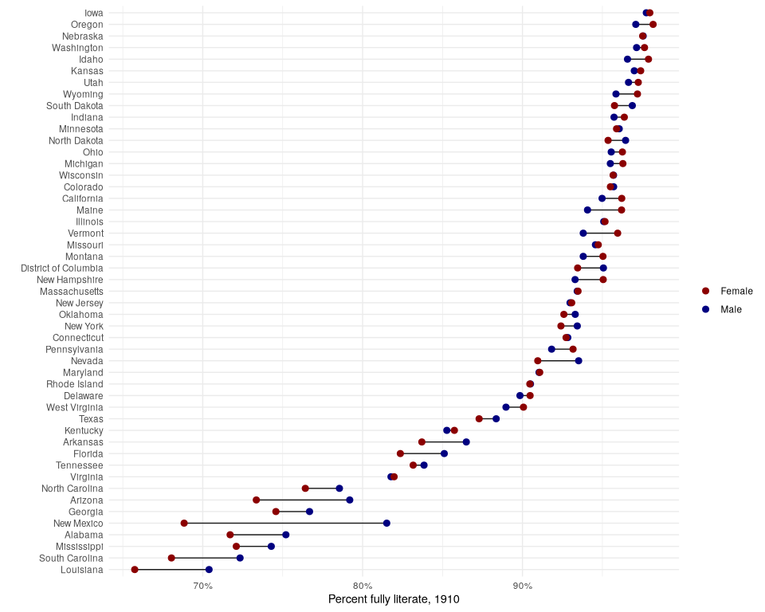

# Complete Count Historical Microdata

``` r
library(RPostgres)
library(tidyverse)
```

    ## ── Attaching core tidyverse packages ──────────────────────── tidyverse 2.0.0 ──
    ## ✔ dplyr     1.1.4     ✔ readr     2.1.5
    ## ✔ forcats   1.0.0     ✔ stringr   1.5.1
    ## ✔ ggplot2   3.5.1     ✔ tibble    3.2.1
    ## ✔ lubridate 1.9.4     ✔ tidyr     1.3.1
    ## ✔ purrr     1.0.4     
    ## ── Conflicts ────────────────────────────────────────── tidyverse_conflicts() ──
    ## ✖ dplyr::filter() masks stats::filter()
    ## ✖ dplyr::lag()    masks stats::lag()
    ## ℹ Use the conflicted package (<http://conflicted.r-lib.org/>) to force all conflicts to become errors

``` r
library(dbplyr)
```

    ## 
    ## Attaching package: 'dbplyr'
    ## 
    ## The following objects are masked from 'package:dplyr':
    ## 
    ##     ident, sql

## Loading data

``` r
conn <- dbConnect(
  drv = Postgres(),
  user = "census",
  password = "",
  host = "localhost",
  port = "5432",
  dbname = "census"
)
```

``` r
census1910 <- tbl(conn, in_schema("ipums", "usa"))

census1910
```

    ## # Source:   table<"ipums"."usa"> [?? x 14]
    ## # Database: postgres  [census@localhost:5432/census]
    ##     YEAR SAMPLE SERIAL  HHWT STATEFIP    GQ PERNUM PERWT   SEX   AGE MARST   LIT
    ##    <int>  <int>  <int> <dbl>    <int> <int>  <int> <dbl> <int> <int> <int> <int>
    ##  1  1910 191004      1     1        1     1      1     1     1    58     1     4
    ##  2  1910 191004      1     1        1     1      2     1     2    52     1     4
    ##  3  1910 191004      1     1        1     1      3     1     1    18     6     4
    ##  4  1910 191004      1     1        1     1      4     1     1    12     6     4
    ##  5  1910 191004      1     1        1     1      5     1     1    33     1     4
    ##  6  1910 191004      1     1        1     1      6     1     2    26     1     4
    ##  7  1910 191004      1     1        1     1      7     1     2     2     6     0
    ##  8  1910 191004      2     1        1     1      1     1     2    61     5     4
    ##  9  1910 191004      2     1        1     1      2     1     1    24     6     4
    ## 10  1910 191004      3     1        1     1      1     1     1    55     1     4
    ## # ℹ more rows
    ## # ℹ 2 more variables: VERSIONHIST <int>, HISTID <chr>

## Analyzing big Census microdata

``` r
census1910 |> summarize(n())
```

    ## # Source:   SQL [?? x 1]
    ## # Database: postgres  [census@localhost:5432/census]
    ##      `n()`
    ##    <int64>
    ## 1 92043618

``` r
census1910 |> 
  filter(AGE > 17, STATEFIP == "48") |> 
  group_by(SEX, LIT) |> 
  summarise(num = n())
```

    ## `summarise()` has grouped output by "SEX". You can override using the `.groups`
    ## argument.

    ## # Source:   SQL [?? x 3]
    ## # Database: postgres  [census@localhost:5432/census]
    ## # Groups:   SEX
    ##     SEX   LIT     num
    ##   <int> <int> <int64>
    ## 1     1     1  116351
    ## 2     1     2      28
    ## 3     1     3   14126
    ## 4     1     4  997335
    ## 5     2     1  111181
    ## 6     2     2      17
    ## 7     2     3   14524
    ## 8     2     4  883685

``` r
census1910 |> 
  filter(AGE > 17, STATEFIP == "48") |> 
  group_by(SEX, LIT) |> 
  summarise(num = n()) |> 
  show_query()
```

    ## `summarise()` has grouped output by "SEX". You can override using the `.groups`
    ## argument.

    ## <SQL>
    ## SELECT "SEX", "LIT", COUNT(*) AS "num"
    ## FROM (
    ##   SELECT "usa".*
    ##   FROM "ipums"."usa"
    ##   WHERE ("AGE" > 17.0) AND ("STATEFIP" = '48')
    ## ) AS "q01"
    ## GROUP BY "SEX", "LIT"

If an analyst wants the result of a database operation to be brought
into R as an R object rather than as a database view, the
[`collect()`](https://dplyr.tidyverse.org/reference/compute.html)
function can be used at the end of a pipeline to load data directly. A
companion function from **ipumsr**,
[`ipums_collect()`](https://rdrr.io/pkg/ipumsr/man/ipums_collect.html),
will add variable and value labels to the collected data based on an
IPUMS codebook.

``` r
literacy_props <- census1910 |> 
  filter(AGE > 18) |> 
  group_by(STATEFIP, SEX, LIT) |> 
  summarise(num = n()) |> 
  group_by(STATEFIP, SEX) |> 
  mutate(total = sum(num, na.rm = T)) |> 
  ungroup() |> 
  mutate(prop = num / total) |> 
  filter(LIT == 4) |> 
  collect()
```

    ## `summarise()` has grouped output by "STATEFIP" and "SEX". You can override
    ## using the `.groups` argument.

``` r
state_names <- tigris::fips_codes |> 
  select(state_code, state_name) |> 
  distinct()


literacy_props_with_name <- literacy_props %>%
  mutate(STATEFIP = str_pad(STATEFIP, 2, "left", "0")) %>%
  left_join(state_names, by = c("STATEFIP" = "state_code")) %>%
  mutate(sex = ifelse(SEX == 1, "Male", "Female")) 
```

``` r
ggplot(literacy_props_with_name,
       aes(x = prop, y = reorder(state_name, prop),
           color = sex)) +
  geom_line(aes(group = state_name), color = "gray10") +
  geom_point(size = 2.5) +
  theme_minimal() +
  scale_color_manual(values = c(Male = "navy", Female = "darkred")) +
  scale_x_continuous(labels = scales::percent) +
  labs(x = "Percent fully literate, 1910",
       color = "",
       y = "")
```

<!-- -->
