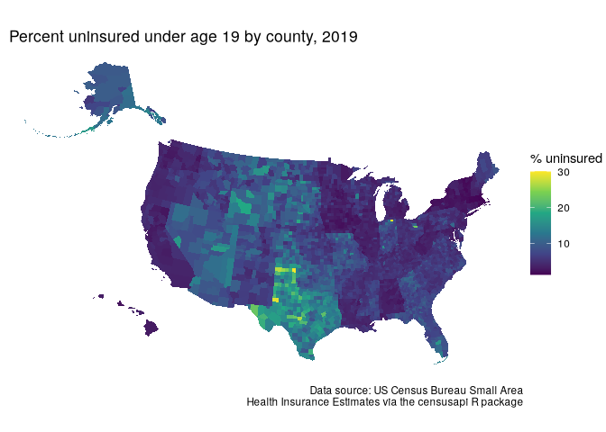
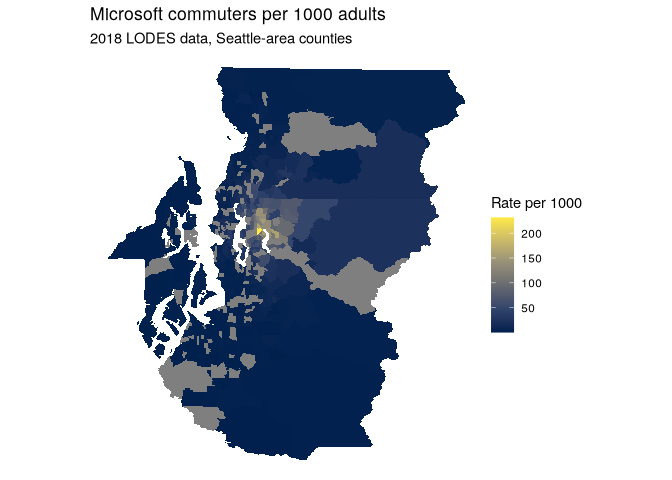
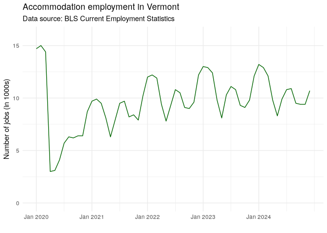

# Other USG datasets

## censusapi

For datasets not available with tidycensus.

``` r
library(censusapi)
```

``` r
listCensusApis()
```

``` r
tx_econ17 <- getCensus(
  name = "ecnbasic",
  vintage = 2017,
  vars = c("EMP", "PAYANN", "GEO_ID"),
  region = "county:*",
  regionin = "state:48",
  NAICS2017 = 72
)
tx_econ17 |> head()
```

    ##   state county  EMP PAYANN         GEO_ID NAICS2017
    ## 1    48    373 1041  15256 0500000US48373        72
    ## 2    48    391  246   3242 0500000US48391        72
    ## 3    48    467 1254  19187 0500000US48467        72
    ## 4    48    055  910  15247 0500000US48055        72
    ## 5    48    487  394   5233 0500000US48487        72
    ## 6    48    317    0      0 0500000US48317        72

``` r
nm_econ17 <- getCensus(
  name = "ecnbasic",
  vintage = 2017,
  vars = c("EMP", "PAYANN", "GEO_ID"),
  region = "county:*",
  regionin = "state:35",
  NAICS2017 = 72
)
nm_econ17 |> head()
```

    ##   state county EMP PAYANN         GEO_ID NAICS2017
    ## 1    35    023 193   3529 0500000US35023        72
    ## 2    35    029 803  10118 0500000US35029        72
    ## 3    35    017 994  10497 0500000US35017        72
    ## 4    35    019 359   5136 0500000US35019        72
    ## 5    35    011   0      0 0500000US35011        72
    ## 6    35    003   0      0 0500000US35003        72

``` r
library(tigris)
library(tidyverse)
options(tigris_use_cache = TRUE)
```

``` r
us_youth_sahie <- getCensus(
  name = "timeseries/healthins/sahie",
  vars = c("GEOID", "PCTUI_PT"),
  region = "county:*",
  regionin = "state:*",
  time = 2019,
  AGECAT = 4
)

us_counties <- counties(cb = T,
                        resolution = "20m",
                        year = 2019) |> 
  shift_geometry(position = "outside") |> 
  inner_join(us_youth_sahie, by = "GEOID")
```

``` r
ggplot(us_counties, aes(fill = PCTUI_PT)) +
  geom_sf(color = NA) +
  theme_void() +
  scale_fill_viridis_c() +
  labs(fill = "% uninsured ",
       caption = "Data source: US Census Bureau Small Area\nHealth Insurance Estimates via the censusapi R package",
       title = "  Percent uninsured under age 19 by county, 2019")  
```

<!-- -->

## Labor markets - lehdr

Longitudinal and Employer-Household Dynamics (LEHD) Origin-Destination
Employment Statistics (LODES) data.

[Documentation](https://lehd.ces.census.gov/data/lodes/LODES7/LODESTechDoc7.5.pdf)

- [`grab_lodes()`](https://rdrr.io/pkg/lehdr/man/grab_lodes.html),:
  downloads a LODES file of a specified `lodes_type` (either `"rac"` for
  residential, `"wac"` for workplace, or `"od"` for origin-destination)
  for a given state and year
- `agg_geo` parameter: roll up estimates to higher levels of aggregation
- `state_part = "main"` argument below captures within-state commuters
- `state_part = "aux"` to get commuters from out-of-state
- `use_cache = TRUE` stores downloaded LODES data in a cache directory

``` r
library(lehdr)
library(tidycensus)
library(sf)
library(tidyverse)
library(tigris)
```

``` r
nm_lodes_od <- grab_lodes(
  state = "nm",
  year = 2018,
  lodes_type = "od", 
  agg_geo = "tract",
  state_part = "main",
  use_cache = T
)
```

    ## Using cached version of file found in:
    ## /home/biscotty/.cache/R/lehdr/nm_od_main_JT00_2018.csv.gz

``` r
head(nm_lodes_od)
```

    ## # A tibble: 6 × 14
    ##    year state w_tract    h_tract  S000  SA01  SA02  SA03  SE01  SE02  SE03  SI01
    ##   <dbl> <chr> <chr>      <chr>   <dbl> <dbl> <dbl> <dbl> <dbl> <dbl> <dbl> <dbl>
    ## 1  2018 NM    350010001… 350010…    20     0     9    11     3    11     6     2
    ## 2  2018 NM    350010001… 350010…     1     0     1     0     0     1     0     0
    ## 3  2018 NM    350010001… 350010…     2     0     0     2     1     0     1     0
    ## 4  2018 NM    350010001… 350010…     1     1     0     0     1     0     0     0
    ## 5  2018 NM    350010001… 350010…     5     2     0     3     5     0     0     1
    ## 6  2018 NM    350010001… 350010…     6     2     2     2     2     4     0     2
    ## # ℹ 2 more variables: SI02 <dbl>, SI03 <dbl>

For example, the workflow below illustrates how to use LODES data to
understand the origins of commuters to the Microsoft campus (represented
by its Census tract) in Redmond, Washington. Commuters from LODES will
be normalized by the total population age 18 and up, acquired with
**tidycensus** for 2018 Census tracts in Seattle-area counties. The
dataset `ms_commuters` will include Census tract geometries (obtained
with `geometry = TRUE` in **tidycensus**) and an estimate of the number
of Microsoft-area commuters per 1000 adults in that Census tract.

``` r
seattle_adults <- get_acs(
  geography = "tract",
  variables = "S0101_C01_026",
  state = "WA",
  county = c("King", "Kitsap", "Pierce", "Snohomish"),
  year = 2018,
  geometry = T
)

wa_lodes_od <- grab_lodes(
  state = "wa",
  year = 2018,
  lodes_type = "od",
  agg_geo = "tract",
  state_part = "main",
  use_cache = TRUE
)

microsoft <- wa_lodes_od |> 
  filter(w_tract == "53033022803")  # microsoft location

ms_commuters <- seattle_adults |> 
  left_join(microsoft, by = c("GEOID" = "h_tract")) |> 
  mutate(ms_per_1000 = 1000 * (S000 / estimate)) |> 
  st_transform(6596) |> 
  erase_water(area_threshold = 0.99)
```

``` r
ms_commuters |> ggplot(aes(fill = ms_per_1000)) +
  geom_sf(color = NA) +
  theme_void() +
  scale_fill_viridis_c(option = "cividis") +
  labs(title = "Microsoft commuters per 1000 adults",
       subtitle = "2018 LODES data, Seattle-area counties",
       fill = "Rate per 1000")  
```

<!-- -->

## Bureau of Labor Statistics - blscrapeR

``` r
library(blscrapeR)

KEY <- Sys.getenv("BLS_KEY")
```

``` r
series_ids |> 
  filter(str_detect(series_title, "Men")) |> 
  filter(str_detect(series_title, "Hispanic")) |> 
  filter(str_detect(series_title, "Unemployment"))
```

The example below illustrates this for data on the [Current Employment
Statistics](https://www.bls.gov/ces/), for which the series ID [is
formatted as follows](https://www.bls.gov/help/hlpforma.htm#SA):

- Positions 1-2: The prefix (in this example, `SA`)
- Position 3: The seasonal adjustment code (either `S`, for seasonally
  adjusted, or `U`, for unadjusted)
- Positions 4-5: The two-digit state FIPS code
- Positions 6-10: The [five-digit area
  code](https://download.bls.gov/pub/time.series/sm/sm.area), which
  should be set to `00000` if an entire state is requested.
- Positions 11-18: The [super sector/industry
  code](https://download.bls.gov/pub/time.series/sm/sm.industry)
- Positions 19-20: The [data type
  code](https://download.bls.gov/pub/time.series/sm/sm.data_type)

> [Instructions](https://www.bls.gov/help/hlpforma.htm)

ABQ area code 10740

Accommodation and food services 70720000

For some reason, New Mexico does not return valid data. This is Vermont

``` r
vt_accom <- bls_api(seriesid = "SMU50000007072100001",
                     startyear = 2020, 
                     endyear = 2024)
```

    ## REQUEST_SUCCEEDED

``` r
vt_accom |> head()
```

    ## # A tibble: 6 × 6
    ##    year period periodName value footnotes seriesID            
    ##   <dbl> <chr>  <chr>      <dbl> <chr>     <chr>               
    ## 1  2024 M12    December    10.7 ""        SMU50000007072100001
    ## 2  2024 M11    November     9.4 ""        SMU50000007072100001
    ## 3  2024 M10    October      9.4 ""        SMU50000007072100001
    ## 4  2024 M09    September    9.5 ""        SMU50000007072100001
    ## 5  2024 M08    August      10.9 ""        SMU50000007072100001
    ## 6  2024 M07    July        10.8 ""        SMU50000007072100001

``` r
vt_accom |> 
  mutate(period_order = rev(1:nrow(vt_accom))) |> 
  ggplot(aes(x = period_order, y = value, group = 1)) +
  geom_line(color = "darkgreen") + 
  theme_minimal() + 
  scale_y_continuous(limits = c(0, max(vt_accom$value) + 1)) + 
  scale_x_continuous(breaks = seq(1, 54, 12),
                     labels = paste("Jan", 2020:2024)) + 
  labs(x = "",
       y = "Number of jobs (in 1000s)",
       title = "Accommodation employment in Vermont",
       subtitle = "Data source: BLS Current Employment Statistics")
```

<!-- -->

## Agricultural data

``` r
library(tidyUSDA)

usda_key <- Sys.getenv("USDA_KEY")
```

Now, let’s see which US counties produce have the most acres devoted to
cucumbers. To use the
[`getQuickstat()`](https://bradlindblad.github.io/tidyusda/reference/getQuickstat.html)
function effectively, it is helpful to construct a query first at
<https://quickstats.nass.usda.gov/> and see what options are available,
then bring those options as arguments into R.

``` r
cucumbers <- getQuickstat(
  key = usda_key,
  program = "CENSUS",
  data_item = "CUCUMBERS, FRESH MARKET - ACRES HARVESTED",
  sector = "CROPS",
  group = "VEGETABLES",
  commodity = "CUCUMBERS",
  category = "AREA HARVESTED",
  domain = "TOTAL",
  geographic_level = "COUNTY",
  year = "2017"
)
```

``` r
cucumbers |> 
  select(state_name, county_name, Value) |> 
  arrange(desc(Value)) |> 
  head()
```

    ##       state_name  county_name Value
    ## 1        FLORIDA      MANATEE  2162
    ## 2       MICHIGAN      BERRIEN  1687
    ## 3     CALIFORNIA  SAN JOAQUIN  1558
    ## 4        GEORGIA       BROOKS  1495
    ## 5 NORTH CAROLINA      SAMPSON  1299
    ## 6        FLORIDA HILLSBOROUGH  1070

## 
