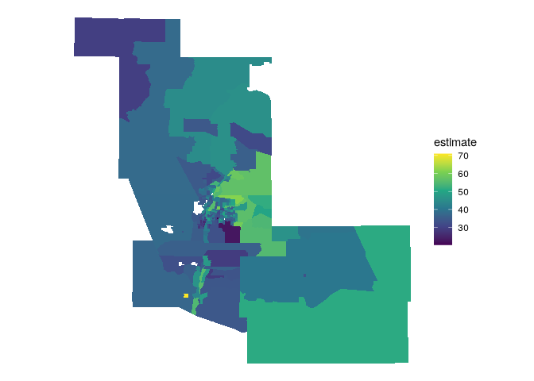
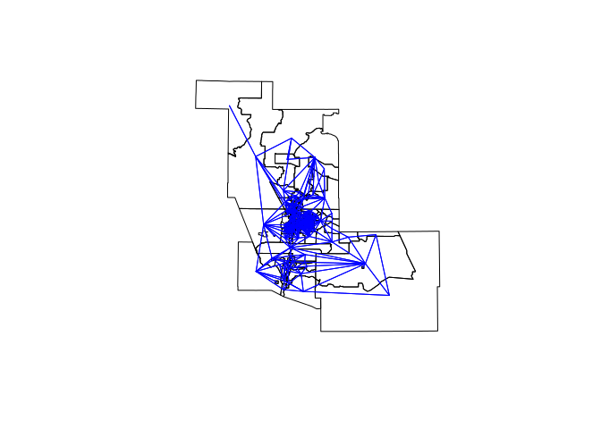
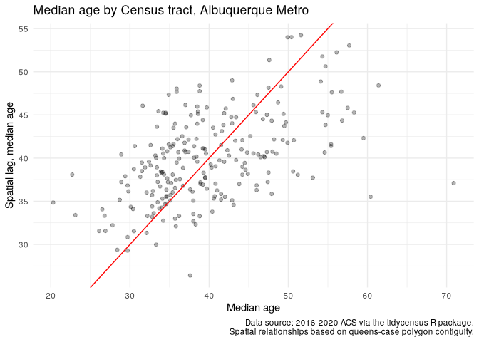
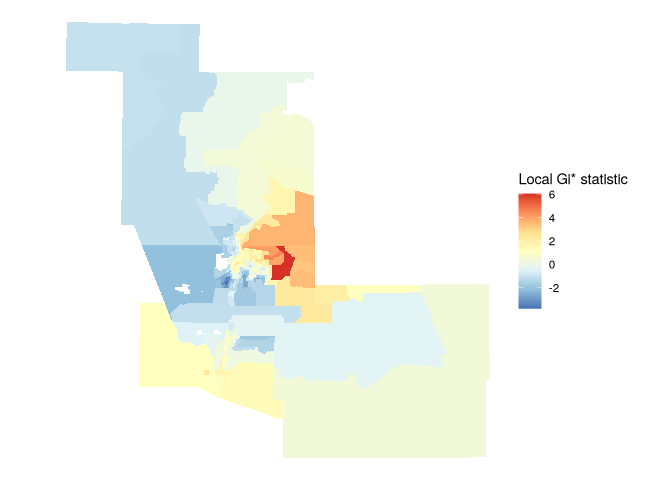
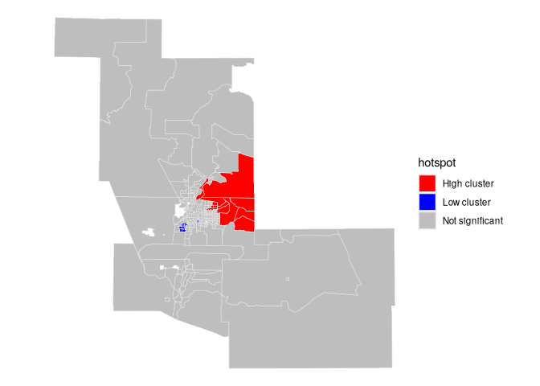
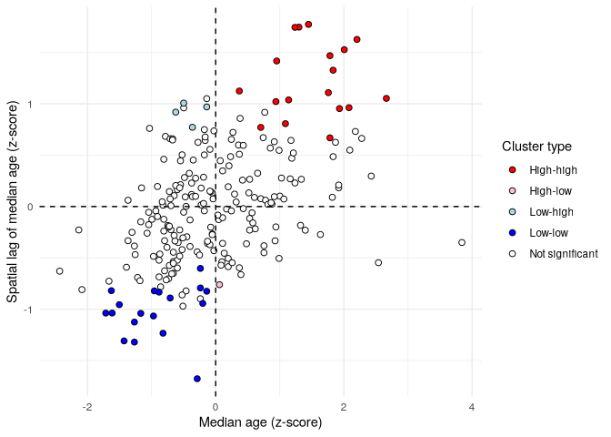
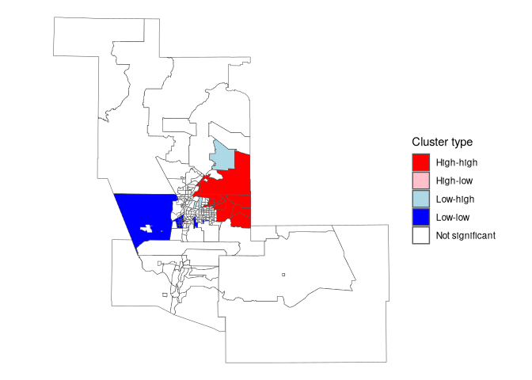

# Spatial Neighborhoods and weights matrices

ESDA with spatial properties. Example, median age by census tract.

``` r
library(tidycensus)
library(tidyverse)
```

    ## ── Attaching core tidyverse packages ──────────────────────── tidyverse 2.0.0 ──
    ## ✔ dplyr     1.1.4     ✔ readr     2.1.5
    ## ✔ forcats   1.0.0     ✔ stringr   1.5.1
    ## ✔ ggplot2   3.5.1     ✔ tibble    3.2.1
    ## ✔ lubridate 1.9.4     ✔ tidyr     1.3.1
    ## ✔ purrr     1.0.4     
    ## ── Conflicts ────────────────────────────────────────── tidyverse_conflicts() ──
    ## ✖ dplyr::filter() masks stats::filter()
    ## ✖ dplyr::lag()    masks stats::lag()
    ## ℹ Use the conflicted package (<http://conflicted.r-lib.org/>) to force all conflicts to become errors

``` r
library(tigris)
```

    ## To enable caching of data, set `options(tigris_use_cache = TRUE)`
    ## in your R script or .Rprofile.

``` r
library(sf)
```

    ## Linking to GEOS 3.13.1, GDAL 3.10.2, PROJ 9.6.0; sf_use_s2() is TRUE

``` r
library(spdep)
```

    ## Loading required package: spData
    ## To access larger datasets in this package, install the spDataLarge
    ## package with: `install.packages('spDataLarge',
    ## repos='https://nowosad.github.io/drat/', type='source')`

``` r
options(tigris_use_cache = T)
```

``` r
abq <- core_based_statistical_areas(
  cb = T,
  year = 2020) |> filter(str_detect(NAME, "Albuquerque")) |> 
  st_transform(32113)
  
abq_tracts <- get_acs(
  geography = "tract",
  variables = "B01002_001",
  state = "NM",
  year = 2020,
  geometry = T
) |> 
  st_transform(32113) |> 
  st_filter(abq, .predicate = st_within) |> 
  na.omit()
```

    ## Getting data from the 2016-2020 5-year ACS

``` r
ggplot(abq_tracts) +
  geom_sf(aes(fill = estimate), color = NA) +
  scale_fill_viridis_c() +
  theme_void()
```

<!-- -->

## Spatial neighborhood definitions

`spdep` includes:

- *Proximity-based neighbors*, where neighboring features are identified
  based on some measure of distance. Neighbors might be defined as those
  that fall within a given distance threshold (e.g. all features within
  2km of a given feature) or as *k*-nearest neighbors (e.g. the nearest
  eight features to a given feature).
- *Graph-based neighbors*, where neighbors are defined through network
  relationships (e.g. along a street network).
- *Contiguity-based neighbors*, used when geographic features are
  polygons. Options for contiguity-based spatial relationships include
  *queen’s case neighbors*, where all polygons that share at least one
  vertex are considered neighbors; and *rook’s case neighbors*, where
  polygons must share at least one line segment to be considered
  neighbors.

## Queen contiguity

``` r
neighbors <- poly2nb(abq_tracts, queen = T)

summary(neighbors)
```

    ## Neighbour list object:
    ## Number of regions: 234 
    ## Number of nonzero links: 1458 
    ## Percentage nonzero weights: 2.662722 
    ## Average number of links: 6.230769 
    ## Link number distribution:
    ## 
    ##  1  2  3  4  5  6  7  8  9 10 11 12 13 15 
    ##  4  3 13 27 40 49 46 20 12 11  5  2  1  1 
    ## 4 least connected regions:
    ## 9 16 46 48 with 1 link
    ## 1 most connected region:
    ## 97 with 15 links

``` r
abq_coords <- abq_tracts |> 
  st_centroid() |> 
  st_coordinates()
```

    ## Warning: st_centroid assumes attributes are constant over geometries

``` r
plot(abq_tracts$geometry)
plot(neighbors, 
     coords = abq_coords,
     add = T,
     col = "blue", points = F)
```

<!-- -->

``` r
neighbors[[1]]
```

    ##  [1]  35  36  37  60  67  74 106 163 203 216 225

## Generate spatial weights matrix

> Convert neighbors list to spatial weights
>
> Can use row-standardized `style = "W", when analyzing means` or 1/0
> with `style = "B" when computing sums`.

``` r
weights <- nb2listw(neighbors, style = "W")
weights$weights[[1]]
```

    ##  [1] 0.09090909 0.09090909 0.09090909 0.09090909 0.09090909 0.09090909
    ##  [7] 0.09090909 0.09090909 0.09090909 0.09090909 0.09090909

## Global and local spatial autocorrelation

The degree to which a variable is similar to or different from their
neighbors.

- *Spatial clustering*: data values tend to be similar to neighboring
  data values;
- *Spatial uniformity*: data values tend to differ from neighboring data
  values;
- *Spatial randomness*: there is no apparent relationship between data
  values and those of their neighbors.

### Spatial lags and Moran’s $I$

``` r
abq_tracts$lag_estimate <- lag.listw(weights, abq_tracts$estimate)
```

``` r
ggplot(abq_tracts, aes(x = estimate, y = lag_estimate)) +
  geom_point(alpha = 0.3) +
  geom_abline(color = "red") +
  theme_minimal() +
  labs(title = "Median age by Census tract, Albuquerque Metro",
       x = "Median age",
       y = "Spatial lag, median age", 
       caption = "Data source: 2016-2020 ACS via the tidycensus R package.\nSpatial relationships based on queens-case polygon contiguity.")
```

<!-- -->

> positive correlation suggested, quantify with Moran’s $I$

``` r
moran.test(abq_tracts$estimate, weights)
```

    ## 
    ##  Moran I test under randomisation
    ## 
    ## data:  abq_tracts$estimate  
    ## weights: weights    
    ## 
    ## Moran I statistic standard deviate = 8.5616, p-value < 2.2e-16
    ## alternative hypothesis: greater
    ## sample estimates:
    ## Moran I statistic       Expectation          Variance 
    ##       0.322745799      -0.004291845       0.001459114

> Positive statistic shows age populations are spatially clustered, not
> spatially uniform.

## Local spatial autocorrelation

> Getis-Ord local G

``` r
localg_weights <- nb2listw(include.self(neighbors))

abq_tracts$localG <- localG(abq_tracts$estimate, localg_weights)

ggplot(abq_tracts) + 
  geom_sf(aes(fill = as.numeric(localG)), color = NA) + 
  scale_fill_distiller(palette = "RdYlBu") + 
  theme_void() + 
  labs(fill = "Local Gi* statistic")
```

<!-- -->

> Hotspots

``` r
abq_tracts <- abq_tracts |> 
  mutate(hotspot = case_when(
    localG >= 2.576 ~ "High cluster",
    localG <= -2.576 ~ "Low cluster",
    TRUE ~ "Not significant"
  ))

ggplot(abq_tracts) +
  geom_sf(aes(fill = hotspot), color = "grey90", size = 0.1) +
  scale_fill_manual(values = c("red", "blue", "grey")) +
  theme_void()
```

<!-- -->

``` r
class(abq_tracts$localG)
```

    ## [1] "localG"

``` r
abq_tracts[2:10,]$localG
```

    ## [1] -0.04878106  0.36133430 -0.05751201  0.81473369 -3.07729768  0.61547590
    ## [7]  2.27543495 -1.10505654 -0.11356286

## Local indicators of spatial association (LISA)

One of the major benefits of using LISA for exploratory analysis is its
ability to identify both *spatial clusters*, where observations are
surrounded by similar values, and *spatial outliers*, where observations
are surrounded by dissimilar values.

``` r
set.seed(1916)

abq_tracts$scaled_estimate <- as.numeric(scale(abq_tracts$estimate))

abq_lisa <- localmoran_perm(
  abq_tracts$scaled_estimate,
  weights,
  nsim = 999L,
  alternative = "two.sided"
) |> 
  as_tibble() |> 
  set_names(c("local_i", "exp_i", "var_i", "z_i", "p_i",
              "p_i_sim", "pi_sim_folded", "skewness", "kurtosis"))

abq_lisa_df <- abq_tracts |> 
  select(GEOID, scaled_estimate) |> 
  mutate(lagged_estimate = lag.listw(weights, scaled_estimate)) |> 
  bind_cols(abq_lisa)

abq_lisa_df
```

    ## Simple feature collection with 234 features and 12 fields
    ## Geometry type: POLYGON
    ## Dimension:     XY
    ## Bounding box:  xmin: 375897.8 ymin: 361484.1 xmax: 588010.2 ymax: 579776.4
    ## Projected CRS: NAD83 / New Mexico Central
    ## First 10 features:
    ##          GEOID scaled_estimate lagged_estimate     local_i         exp_i
    ## 1  35001003400      -1.0446191     -0.05610255  0.05885732 -0.0004430175
    ## 2  35001000712      -0.6478599      0.10598261 -0.06895657 -0.0083183746
    ## 3  35001000206       0.8771833      0.02322112  0.02045660 -0.0124862387
    ## 4  35001004749      -0.9082331      0.19525343 -0.17809674 -0.0096521043
    ## 5  35001000126       0.5300190      0.26551288  0.14133086  0.0035417771
    ## 6  35001004713      -1.2677962     -1.12521084  1.43266049 -0.0177662682
    ## 7  35001000116       1.0011706      0.10137737  0.10193165 -0.0113794028
    ## 8  35001003737       1.0879617      0.80692390  0.88167010 -0.0133422558
    ## 9  35043940900      -1.3049924     -0.25110069  0.32909085 -0.0258972712
    ## 10 35043011200       0.6168101     -0.21700419 -0.13442484 -0.0026957385
    ##         var_i        z_i         p_i p_i_sim pi_sim_folded   skewness
    ## 1  0.09946659  0.1880263 0.850856048   0.874         0.437 -0.1579606
    ## 2  0.08621292 -0.2065190 0.836385497   0.800         0.400 -0.3820377
    ## 3  0.09513260  0.1068062 0.914942756   0.888         0.444  0.2000897
    ## 4  0.19138153 -0.3850412 0.700206910   0.698         0.349 -0.1522952
    ## 5  0.04701623  0.6354639 0.525125878   0.514         0.257  0.4025555
    ## 6  0.25668325  2.8628398 0.004198628   0.002         0.001 -0.3637668
    ## 7  0.13683131  0.3063229 0.759358774   0.752         0.376  0.1584734
    ## 8  0.19214221  2.0418209 0.041169303   0.068         0.034  0.3577229
    ## 9  1.75556985  0.2679198 0.788761076   0.904         0.454 -0.7114104
    ## 10 0.11269643 -0.3923979 0.694764252   0.764         0.382  0.4495781
    ##        kurtosis                       geometry
    ## 1   0.013736188 POLYGON ((465566.3 455749.8...
    ## 2   0.092424070 POLYGON ((476615 451815, 47...
    ## 3  -0.239451289 POLYGON ((469337.1 457303, ...
    ## 4  -0.128796970 POLYGON ((457646.7 456204.6...
    ## 5   0.004642855 POLYGON ((475801.1 454861.7...
    ## 6   0.131598392 POLYGON ((453465.7 449838.7...
    ## 7   0.135972963 POLYGON ((475791.4 455683.3...
    ## 8  -0.062764479 POLYGON ((475634.2 459345.9...
    ## 9   0.493448712 POLYGON ((375897.8 555421.2...
    ## 10  0.324047403 POLYGON ((432042 524406.3, ...

``` r
abq_lisa_clusters <- abq_lisa_df %>%
  mutate(lisa_cluster = case_when(
    p_i >= 0.05 ~ "Not significant",
    scaled_estimate > 0 & local_i > 0 ~ "High-high",
    scaled_estimate > 0 & local_i < 0 ~ "High-low",
    scaled_estimate < 0 & local_i > 0 ~ "Low-low",
    scaled_estimate < 0 & local_i < 0 ~ "Low-high"
  ))
```

``` r
color_values <- c(`High-high` = "red", 
                  `High-low` = "pink", 
                  `Low-low` = "blue", 
                  `Low-high` = "lightblue", 
                  `Not significant` = "white")

ggplot(abq_lisa_clusters, aes(x = scaled_estimate,
                              y = lagged_estimate,
                              fill = lisa_cluster)) +
  geom_point(color = "black", shape = 21, size = 2) +
  theme_minimal() +
  geom_hline(yintercept = 0, linetype = "dashed") +
  geom_vline(xintercept = 0, linetype = "dashed") +
  scale_fill_manual(values = color_values) +
  labs(x = "Median age (z-score)",
       y = "Spatial lag of median age (z-score)",
       fill = "Cluster type")
```

<!-- -->

``` r
ggplot(abq_lisa_clusters, aes(fill = lisa_cluster)) +
  geom_sf(size = 0.1) +
  theme_void() +
  scale_fill_manual(values = color_values) +
  labs(fill = "Cluster type")
```

<!-- -->
